# 操作系统如何工作：开发人员应了解的10个概念


你会说二进制吗？ 你能理解机器代码吗？ 如果我给您一张满是1和0的表，您能告诉我这是什么意思吗？ 如果您要去的国家从未听说过一种从未听说过的语言，或者也许您听说过但实际上却不讲这种语言，那么在那里需要什么来帮助您进行交流 和当地人在一起？

您将需要翻译。 您的操作系统充当PC中的转换器。 它将那些1和0，是/否和开/关值转换为您会理解的可读语言。 它通过简化的图形用户界面或GUI来完成所有这些工作，您可以使用鼠标四处移动，单击，移动它们，然后在眼前看到它们的发生。

尽管可以质疑知识的广度和深度，但要了解的知识多于基础知识，对于程序的运行状况甚至结构和流程至关重要。

为什么？ 当您编写程序时，它运行得太慢，但是您的代码没有发现任何问题，您还会在哪里寻找解决方案？ 如果您不知道操作系统如何工作，该如何调试问题？ 您访问的文件过多吗？ 内存不足和交换是否频繁使用？ 但是您甚至都不知道交换是什么！ 还是I / O阻塞？

并且您想与另一台机器通信。 您如何在本地或通过互联网进行此操作？ 有什么区别？ 为什么有些程序员更喜欢一个操作系统而不是另一个？

为了成为一名认真的开发人员，我最近参加了佐治亚理工学院的课程“操作系统简介”。该课程教授基本的OS抽象概念，机制及其实现。 该课程的核心包括并发编程（线程和同步），进程间通信以及分布式OS简介。

我想用这篇文章分享我的课程总结，这是如果您想精通软件开发，则需要学习的10个关键操作系统概念。
## 什么是操作系统？

但首先，让我们定义一个操作系统。 操作系统（OS）是管理计算机硬件并为程序提供服务的软件的集合。 具体来说，它隐藏了硬件复杂性，管理计算资源，并提供了隔离和保护。 最重要的是，它直接具有对基础硬件的特权访问。

操作系统的主要组件是文件系统，调度程序和设备驱动程序。 您以前可能曾经使用过台式机（Windows，Mac，Linux）和嵌入式（Android，iOS）操作系统。

操作系统具有三个关键要素，分别是：（1）抽象（进程，线程，文件，套接字，内存），（2）机制（创建，调度，打开，写入，分配），以及（3）策略 （LRU，EDF）。

有两种操作系统设计原则，分别是：（1）通过实施灵活的机制来支持策略来分离机制和策略，以及（2）常见情况的优化：将在哪里使用OS？ 用户想要在该计算机上执行什么？ 工作量有哪些要求？

如今，共有三种类型的操作系统。 第一个是Monolithic OS，其中整个OS都在内核空间中工作，而单独在超级用户模式下工作。 第二个是模块化操作系统，其中系统核心的某些部分位于名为模块的独立文件中，可以在运行时将其添加到系统中。 第三个是Micro OS，在该操作系统中，内核分为单独的进程，称为服务器。 一些服务器在内核空间中运行，而某些服务器在用户空间中运行。

现在，让我们进入您需要更详细了解的主要概念。
## 1：流程和流程管理

进程基本上是正在执行的程序。 流程的执行必须按顺序进行。 简而言之，我们将计算机程序编写在一个文本文件中，当我们执行该程序时，它成为执行程序中提到的所有任务的过程。

当程序加载到内存中并成为一个进程时，它可以分为四个部分：堆栈，堆，文本和数据。 下图显示了主内存中进程的简化布局
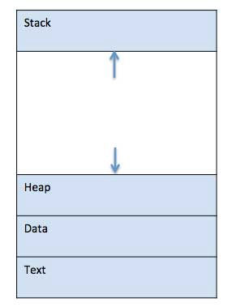
+ 堆栈：进程堆栈包含临时数据，例如方法/函数参数，返回地址和局部变量。
+ 堆：这是在运行时动态分配给进程的内存。
+ 文本：包括由程序计数器的值和处理器的寄存器的内容表示的当前活动。
+ 数据：此部分包含全局变量和静态变量。

当一个进程执行时，它会经过不同的状态。 在不同的操作系统中，这些阶段可能有所不同，并且这些状态的名称也未标准化。 通常，一个进程一次可以具有以下五个状态之一：
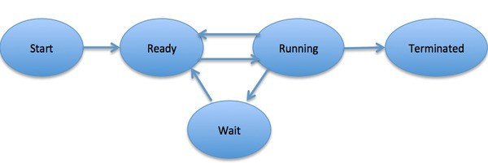
+ 开始：首次启动/创建流程的初始状态。
+ 就绪：该进程正在等待分配给处理器。 准备就绪的进程正在等待操作系统分配处理器，以便它们可以运行。 进程可能在“开始”状态之后进入该状态，或者在运行时由于调度程序中断而将CPU分配给其他进程而进入此状态。
+ 正在运行：操作系统调度程序将进程分配给处理器后，进程状态将设置为正在运行，并且处理器将执行其指令。
+ 等待中：如果进程需要等待资源（例如，等待用户输入或等待文件可用），则进入等待状态。
+ 终止或退出：一旦进程完成执行或被操作系统终止，它将移至终止状态，在该状态下等待从主内存中删除。

流程控制块是操作系统为每个流程维护的数据结构。 PCB由整数进程ID（PID）标识。 PCB保留跟踪一个过程所需的所有信息，如下所示：
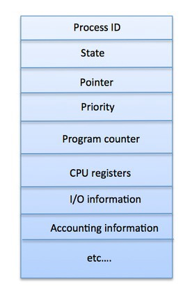
+ 进程状态：进程的当前状态-就绪，正在运行，正在等待还是其他。
+ 进程特权：允许/禁止访问系统资源是必需的。
+ 进程ID：操作系统中每个进程的唯一标识。
+ 指针：指向父进程的指针。
+ 程序计数器：程序计数器是指向要为此过程执行的下一条指令的地址的指针。
+ CPU寄存器：各种CPU寄存器，需要在其中存储进程以执行运行状态。
+ CPU调度信息：进程优先级和其他用于调度进程的调度信息。
+ 内存管理信息：这包括页表，内存限制和段表的信息，具体取决于操作系统使用的内存。
+ 记帐信息：这包括用于进程执行的CPU数量，时间限制，执行ID等。
+ IO状态信息：这包括分配给该进程的I / O设备的列表。
## 2：线程和并发

线程是通过流程代码执行的流程。 它具有自己的程序计数器，该计数器跟踪接下来要执行的指令。 它还具有保存其当前工作变量的系统寄存器，以及包含执行历史记录的堆栈。

线程与其对等线程共享各种信息，例如代码段，数据段和打开文件。 当一个线程更改一个代码段存储项时，所有其他线程都可以看到。

线程也称为轻量级进程。 线程提供了一种通过并行性提高应用程序性能的方法。 线程代表一种软件方法，可以通过减少开销来提高操作系统的性能。 线程等效于经典过程。

每个线程仅属于一个进程，并且一个进程外不能存在任何线程。 每个线程代表一个单独的控制流。 线程已成功用于实现网络服务器和Web服务器。 它们还为在共享内存多处理器上并行执行应用程序提供了合适的基础。
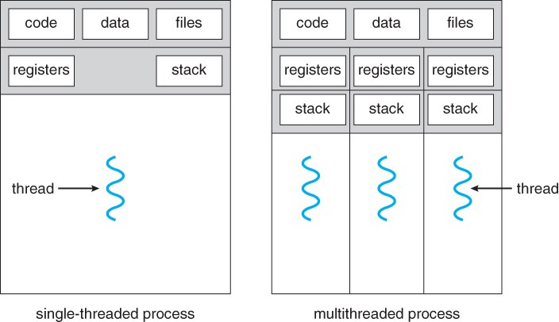

线程的优点：
+ 它们使上下文切换时间最小化。
+ 使用它们可以在流程中提供并发性。
+ 他们提供有效的沟通。
+ 创建和上下文切换线程更经济。
+ 线程允许更大范围和更高效率地利用多处理器体系结构。

线程通过以下两种方式实现：
+ 用户级线程：用户管理的线程。
+ 内核级线程：作用在内核（操作系统核心）上的操作系统管理的线程。

用户级线程

在这种情况下，线程管理内核不知道线程的存在。 线程库包含用于创建和销毁线程，在线程之间传递消息和数据，调度线程执行以及保存和还原线程上下文的代码。 该应用程序从一个线程开始。
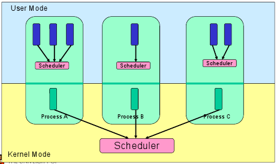

好处：
+ 线程切换不需要内核模式特权。
+ 用户级线程可以在任何操作系统上运行。
+ 调度可以是用户级线程中特定于应用程序的。
+ 用户级线程可以快速创建和管理。

缺点：
+ 在典型的操作系统中，大多数系统调用都处于阻塞状态。
+ 多线程应用程序无法利用多处理。

内核级线程

在这种情况下，线程管理由内核完成。 应用程序区域中没有线程管理代码。 操作系统直接支持内核线程。 可以将任何应用程序编程为多线程。 在一个进程中支持应用程序内的所有线程。

内核维护整个流程以及流程中各个线程的上下文信息。 内核的调度是基于线程进行的。 内核在内核空间中执行线程创建，调度和管理。 内核线程通常比用户线程创建和管理慢。
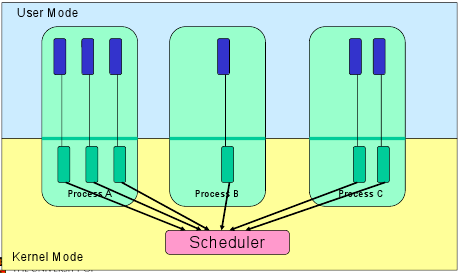

好处
+ 内核可以在多个进程中同时调度来自同一进程的多个线程。
+ 如果某个进程中的一个线程被阻止，则内核可以调度同一进程的另一个线程。
+ 内核例程本身可以是多线程的。

缺点
+ 内核线程通常比用户线程创建和管理慢。
+ 在同一进程中将控制权从一个线程转移到另一个线程需要将模式切换到内核。
## 3：排程

调度过程由过程管理器负责，该过程管理器根据特定策略处理从CPU中删除正在运行的过程并选择另一个过程。

进程调度是Multiprogramming操作系统的重要组成部分。 这些操作系统允许一次将多个进程加载到可执行内存中，并且加载的进程使用时分多路复用共享CPU。

操作系统维护进程调度队列中的所有进程控制块（PCB）。 操作系统为每个进程状态维护一个单独的队列，并且处于相同执行状态的所有进程的PCB都放置在同一队列中。 当进程的状态更改时，其PCB从当前队列中取消链接，并移至新的状态队列。

操作系统维护以下重要的流程调度队列：
+ 作业队列：此队列将所有进程保留在系统中。
+ 就绪队列：此队列将一组驻留在主内存中的所有进程保留为就绪并等待执行。 一个新的进程总是放在这个队列中。
+ 设备队列：由于I / O设备不可用而被阻塞的进程构成了该队列。
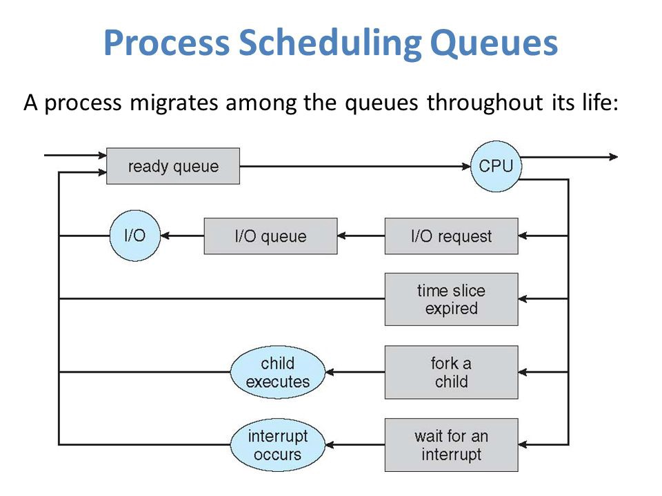

操作系统可以使用不同的策略来管理每个队列（FIFO，循环，优先级等）。 操作系统调度程序确定如何在就绪队列和运行队列之间移动进程，该队列在系统上每个处理器内核只能有一个条目。 在上图中，它已与CPU合并。

两种状态的流程模型指的是运行状态和非运行状态：
+ 正在运行：创建新进程后，它将以运行状态进入系统。
+ 未运行：未运行的进程保留在队列中，等待轮流执行。 队列中的每个条目都是指向特定进程的指针。 队列是通过使用链表实现的。 调度程序的使用如下：当进程中断时，该进程将在等待队列中传输。 如果该过程已完成或中止，则将其丢弃。 无论哪种情况，调度程序都将从队列中选择一个要执行的进程。


上下文切换是一种在过程控制块中存储和恢复CPU的状态或上下文的机制。 它允许稍后在同一点恢复流程执行。 使用此技术，上下文切换器使多个进程可以共享一个CPU。 上下文切换是多任务操作系统的基本功能。

当调度程序将CPU从执行一个进程切换到另一个进程时，当前运行进程的状态将存储到进程控制块中。 此后，下一个进程的状态将从其自己的PCB加载，并用于设置PC，寄存器等。此时，第二个进程可以开始执行。

上下文切换是计算密集型的，因为必须保存和恢复寄存器和内存状态。 为了避免上下文切换时间，某些硬件系统会使用两组或更多组处理器寄存器。

切换过程时，将存储以下信息以供以后使用：程序计数器，调度信息，基址和限制寄存器值，当前使用的寄存器，更改的状态，I / O状态信息和记帐信息。
## 4：内存管理

内存管理是处理或管理主内存的操作系统的功能。 它在执行期间在主内存和磁盘之间来回移动进程。

内存管理跟踪每个内存位置，而不管它是分配给某个进程还是分配给空闲进程。 它检查要为进程分配多少内存。 它决定哪个进程在什么时候获取内存。 并且它会跟踪释放或未分配内存的时间，并相应地更新状态。
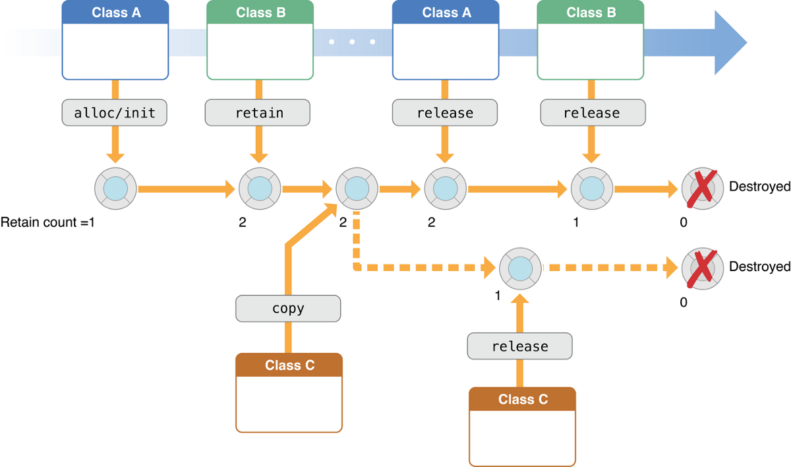

进程地址空间是进程在其代码中引用的逻辑地址集。 例如，当使用32位寻址时，地址范围可以从0到0x7fffffff； 也就是说，“理论上可能有2个”数字，总的理论大小为2 GB。

操作系统负责在将内存分配给程序时将逻辑地址映射到物理地址。 分配内存前后，程序中使用三种类型的地址：
+ 符号地址：源代码中使用的地址。 变量名称，常量和指令标签是符号地址空间的基本元素。
+ 相对地址：编译时，编译器会将符号地址转换为相对地址。
+ 物理地址：当程序加载到主存储器中时，加载程序会生成这些地址。

虚拟地址和物理地址在编译时和加载时地址绑定方案中相同。 虚拟地址和物理地址在执行时地址绑定方案上有所不同。

程序生成的所有逻辑地址的集合称为逻辑地址空间。 对应于这些逻辑地址的所有物理地址的集合称为物理地址空间。
## 5：进程间通信

流程分为两种：独立流程和合作流程。 一个独立的进程不受其他进程执行的影响，而一个协作进程可能会受到其他执行进程的影响。

您可能会认为那些独立运行的进程将非常高效地执行。 但是实际上，在许多情况下，可以利用流程的协作性质来提高计算速度，便利性和模块化性。 进程间通信（IPC）是一种机制，允许进程相互通信并同步其动作。 这些过程之间的通信可以看作是它们之间合作的一种方法。

进程可以通过两种方式相互通信：共享内存和消息解析。

共享内存方法

假设有两个过程：生产者和消费者。 生产者生产某种物品，而消费者消费该物品。 这两个进程共享一个称为“缓冲区”的公共空间或内存位置，存储生产者生产的商品，如果需要，消费者从那里消费该商品。

undefined
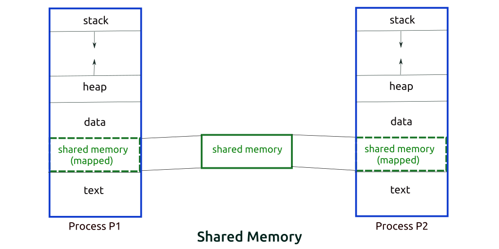

在有界缓冲区问题中，生产者和消费者将共享一些公共内存。 然后，生产者将开始生产物品。 如果生产的物品总数等于缓冲区的大小，则生产者将等待直到消费者将其消耗掉。

同样，消费者首先检查商品的可用性，如果没有商品可用，消费者将等待生产者生产商品。 如果有可用的物品，则消费者将消耗它们。

消息解析方法

在这种方法中，进程之间可以相互通信，而无需使用任何类型的共享内存。 如果两个进程p1和p2要相互通信，请按以下步骤进行：
+ 建立通信链接（如果已经存在链接，则无需再次建立。）
+ 开始使用基本原语交换消息。 我们至少需要两个原语：send（消息，目的地）或send（消息）和receive（消息，主机）或receive（消息）
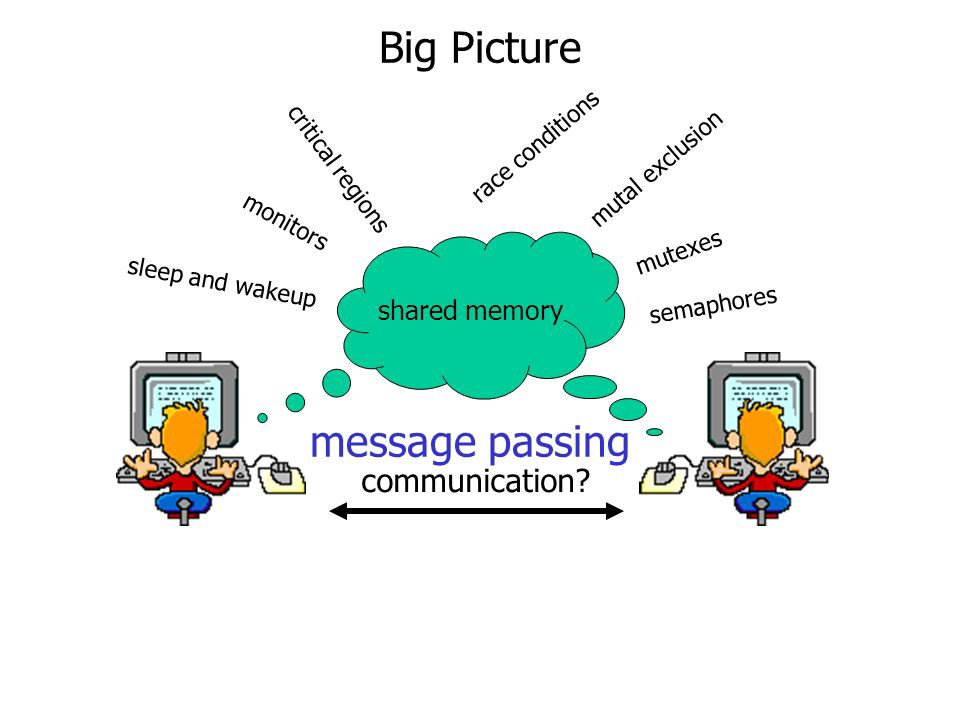

消息大小可以是固定的，也可以是可变的。 如果它是固定大小，则对于OS设计人员来说很容易，但是对于程序员来说则很复杂。 如果它是可变大小，那么对于程序员来说很容易，但是对于OS设计人员来说却很复杂。 标准消息分为两部分：标头和正文。

标头用于存储消息类型，目标ID，源ID，消息长度和控制信息。 控制信息包含一些信息，例如如果缓冲区空间不足，该怎么办，序列号及其优先级。 通常，使用FIFO样式发送消息。
## 6：输入/输出管理

操作系统的重要工作之一是管理各种输入/输出（I / O）设备，包括鼠标，键盘，触摸板，磁盘驱动器，显示适配器，USB设备，位图屏幕，LED，模拟- 到数字转换器，开/关开关，网络连接，音频I / O，打印机等。

一个I / O系统需要接受一个应用程序I / O请求并将其发送到物理设备，然后接受从设备返回的所有响应并将其发送给应用程序。 I / O设备可以分为两类：
+ 块设备：块设备是驱动程序通过发送整个数据块与之通信的设备。 例如，硬盘，USB摄像头，Key-On-Key等。
+ 字符设备：字符设备是驱动程序通过发送和接收单个字符（字节，八位字节）与之通信的字符设备。 例如，串行端口，并行端口，声卡等。
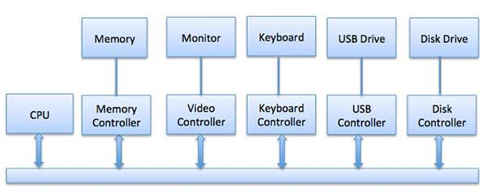

CPU必须具有一种与I / O设备之间传递信息的方法。 有三种方法可用于与CPU和设备通信。

1.特殊指令I / O

这使用专门用于控制I / O设备的CPU指令。 这些指令通常允许将数据发送到I / O设备或从I / O设备读取。

2.内存映射的I / O

使用内存映射的I / O时，内存和I / O设备共享相同的地址空间。 该设备直接连接到某些主存储器位置，因此I / O设备可以在不经过CPU的情况下向/从存储器传输数据块。
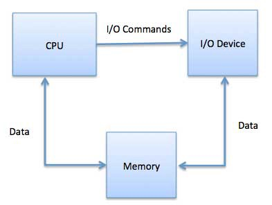

在使用内存映射的I / O时，操作系统会在内存中分配缓冲区，并通知I / O设备使用该缓冲区将数据发送到CPU。 I / O设备与CPU异步运行，并在完成后中断CPU。

该方法的优势在于，可以访问存储器的每条指令都可以用于操作I / O设备。 内存映射的I / O用于大多数高速I / O设备，例如磁盘和通信接口。

3.直接内存访问（DMA）

传输每个字节后，键盘等速度较慢的设备将对主CPU产生中断。 如果快速设备（例如磁盘）为每个字节生成了中断，则操作系统将花费大部分时间来处理这些中断。 因此，典型的计算机使用直接内存访问（DMA）硬件来减少这种开销。

直接内存访问（DMA）意味着CPU授予I / O模块权限，使其可以在不涉及内存的情况下读取或写入内存。 DMA模块本身控制着主存储器和I / O设备之间的数据交换。 CPU仅在传输的开始和结束时参与，并且仅在整个块都已传输后才中断。

直接内存访问需要一种称为DMA控制器（DMAC）的特殊硬件，该硬件可管理数据传输并仲裁对系统总线的访问。 控制器通过源指针和目标指针（在何处读取/写入数据），用于跟踪传输字节数的计数器以及各种设置进行编程。 这些包括I / O和内存类型以及CPU周期的中断和状态。
## 7：虚拟化

虚拟化技术使您可以从单个物理硬件系统创建多个模拟环境或专用资源。

称为虚拟机监控程序的软件直接连接到该硬件，并允许您将一个系统划分为多个独立的，独立的安全环境，称为虚拟机（VM）。 这些VM依靠虚拟机监控程序的能力将计算机的资源与硬件分开，并适当地分配它们。

装有管理程序的原始物理计算机称为主机，而许多使用其资源的VM称为来宾。 这些来宾将计算资源（例如CPU，内存和存储）视为可以轻松重定位的资源库。 操作员可以控制CPU，内存，存储和其他资源的虚拟实例，以便来宾在需要它们时可以接收所需的资源。

理想情况下，所有相关的VM通过一个基于Web的虚拟化管理控制台进行管理，从而加快了工作速度。 通过虚拟化，您可以决定为虚拟机提供多少处理能力，存储和内存，并且由于虚拟机与其支持的硬件相互分离，因此可以更好地保护环境。

简而言之，虚拟化可以从未充分利用的硬件中创建所需的环境和资源。


虚拟化类型：
+ 数据虚拟化：可以将分散的数据整合到一个源中。 数据虚拟化使公司可以将数据视为动态供应-提供处理功能，可以将来自多个源的数据整合在一起，轻松容纳新的数据源，并根据用户需求转换数据。 数据虚拟化工具位于多个数据源的前面，并允许将它们视为单个数据源。 他们在正确的时间以任何形式将所需的数据传递给任何应用程序或用户。
+ 桌面虚拟化：容易与操作系统虚拟化混淆，后者允许您在一台计算机上部署多个操作系统。桌面虚拟化允许中央管理员（或自动化管理工具）一次将模拟的桌面环境部署到数百台物理计算机。 与在每台计算机上实际安装，配置和更新的传统桌面环境不同，桌面虚拟化允许管理员在所有虚拟桌面上执行批量配置，更新和安全检查。
+ 服务器虚拟化：服务器是设计为可以很好地处理大量特定任务的计算机，因此其他计算机（例如笔记本电脑和台式机）可以执行各种其他任务。 虚拟化服务器可以使其执行更多特定功能，并需要对其进行分区，以便组件可用于提供多种功能。
+ 操作系统虚拟化：操作系统虚拟化发生在内核（操作系统的中央任务管理器）上。 这是一种并行运行Linux和Windows环境的有用方法。 企业还可以将虚拟操作系统推向计算机，这将：（1）降低批量硬件成本，因为计算机不需要如此高的现成功能，（2）增强安全性，因为所有虚拟实例都可以 监视和隔离，以及（3）限制在IT服务（如软件更新）上花费的时间。
+ 网络功能虚拟化：网络功能虚拟化（NFV）分离了网络的关键功能（例如目录服务，文件共享和IP配置），因此它们可以在环境中分布。 一旦软件功能独立于它们赖以生存的物理机器，就可以将特定功能打包到一个新网络中并分配给一个环境。 虚拟化网络减少了创建多个独立网络所需的物理组件（如交换机，路由器，服务器，电缆和集线器）的数量，并且在电信行业中特别流行。
## 8 —分布式文件系统

分布式文件系统是基于客户端/服务器的应用程序，它允许客户端访问和处理存储在服务器上的数据，就像它们在自己的计算机上一样。 当用户访问服务器上的文件时，服务器会向用户发送文件的副本，该副本在处理数据时会缓存在用户的计算机上，然后返回给服务器。

理想情况下，分布式文件系统将单个服务器的文件和目录服务组织到一个全局目录中，这样远程数据访问不是特定于位置的，而是与任何客户端相同的。 全局文件系统的所有用户均可访问所有文件，并且组织是分层且基于目录的。
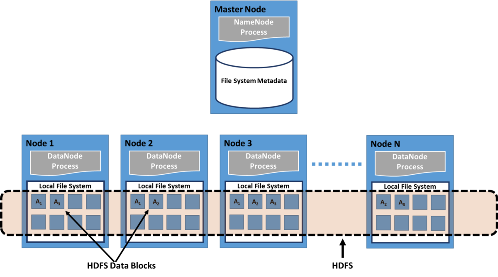

由于多个客户端可能同时访问同一数据，因此服务器必须具有适当的机制（例如维护有关访问时间的信息）来组织更新，以便客户端始终接收最新版本的数据，并且数据冲突 不会出现。 分布式文件系统通常使用文件或数据库复制（在多个服务器上分布数据的副本）来防止数据访问失败。

Sun Microsystems的网络文件系统（NFS），Novell NetWare，Microsoft的分布式文件系统和IBM的DFS是分布式文件系统的一些示例。
## 9 —分布式共享内存

分布式共享内存（DSM）是分布式操作系统的资源管理组件，可在没有物理共享内存的分布式系统中实现共享内存模型。 共享内存提供了在分布式系统中的所有计算机之间共享的虚拟地址空间。

在DSM中，类似于访问虚拟内存的方式，从共享空间访问数据。 数据在辅助存储器和主存储器之间以及不同节点的分布式主存储器之间移动。 内存中页面的所有权以某种预定义状态开始，但在正常操作过程中会发生变化。 当数据由于特定进程的访问而从一个节点移动到另一个节点时，所有权发生变化。
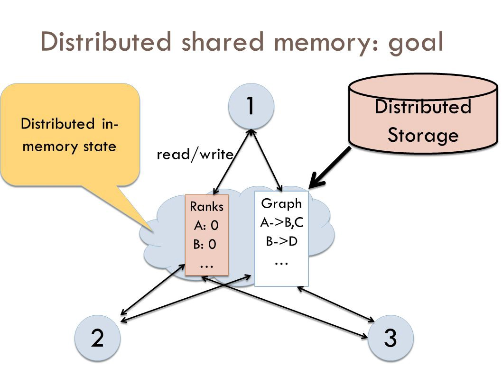

分布式共享内存的优点：
+ 隐藏数据移动并为共享数据提供更简单的抽象。 程序员无需担心机器之间的内存传输，例如使用消息传递模型时。
+ 允许通过引用传递复杂的结构，从而简化了分布式应用程序的算法开发。
+ 通过移动包含参考数据而不是仅包含数据的整个页面来利用“参考位置”。
+ 比多处理器系统便宜。 可以使用常规硬件来实现想法，不需要任何复杂的操作即可将共享内存连接到处理器。
+ 通过合并所有节点的所有物理内存，程序可以使用更大的内存。 像传统分布式系统一样，这种大内存不会因交换而引起磁盘延迟。
+ 可以使用无限数量的节点。 与通过公共总线访问主存储器的多处理器系统不同，因此限制了多处理器系统的大小。
+ 为共享内存多处理器编写的程序可以在DSM系统上运行。

可以通过两种不同的方式通知节点谁拥有哪个页面：无效和广播。 无效是一种方法，当某些进程要求对该页面进行写访问并成为其新所有者时，该方法会使页面无效。 这样，下次其他进程尝试读取或写入它认为拥有的页面副本时，该页面将不可用，并且该进程将不得不重新请求对该页面的访问。 当进程将其写入时，广播将自动更新内存页的所有副本。 这也称为写入更新。 由于必须发送新值而不是无效消息，因此该方法效率低下，难以实施。
## 10-云计算

越来越多，我们看到技术正在向云迁移。 这不仅仅是一种时尚-在过去的10年中，从传统的软件模型向Internet的转变稳步增长。 展望未来，云计算的下一个十年有望通过移动设备在任何地方进行协作的新方法。

那么什么是云计算？ 本质上，云计算是计算机程序的一种外包。 使用云计算，用户可以在外部方在“云”中托管软件和应用程序的同时，从任何地方访问软件和应用程序。这意味着他们不必担心存储和电源， 他们可以简单地享受最终结果。

传统的业务应用程序一直非常复杂且昂贵。 运行它们所需的硬件和软件的数量和种类令人生畏。 您需要整个专家团队来安装，配置，测试，运行，保护和更新他们。 当您将这项工作分散在数十个或数百个应用程序上时，很难理解为什么拥有最佳IT部门的大型公司没有获得所需的应用程序。 中小型企业没有机会。
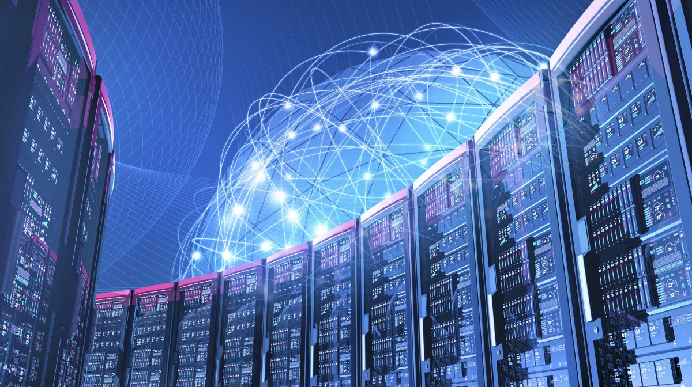

借助云计算，您无需管理硬件和软件，从而消除了存储自己的数据所带来的烦恼，这是由经验丰富的供应商（如Salesforce和AWS）负责的。 共享的基础结构意味着它像公用程序一样工作：您只需为所需的东西付费，升级是自动的，放大或缩小都很容易。

基于云的应用程序可以在数天或数周内启动并运行，而且成本更低。 使用云应用程序，您只需打开浏览器，登录，自定义应用程序并开始使用它。 企业正在云中运行各种应用程序，例如客户关系管理（CRM），人力资源，会计等。

随着云计算的普及，成千上万的公司只是将其非云产品和服务重新命名为“云计算”。在评估云产品时，请务必深入了解，并牢记如果必须购买和管理硬件和软件，该怎么办？ 您正在查看的并不是真正的云计算，而是假云。
## 最后的外卖

作为软件工程师，您将成为更广泛的计算机科学领域的一部分，该领域包括硬件，操作系统，网络，数据管理和挖掘以及许多其他学科。 每个学科的工程师对其他学科的了解越多，他们与这些其他学科进行有效交互的能力就越高。

由于操作系统是管理输入，处理和输出的“大脑”，因此所有其他学科都与操作系统交互。 对操作系统的工作原理的了解将为其他学科的工作原理提供宝贵的见解，因为您与这些学科的交互是由操作系统管理的。

— —

如果您喜欢这首乐曲，请按一下拍手按钮I，我会很喜欢的，这样其他人可能会偶然发现它。 您可以在GitHub上找到我自己的代码，还可以在https://jameskle.com/上找到我的更多作品和项目。 您也可以在Twitter上关注我，直接给我发送电子邮件或在LinkedIn上找到我。 注册我的时事通讯，直接在您的收件箱中接收我对数据科学，机器学习和人工智能的最新想法！
```
(本文翻译自James Le的文章《How Operating Systems Work: 10 Concepts you Should Know as a Developer》，参考：https://medium.com/cracking-the-data-science-interview/how-operating-systems-work-10-concepts-you-should-know-as-a-developer-8d63bb38331f)
```
