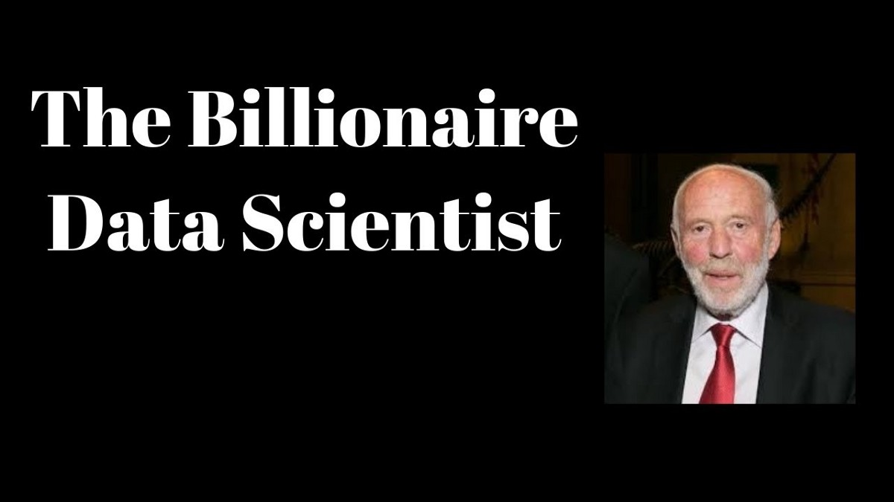
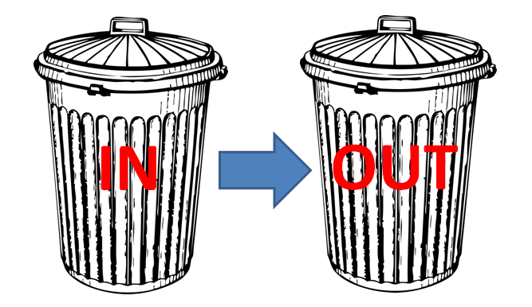
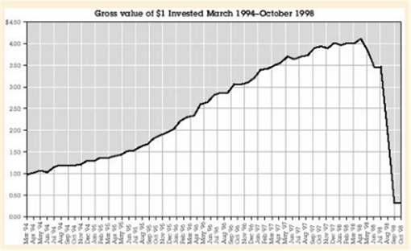
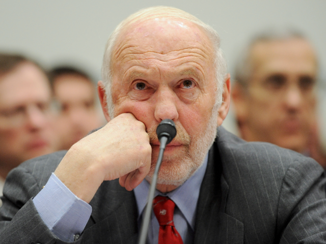

# 文艺复兴如何通过机器学习击败市场
## 一堆聪明的数学家和计算机科学家使用机器学习为金融市场建模并押注短期…


TLDR：一群才华横溢的数学家和计算机科学家将机器学习应用于金融市场模型，押注短期策略，自1988年以来，这种策略每年回报率达66％。

解决市场的人说明了吉姆·西蒙斯（Jim Simons）和他的科学家和数学家们杂乱无章的团队如何建立了复兴技术，这是历史上最赚钱的量化基金。 说实话，我希望能有更多关于它们在市场上的优势的多汁细节，但是鉴于整个领域的秘密，尤其是在文艺复兴时期，这是一厢情愿的想法。

我决定从书中写下我的学习要点，而不是通常的文章中实现机器学习模型的文章，因此，任何想跳过Mercer-funding-Trump戏剧以及超富员工的副作用的人仍然可以学习宝贵的知识点 自1988年以来，大奖章基金如何实现66.1％的平均年回报率。
# 解决市场的人的见解

1.财务知识是可选的-文艺复兴时期和其他定量基金之间的最大区别是，他们的团队由科学家组成，而不是华尔街同僚。 在零财务背景下，他们将财务数据像以前用来试验的科学/文本数据一样对待。 当鲍勃·默瑟（Bob Mercer）被问到他们如何用模特赚到这么多钱时，发生了一个尴尬而有趣的场面。 他回答说：“有时它告诉我们购买克莱斯勒，有时它告诉我们出售。”这是克莱斯勒被收购后不再进行交易的时候，这表明文艺复兴几乎不需要了解公司的基本面，甚至 他们的名字！

2.合理化模型的预测不是重中之重-雇用研究人员而不是经济学家的另一个可能的副作用是，他们更关心交易异常的统计意义如何，而不是其可解释性。 因此，他们敢于交易难以解释/理解的非直觉异常。 我之所以喜欢这种方式，是因为通常需要进行深度学习和建模，因此很难合理化模型的预测。 缺点之一是很难知道何时停止交易。 例如，由于政府的限制而存在异常，当故事不再成立时，我们可以停止交易。 没有这个故事，我们必须依靠统计测试来确认信号不再存在。

3.研究论文可能是错误的-为了寻找想法，西蒙斯（Simons）成立了一个读书俱乐部，以阅读和讨论声称已找到阿尔法的论文。 可悲的是，当他们试图对这些文件进行回测时，他们从未工作过。 如果研究人员真的找到了alpha，那么他们可能不会一开始就发布它们，但我确实发现阅读论文是灵感/想法的来源。

4.拥有单一交易模型-亨利·劳弗（Henry Laufer）并未为每个资产类别都创建一个独特的交易模型，而是认为所有资产类别都拥有一个大型模型，可以让他们利用所收集的大量数据并对不同资产类别之间的相关性进行建模 。 由于该模型已经对市场和价格变动产生了隐式的了解，因此可以轻松添加将来的想法。 即使对于历史较短的资产类别，如果它们与历史较丰富的投资相似，也可以进行交易。 这让我想起了神经网络中的转移学习，您首先要训练通用模型以学习大型图像/文本数据集的良好表示，然后您可以成功地附加任何下游任务。 这比为一个下游任务建立一个模型要好得多，在下游任务中，通常没有那么多标签数据，这限制了模型的学习能力。

5.工业级编码至关重要—罗伯特·弗雷（Robert Frey）所做的最初的统计套利模型在理论上很有效，但是它们是零散的编码，无法处理特殊情况。 默瑟（Mercer）和彼得·布朗（Peter Brown）多年来在IBM中为大型系统编码，他们构建了一个动态交易系统。 当我们进入“任何人都可以用4行代码进行机器学习”的时代时，请记住，工业级编码技能对于确保一切在生产中顺利运行至关重要。 特别是在金融领域，错误的决定可能会导致数百万美元的损失。

6.用优势来发挥其能力-人们想知道为什么竞争对手还没有赶上或复制文艺复兴的成功，而可能的原因是，一旦找到优势，就将其以最大能力进行交易，这样异常现象就不再存在 出现。 从本质上讲，这已经使市场变得高效，因为异常情况已经被套利。 竞争者被遗弃寻找剩余的异常。

7.乱扔垃圾，乱扔垃圾-团队的初始模型之所以失败，主要是因为他们手工收集的数据充满了错误。 在Sandor Straus清理，估算并收集了当日数据后，他们能够改善模型并利用当日数据在大多数投资者使用开盘/收盘价制定交易决策的时候进行。 在进行数据科学项目时，确保输入正确是很重要的[1]。 正如Mercer所说，“没有数据像更多数据一样”。


8.不要百分百地信任您的模型-1998年，当时更大的量化基金Long Term Capital Management因对模型的坚定信心而破产，即使面对亏损甚至无法承受时，它们的价值也翻了一番。 本来是不可能的。 在文艺复兴时期，当信号不起作用时，他们的系统会保守地削减头寸。 这对于定量基金至关重要，尤其是当我们有时不知道为什么模型会吐出其预测时，适当的风险管理/下注规模至为重要。


9.数量也是人。故事的许多部分描述了吉姆·西蒙斯对市场动向和新闻的情感反应，这实际上并不是我们对他的期望。 这显示了即使您是最大的量，也要保持冷静是多么困难，并且建议我们不要因为情感而干预或推翻算法建议，因为这只会影响性能。


10.长期异常现象很难从中获利-大奖章基金主要交易短期异常现象，而将长期策略留给外部人士使用。 外部基金RIEF一直在努力追回Medallion的回报。

11.用机器学习来打败市场是艰难的-团队经常为他们的模型为什么不起作用感到困惑，我最喜欢的是在他们的许多代码行中使用静态S＆P 500指数值，弄乱了模型的 预测。 然而，团队坚持不懈，克服了所有障碍，成为有史以来最成功的量化基金。 创新并没有停止-随着竞争对手学习并尝试模仿自己的成功，文艺复兴必须不断寻找新的方法来超越市场。 鉴于它们是最好的，而且只有大约51％的时间是正确的，因此我们其余的人都为我们完成了工作。

undefined
# 参考文献

[1] Nick Hynes，D Sculley和Michael Terry。 数据仓库：针对ml数据集的轻量级自动完整性检查。 NIPS机器学习系统研讨会，2017年。
```
(本文翻译自Neo Yi Peng的文章《How Renaissance beat the markets with Machine Learning》，参考：https://towardsdatascience.com/how-renaissance-beat-the-markets-with-machine-learning-606b17577797)
```
