本文就是这样。 这项工作正在进行中。 当我遇到它们时，我将继续添加更多东西。 如果您有任何建议可以使您的生活更轻松，请将其放在下面的评论部分，我们都可以从中受益。

〜学习愉快。
# 如何看中Python
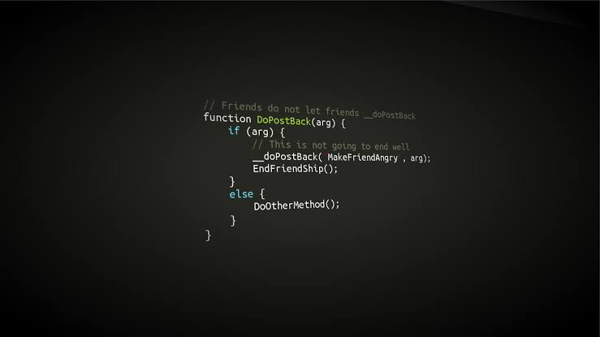

Python很酷。 真的很酷。 但是，我们中的很多人都是从不同的编程语言开始的，尽管我们确实很容易地掌握了Python，但是我们仍然不擅长使用pythonic做事。 本文介绍了我几年来学到的一些技巧和相同的实际示例。 希望你喜欢它。
## -1。 有用的键盘快捷键

缩进代码按Tab。

取消缩进代码按Shift + Tab。

要注释或取消注释一堆代码，请选择它，然后按Control + /或Command + /对于Mac。

要将引号括起来，请选择它，然后按Shift +'或Shift +“。
## 0.邮编

Zip可用于一起迭代2个以上的列表。
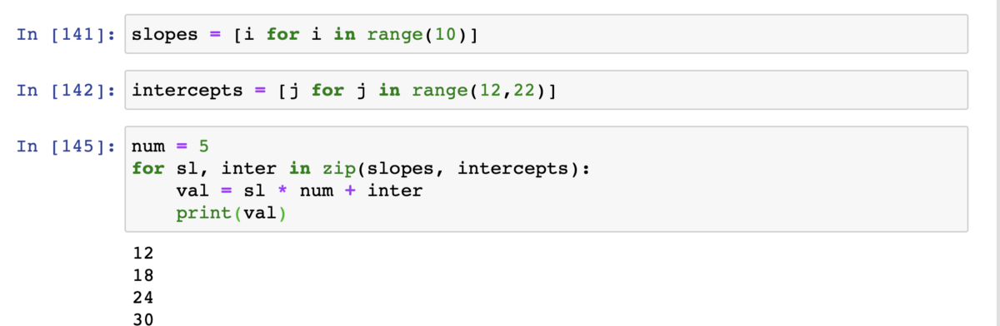
## 1.清单理解

关于Python的最好之处在于，您可以用更少的代码完成很多工作。 以列表理解为例。 如果要创建一定范围内的数字列表，则可以按如下所示轻松进行操作：
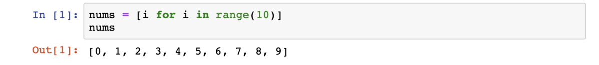

您也可以很容易地对其应用条件。
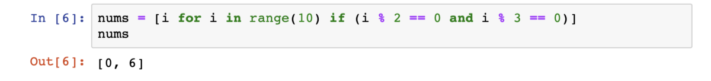

实际示例：

列表推导的一个非常酷的用例是将数字转换为它的单个数字。 技巧是将数字转换为字符串，遍历各个字符，将其转换为int并将它们存储在列表中。 我们可以按照所有步骤进行操作
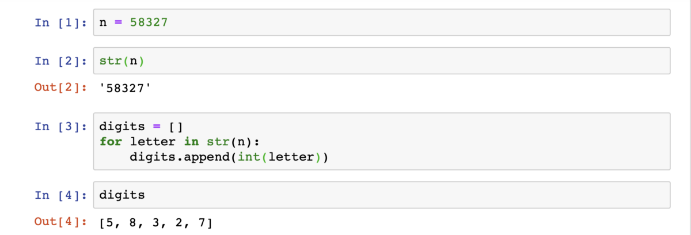

或一起做
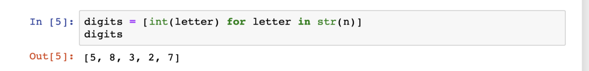

这也让我想起了map（）函数。
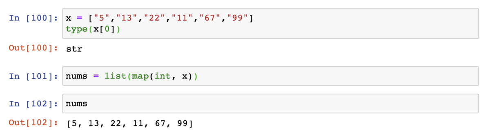
## 2.使用*运算符

*运算符可用于重复字符串。 例如，
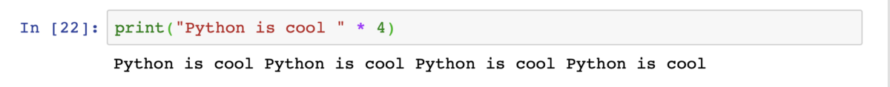

现在您可能不想多次打印“ Python很酷”，但应该将其用于类似这样的操作
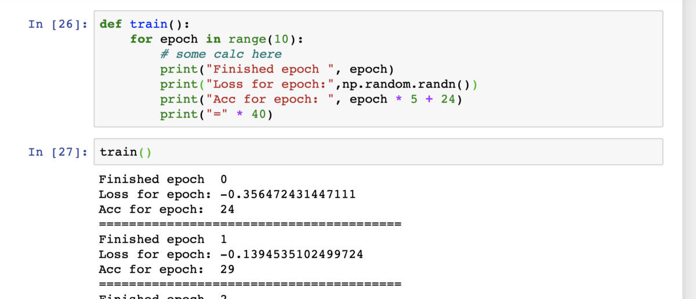

*运算符还可用于解压缩列表等可迭代项。
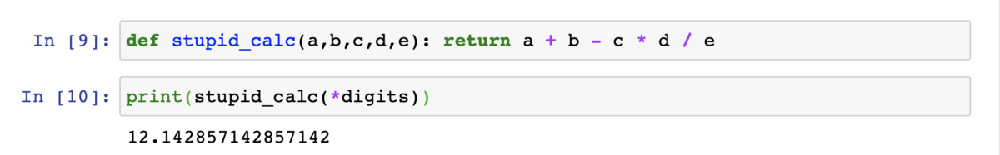

您也可以做类似的事情
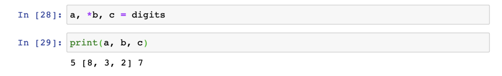

当我们有一个不知道参数个数的函数时，通常使用此运算符。 我们将其与* args和** kwargs一起使用。
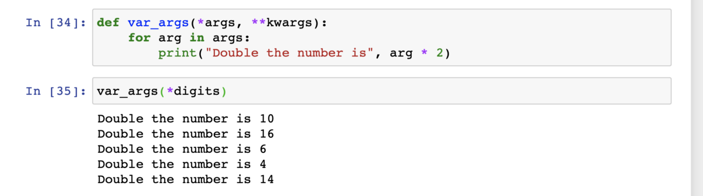

我们传递给函数的参数存储在* args中。 ** kwargs将存储命名的参数或字典。
## 3.部分

您可以使用函数执行的其他操作是创建部分函数。 这些是什么？ 假设我们有一个计算单利的函数。 我们可以为某些参数设置默认值（从右到左）。
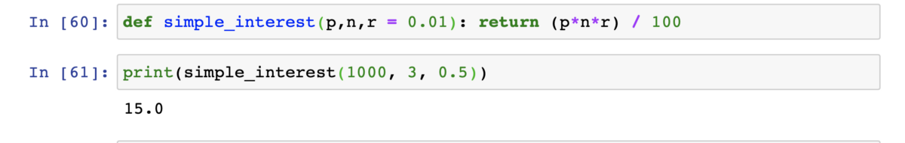

但是，我们不能以这种方式将默认值设置为p。

我们可以使用部分函数来实现。 在部分函数中，我们从左到右为某些参数设置了默认值，然后将其用作函数。 让我们为p设置一个默认值。
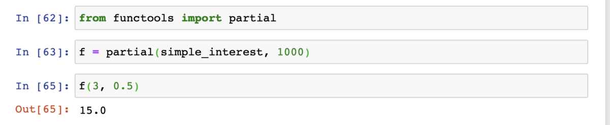

尽管局部函数从左到右起作用，但是我们也可以使用命名参数跳过它们之间的参数。
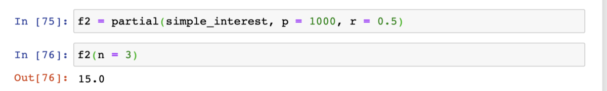
## 4.断言

测试驱动的开发意味着您编写测试，然后编写代码以通过这些测试。 您可以使用assert在Python中编写小型测试。 例如，您可能要确保某个对象的形状符合您的期望。
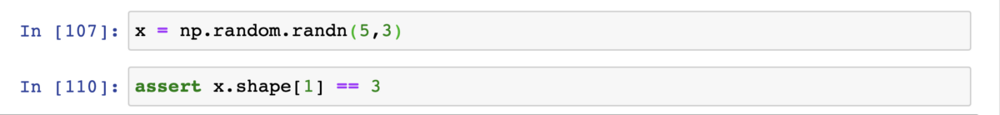

编写这些小型测试对确保代码的部分按预期工作将非常有帮助。 它还将帮助您高效地调试。
## 5.发电机

我们可以在Python中使用yield关键字而不是return关键字来创建生成器。 使用生成器的优点是可以即时生成事物并忘记它们。 这样可以节省内存。
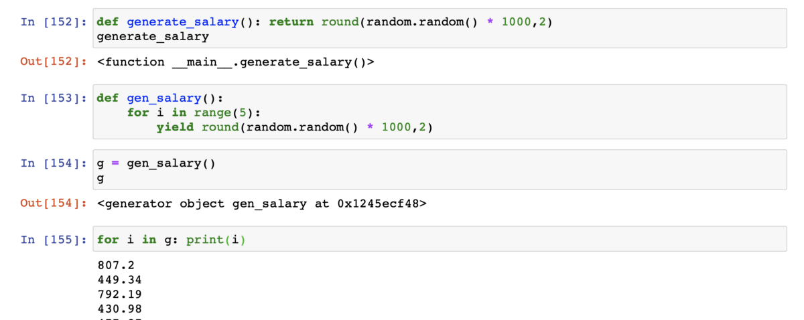
# 接下来
## 6.邓德·泰勒斯

如果您想学习面向对象的Python，我真的推荐Corey Schafer的Youtube播放列表。 这部分将很快填充。
```
(本文翻译自Dipam Vasani的文章《How to be fancy with Python》，参考：https://towardsdatascience.com/how-to-be-fancy-with-python-8e4c53f47789)
```
