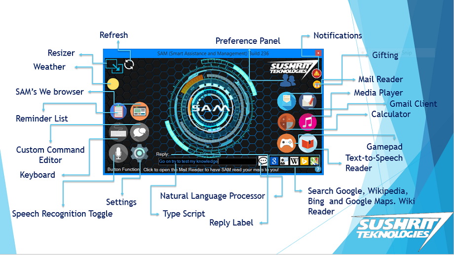
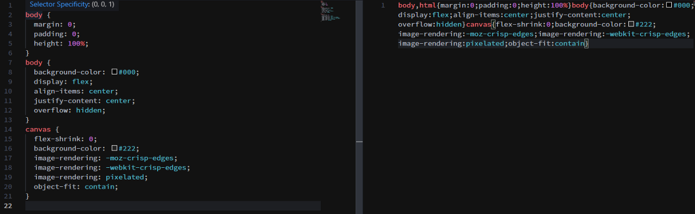
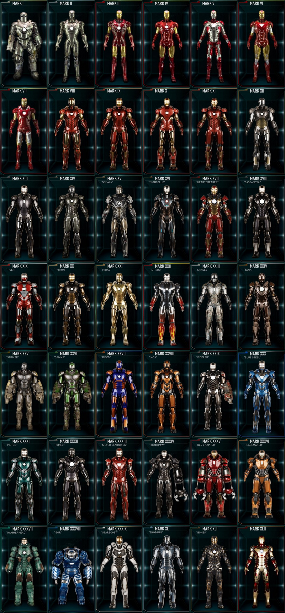
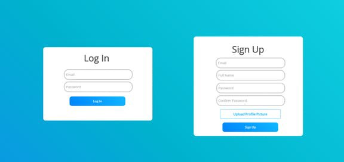

# 如何构建像Tony Stark这样的软件

> That’s gonna be you by the end of this journey

本文将引导您完成一个过程，在此过程中，您可以开始项目，打破无休止的学习周期，也可以在编码时更改方式并改善工作流程和效率，以使您不再觉得这不是您的工作。 事情，然后决定学习Excel。 我们将从Tony Stark AKA钢铁侠的灵感以及他如何制造东西中做到这一点。 我还将分享一些我个人遵循的技巧，以始终保持在100％的状态。

这些天来编写出色的代码并不是真正的问题。 一切都不过是Google搜索而已，只需找到Stackoverflow的第一个链接，找到投票次数最多/可接受的答案以及繁荣复制粘贴！

我看到大多数人如今面临的真正挑战是下一步该去哪里，或者如何真正地使用他们所学到的东西。 我们都在最新框架上观看视频的完整播放列表，这比所有人似乎都在使用但又抱怨的其他框架要好。 好吧，大多数人只是看一下，留下一些评论，这就是结束。 几天后，遇到的下一个播放列表也是如此。

人们以惊人的速度消费这些播放列表。 学习新事物并没有错，但是真正的错误是没有在视频用来演示框架的演示应用程序/服务之外的任何地方使用它们。

如果是React或Vue之类的东西，它将成为待办事项列表应用。 如果是与Tensorflow或keras等机器学习相关的东西，它将出现在MNIST数据集（识别手写数字）中，占10的9倍。

我明白了，除了扩展提供的示例代码外，很难提出一个将这些技术应用于其中的项目。 我们大多数人都会在待办事项应用中添加2个或更多按钮，并每天调用一次，更新您的简历并完成。 如果您选择播放列表，会更容易，因为您想学习新的东西来处理您的项目，因为您知道从那里开始。 大多数人不采取下一步措施，因为他们要么确信自己已经从一门课程中掌握了框架，并且能够在需要时使用它（大错误），要么他们对如何放置各种东西并不十分自信。 框架，因为它们缺乏经验（这是很普遍的，而且没有错）。 然后，您可以将自己与之前的人进行比较，后者是在车库中的一台简单计算机上为Google编码的，并且感到更加不安全。

顺便说一句，我有一个方便的指南，可以帮助您决定在考虑某个项目时选择哪种语言，框架和方法。

每个程序员都必须在某个或多个阶段经历这些阶段。 好吧，所以我们知道您的目的。 您已经学到了很多东西，却对它们无所事事，这可能会让您觉得自己更像一个骗子。 那么我们该怎么办 ？

好吧，这里有一些生活建议：陷入困境时，请始终寻找灵感，最终找到出路。

在这种情况下，我们将从MCU的一张面孔Tony Stark AKA Iron Man中汲取灵感。

因此，让我们开始吧，我们将逐步探索托尼（Tony）在《钢铁侠》（Iron Man）11年的职业生涯中所贡献的一些主要盔甲的创建过程。
# 马可福音1（Hacking Together）

> This was the suit that was literally built in a cave, with materials salvaged from missiles.

在早期阶段，当您只是学习编码或使用框架时，您自己完成所有工作，将所有内容都用谷歌搜索，以某种方式将代码拼凑在一起，以便可以加载一些HTML页面或消息。 得到显示。

您可以对Stackoverflow答案中的所有内容进行故障排除，并在需要时返回。

这类似于托尼用残骸和打捞物将他的衣服拼凑在山洞中的方式。
# 标记2（美学和质量控制）

虽然Mark 1令人讨厌，但它仍然笨拙，被黑客入侵，无法精确飞行，必须手动配备。 就像您第一次尝试构建某些东西一样，大多数代码都足以显示某些东西并达到您的基本目的。 确定点击90年代时代的按钮，打开一个弹出窗口，提示“ Hello World”非常酷，但这真的是您要放入“投资组合”的东西吗？

当然不是。 就像Mark 2（从美学到自动组装和飞行功能）的全面升级一样，您的代码也需要第二次迭代，否则，它并不能真正打动您房间外的任何人。

因此，您可以从在线选择一些设计，然后尝试重新创建它们。 在这里，您可以找到一些设计灵感来激发您的创造力：
+ 行为
+ Reddit / r /设计
+ Reddit / r /用户体验
+ Reddit / r / UI_Design

有了灵感之后，下一步就是弄清楚如何将设计变为现实。 好吧，如果您要构建一个网站/网络应用程序，这很简单。 您可以使用预先设置了所有必需组件的工具包/ UI框架，然后从此处开始进行自定义。 与其从头开始，不如从头开始（建议大多数想要构建东西的人，如果您确实喜欢设计，那么可以随时尝试从头开始构建）。 可以使用的一些工具箱/ UI框架是：
+ Bootstrap（大部分用于我个人，我喜欢它！）
+ 布尔玛
+ Daemonite的材料（基于Google的材料设计）

您可以阅读Google关于UI / UX的案例研究，以及有关设计适合大多数设备和用例的用户界面的指南。
# 标记3（测试和错误修复）

现在Mark 2看上去与其前任完全不同（您可以说两者之间形成了鲜明的对比）Mark 2在各个方面都领先一步，但它有其自身的缺陷。 这是我们的第三课。 经常测试！

托尼完成设计并穿上Mark 2后，他开始进行测试，他直接跳上了飞行测试，而这套西装飞得惊人。 由于结冰，它无法在更高的海拔下生存。 如果他没有考虑到结果参加战斗，那么他就不会那么优雅地获胜。

因此，请始终尽可能地测试您的代码。 以下是一些针对Python和JavaScript（目前2种最常用/成对的语言）编写测试的链接。
+ Python单元测试
+ JavaScript单元测试
+ 另外测试React（是的，非常需要！）

只需查找视频即可找到您选择的武器。

您编写的测试越多，对代码的信心就越大，尤其是在演示或部署代码时。

与Mark 2相比，Mark 3可能是次要的增量更新，但是有必要，您知道为什么。 因此，请勿跳过测试。
# 标记5（可移植性）

Mark 5是一套着重于便携和易于装备的西装。

这是一个很小的问题，但是在某些时候，您必须意识到项目文件夹中的源文件太大，无法进行演示，因此您并不总是希望在舒适的笔记本电脑/ PC上进行演示。 因此，请考虑将项目打包到可执行文件中或部署到服务器，以使您在旅途中更易于访问，并且需要快速吹嘘。
# 标记6（重大重新设计和规格更改）

现在，从外观上看，Mark 4可能再次看起来像是一个轻微的设计调整，但这还不是全部。 它带有一个新的Arc Reactor，该反应堆完全由一个新元素重建，直到那时才真正存在。 他之所以决定这样做，是因为从长远来看，以前的核心并没有成立。

上课时间4.找出无法解决的问题。

有时，您会在工作时意识到，由于工作环境，所选框架等的限制，投入的努力并没有真正实现。 这就是托尼面临的同样的问题。 因此，当诸如您的PHP脚本（请不要使用PHP）之类的核心组件无法满足您的需求时，就该更换工具了。

这是我早年作为程序员尝试构建自己的JARVIS时遇到的事情。 大约6年前我刚开始工作时，我决定将Windows Forms与C＃结合使用（是的，我这样做并不是我引以为傲的事情，但一定会因为您看到的原因而感到满意）。 那时提供了我设计所需的一切。 通过.Net进行语音识别，易于拖放的UI构建器（当时我选择它的主要原因）。 我能够构建自己的第一个版本，并使其可供下载。

> Please ignore that horrible Obviously PowerPoint ripped background

那不是最好看的东西，但我为此感到自豪。 但是很快我意识到WinForms太旧了并且已经过时了，所以我决定将另一种Windows UI技术切换到WPF来进行UI设计，该技术提供了更精细的控制（与WinForms相比）

它附带了对XAML的支持，从根本上来说，这是一种通过添加标签，属性，同时仍然保留拖放方面来创建与HTML相似的UI的一种出色方法。 在这一点上，我开始欣赏HTML之类的控件所具有的控制水平，我可以制作动画，自定义主题以及使我不感兴趣并让我想了解更多东西的事实。 在这一点上，我开始喜欢Material Design，并继续前进。

> This was the last iteration I made for desktop, then I switched to web technologies

如您所见，在SAM（现为Braggi）的开发过程中，我多次更改了核心平台。 不断更改平台是一个巨大的痛苦，而从WinForms到WPF的转换仍在C＃上，一旦我转换到React，那就是JavaScript。 当然，所有代码都变得毫无用处，但是这些更改使我今天成为了FullStack开发人员。

因此，在本节的最后，我想说的是，要大胆地考虑更改不再适用的规范和框架。 更改速度越快，头痛就越少。 我永远不会喜欢Web技术，然后再切换到React，然后如果我没有切换到WPF，那就先Flutter，尽管知道要从头开始重新设计多少UI，并且我几乎没有经验。 。

托尼也经历了同样的大跌。 务必保留旧工作的备份，以防万一事情无法按计划进行，至少可以展示一些东西。
# 马克7–50（部署）

所有西装的共同点是，它们变得非常容易装备，Mark 7将作为一个完整的包装提供，而Mark 42可能会以微小的碎片和组装形式出现。

对于Web开发人员而言，这里的关键要点是必不可少的。

当您的产品依靠用户的互联网连接来满足他们的要求时，至关重要的是，尽可能有效地压缩/组织来回传输的每个字节数据。

让我们看看将网站部署到托管服务时必须执行的一些操作。
+ 缩小您的JS和CSS。 缩小可从代码中删除必要和冗余的数据，以节省空间。 当额外文件空间的每个字节都可能影响网站加载时间和服务器加载时，这至关重要。

> Left: Regular CSS | Right: Minified CSS

2.使用CDN。 CDN（内容交付网络）存储经常需要的文件，例如图像和视频（例如，您的徽标或在网站上加载的促销视频），因为这些文件通常比整个网站大，并且总是按需添加， 这给您的服务器带来了沉重的负担，因此，使用CDN是一个很好的策略，CDN是为您托管媒体的分布式服务器，可以使它们立即可用。 这些服务器通常比托管服务快得多，故障率也更低。 示例包括：
+ AWS
+ 云耀斑

3.使用捆绑软件，例如Webpack for WebApps：捆绑软件本质上会将您的所有源文件粘合在一起，就像React Apps一样，并使它们协同工作，以便可以通过服务器提供它们。 所有文件都根据您的规范进行链接，定义了入口点和出口点，该页面设置为何时显示等。 捆绑再次减少了磁盘上和Web上的加载时间和最终空间利用率，从而节省了带宽和用户的等待时间。
# Mark 50–85（模块化，自动化和混合方法）

Mark 50–85基本上就是使西装适应情况，制造武器，随意支持，这是一种非常混合和模块化的方法。

现在，在这些装甲到达之前，每种装甲都只有这么灵活，每个装甲都有一套武器，这是自己的目的，并不是所有人都可以进入太空，占领绿巨人等等。

为某些用例编写自定义模块虽然很好，但您希望能够重用尽可能多的代码。 当然，您拥有的过渡动画很酷，为它们提供动力的100行CSS是一件真正的艺术品，但是如果它们只适合主页上的滑块，那有什么用呢？

在编写代码时，应牢记可以在哪里重用某些组件。

像React这样的框架都集中在重用组件上。 您的登录表单中几乎有三分之二可以重复使用来制作您的注册表单。

尽量减少重写相同组件和逻辑的需要，并尽可能重用。 准备条件，以便在检测到状态更改时，表单的某些元素将被禁用和隐藏。 就像在这种情况下，如果表单状态设置为“登录”，则密码确认和全名字段将不可见，并且必须在需要的地方将文本更改为“登录”。 请记住，避免使用冗余代码可以节省空间，并且最重要的是可以提高性能！

在电子表格或Adobe XD（这是免费的而且令人惊奇的也是专业的展示产品）上逐步规划设计。 随着时间的流逝，您将养成在纸上/纸张上进行设计计划，然后将代码一起修改的习惯。

另一个有用的技巧是为自己创建样板模板，以便您可以从这些模板开始用于新项目，而无需再次使用Google谷歌搜索所有内容。 因此，即使您已完成此项目，也可以立即启动一个新项目。

我可以建议一些好的引导存储库：
+ 对于基本React
+ 对于高级React（使用Router，Redux，Express Backend）
+ Django，Flask和其他一些人带有自己的Boilerplate，它们是很好的起点。
+ 对于静态网站，请查找一些免费模板，然后尝试通过混合和匹配它们来修改它们以满足您的要求。

写下您的要求，分析使梦想项目变为现实所需的更多知识，并学习它们。 学习完后，将它们集成到您的项目中，冲洗并重复直到您有一个充满信心的版本为止。

请记住，您作为编码员的旅程将是一个连续的过程，需要大量的学习，学习和重新学习。 没有平等地创建框架/语言，每个框架/语言都有自己的学习曲线和优点和缺点。 在做出决定之前，请务必始终考虑所有这些因素。

正如我之前说的，我花了很长时间才意识到我真正想把我的项目带到哪里，最终的规格（现在）只是在经历了多次拆除之后才开始出现。 因此，不要担心如果您发现自己过于频繁地将事情分开。 最后，它使您更习惯于构建事物。 因此，请继续构建疯狂的东西，破坏它们，修复它们并对其进行重新加工。

这就是我的全部，请确保在below下面的评论中让我知道您的想法。 很想听听您的经验和建议and。

直到下一次，继续努力！

