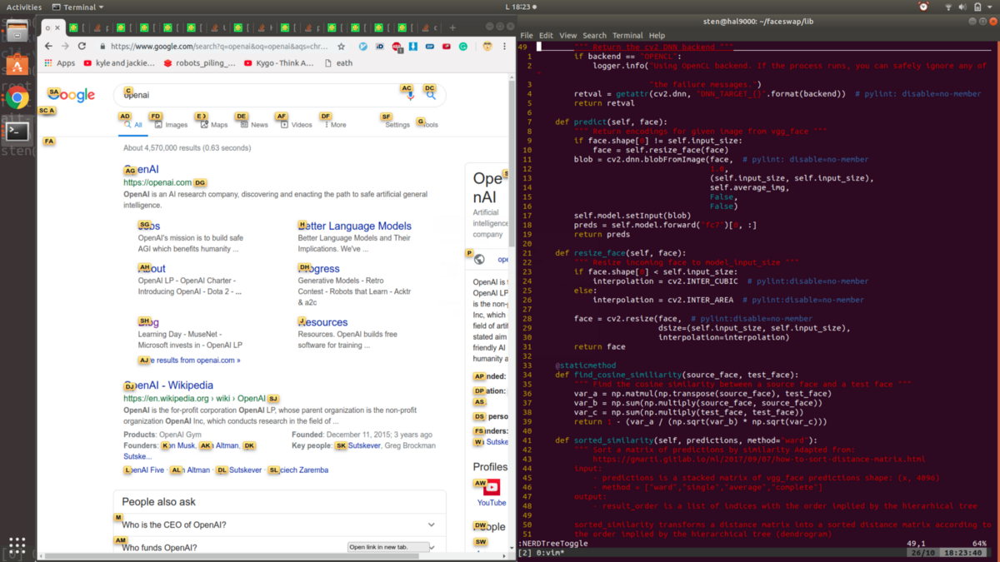
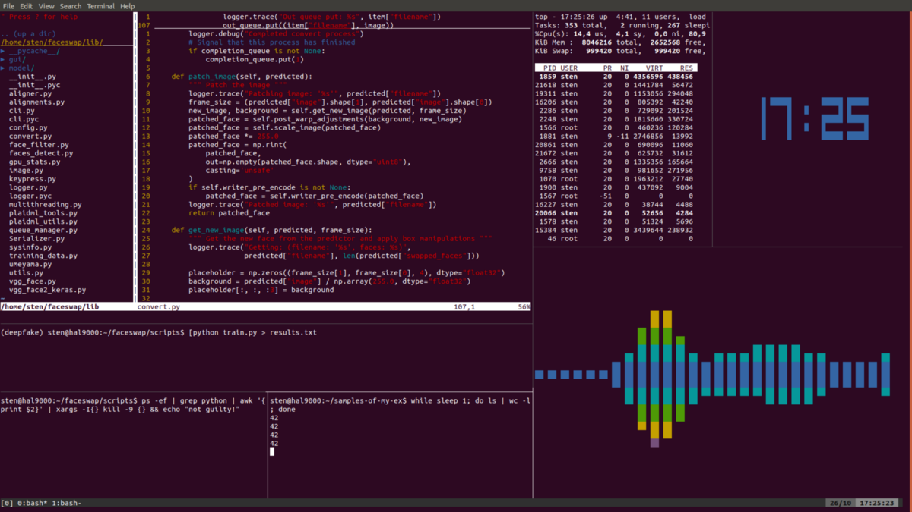

也许您认为这样的马基雅维利式策略太过巧妙和不真诚，光彩夺目太轻浮了。 您宁愿放慢脚步，专注于手工艺，希望在努力，诚实的工作中走到最后，得到认可。

也许会，但是为什么要浪费生命中最美好的十年呢？ 为什么不把脚放在桌子上，马上就扮演热门人物呢？ 让我告诉你，比起一个真正的没人，做一个假人更好。

设置好舞台之后，演出就可以开始了。 轴承中的所有内容都应最大程度地证明您没有使用鼠标。 也许靠在椅子上，双腿放在桌子上，键盘放在腿上。 我本人在距离40英寸显示器十英尺远的一个豆袋里晒太阳。

至于表演本身，请记住：这是巴洛克风格，而不是极简主义。 您想用快速的手指操作和复杂的过渡来吸引观众。 在vim内部，您可以逐行，逐个功能地跳动，因此围观者几乎无法注册任何一个。 就像他们的视线开始调整一样，就像他们要赶上废话一样（很少有行真正包含有效的代码），您切换到另一个tmux窗格，他们的斗争又重新开始了。

通过混淆的程度和引起的沮丧程度来衡量良好的性能。 出色的性能令人作呕。 从字面上看，观众可以从他们的脚上滑下来-他们不由自主地在癫痫发作和流涎中摔倒在地。

比离开终端更糟糕的是离开键盘。 使用游标会散发出无能。 如果您拥有PC，请立即将牙齿伸入符合人体工程学的怪兽尾巴中，该尾巴即是鼠标。 如果使用笔记本电脑，请将砂纸粘在触摸板上-您希望将其与血液和疼痛联系起来。

现在，当您在终端中时，很容易敲击键盘。 要继续在浏览器中进行操作，请使用Vimium，这是一个Chrome扩展程序，可帮助您无需使用鼠标即可浏览网页。 它用一系列键突出显示站点上的每个链接，按下这些键可以模拟鼠标单击，从而打开所需的页面。 外观如下：

> Vimium

提示，即使在浏览互联网时，也要打开终端。 正如剧作家约翰·海伍德（John Heywood）所说：“一块面包总比没有好。” 此外，仔细查看我的Chrome标签会发现arXiv论文和Stack Overflow帖子混合在一起。 这绝非偶然。 从战略角度精心设计的标签页可以让您跨过一位机器学习工程师梦the以求的椅子，一条腿在理论上悬而未决，另一条腿在实践中悬而未决。

令人信服的表演需要精巧的舞台，因为它分散了观众的注意力，使他们无法意识到自己缺乏深度。 在电影中，通过将3D块堆叠在一起或通过修饰一些全息图来编写软件。 当然，这是幻想。 在现实生活中，您可以找到最接近它的方法，就是结合使用数十年前发明的三种陈旧技术。

首先，您拥有vim，这是一个高度可配置的文本编辑器，因此难以使用的数百万开发人员无意中陷入了困境，无法弄清该死的东西。 您敢于使用它的事实这一事实就提高了您在同事中的地位。 您似乎是彻头彻尾的神话人物，向其他人阐明了与神圣的编辑战争等历史悠久的话题，并激起了您对Emacs教堂的十字军东征。

其次，有tmux，该工具可让您在单个终端窗口中打开多个窗格。 这意味着您可以在一个窗格中编写代码，在另一窗格中运行终端命令，并在其余窗格中打开完全没用的插件（如音频频谱图和超大的时钟）。 通常，您希望打开尽可能多的窗格，以吸引眼球的眼镜压倒观众的感觉。 我本人指出，永远不要关闭窗格，因为无法正常工作的代码不会老化。

举个例子，这是我生成一些深造品时的屏幕快照：

> Spectrogram credit: M.O.P. — Ante Up

最后，掌握bash是至关重要的，bash是一种直接在命令行中直接使用的脚本语言。 知道bash可以使您在终端中的时间最大化-将其留在表演的中间是一种牺牲，这相当于在电影中间打开电影院的灯光。 需要计算什么吗？ 在这里，您可以：echo“ scale = 0; 2 + 2” | 公元前。 想知道您的CPU使用率吗？ 这是命令：mpstat | grep -A 5“％idle” | 尾-n 1 | awk -F“”'{print 100-$ 12}'a。 你明白了。
# 如何假装成为一名优秀的程序员
## 秘密在于光学

> Photo by Braydon Anderson on Unsplash

程序员是向导，可怜的衣衫characters的字符将咖啡变成代码。 我不懂魔术，我只是个魔术师。 我的工作是要成为一名假冒的程序员，比真正的程序员要更真实。

我的工作很棒，绝对是骗子的野兽。 我欺骗商人要求我成为他们的技术联合创始人。 我欺骗了工程师，向我咨询人工智能。 我的行为是如此真实，司法部曾经征求我的建议，以使用Visual Basic来跟踪串行杀手的IP地址来创建GUI界面。

秘诀：这不是您所知道的，而是您所展示的。

真正的工程师缓慢而无聊，因为他们被现实压倒了。 魔术师只能受到他的想象力的限制。 他可以自由地执行最复杂的场景，越淫荡越好。 公众对黑客的看法是由狂欢和口交的场面所塑造的，他们是稀有的人，他们会根据自己的误解而行事，使未成年的人沉迷于幻想，而你会被称赞为英雄。
