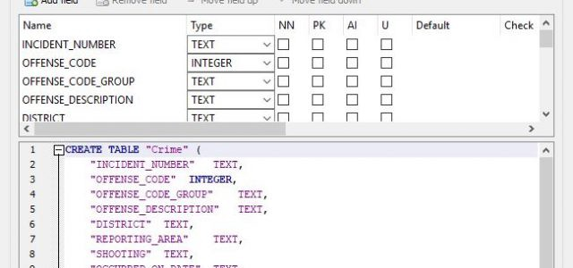
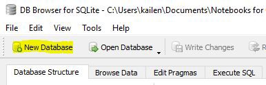
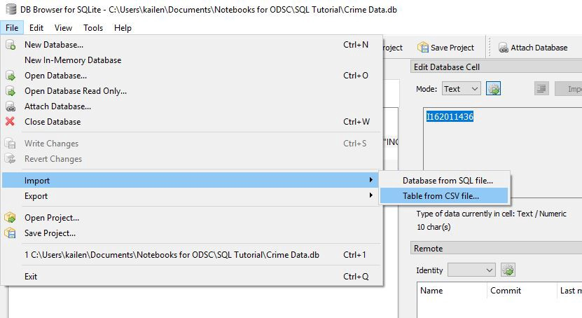
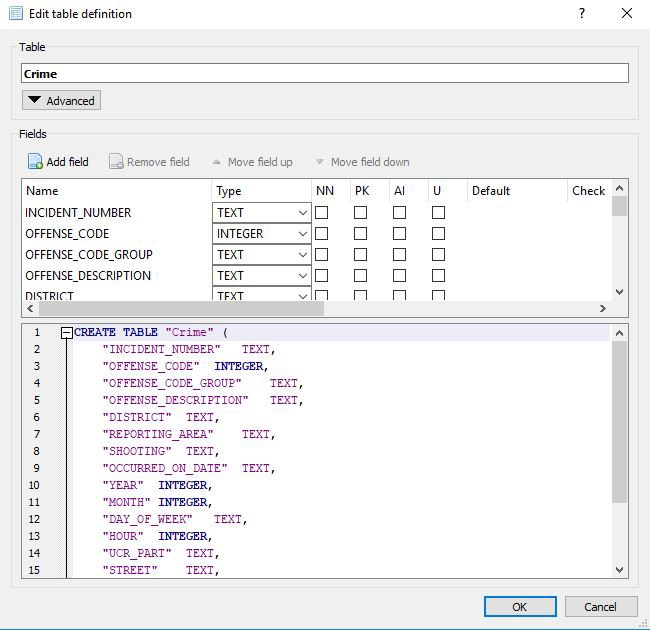
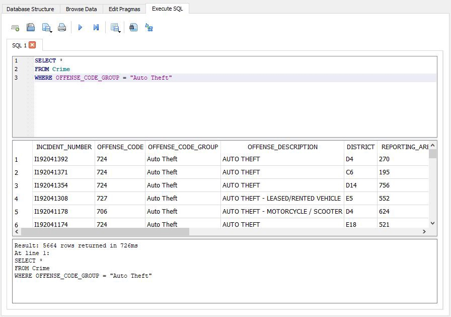
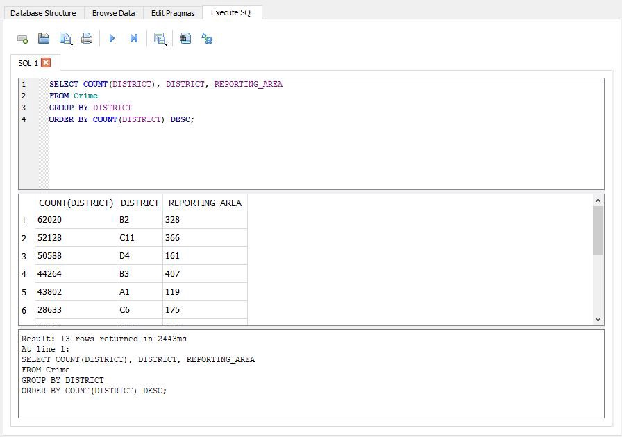
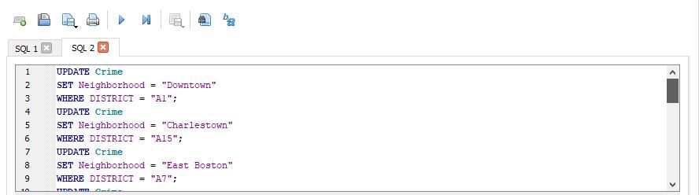
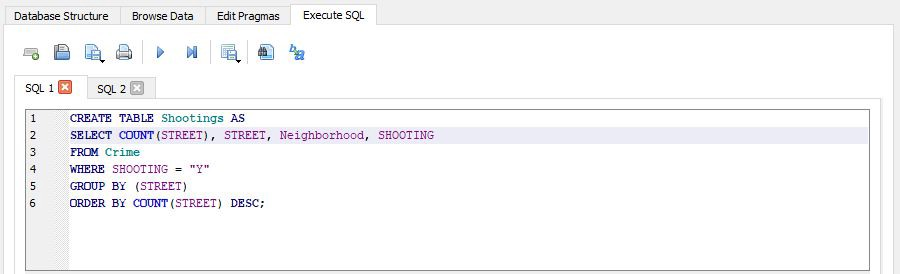
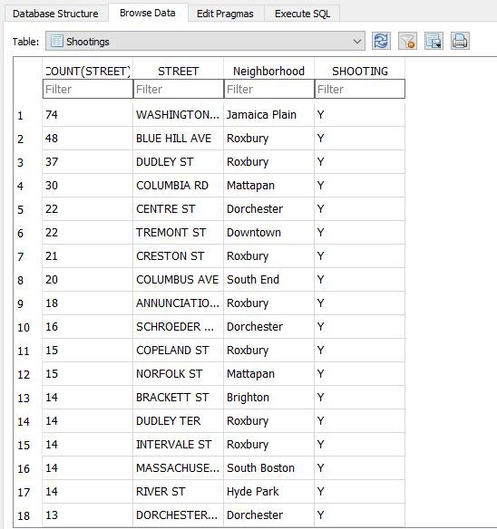

原始帖子在这里。

在OpenDataScience.com上阅读更多数据科学文章，包括从初学者到高级的教程和指南！ 在此处订阅我们的每周新闻，并在每个星期四接收最新新闻。
# 如何开始使用SQL

几乎每个流行的应用程序和社交媒体平台都有一个引擎来驱动我们吸收的信息和数据。 要跟踪数亿个数据点，必须有运转良好的计算机来维护该数据库。 每个开发人员都有自己喜欢的用于数据库管理的程序，但是大多数程序都使用结构化查询语言（简称SQL）。

[相关文章：在MySQL，PostgreSQL和SQLite之间切换]

对于那些希望管理关系数据库的人来说，SQL是一个很好的工具，后者依赖于基于诸如交互作用（例如视频中的用户评论）之类的关系来连接不同的数据类型。 每次交互都使用查询来存储和访问，查询可以精确选择需要在网页上显示的数据或其他内容。 但是SQL不仅仅是一个数据库管理工具-它在许多领域中都有大量的应用程序，是清理和浏览数据以及合并数据集以获取更多见解的必备工具。

对于喜欢在shell中工作的传统编码器来说，脚本查询应该不是问题，但是对于那些喜欢在更可视化环境中工作的程序员，可以使用多种选择。 对于客户端服务器应用程序，MySQL是一个不错的选择，但是对于本教程，我将使用DB Browser for SQLite。 尽管SQLite不是客户端服务器，但我将仅介绍一些简单的查询，以使您熟悉语法。 事不宜迟，让我们开始吧！

在为您的系统下载了适当的数据库浏览器版本后，我们就可以开始查看数据源。 在开放数据科学学院，我们显然喜欢使用随时可用的数据，并且波士顿市的数据门户还有很多余地。 我下载了《犯罪事件报告》数据以供使用-如果您使用的数据具有数据字典，则必须对其进行研究以准确了解每一列所包含的内容，尤其是其名称含糊不清时。

首先，单击“创建新数据库”，为数据库命名，然后保存到您选择的位置。

使用数据库浏览器的好处之一是能够从逗号分隔的值文件中创建表，而这恰好是犯罪数据所采用的格式。

如果您对此处涉及的编码语法感到好奇，或者想要从头开始创建表，则可以突出显示该表，然后单击“修改表”以查看用于创建表的脚本，如下所示。

如您所见，每个类别都与不同的数据类型相关联，在创建查询时要特别注意。 此时，您可能想使用“浏览数据”选项卡来熟悉数据。

浏览完数据后，我们可以开始编写简单的查询来选择要突出显示的特定数据。 首先，单击“执行SQL”选项卡以打开脚本外壳。 大多数SQL查询的Hallmark命令是SELECT命令，该命令根据特定条件从表中提取列和行。 如果我们写“ SELECT *”，则可以在必要时包括表中的每一列。 与WHERE和FROM命令结合使用，SELECT允许您在短短几行中创建一个新表。 在这里，我想隔离汽车盗窃事件； 执行完查询后，输出结果如下：

从我们的结果中可以看出，过去四年来在波士顿发生了5664起汽车盗窃案。 如果我们想统计某些事情，例如哪个区的报告最多，该怎么办？ 我们可以使用COUNT命令来处理这一问题—同样，只需执行几行代码，我们就会获得一个漂亮的数据集来显示每个地区的事件数。 注意：使用GROUP BY命令显示每个不同区域的计数很重要。

根据波士顿警察局的区密钥，在过去四年中，罗克斯伯里，多切斯特和南端的事件最多。 作为实践，我创建了一个名为Neighbourhood的列，并使用UPDATE命令插入与各自警区有关的社区名称。

我将展示的最后一个示例结合了到目前为止我们已经练习的所有命令。 我想获得发生枪击案的犯罪现场的最常见街道的清单。 另外，我想从查询中创建一个新表以导出以供以后使用，例如可视化。 这是我想出的查询和输出：

如果一切顺利，则数据库中应该有一个新表，您可以在“浏览数据”选项卡中查看该表，我们可以将其视为自己的数据集。

[相关文章：R中的SQL等效项]

既然您已经了解了SQL的基本命令，那么，世界就在您身边。 这些命令与框架配对后，可以为后端系统提供支持，这些后端系统选择与您的用户看到的数据相关的数据。 对于使用SQL清理数据的用户来说，这些命令是有用的工具，但是通过更多的实践和对SQL语法的更好理解，即使对于非编码人员，清理和导出数据也应轻而易举。 因此，无论您是记者，实验室技术人员还是大数据分析师，都可以尝试使用SQL-它可能会成为您最喜欢的数据整理工具。
