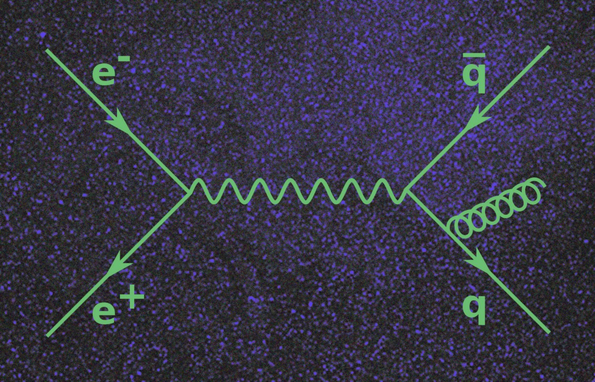

# 如何将向量微积分的复杂数学转换为简单图片
## 费曼图彻底改变了粒子物理学。 现在，数学家希望对矢量微积分做同样的事情。


来自arXiv的新兴技术

早在1948年，《物理评论》杂志就发表了一篇题为《时空方法》的论文。
```
(本文翻译自MIT Technology Review的文章《How to Turn the Complex Mathematics of Vector Calculus Into Simple Pictures》，参考：https://medium.com/mit-technology-review/how-to-turn-the-complex-mathematics-of-vector-calculus-into-simple-pictures-f3ea8d8b3830)
```
