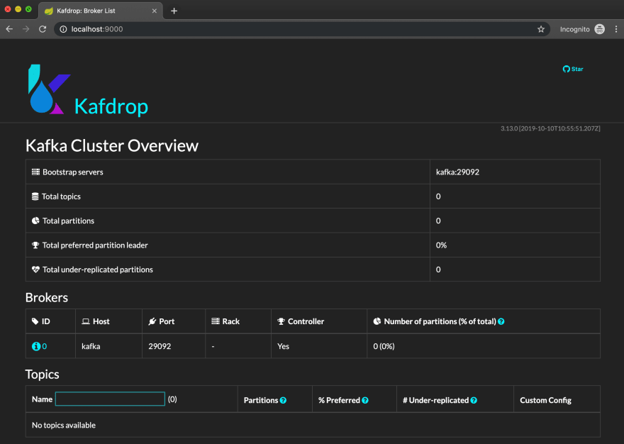

这篇文章对您有用吗？ 花一点时间鼓掌，以便其他人也能发现它。 我很想听听您的反馈，所以请不要退缩！ 如果您对Kafka或事件流感兴趣，或者有任何疑问，请在Twitter上关注我。
# 简要介绍

事件流平台驻留在更广泛的面向消息的中间件（MoM）类中，并且与传统的消息队列和主题类似，但是由于日志结构的不可变性，它们提供了更强大的时间保证和通常数量级的性能提升。 简而言之，写操作主要限于顺序追加，这使它们变得快速。 真快。

传统消息队列（MQ）中的消息往往是任意排序的，并且通常彼此独立，而流中的事件（或记录）往往是按时间顺序或因果关系强烈排序的。 而且，流将保留其记录，而MQ一旦读取了一条消息，便会丢弃该消息。 因此，事件流往往更适合事件驱动的体系结构，包括事件源，最终一致性和CQRS概念。 （当然，也有FIFO消息队列，但是FIFO队列和成熟的事件流平台之间的差异非常大，而不仅限于订购。）

事件流平台是更广泛的MoM领域中相对较新的范例。 与数百种MQ风格的代理相比，只有少数主流实现可用，有些可以追溯到1980年代（例如Tuxedo）。 与已建立的标准（例如AMQP，MQTT，XMPP和JMS）相比，流空间中没有等效的标准。 事件流平台是持续研究和实验的活跃领域。 尽管如此，流媒体平台不仅是一个利基概念，还是具有一些深奥的用例的学术思想； 它们可以有效地应用于广泛的消息传递和事件场景，并定期取代它们的更传统版本。
# 架构概述

下图简要概述了Kafka组件体系结构。 虽然并不是要向您灌输Kafka的所有内部工作原理，但对其设计的某些欣赏将对解释我们稍后将要介绍的关键概念大有帮助。

> Architecture Overview


Kafka是一个分布式系统，包含几个关键组件：
+ 代理节点：负责大量I / O操作和集群内的持久性持久性。 代理容纳仅附加日志文件，这些文件包含由集群托管的主题分区。 可以在多个代理之间复制分区，以实现水平可伸缩性和更高的持久性-这些被称为副本。 代理节点可以充当某些副本的领导者，而可以充当其他副本的跟随者。 一个单一的代理节点也将被选为集群控制器-负责分区状态的内部管理。 这包括针对任何给定分区的领导者跟随者角色的仲裁。
+ ZooKeeper节点：在幕后，Kafka需要一种方法来管理集群中总体控制器状态。 如果控制器出于某种原因退出，则有一个协议可以从剩余的代理集中选出另一个控制器。 ZooKeeper很大程度上实现了控制器选择，心跳等的实际机制。 ZooKeeper还充当各种配置存储库，维护集群元数据，领导者跟随状态，配额，用户信息，ACL和其他内部管理项目。 由于底层的闲聊和共识协议，ZooKeeper节点的数量必须为奇数。
+ 生产者：负责将记录附加到Kafka主题的客户端应用程序。 由于Kafka的日志结构性质以及在多个消费者生态系统之间共享主题的能力，因此只有生产者才能修改基础日志文件中的数据。 实际的I / O由代理节点代表生产者客户端执行。 任何数量的生产者都可以发布到同一主题，选择用于保留记录的分区。
+ 使用者：从主题读取的客户端应用程序。 任何数量的消费者都可以从同一主题中阅读内容； 但是，根据使用者的配置和分组，存在一些规则来管理使用者之间的记录分配。
# 主题，分区，记录和偏移

分区是记录的完全有序序列，是Kafka的基础。 一条记录具有一个ID（一个64位整数偏移量）和一个毫秒精确的时间戳。 另外，它可能有一个键和一个值。 两者都是字节数组，并且都是可选的。 术语“完全排序”仅表示对于任何给定的生产者，记录将按照应用程序发出的顺序进行写入。 如果记录P在Q之前发布，则P将在分区中的Q之前。 （假设P和Q共享一个分区。）此外，所有使用者将以相同的顺序读取它们。 对于每个可能的使用者，将始终在Q之前读取P。 在大多数用例中，这种订购保证至关重要。 通常，已发布的记录将与某些现实事件相对应，并且保留这些事件的时间表通常是必不可少的。

注意：Kafka使用“记录”一词，其他人则可能使用“消息”或“事件”。 在本文中，我们将根据上下文互换使用这些术语。 同样，您可能会看到“信息流”一词可以代替“主题”。

生产者之间没有公认的订购； 如果两个（或更多）生产者同时发出记录，则这些记录可以任意顺序实现。 话虽如此，该顺序仍将在所有消费者中得到统一观察。

记录的偏移量在分区中唯一标识。 偏移量是稀疏地址空间中严格单调递增的整数，这意味着每个连续偏移量始终高于其前任偏移量，并且相邻偏移量之间可能存在变化的间隙。 如果启用了压缩或作为事务的结果，则间隙可能合法地出现； 我们无需在此阶段深入研究细节，只需说偏移量不必是连续的即可。

您的应用程序不应尝试从字面上解释偏移量，也不应该猜测下一个偏移量可能是什么； 但是，它可以根据它们的偏移量推断任何记录对的相对顺序，按记录的偏移量对记录进行排序，依此类推。

下图显示了内部分区的外观。
```
start of partition+--------+-----------------+|0..00000|First record     |+--------+-----------------+|0..00001|Second record    |+--------+-----------------+|0..00002|Third record     |+--------+-----------------+|0..00003|Fourth record    |+--------+-----------------+|0..00007|Fifth record     |+--------+-----------------+|0..00008|Sixth record     |+--------+-----------------+|0..00010|Seventh record   |+--------+-----------------+            ...+--------+-----------------+|0..56789|Last record      |+--------+-----------------+       end of partition
```

起始偏移量（也称为低水位标记）是将显示给消费者的第一条消息。 由于Kafka的保留期有限，因此不一定是第一个发布的消息。 可以根据时间和/或分区大小来修剪记录。 发生这种情况时，低水位线似乎会前进，并且早于低水位线的记录将被截断。

相反，高水位标记是紧接分区中最后一条记录的偏移量，也称为结束偏移量。 它是将分配给要发布的下一个记录的偏移量。 它不是最后一条记录的偏移量。

主题是分区的逻辑组成。 一个主题可能具有一个或多个分区，并且一个分区必须恰好是一个主题的一部分。 主题是Kafka的基础，它允许并行性和负载平衡。

之前，我们说过分区显示总顺序。 由于主题内的分区是相互独立的，因此称该主题具有部分顺序。 简单来说，这意味着某些记录可以相对于彼此排序，而相对于某些其他记录则不排序。 总顺序和部分顺序的概念虽然听起来有些学术性，但在构建性能事件流传输管道中非常重要。 它使我们能够在可能的地方并行处理记录，同时在必须的地方保持顺序。 我们将在短期内探讨记录顺序，消费者并行性和主题大小的概念。
# 示例：发布消息

让我们将其中的一些理论付诸实践。 我们将启动一对Docker容器-一个用于Kafka，另一个用于Kafdrop。 但是，我们将使用Docker Compose，而不是单独启动它们。

在您选择的目录中创建一个docker-compose.yaml文件，其中包含以下内容：
```
version: "2"services:  kafdrop:    image: obsidiandynamics/kafdrop    restart: "no"    ports:      - "9000:9000"    environment:      KAFKA_BROKERCONNECT: "kafka:29092"    depends_on:      - "kafka"  kafka:    image: obsidiandynamics/kafka    restart: "no"    ports:      - "2181:2181"      - "9092:9092"    environment:      KAFKA_LISTENERS: "INTERNAL://:29092,EXTERNAL://:9092"      KAFKA_ADVERTISED_LISTENERS: "INTERNAL://kafka:29092,EXTERNAL://localhost:9092"      KAFKA_LISTENER_SECURITY_PROTOCOL_MAP: "INTERNAL:PLAINTEXT,EXTERNAL:PLAINTEXT"      KAFKA_INTER_BROKER_LISTENER_NAME: "INTERNAL"
```

注意：为方便起见，我们使用obsidiandynamics / kafka图像，因为它将Kafka和ZooKeeper巧妙地捆绑到一个图像中。 如果您愿意，可以用Confluent或Wurstmeister的图像替换它，但随后必须正确地将它们全部连接起来。 obsidiandynamics / kafka图像可以为您完成所有这些操作，因此强烈建议初学者（和懒惰的专业人士）使用。

然后从docker-compose up开始。 一旦启动，请在浏览器中导航到localhost：9000。 您应该会看到Kafdrop登陆屏幕。

> Kafka cluster overview


您应该看到我们的单一经纪人集群。 这是一个充满希望的开始，但是没有话题。 没问题； 让我们使用Kafka的命令行工具创建一个主题并发布一些消息。 方便地，我们已经有一个Kafka映像作为docker-compose堆栈的一部分运行，因此我们可以将其嵌入其中以使用内置的CLI工具。
```
docker exec -it kafka-kafdrop_kafka_1 bash
```

这将使您进入Bash外壳。 这些工具位于/ opt / kafka / bin目录中，因此请使用cd进入该目录：
```
cd /opt/kafka/bin
```

创建一个名为streams-intro的主题，其中包含3个分区：
```
./kafka-topics.sh --bootstrap-server localhost:9092 \    --create --partitions 3 --replication-factor 1 \    --topic streams-intro
```

切换回Kafdrop，我们现在应该在列表中看到新主题。


是时候发布东西了。 我们将使用kafka-console-producer工具：
```
./kafka-console-producer.sh --broker-list localhost:9092 \    --topic streams-intro --property "parse.key=true" \    --property "key.separator=:"
```

注意：kafka-topics使用--bootstrap-server参数来配置Kafka代理列表，而kafka-console-producer则使用--broker-list参数来实现相同的目的。 同样，--property参数在很大程度上没有记载； 为Google做好准备。

记录由换行符分隔。 键和值部分由冒号分隔，如key.separator属性所指示。 为了举例，键入以下内容（复制粘贴即可）：
```
foo:first messagefoo:second messagebar:first messagefoo:third messagebar:second message
```

完成后按CTRL + D。 然后切换回Kafdrop，然后单击streams-intro主题。 您将看到该主题的概述以及基础分区的详细分类：

> Kafka topic viewer


让我们暂停片刻，剖析已完成的工作。 我们创建了一个包含三个分区的主题。 然后，我们使用两个唯一的键foo和bar发布了五个记录。 Kafka使用键将记录映射到分区，这样具有相同键的所有记录将始终出现在同一分区上。 方便，但也很重要，因为它使发布者可以指定准确的记录顺序。 稍后我们将更详细地讨论键哈希和分区分配。 同时，坐下来享受旅程。

查看分区表，分区＃0的第一个和最后一个偏移分别为零和两个。 分区＃2的值为零和三个，而分区＃1的显示为空白。 在Kafdrop网络用户界面中单击＃0，会将我们转到主题查看器：

> Viewing topic contents


我们可以看到在bar键下发布的两条记录。 注意，它们与foo记录完全无关。 除了在同一个主题中进行整理外，没有什么可以绑定跨分区的记录了。

注意：如果您想知道，可以使用消息左侧的箭头来展开和漂亮地打印JSON编码的消息。 由于我们的示例未使用JSON，因此无需精打细算。

可以毫不夸张地说，Kafka的内置工具令人讨厌。 命令参数的命名不一致，并且发布键式消息的简单操作要求您跳过环-传递晦涩的，未记录的属性。 内置工具的可用性是Kafka社区中众所周知的痛点。 这真是可耻。 这就像购买法拉利，只是要用塑料轮毂盖交付。 幸运的是，有商业和开放源代码的替代方案可以填补工具和可观察性方面的巨大空白。
# 消费者和消费者群体

到目前为止，我们了解到生产者将记录发送到流中。 这些记录被组织成井井有条的分区。 Kafka的发布订阅拓扑遵循灵活的多点对多点模型，这意味着可以有任意数量的生产者和消费者同时与流进行交互。 根据实际的解决方案上下文，流拓扑也可以是点对多点，多点对点和点对点。 现在是时候我们来研究如何使用记录了。

使用者是通过客户端库连接到Kafka集群的进程或线程。 （大多数语言都可以使用一种语言。）消费者通常（但不一定）作为整体消费者群体的一部分。 该组由group.id属性指定。 消费者组实际上是Kafka中的负载平衡机制-在组内的各个消费者实例之间大致均匀地分配分区分配。 当组中的第一个使用者订阅该主题时，它将收到该主题中的所有分区。 当第二个使用者随后加入时，它将获得大约一半的分区，从而使第一个使用者减轻了先前负载的一半。 当使用者离开时（通过断开连接或超时），该过程将反向进行-其余的使用者将吸收更多数量的分区。

因此，消费者吸取了某个主题的记录，并从Kafka及其所属的其他消费者分配的分区中提取了份额。 就负载平衡而言，这应该非常简单。 但是，这是关键-消费记录的行为不会删除它。 起初这似乎是矛盾的，特别是如果您将消耗行为与消耗行为联系起来。 （如果有的话，应该将消费者称为“阅读者”，但不要过多地选择术语。）一个简单的事实是，消费者绝对不会对该主题及其分区产生任何影响； 主题是仅追加分类帐，只能由生产者或Kafka本身（作为压缩或清除的一部分）进行突变。 消费者是“便宜的”，因此您可以让许多人在不增加集群负担的情况下拖尾日志。 这是事件流和传统消息队列之间的又一区别，这是至关重要的。

使用者在内部维护一个偏移量，该偏移量指向分区中的下一个记录，从而在每次连续读取时都提前偏移量。 消费者首次订阅主题时，可以选择从主题的头端或尾端开始。 通过将auto.offset.reset属性设置为最新，最早或没有，可以控制此行为。 在后一种情况下，如果使用者组不存在先前的偏移量，则将引发异常。

消费者在本地保留其偏移状态向量。 由于不同消费者群体中的消费者不会互相干扰，因此可能有许多人同时阅读同一主题。 消费者按照自己的步调奔跑； 缓慢的或积压的消费者对其同行没有影响。

为了说明这个概念，请考虑一个包含两个分区的主题的人为场景。 两个消费者组-A和B-订阅了该主题。 每个组具有三个实例，使用者被命名为A1，A2，A3，B1，B2和B3。 下图说明了两组如何共享主题，以及消费者如何彼此独立地浏览记录。
```
Partition 0                 Partition 1               +--------+                  +--------+               |0..00000|                  |0..00000|               +--------+                  +--------+               |0..00001| <= consumer A2   |0..00001|               +--------+                  +--------+               |0..00002|                  |0..00002| <= consumer A1               +--------+                  +--------+               |0..00003|                  |0..00003|                +--------+                  +--------+                  ...                          ...               +--------+                  +--------+               |0..00008| <= consumer B3   |0..00008| <= consumer B2               +--------+                  +--------+               |0..00009|                  |0..00009|               +--------+                  +--------+producer P1 => |0..00010|                  |0..00010|               +--------+                  +--------+                            producer P1 => |0..00011|                                           +--------+
```

仔细看，您会发现有些东西丢失了。 消费者A3和B1不在那里。 那是因为Kafka保证分区只能分配给其消费者组中的一个消费者。 （我们说“最多”是指所有消费者都处于脱机状态的情况。）由于每个组中有三个消费者，但是只有两个分区，因此一个消费者将保持空闲状态-等待各自组中的另一个消费者离开后再离开 分配了一个分区。 以这种方式，消费者群体不仅是负载平衡机制，而且是用于构建高性能管道而又不牺牲安全性的类似篱笆的排他性控制，尤其是在要求记录只能由一个线程处理的情况下 或在任何给定时间进行处理。

消费者群体也用于确保可用性。 通过定期从某个主题中提取记录，使用者可以向群集隐式通知群集处于“健康”状态，从而将租约扩展到其分区分配上。 但是，如果消费者未能在允许的期限内再次阅读，则将其视为有缺陷，并将重新分配其分区-分配给该组中其余“健康”的消费者。 该截止日期由max.poll.interval.ms消费者客户端属性控制，默认情况下设置为五分钟。

用交通类比来说，主题就像高速公路，而分区就是车道。 记录等同于汽车，占用者对应于记录的价值。 只要保持行车路线，几辆车就可以安全地在同一条高速公路上行驶。 共享相同线路的汽车按顺序行驶，形成队列。 现在，假设每条车道通向一个匝道，将其流量转移到某个位置。 如果一个坡道堆积了，其他坡道可能仍会顺畅流动。

Kafka正是利用这种高速路隐喻来实现其端到端吞吐量，轻松地在商品硬件上每秒达到数百万条记录。 创建主题时，可以选择分区计数-通道数（如果需要）。 分区在一个消费者组中的各个消费者之间大致均匀地划分，并确保不会将分区同时分配给两个（或多个）消费者，前提是这些消费者是同一消费者组的一部分。 参照我们的类比，汽车永远不会同时出现在两个坡道之外。 但是，可以想象有两条车道通向同一匝道。

注意：创建后，可以通过增加分区数来调整主题的大小。 但是，无法在不重新创建主题的情况下减少分区数。

记录对应于事件，消息，命令-或任何其他可流式传输的内容。 记录的精确划分方式由生产者决定。 生产者可以在发布记录时显式分配分区索引，尽管这种方法很少使用。 正如我们在前面的示例中所做的那样，一种更常见的方法是为记录分配键。 密钥对Kafka完全不透明-换句话说，Kafka不会尝试解释密钥的内容，而是将其视为字节数组。 使用一致的哈希技术对这些字节进行哈希处理以得出分区索引。

共享相同散列的记录可以保证占据相同的分区。 假设一个主题具有多个分区，则具有不同键的记录可能最终会位于不同的分区中。 但是，由于哈希冲突，具有不同哈希值的记录也可能最终会在同一分区中。 这就是哈希的本质。 如果您了解哈希表的工作原理，这没有什么不同。

生产者很少在乎记录将映射到哪个特定分区，只有相关记录最终在同一分区中并且保留其顺序。 同样，使用者对分配的分区也无动于衷，只要它们以与发布时相同的顺序接收记录，并且其分区分配不会与组中的任何其他使用者重叠。
# 提交抵销

我们已经说过，消费者在分区偏移量方面保持内部状态。 在某个时候，该状态必须与Kafka共享，以便在重新分配分区时，新使用者可以从传出使用者停止的地方恢复处理。 同样，如果使用者要断开连接，则在重新连接时，理想情况下，他们将跳过已处理的那些记录。

将使用者状态持久返回到Kafka集群称为提交偏移量。 通常，使用者将读取一条记录（或一批记录），并提交最后一条记录的偏移量加一个。 如果新用户接管了该主题，它将从最后提交的偏移量开始处理，因此加一步骤至关重要。 （否则，将再次处理最后处理的记录。）

有趣的事实：Kafka采用递归方法来管理已提交的偏移量，并优雅地利用自身来保持和跟踪偏移量。 提交偏移量后，Kafka将在内部__consumer_offsets主题上发布二进制记录。 该主题的内容在后台进行了压缩，从而创建了一个有效的事件存储，该存储逐渐减少到任何给定的消费者组的最后一个已知提交点。

控制发生偏移的时间点可在交付保证方面提供很大的灵活性，这使卡夫卡获得了另一张王牌。 “传递”一词不仅假设要读取记录，还包括整个处理周期以及所有副作用。 只需将提交操作从开始处理记录的一点移动到处理完成后的某个时刻，就可以将提交模式从最多一次转换为最少一次。 使用此模型，如果使用者在处理记录的过程中失败，则将在分区重新分配后重新读取记录。

默认情况下，Kafka使用者将每5秒自动提交一次偏移，无论该使用者是否已完成记录的处理。 通常，这不是您想要的，因为它可能导致混合的交付语义-在使用者失败的情况下，某些记录可能会交付两次，而另一些记录可能根本无法交付。 要启用手动偏移提交，请将enable.auto.commit属性设置为false。

注意：Kafka中有一些类似的陷阱。 请密切注意Kafka官方文档中的（生产者和消费者）客户端属性，尤其是规定的默认值。 暂时不要假设默认设置是明智的，因为默认设置应该让安全性胜于其他竞争品质。 Kafka默认值通常会针对性能进行优化，并且在安全性很关键的情况下，需要在客户端上明确覆盖默认值。 幸运的是，设置属性以确保安全性对性能只会产生很小的影响-Kafka仍然是野兽。 记住优化的第一条规则：不要这样做。 如果卡夫卡的创作者给予更多考虑，卡夫卡本来会更好。

正确地提交偏移量可能很棘手，并且经常会赶上初学者。 承诺的偏移量表示低于该偏移量的记录和所有先前的记录已由消费者处理。 在设计至少一次或完全一次的应用程序时，仅当应用程序处理相关记录及其之前的所有记录时，才应提交偏移量。 换句话说，该记录已被处理到已经执行并最终确定该记录所导致的任何动作。 这可能包括调用其他API，更新数据库，提交事务，保留记录的有效负载或发布更多记录。 换句话说，如果消费者在提交记录后失败，那么再也看不到该记录不会损害其正确性。

在至少一次（并且扩展为完全一次）方案中，典型的使用者实现将与记录处理一起线性地提交其偏移量。 也就是说，读取记录，提交（加一），读取下一条，提交（加一），依此类推。 一种常见的策略是使用线程池同时处理一批记录（在此有意义），并且仅在完成整个批处理时才确认最后一条记录。 Kafka中的提交过程非常高效，客户端库将使用内存队列将提交请求异步发送到集群，而不会阻塞使用方。 客户端应用程序可以注册一个可选的回调，并在集群确认提交后通知它。

消费群体是一个有点被低估的概念，它对于事件流平台的多功能性至关重要。 通过简单地改变消费者与其组的亲和力，就可以得出极为不同的分发拓扑结构-从类似主题的发布订阅行为到MQ风格的点对点模型。 因为记录永远不会真正被消耗（提前的偏移量只会造成消耗的错觉），所以可以在单个事件流上同时叠加不同的分发拓扑。
# 免费消费者

消费者群体是完全可选的； 消费者不需要包含在消费者组中即可从主题中提取消息。 一个免费的使用者忽略了group.id属性。 这样做可以使其在宽松的规则下运行，从而将消费者管理的职责完全转移到应用程序中。

注意：使用“免费”一词来表示没有包容性群体的消费者不是标准Kafka命名法的一部分。 由于卡夫卡（Kafka）缺乏规范的术语来描述这一点，因此这里采用了“免费”一词。

自由消费者不订阅主题。 取而代之的是，使用方应用程序负责为用户手动分配一组主题分区，并分别为每个主题分区对指定起始偏移量。 自由消费者不会向Kafka支付补偿； 应用程序可以使用自己选择的数据存储来跟踪此类使用者的进度并适当地保持其状态。 在这种模式下，自动分区分配，重新平衡，偏移量持久性，分区独占性，消费者心跳和故障检测以及其他与消费者群体相关的所谓“精美”的概念不再存在。

自由消费者在野外观察的频率不及同类消费者。主要有两个用例，其中自由消费者是合适的选择。第一种是当您确实需要完全控制分区分配方案和/或需要其他位置来存储使用者偏移量时。这是非常罕见的。不用说，鉴于必须要考虑的多种情况，正确实施也非常困难。第二个更常见的用例是当您有一个无状态或临时用户需要监视主题时。例如，您可能有兴趣跟踪主题以标识​​特定记录，或者仅作为调试工具。您可能只在乎无状态使用者在线时发布的记录，因此持久偏移和从最后处理的记录恢复等问题完全不相关。例行使用的一个很好的例子是我们已经看到的Kafdrop网络用户界面。当您单击一个主题以查看消息时，Kafdrop将创建一个免费的使用者，并为其分配所请求的分区，并从提供的偏移量中读取记录。导航到其他主题或分区将重置使用者，并丢弃所有先前状态。

下图概述了生产者，主题，分区，消费者和消费者群体之间的关系。
```
+----------+          +----------+|PRODUCER 1|          |PRODUCER 2|+-----v----+          +-----v----+      |                     |      |                     |      |                     |+-----V---------------------V--------------------------------------+|                            >>> TOPIC >>>                         ||            +---------------------------------------------------+ || PARTITION 0|record 0..00|record 0..01|record 0..02|record 0..03| ||            +-------------------v-------------------------------+ ||                                |                                 ||            +-------------------|-------------------------------+ || PARTITION 1|record 0..00|      |     |record 0..02|record 0..03| ||            +-------------------|-------------v-----------------+ ||                                |             |                   |+----------v---------------------|-------------|-------------------+           |                     |             |                  |                     |             |            |                     |             |            |            +--------|-------------|-------------------+           |            |        |             |                   |      +----V-----+      | +------V---+  +------V---+  +----------+ |      |CONSUMER 1|      | |CONSUMER 2|  |CONSUMER 3|  |CONSUMER 4| |      +----------+      | +----------+  +----------+  +----------+ |                        |               CONSUMER GROUP             |                        +------------------------------------------+
```

关键要点是：
+ 主题被细分为多个分区，每个分区在较宽的，部分排序的流中形成一个独立的，完全排序的序列。
+ 多个生产者可以发布一个主题，随意选择一个分区。 这可以通过指定分区索引直接完成，也可以通过确定性地哈希为一致分区索引的记录键间接实现。 （在上图中，生产者1和生产者2都发布到同一主题。）
+ 可以在一个消费者组中的整个消费者群体之间平衡主题的分区，从而在该组的成员之间大致均匀地分配分区。 （消费者2和消费者3各自获得一个分区。）
+ 不能保证组中的使用者可以分配分区。 在该群体的人口超过分区的地方，一些消费者将保持闲置状态，直到平衡达到平衡或向对方倾斜。 （消费者4保持无分区状态。）
+ 可以将分区手动分配给免费使用者。 如有必要，可以将整个主题分配给一个免费用户-通过单独分配所有分区来完成。 （可以为消费者1自由分配任何分区。）
# 一次交货

在将一次最少的传送语义与一次最多的传送语义进行比较时，一个经常被问到的问题是：为什么我们不能完全一次拥有它？

在不研究涉及猜想和不可能证明的学术细节的情况下，可以说没有与消费者应用程序的协作就不可能实现一次精确的语义。 实际上这是什么意思？

事件流应用程序中的使用者必须是幂等的。 换句话说，重复处理同一记录应该不会对消费者生态系统产生任何净影响。 如果唱片没有加成效应，则消费者天生就是等幂的。 （例如，如果使用者使用新的条目简单地覆盖了现有的数据库条目，则更新自然是幂等的。）否则，使用者必须在处理记录之前检查记录是否已被处理以及处理的程度如何。 。 至少一次交付和消费者幂等的组合共同导致一次语义。
# 示例：交易平台

由于所有这些理论都像库布里克的《巨石》一样笼罩着我们，如果不为读者提供实际的情况下得出结论是不合适的。

假设您正在寻找上市股票的特定价格模式，并在确定特定模式后发出交易信号。 有大量的库存，可以理解，您希望并行处理它们。 但是，任何给定的股票代码的时间序列必须在单个使用者上顺序处理。

Kafka使这个用例以及其他类似用例几乎不容易实现。 我们将创建一对主题：价格（用于原始价格数据）和用于任何结果订单的订单。 我们可以对分区计数相当慷慨，因为数据的性质为我们提供了充分的并行性机会。

在供稿源，我们可以在价格主题上发布每个价格的记录，并用代码作为代码。 Kafka的自动分区分配将确保（最多）其组中的一个使用者处理每个股票代码。 消费者实例可以自由扩展和扩展以匹配处理负载。 消费者组应该有意义地命名，理想地反映消费应用程序的目的。 一个很好的例子是trading-strategy.abc，它是一种名为“ ABC”的虚拟交易策略。

消费者确定了价格模式后，就可以在订单主题上发布另一条消息-订单请求。 我们将召集另一个消费者组-订单执行-负责读取订单并将其转发给经纪人。

在这个简单的示例中，我们创建了一个完全由事件驱动且高度可扩展的端到端交易管道-至少在理论上，假设没有其他瓶颈。 我们可以在各个阶段动态添加更多处理节点，以应对需要增加的负载的情况。

现在让我们加点香料。 假设您需要在通用数据源的驱动下同时运行的几种交易策略。 此外，交易策略将由不同的团队制定； 目的是尽可能地将这些实现分离开来，使团队能够自主运作-甚至可以使用不同的编程语言和工具链，以各自的节奏进行开发和部署。 也就是说，理想情况下，您希望重用已经编写的内容。 那么，我们将如何实现呢？ 请在下面回答。

> Staged event-driven pipeline


Kafka灵活的多点到多点pub-sub架构将状态使用与广播语义相结合。 通过使用不同的消费群体，Kafka允许不同的应用程序共享输入主题，并按自己的进度处理事件。 第二种交易策略将需要一个专门的消费群体– trading-strategy.xyz-将其特定的业务逻辑应用于通用定价流，并将生成的订单发布到相同的订单主题。 通过这种方式，Kafka使您能够从易于重用和组合的离散元素构建模块化事件处理管道。

注意：在服务总线和传统的“企业”消息经纪人时代，事件来源成为主流之前，您必须在持久消息队列或瞬态广播主题之间进行选择。 在我们的示例中，您可能使用扇出模式创建了多个FIFO队列。 由于Kafka将发布主题和持久消息队列归纳为一个统一的模型，因此单个来源主题可以为各种消费者提供支持，而不会产生重复。
# 结论

事件流平台是构建模块化，松耦合，事件驱动的应用程序的高效构建块。 在事件流的世界中，Kafka巩固了其成为开源解决方案的地位，该解决方案既灵活又高效。 并发和并行性是Kafka体系结构的核心，形成了部分排序的事件流，可以在可扩展的消费者生态系统中实现负载平衡。 消费者及其周围群体的简单重新配置可以带来截然不同的事件分布和处理语义。 偏移补偿提交点可以将交付保证从最多一次转换为最少一次模型。

当然，卡夫卡并非没有缺陷。 轻描淡写地说，工具是低于标准的。 大多数Kafka从业人员长期以来都放弃了现成的CLI实用程序，转而使用其他开源工具（例如Kafdrop，Kafkacat和第三方商业产品，例如Kafka Tool）。 Kafka的配置选项种类繁多，其中的默认设置充斥着陷阱，随时可以让毫无戒心的初次使用者震惊。

总而言之，Kafka代表了我们构建和构建复杂系统的方式的范式转变。 它的好处超越了多余的东西，并且使那些已经被如此积极采用的技术束缚住了所有的麻烦。 至关重要的是，它为空间的进一步发展铺平了道路。 Apache Pulsar是替代平台的一个典型示例，该平台已在Kafka的许多缺点上得到了改进，但很大程度上要归功于其前身奠定了基石并将这一类型推向了主流。

# Kafka和Kafdrop的事件流介绍
## 了解数据和应用工程中的现代架构趋势

事件源，最终一致性，微服务，CQRS…这些已迅速成为主流应用程序开发中的家喻户晓的名字。 但是你知道是什么使它们打勾吗？ 从细粒度的服务组装复杂的，以业务为中心的应用程序而又不会将很多事情变成泥潭的基本基础是什么？

本文研究了一个基本的构建块—事件流。 主导者将是Apache Kafka（事件流平台中的事实上的标准），我们将通过Kafdrop观察到这一点，它是一个功能丰富的Web UI。
```
(本文翻译自Emil Koutanov的文章《Introduction to Event Streaming with Kafka and Kafdrop》，参考：https://towardsdatascience.com/https-medium-com-ekoutanov-introduction-to-event-streaming-with-kafka-and-kafdrop-303d5d0ceeec)
```
