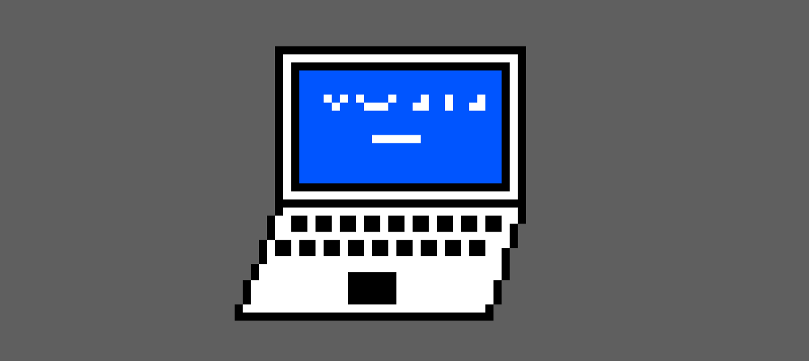

# 我只是不想再成为软件开发人员

我仍然喜欢编码，但我讨厌这个行业

对我来说，这是一个简单的故事。 当我十岁的时候，对我来说，没有什么比我父亲从事技术工作的破旧计算机给我带来的刺激更令人兴奋了。 我成为一名青少年游戏开发者和业余爱好网络开发人员。 大学毕业后，我在一家非盈利性组织工作，收入不高，当时我被任命为网络开发人员，这是我获得的令人兴奋的职位，使我的收入提高了五倍。 从那以后我一直在做。 这是一个雇用我或促进科技行业的人们喜欢听的故事。 但这不是全部。

激情在这个行业中备受推崇，出于爱而进入代码的人们被认为是特殊的。 人们还认为某些人在科技领域的代表较少的原因是，因为没有多少人在他们的地下室里玩Linux机器。

但问题在于，业余爱好编码根本不像工作编码。 很少有编码工作可让您完成业余编码员喜欢的工作。 我认为该行业在很多方面都变得像《雪崩》（Snow Crash）中描绘的程序一样，该程序编写于1992年，但几乎是一个oracle：

她是美联储的一名应用程序程序员。 在过去，她会写计算机程序为生。 如今，她编写了计算机程序的片段。 这些程序是由Marietta和Marietta的上级在顶层进行的为期一周的大规模会议中设计的。 一旦确定了设计，他们便开始将问题分解为细微的细分，然后将其分配给小组经理，小组经理将其分解得更多，并为个别程序员提供少量工作。 为了避免各个编码人员的工作发生冲突，所有这些工作都必须按照一套比政府程序手册更大，更灵活的规则进行。

当然，那里还有更多吸引人的工作，但现实是，我们中的很多人都做零碎的工作，这些工作通常很乏味并且没有任何创造力。 作为一名开发人员，我经常很难弄清一份工作是否会因Snow Crashy而失败，并且被从事工作的承诺所吸引，却发现自己发现了一些企业CMS上的错误。

但是很长一段时间我都装作很有趣。 我喜欢它。 因为在行业中以这种方式描绘自己存在着很大的社会压力。 雇用您的人一旦看到该立面出现裂缝，就会立即采取另一种方式。

想在这里了解我如何成为专业开发人员的真实故事吗？ 在那个非营利性组织工作后，我实际上是一名自由职业者，我因为医疗费用堆积而接任开发人员的工作。 留下来，因为他们从来没有离开过。

undefined

如此之多的人使用高科技的部分原因是因为它的高薪，我知道Google中有很多人不一定对它充满热情，但是它可以养家糊口，所以他们仍然在那里工作

如果我中了彩票，我还会编码吗？ 我会的，但那不会像工作。 这将是我喜欢的项目。 而且会更少的时间。

业余时间每天编码几个小时与每天编码8小时以上是不一样的。 在过去的十年中，它使我感到失望。 长时间工作会导致我经常出现痛苦的偏头痛。 我的脖子上患有关节炎。 我尝试过站立式书桌，平衡板书桌，跑步机书桌，特殊饮食，下班前后多做运动。 每个条纹的医生，物理治疗师，按摩治疗师。 我花了成千上万美元。 我将其隐藏起来是因为我担心它会使我失业。 我辛苦工作了很长时间。 我不确定这类时间的咨询服务对任何人都有利，但对我当然不利。

我还必须说，科技领域对女性的持续反弹会给人们带来巨大的损失。 詹姆斯·达莫尔（James Damore）所说的真正切入核心的是，我们中很多技术女性都只在那里，因为降低了门槛以让我们进入某些配额。 在我经常访问的网站上以及从我曾经被视为朋友的人们那里读到它的反应非常困难。 我不能假装这没有助长士气低落。 另一方面，我真的厌倦了我遇到的多样性项目，这些项目是公司的啦啦队表演，完全不愿为使妇女成为一个更好的行业而付出艰辛的努力。

当我发现有个与我做同样工作的人的薪水增加了20％时，很难与自由的女权主义者庆祝“妇女节”。 有时还会有些混蛋，例如“如果真的给了女性更少的薪水，为什么公司不雇用更多的女性来省钱？”我很确定他们已经这样做了，而且最近的诉讼将表明这是一种普遍做法。 。 我的经验是，公司很高兴雇用女性，这使她们看起来很漂亮，而且她们通常可以少付薪水。 这与配额无关。

我上一篇文章的评论者问我，为什么我不仅仅掌握自己的技能并获得“更好”的工作。 我从来没有真正遇到过麻烦。 我轻松地学习新技术并快速学习。 我怀疑我会继续这样做。 但是到了这一刻，我已经失去了尝试破解该行业的所有欲望。

因为他们并不是真正在寻找“激情”，而是只愿意忍受长时间的人们。 他们并不是在找一个周末在开源项目上花几个小时的人，而是在找一个下班回家然后整夜花时间的人。

好消息是我基本上已经中了彩票。 我积累了作为开发人员的积蓄，这使我得以辞职。 我还有一个安全网，如果事情真的到了地狱，我可以在家人的农场里生活和工作。 我非常感激这是一项巨大的特权。 节省下来的钱本来是用来支付房屋首付的，但是现在给了我一块登陆垫，让我可以花一些时间来真正地做自己喜欢的事情。 几个小时的编码，几个小时的写作。 从我大部分时间都充满痛苦的经历，到只有几次孤立的事件。 与我关心的人有足够的时间。 我在一月份开始皮具职业培训。

我从这里去哪里？ 那套房子的首付钱不会永远持续下去。 我并不妄想，因为我知道这会对我的职业生涯产生影响。 销售美国制造的消费品是一个艰难的行业。 我一生中受到许多人的严厉警告。 如果我试着回去，我知道许多公司会在知道我的生活中还有其他优先事项时便开始运营，并且我不怕捍卫它们。 但是我有各种各样的技能，希望能以某种方式使我有价值。

当然，除了软件开发之外，还有很多工作要花很长时间，这很有害。 我梦想着一个人人都少工作的世界。 同时，我仍然会在这里编码，也许实际上又在享受它，并试图找到一种在工作与其他需求之间达到真正平衡的生活。
