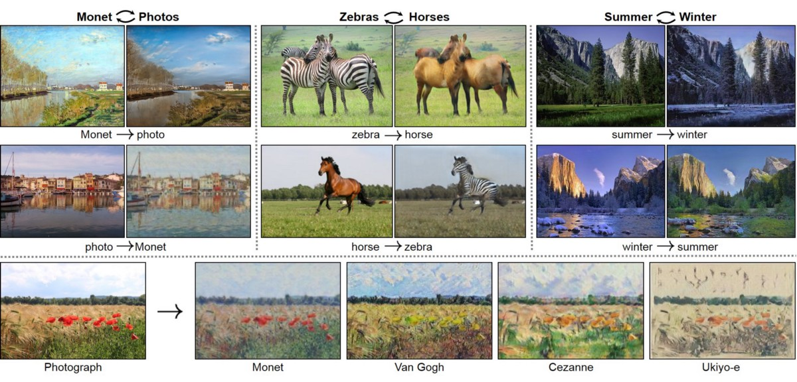
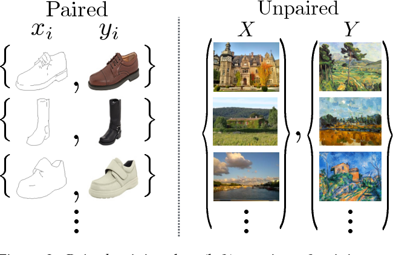
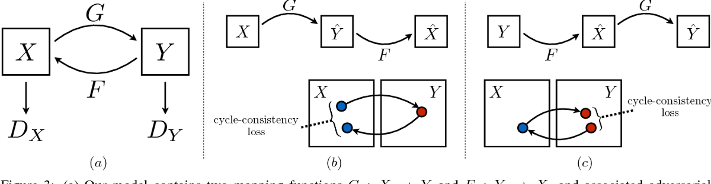
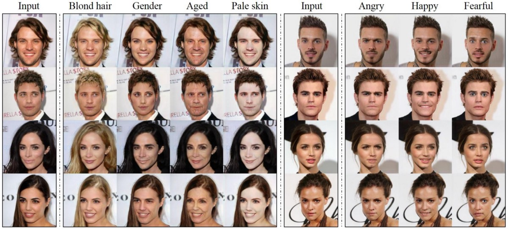
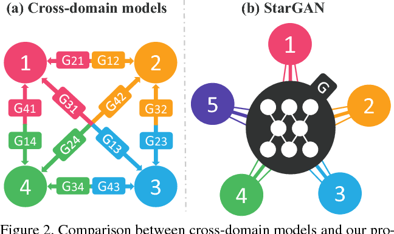
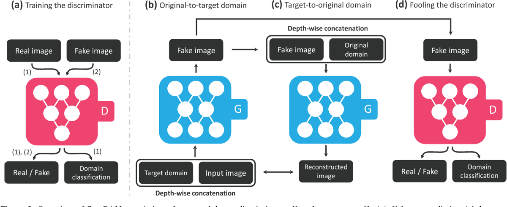

最初发布于amberer.gitlab.io。
# 图像到图像翻译

图像到图像的翻译是一类视觉和图形问题，其目标是学习输入图像和输出图像之间的映射。 它可以应用到广泛的应用程序中，例如收集样式转移，对象变形，季节转移和照片增强。
# 循环GAN


使用周期一致的对抗网络进行不成对的图像到图像翻译（ICCV 2017）

论文/项目/语义学者

作者提出了一种在没有配对示例的情况下学习将图像从源域X转换为目标域Y的方法。 目的是学习映射G：X→Y，从而利用对抗损失将来自G（X）的图像分布与分布Y区分开。 由于此映射的约束严重不足，因此我们将其与反映射F：Y→X耦合，并引入循环一致性损失以强制执行F（G（X））≈X（反之亦然）。


成对的训练数据（左）由训练示例构成，它们具有一对一的对应关系。 未配对的训练集没有这种对应关系（摘自本文）


图取自本文。

该模型包含两个映射函数G：X→Y和F：Y→X，以及相关的对抗标识符DY和DX。 DY鼓励G将X转换为与域Y不可区分的输出，反之亦然，对于DX，F和X则相反。 为了进一步规范化映射，他们引入了两个“周期一致性损失”，这些损失捕捉了直觉，即如果我们从一个域转换到另一个域然后再次返回，我们应该到达起点。
# 星际


用于多域图像到图像转换的统一生成对抗网络（CVPR 2018）

论文/代码/语义学者

现有的图像到图像转换方法在处理两个以上的域时具有有限的可扩展性和鲁棒性，因为应该为每对图像域分别构建不同的模型。 StarGAN是一种新颖且可扩展的方法，可以仅使用一个模型就可以对多个域执行图像到图像的转换。


跨域模型与我们提出的模型StarGAN之间的比较。 （a）要处理多个域，应为每对图像域建立跨域模型。 （b）StarGAN能够使用一个生成器来学习多个域之间的映射。 该图表示连接多个域的星形拓扑。（摘自本文）


StarGAN概述，由两个模块（鉴别器D和生成器G）组成。（a）D学会区分真实图像和伪图像，并将真实图像分类到其对应的域。 （b）G接受图像和目标域标签作为输入，并生成伪图像。 目标域标签在空间上复制并与输入图像连接在一起。 给定原始域标签，©G尝试从伪造图像中重建原始图像。 （d）G试图生成与真实图像没有区别的图像，并被D分类为目标域。（摘自本文）
```
(本文翻译自Yongfu Hao的文章《Image-to-Image Translation》，参考：https://towardsdatascience.com/image-to-image-translation-69c10c18f6ff)
```
