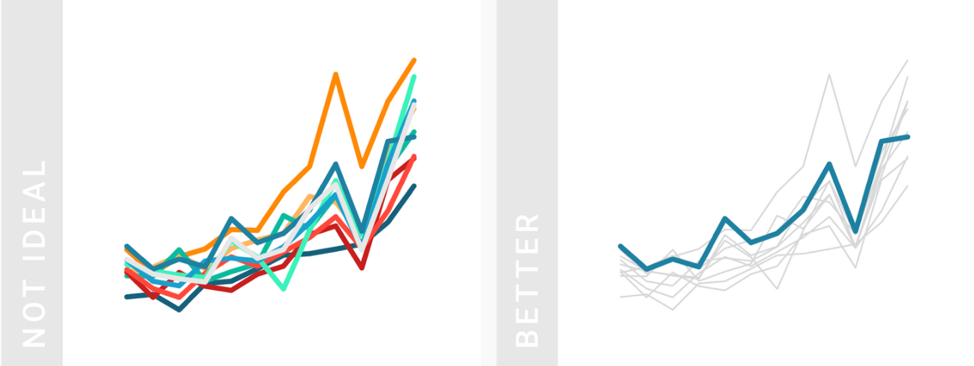
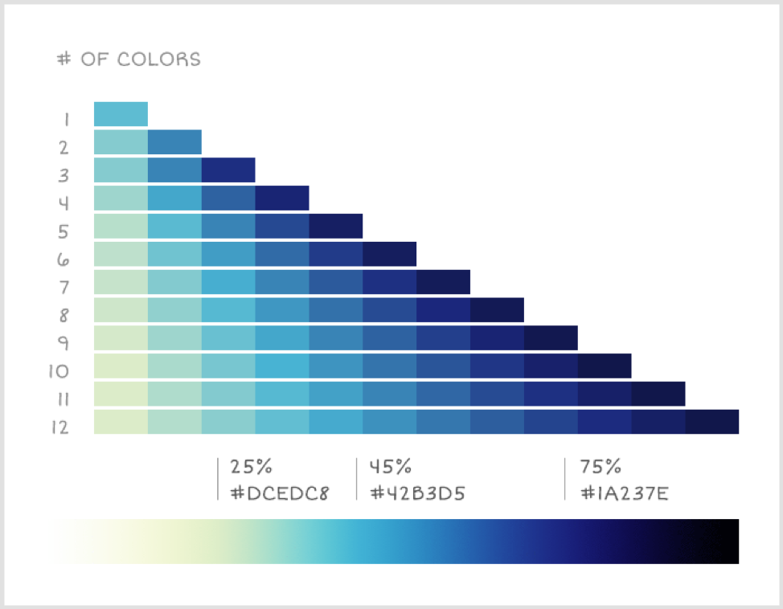

请记住-归根结底，我们的数据科学家必须向世界展示的一件事是我们的情节。 将所有的精力都投入到Jupyter笔记本中似乎很可惜，只有您可能会看到，而在与人共享的绘图输出上却花费很少的时间。 因此，您可以随意使用层次结构，文本和颜色的原理，以使数据可视化易于阅读且外观漂亮。 来吧！
# 颜色

选择颜色很难。 听说过RGB色彩系统吗？ 它会通过红色，绿色和蓝色的组合生成所有可能的颜色。 告诉计算机定义每种颜色的强度的数字输入范围为0至255。 因此，例如：如果R = 0，则颜色中没有“红色”。 如果R = 255，G = 0和B = 0，则颜色为纯“红色”。 因此，从理论上讲，您可以将R，G和B合并为256 * 256 * 256 = 16,777,216种可能的颜色。 那么，我们如何选择几种颜色以最清晰，最易访问的方式可视化数据？ 首先，我们必须了解颜色的基本要素。

颜色全部归结为三个元素：色相，值和饱和度。

色相描述颜色本身。 色相通常是我们描述颜色时所想到的颜色：红色，蓝色，绿色等。 价值是色调的浅浅或深浅。 例如，具有深色值的蓝色是“深蓝色”，具有浅色值的蓝色是“浅蓝色”。 饱和度是色调的强度或强度。 低饱和度意味着更暗，更灰的颜色，高饱和度意味着更强烈的鲜艳颜色。 例如，具有低饱和度的蓝色看起来像是多云的天空，而具有高饱和度的蓝色看起来像是晴朗的天空。

> Hue is the color itself. Saturation is the intensity of the color. Value is the lightness/darkness of the color. Source


在某些情况下，色相，饱和度和值的组合可以帮助直观地显示数据中的图案或趋势。 但是，如果数据尽可能地简单，观众将能够更快地理解您的数据。 如果定量值在图表中很重要，最好用单色条或点显示结果。 如果需要，可以使用颜色在同一张图上显示不同的类别。

> The plot on the left converts all categories into a different color and merges them into a single bar. Keep it simple instead! The bar plot on the right only needs one color, because it breaks out each category as a separate bar. Quantities are much easier to compare in the graph on the right. Credit: Datawrapper


我们可以使用色相，值和饱和度使数据更清晰。 我们可以使用颜色显示比例尺-即增加或减少价值等级。 一种想法是使用渐变调色板在较宽的值和饱和度范围内合并相反的色相（紫色和黄色，红色和绿色或橙色和蓝色）。 尤其是，值的范围更广，即使色盲人员也可以访问调色板。

对于连续数据，请使用颜色渐变；对于分类数据，请使用不同的颜色。

渐变表示：

“我的数量可能比我周围的另一种颜色更高或更低。”

不同的颜色表示：

“我与周围的所有其他颜色都没有关系。”

> In the graph on the left, the all-blue gradient color scheme may imply that “Ivan” is more important in the data than the other three people, when really, he is not. The graph on the right uses different hues, to give equal weight to all people being compared. The graph on the right also uses light and dark values to allow the categories to be distinguished even by those who are colorblind. Credit: Datawrapper


当数据说明“从低到高”趋势的故事时，可以使用渐变。 使用渐变显示数据时，渐变应以相等的步长从浅到深尽可能淡化。 渐变应清楚地显示彩色和黑白。

> Intuitively, people understand light colors for low values and dark colors for high values. If using a gradient, limit the number of hues to one or two colors at a maximum. (Ex: light grey to dark blue, or light yellow to dark blue.) Credit: Datawrapper


直观上，人们理解浅色代表低值，深色理解代表高值。 如果使用渐变，则将色相数量限制为最大一种或两种颜色。 例如，浅灰色到深蓝色，或浅黄色到深蓝色。

如果比较的数据可能高于或低于平均值或基准数量，那么使用分散调色板是一个不错的选择。 使用此调色板的很好的例子可能是显示按县划分的平均工资，或按州显示的平均气温。 建议在渐变的中心使用浅灰色，并使用深色值，在渐变的两侧使用互补色（紫色和黄色，红色和绿色或橙色和蓝色）。

> A diverging palette should use two complementary hues, that are dark in value, with a light, desaturated color in the middle. The right graph is the better choice. Credit: Datawrapper


> Complementary color pairs are recommended in a diverging color palette. Complementary colors are always on the opposite side of each other on the color wheel. Credit: Lacie Lynnae


您的绘图越不偏色，使用颜色突出显示数据就越容易。 灰色是背景数据，注释或保持绘图尽可能简约的绝佳选择。 为了使绘图更加生动活泼，灰色可以是暖色的细微阴影，例如红色，橙色或黄色。

> Too many colors can make the plot too noisy — making it hard to extract key insights. If you want to call attention to one particular element on your plot, use grey throughout and use one color to highlight. Credit: Datawrapper


为数据使用直观的颜色！ 例如，我们都知道红色表示“热”，蓝色表示“冷”。 在自然界中，我们都会将绿色与树木相关联，将蓝色与水体相关联。 在美国，我们都知道共和党人通常显示为红色，而民主党人显示为蓝色。 在流量，行为或性能方面，从小就被教导说红色表示“停止”或“不良”，而绿色表示“继续”或“良好”。

> Use intuitive colors for people to understand the data faster. Avoid using other colors just to be different — and avoid using colors associated with something else (for example, using blue and red for male and female, because blue and red are so heavily associated with politics). Credit: Datawrapper

## 因此，教训是：
# 尽量少用颜色来强调。 对连续数据使用单色调或双色调渐变。 对分类数据使用不同的色调。 使用直观的颜色。
# 层次结构

对于数据可视化，大多数人都说最好的经验法则是尽可能简单地讲述数据的故事。 使数据易于浏览的一种方法是采用图形中的层次结构。

层次结构的意思是“排名”。 因此，通过将信息分解为“排名”元素，我们可以或多或少地赋予数据可视化中的某些元素权重。 层次结构为读者提供了快速浏览内容的结构，并找到引起他们兴趣的内容。 层次结构向读者展示了如何从重大发现到最细微的细节，如何进行数据可视化并进行交互。

我们可以通过多种方式提供层次结构，例如标题，标题，注释和较小的细节。 此外，文本可以通过文本大小（12pt与24pt），粗细（粗体与浅色）以及其他重点（斜体与下划线）来提供层次结构。 颜色还可以通过突出显示图形的某些元素来提供层次结构并引起注意。
## 因此，教训是：
# 层次结构“对信息进行排名”，因此我们知道需要理解的重要内容。

> Credit: Canva


> Credit: Alyssa Leverenz

# 文本

我们生活中的字体主要有两种：衬线字体和无衬线字体。

Serif应该用于文本较长的项目，例如书籍和文章。 纵观整个历史，许多人都认为衬线字体有助于处理较长的文本，因为它们可以帮助眼睛沿直线平滑移动，从而使阅读更加轻松快捷（尤其是在文本较长的情况下）。 考虑衬线字体，例如Garamond，Georgia或Times New Roman。

Sans Serif应该用于文本长度较短的项目。 Sans Serif是字幕，字幕，栏标题，图表和图形中的文本等的绝佳选择。SansSerif字符在任何大小上都更加易于区分。 当您将数据分发给有视力障碍的读者或仍在学习英语的读者时，这将有所帮助。 考虑无衬线字体，例如Avenir，Futura或Helvetica。

> It takes people longer to understand the numbers in the serif graph on the right than it does to understand the numbers in the sans serif graph on the left. Credit: Howard Coale


> Serif fonts can have many idiosyncrasies in their endpoints, widths, curves, and shapes that add more for the eye to take in at any given moment. In essence, serif creates more “data” for a reader to take in for each letter or number! Credit: Howard Coale


对比度对于区分文本也很重要。 您永远不会知道如何使用您的数据结果。 想象一下，您的情节通过视频投影仪显示在演示文稿中，并且投影仪将纯白色背景上的所有柔和灰色文本都洗掉了，没人能读懂！ 那太可惜了。 为了确保在任何设置下都清晰易读，建议最小比例至少为4：1。

> Max contrast is 21:1 — this means pure white text on a pure black background, or vice-versa. 1:1 means that the background color and your text color are the same. The recommended minimum for text contrast is 4:1. Source

## 因此，教训是：
# 使用sans serif表示较短的文本。 使用衬线表示较长的文本。 有足够的对比。

从架构实践进入数据科学世界，我一直对细节深有感激并感兴趣。 必须精心打造精美的建筑-将熟悉，温暖和诱人的尺寸和比例的材料融合在一起。 必须精心构造外部建筑系统，以提高热效率-冷却时将热量保持在热量中，反之亦然。

建筑学的教训是细节很重要。 但是，此原则不仅仅限于设计建筑物。 史蒂夫·乔布斯曾经告诉我们：

“细节很重要，有必要等待正确处理。”

数据科学专业应该听从乔布斯的建议，特别是在解释数据发现时。 数据科学家拥有无数的库，可以更快速，更轻松地直观地显示出Python之外的数据集：Matplotlib，Seaborn，Plotly，Bokeh，此清单不胜枚举。 今天，我们期待着即时的满足。 我只需单击“立即购买”，我的包裹就会在几个小时内到达我家。 或者，我只是在Seaborn中运行一两行代码，并获得了一条条形图，对吗？ 好吧，我问你-详细信息在哪里？

建筑师的宽松草图可以有效地快速向另一位建筑师解释设计思想。 同样，快速绘制图表可能对数据科学家快速查看数据或与办公桌前的同事讨论数据很有帮助。 但是，就像架构一样，数据可能很难向实践之外的人解释。 必须对可视化进行细化，细化和精心策划，以讲述有关数据的清晰美观的故事。 同样，细节很重要。

但是，在数据可视化中我们应该关注哪些细节？ 我认为我们可以将其分为三类：

1.层次结构

2.文字

3.颜色
# 在数据科学中：细节至关重要
## 层次结构。 文本。 颜色。



> Credit: Graphiq

```
(本文翻译自Alexander Cheng的文章《In Data Science: Details Matter》，参考：https://towardsdatascience.com/in-data-science-details-matter-ec8b27f626fc)
```
