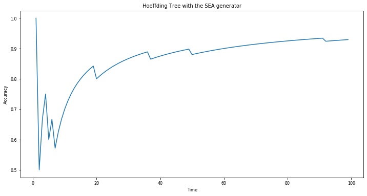
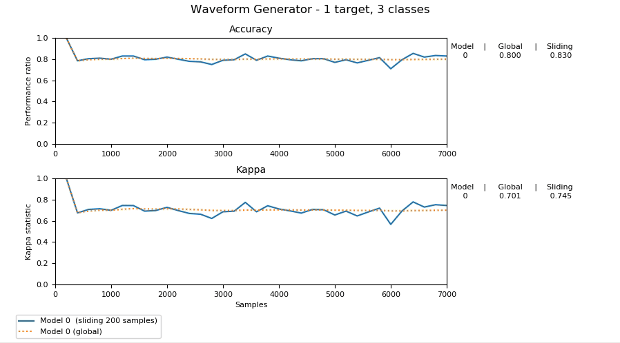

# 参考文献

[1] Doyen Sahoo等人，“在线深度学习：动态学习深度神经网络”（2017），1711.03705

[2] Jesse Read等人，“动态和不断发展的数据中的批次增量与实例增量学习”（2012），978–3–642–34156–4_29

[3] Pedro Domingos和Geoff Hulten，“挖掘高速数据流”（2000年），347090.347107

[4] Maayan Harel等人，“通过重采样进行概念漂移检测”（2014年），citation.cfm
# 结论

希望本教程可以帮助您了解增量学习的基础。 此外，我希望您现在掌握如何将scikit-multiflow用于基本的数据流学习任务。
# 简单的在线分类器

现在，让我们为SEA数据流创建一个简单的分类器。 scikit-multiflow提供了许多增量模型，其中最流行的一种是霍夫丁树。
## 霍夫丁树

Hoeffding树³是使用甚快决策树学习器（VFDT）构建的，VFDT是一个随时可用的系统，每个示例均使用恒定内存和恒定时间来构建决策树。 它由Pedro Domingos和Geoff Hulten于2000年引入，它利用众所周知的统计结果Hoeffding界线，以确保其输出与传统学习器的输出渐近相同。

在scikit-multiflow中，创建Hoeffding树的步骤如下
```
from skmultiflow.trees import HoeffdingTreetree = HoeffdingTree()
```
## 训练Hoeffding树进行分类

如果我们想在SEA数据流上训练树，则可以遍历想要的许多数据点。
```
correctness_dist = []for i in range(nb_iters):   X, Y = stream.next_sample()        # get the next sample   prediction = tree.predict(X)       # predict Y using the tree        if Y == prediction:                # check the prediction     correctness_dist.append(1)   else:     correctness_dist.append(0)         tree.partial_fit(X, Y)             # update the tree
```

使用“ correctness_dist”，由一和零组成的数组，取决于学习者是否对输入的样本进行了准确分类，我们可以绘制随时间变化的准确性
```
import matplotlib.pyplot as plttime = [i for i in range(1, nb_iters)]accuracy = [sum(correctness_dist[:i])/len(correctness_dist[:i]) for i in range(1, nb_iters)]plt.plot(time, accuracy)
```

> Accuracy over time for a Hoeffding tree modeling the SEA generator

## Scikit-Multiflow的替代方法

在scikit-multiflow中，有一种内置的方法可以用更少的代码完成完全相同的事情。 我们可以做的是导入EvaluatePrequential类：

然后，我们可以如下设置“评估者”
```
evaluator=EvaluatePrequential(show_plot=True,max_samples=nb_iters)
```

设置show_plot = True选项将允许弹出窗口显示分类精度的实时图。

现在已经设置了评估程序，我们可以使用它以与以前相同的方式在SEA数据流上增量训练Hoeffding树：
```
evaluator.evaluate(stream=stream, model=tree)
```
# 在Python中使用数据流

现在，我们已经讨论了增量学习是什么，让我们在Scikit-Multiflow（一个用于数据流学习的免费Python框架）中创建一个简单的例子。

我们要做的第一件事是安装scikit-multiflow。
```
pip install -U scikit-multiflow
```

导入数据生成器很容易，可以使用以下命令完成：
```
from skmultiflow.data import SEAGenerator
```

在这里，我们将使用SEA生成器，但还有许多其他可用的选项（有关详细信息，请参见文档：https://scikit-multiflow.github.io/scikit-multiflow/）。 SEA生成器允许您生成具有6个输入和2个输出的无限数据流。 这个特定的数据流包含频繁，突然的概念漂移。

使用发电机非常容易。 我们需要做的第一件事是将其初始化如下：
```
stream = SEAGenerator()      # create a streamstream.prepare_for_use()     # prepare the stream for use
```

然后，如果我们希望获得数据样本，我们要做的就是
```
X,Y = stream.next_sample()
```

其中X是输入，是6维np.array，而Y是输出，是2维np.array。
# 什么是增量学习？

在每次迭代中，模型都会预测一个类标签，显示出真实的标签，然后进行更新

增量学习指的是一系列可扩展算法，可以学习从无限数据流中顺序更新模型¹。 在“传统”机器学习中，我们获得了由（输入，输出）对组成的完整数据集，而在增量学习中，创建模型时并没有所有可用数据。 取而代之的是，数据点一次到达一个，我们必须建立一个“生命”模型，该模型可以随着数据的到来而学习和适应。 增量模型具有以下特征²：
+ 它可以随时预测
+ 它可以适应概念漂移-即数据分布的变化changes。 举一个具体的例子，如果我们有兴趣建立一个模型来预测银行应该借多少钱，那么金融危机可能会改变金额或需要考虑的因素。 在这种情况下，模型需要重新学习很多信息。
+ 它能够处理具有有限资源（时间和内存）的无限数据流。 这意味着它无法像典型的机器学习方法那样存储所有训练数据。
# 介绍

数据无处不在。 无论是个人资料图片，tweet，传感器应用程序，信用卡交易，电子邮件还是新闻提要，数据都在这里……而且它以惊人的速度生成。 利用这些看似无限的数据流，关键挑战之一就是创建轻量级模型，这些模型随时可以预测并适应数据分布的变化。 在这种情况下，传统机器学习方法的局限性导致了在线学习（也称为增量学习）方法的发展。

在这篇文章中，我们将通过使用scikit-multiflow（一个用于数据流学习的Python框架）的简单在线分类器的实际实现，来逐步介绍增量学习。
# 使用Scikit-Multiflow进行增量（在线）学习
## 使用scikit-multiflow在Python中进行增量学习的实用介绍

> Source: https://scikit-multiflow.github.io

```
(本文翻译自Louis de Benoist的文章《Incremental (Online) Learning with Scikit-Multiflow》，参考：https://towardsdatascience.com/incremental-online-learning-with-scikit-multiflow-6b846913a50b)
```
