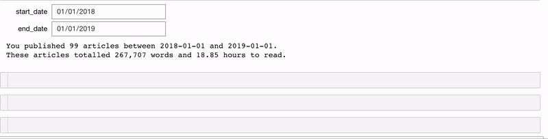

一如既往，我欢迎反馈和建设性的批评。 可以通过Twitter @koehrsen_will与我联系。

我们尚未接近涵盖IPywidget的所有功能。 例如，我们可以将值链接在一起，创建自定义窗口小部件，创建按钮，构建动画，创建带有选项卡的仪表板等等。 查看文档以备进一步使用。 即使这里只介绍了少量内容，我也希望您能看到交互式控件如何增强笔记本工作流程！

> Simple widget to select theme for a plot.

# 结论

Jupyter Notebook是一个出色的数据探索和分析环境。 但是，它本身并不能提供最佳功能。 使用诸如笔记本扩展程序和交互式小部件之类的工具，可使笔记本栩栩如生，并使我们作为数据科学家的工作更加高效。 此外，构建小部件并在笔记本中使用它们非常有趣！ 编写大量代码以重复执行同一任务不是一件令人愉快的事情，但是使用交互式控件为我们的数据探索和分析创建了更自然的流程。
## 扩展交互式控件的功能

为了从IPywidgets库中获取更多信息，我们可以自己制作小部件并在交互功能中使用它们。 我最喜欢的小部件之一是DatePicker。 假设我们有一个stats_for_article_published_between函数，该函数采用开始日期和结束日期并为它们之间发布的所有文章打印统计信息。 我们可以使用以下代码进行交互
```python
# Create interactive version of function with DatePickers
interact(stats_for_article_published_between,
        start_date=widgets.DatePicker(value=pd.to_datetime('2018-01-01')),
        end_date=widgets.DatePicker(value=pd.to_datetime('2019-01-01')))
```

现在，我们获得了两个交互式的日期选择小部件，并将值传递到函数中（有关详细信息，请参阅笔记本）：

> Interactive date selection controls.


类似地，我们可以使用相同的DataPicker交互式小部件创建一个函数，以绘制直到某个日期为止一列的累计总数。

> Cumulative plot of a column using interactive widgets.


如果要使一个窗口小部件的选项依赖于另一个窗口小部件的值，请使用观察功能。 在这里，我们更改图像浏览器功能以选择目录和图像。 显示的图像列表将根据我们选择的目录进行更新。
```python
# Create widgets
directory = widgets.Dropdown(options=['images', 'nature', 'assorted'])
images = widgets.Dropdown(options=os.listdir(directory.value))

# Updates the image options based on directory value
def update_images(*args):
    images.options = os.listdir(directory.value)

# Tie the image options to directory value
directory.observe(update_images, 'value')

# Show the images
def show_images(fdir, file):
    display(Image(f'{fdir}/{file}'))

_ = interact(show_images, fdir=directory, file=images)
```


> Left show image options when the directory is “images” and right shows options when directory is “nature”.

## 可重用的小部件

当我们想在单元格之间重用窗口小部件时，只需将它们分配给interact函数的输出即可。
```python
def show_stats_by_tag(tag):
    return(df.groupby(f'<tag>{tag}').describe()[['views', 'reads']])
    
stats = interact(show_stats_by_tag,
                tag=widgets.Dropdown(options=['Towards Data Science', 'Education', 
                                              'Machine Learning', 'Python', 'Data Science']))
```

现在，要重用stats小部件，我们只需在单元格中调用stats.widget。

> The same widget used in another cell.


这使我们可以在笔记本上重复使用我们的小部件。 请注意，小部件彼此绑定，这意味着一个单元格中的值将自动更新为您为另一单元格中的同一小部件选择的值。
## 绘图小部件

交互式小部件对于选择要绘制的数据特别有用。 我们可以将相同的@interact装饰器与用于可视化数据的函数一起使用：
```python
import cufflinks as cf

@interact
def scatter_plot(x=list(df.select_dtypes('number').columns), 
                 y=list(df.select_dtypes('number').columns)[1:],
                 theme=list(cf.themes.THEMES.keys()), 
                 colorscale=list(cf.colors._scales_names.keys())):
    
    df.iplot(kind='scatter', x=x, y=y, mode='markers', 
             xTitle=x.title(), yTitle=y.title(), 
             text='title',
             title=f'{y.title()} vs {x.title()}',
            theme=theme, colorscale=colorscale)
```

> Interactive scatter plot made using cufflinks+plotly with IPywidgets controls


在这里，我们使用了令人惊叹的袖扣+绘图组合，以使用交互式IPython小部件控件进行交互式绘图。

您可能已经注意到该情节的更新速度有些慢。 如果是这种情况，我们可以使用@interact_manual，它需要一个用于更新的按钮。

> Button made with @interact_manual decorator.


现在，仅在按下按钮时才会更新图。 这对于需要一段时间才能返回输出的函数很有用。

> (Source)

# Jupyter笔记本中的交互式控件
## 如何使用交互式IPython小部件来增强数据探索和分析

在数据浏览中，几乎没有什么动作比一遍又一遍地重新运行同一单元（每次稍微更改输入参数）效率低。 尽管知道这一点，但我仍然发现自己重复执行单元只是为了进行最小的更改，例如，为函数选择一个不同的值，选择各种日期范围进行分析，甚至调整绘图可视化的主题。 这样不仅效率低下，而且令人沮丧，破坏了探索性数据分析的流程。

解决此问题的理想方法是使用交互式控件来更改输入，而无需重写或重新运行代码。 幸运的是，就像Python中经常发生的那样，已经有人遇到了这个问题并开发了一个很好的工具来解决它。 在本文中，我们将介绍如何开始使用IPython小部件（ipywidgets）以及可以用一行代码构建的交互式控件。 该库使我们能够将Jupyter Notebook从静态文档转变为交互式仪表板，非常适合浏览和可视化数据。

您可以通过单击下面的图片在mybinder上查看带有本文小部件的完全交互式正在运行的笔记本。

> Widgets notebook on mybinder.org


不幸的是，IPython小部件无法在GitHub或nbviewer上呈现，但是您仍然可以访问笔记本并在本地运行。

> Example of interactive widgets for data visualization

# IPywidgets入门

与往常一样，第一步是安装库：pip install ipywidgets。 完成后，您可以使用以下命令激活Jupyter Notebook的小部件
```
jupyter nbextension enable --py widgetsnbextension
```

要与JupyterLab一起使用，请运行：
```
jupyter labextension install @jupyter-widgets/jupyterlab-manager
```

要将ipywidgetslibrary导入笔记本中，请运行
```
import ipywidgets as widgetsfrom ipywidgets import interact, interact_manual
```
## 单行交互式控件

假设我们有以下具有中级文章统计信息的数据框（这些是我的实际统计信息，您可以在本文中了解如何获取它们）：

> Dataframe of Medium stats


我们如何查看所有阅读次数超过1000的文章？ 这是一种方法：
```
df.loc[df['reads'] > 1000]
```

但是，如果要显示拍手超过500个的文章，则必须编写另一行代码：
```
df.loc[df['claps'] > 500]
```

如果我们不编写更多代码就可以快速更改这些参数（列和阈值）会不会很好？ 尝试这个：
```
@interactdef show_articles_more_than(column='claps', x=5000):    return df.loc[df[column] > x]
```

> Interactive controls using @interact


使用@interact装饰器，IPywidgets库自动为我们提供了一个文本框和一个用于选择列和数字的滑块！ 它查看我们函数的输入，并根据类型创建交互式控件。 现在，我们可以使用控件（小部件）对数据进行分段，而无需编写代码。

您可能已经注意到小部件的一些问题-x可能为负，我们必须输入正确的列名。 我们可以通过为函数参数提供特定的参数来解决这些问题：
```python
# Interact with specification of arguments
@interact
def show_articles_more_than(column=['claps', 'views', 'fans', 'reads'], 
                            x=(10, 100000, 10)):
    return df.loc[df[column] > x]
```

> Improved widgets for subsetting data.


现在，我们获得了该列的下拉列表（列表中的选项）和一个限制在一定范围内的整数滑块（格式为（start，stop，step））。 通读文档以获取有关如何将函数参数映射到小部件的完整详细信息。

我们可以使用相同的@interact装饰器将任何普通函数快速转换为交互式小部件。 例如，我们可能想要快速浏览的目录中有很多图像：
```
import osfrom IPython.display import Image@interactdef show_images(file=os.listdir('images/')):    display(Image(fdir+file))
```

> Example of browsing images using IPython widgets


现在，我们可以快速循环浏览所有图像，而无需重新运行单元。 如果您正在构建卷积神经网络并想检查网络分类错误的图像，这实际上可能很有用。

小部件用于数据探索的用途是无限的。 另一个简单的示例是查找两列之间的相关性：

> Widget for correlation between two columns.


ipywidgets GitHub上有许多有用的示例。
