# 这值得么？

在此之前，我只是简单地展示了Bamboolib的主要功能-绝不是详尽的教程-只是想向您展示其背后的想法。

问题仍然存在，是否值得？

也就是说，如果您决定采用付费路线。 只要您不介意与他人分享您的作品，仍然可以免费使用。 图书馆本身值得一试的原因有两个：
+ 它提供了一种学习熊猫的好方法-边做边学比读书容易得多，而且像这样的GUI工具一定会帮助您
+ 这非常适合处理数据-面对现实，有时候您知道自己想做什么，但是却不知道如何在代码中实现-Bamboolib可以为您提供帮助

请记住-付费版本不会提供任何其他功能-唯一的真正好处是您的作品将是私人的，并且可以选择用于商业用途。

即使您还没有准备好拿起信用卡，尝试免费版本并查看是否可以从中受益也不会对您造成伤害。

谢谢阅读。 照顾自己。
# 获取代码

到目前为止，这一切都很有趣，也很有趣，但是您迟早会注意到这些操作并不起作用-如果您未明确指定数据集，则不会对它们进行修改。

那不是错误，因为它使您可以在不弄乱原始数据集的情况下进行游戏。 Bamboolib将做什么，但是，它将生成Python代码以实现所需的转换。

要获取代码，请首先单击“导出”按钮：


现在指定要如何导出它-我选择了第一个选项：
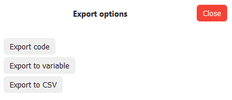

最后，它将为您提供可复制并应用于数据集的代码：
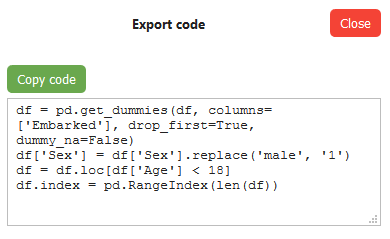
# 一种热编码

很多时候，在为机器学习准备数据时，您都会想要创建虚拟变量，因此，ergo为给定属性的唯一值创建一个新列。 这样做是个好主意，因为许多机器学习算法无法处理文本数据。

要通过Bamboolib实现该逻辑，请点击OneHotEncoder按钮。 我决定从“ Embarked”属性创建虚拟变量，因为它具有3个不同的值，并且您不能说一个比另一个更好。 另外，请确保删除第一个虚拟对象以避免共线性问题（具有变量，该变量对于某些其他变量是理想的预测变量）：
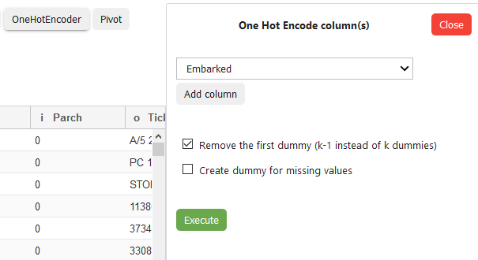

正如您所期望的那样，执行将在数据集中创建两个新列：
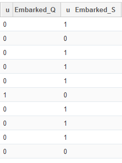

很好，我已经完成了转换，但是接下来呢？
# 通过...分组

是的，您还可以执行聚合！ 首先，单击“聚合/分组依据”按钮，然后在侧面菜单中指定要执行的操作。

我决定按“ Pclass”分组，因为我想查看每个乘客舱的幸存者总数：
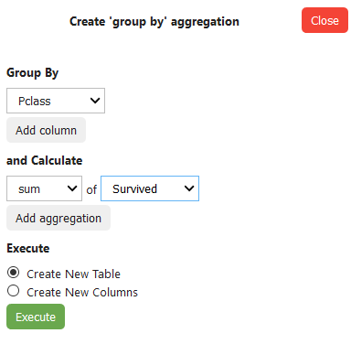

这将产生以下输出：
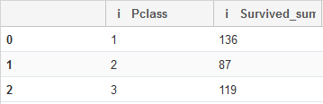

太棒了！ 最后总结一下。
# 替换值

那些日常工作中的另一项是用相应的数字替换字符串值。 该数据集非常适合演示值替换，因为我们可以轻松地用数字替换“性别”列中的字符串值。

首先，请单击“替换值”按钮并指定列，要替换的值以及要替换为的值：
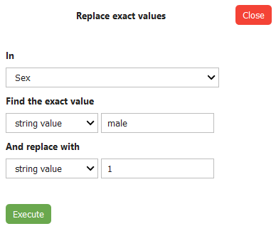

然后单击执行按钮：
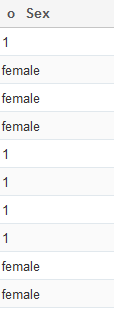

太棒了！ 您可以对“女性”选项执行相同的操作，但是是否要执行由您自己决定。
# 资料筛选

数据过滤是任何数据分析师/科学家最常见的日常任务之一。 基本上，您只想保留给定时刻与您相关的数据子集。

要开始使用Bamboolib进行过滤，请单击“过滤器”按钮。

弹出下面的侧面菜单。 我决定按“年龄”列进行过滤，并仅保留“年龄”值小于18的行：


按下[执行]后，您会看到动作立即发生：
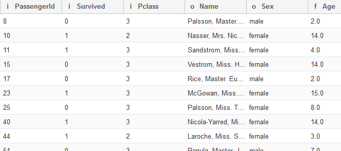

那很棒！ 但是您还能做什么？
# 第一次使用

进入Jupyter后，您可以导入Bamboolib和Pandas，然后使用Pandas加载一些数据集：
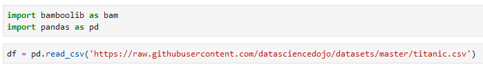

使用库查看数据集的方法如下：
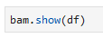

第一次使用该库将无法正常工作。 您需要激活它，因此请确保将许可证密钥放在附近：
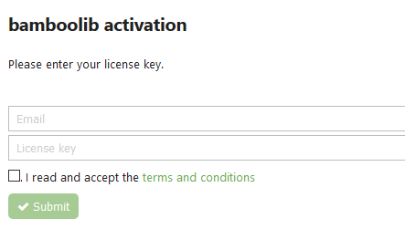

输入电子邮件和许可证密钥后，您将收到以下消息，指示一切正常：


太好了，现在您可以再次执行上一个单元格。 随即您会看到一个陌生但外观友好的界面：
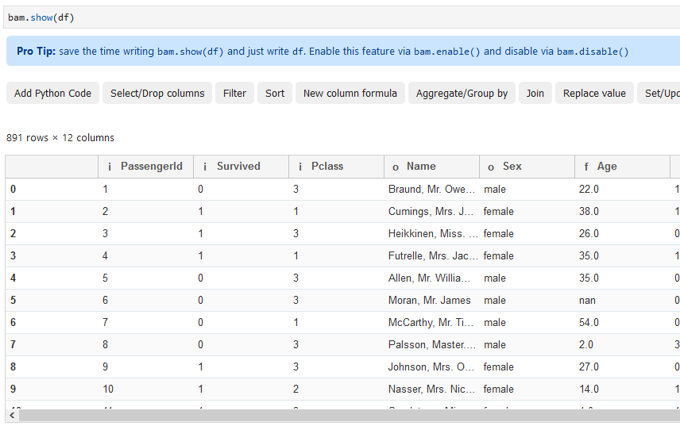

现在一切顺利，我们可以深入研究一些基本功能。 要达到这一点需要做很多工作，但是请相信我，这是值得的！
# 安装过程

首先也是最明显的事情是pip install：
```
pip install bamboolib
```

但是，如果您想让此功能完全正常运行，还有很多事情要做。 它被设计为Jupyter Lab扩展程序（如果仍使用Jupyter Notebook，则为Jupyter Notebook），因此我们还需要在其中进行一些设置。

在命令行中键入以下内容：
```
jupyter nbextension enable --py qgrid --sys-prefixjupyter nbextension enable --py widgetsnbextension --sys-prefixjupyter nbextension install --py bamboolib --sys-prefixjupyter nbextension enable --py bamboolib --sys-prefix
```

现在，您需要找到计算机上安装的Jupyter Lab的主要版本。 您可以使用以下命令获取它：
```
jupyter labextension list
```

我的是“ 1.0”，但您的可以是任何东西，因此这是您需要执行的下一个命令的通用版本：
```
jupyter labextension install @jupyter-widgets/jupyterlab-manager@MAJOR_VERSION.MINOR_VERSION --no-build
```

请注意，您需要将“ MAJOR_VERSION.MINOR_VERSION”替换为版本号，在本例中为“ 1.0”。

还有几个命令，您已经准备就绪：
```
jupyter labextension install @8080labs/qgrid@1.1.1 --no-buildjupyter labextension install plotlywidget --no-buildjupyter labextension install jupyterlab-plotly --no-buildjupyter labextension install bamboolib --no-buildjupyter lab build --minimize=False
```

就是这样 现在您可以启动Juypter Lab，我们可以深入研究好东西。
# 免费吗？

在一个像Numpy和Pandas这样令人惊叹的库可以免费使用的世界中，这个问题甚至可能没有出现在您的脑海中。 但是，应该这样，因为不是所有版本的Bamboolib都是免费的。

如果您不介意与他人分享您的作品，是的，它是免费的，但是如果这样做会带来问题，那么您每月至少要回扣10美元，这对于普通用户而言可能是个大麻烦。 以下是完整的价格表：


正如该库的开发人员所述，Bamboolib旨在帮助您学习熊猫，所以我认为使用free选项不会有问题-如果刚开始，您很可能不会从事某些绝密项目 。

但是，此评论将基于图书馆的私人版本，因为那是Tobias授予我的访问权限。 话虽这么说，本文绝不是说服您购买许可证的想法，仅是我个人的看法。

在跳入好东西之前，您需要先安装该库。
# 引入Bamboolib —熊猫的GUI
## 几天前，托比亚斯·克拉贝尔（Tobias Krabel）先生通过LinkedIn与我联系，向我介绍了他的产品，一个名为Bamboolib的Python库，他说这是学习Pandas的GUI工具-Python的数据分析和可视化库。

> Photo by Marius Masalar on Unsplash


他说，我引用：

我们的目标是帮助人们快速学习和使用熊猫，并且我们希望加入下一代python数据科学家的行列。

我不得不承认，起初我持怀疑态度，主要是因为我一般都不是GUI工具和拖放原理的忠实拥护者。 尽管如此，我还是打开了网址并观看了介绍视频。

那是我应有的兴趣的罕见时期之一。

从那以后，我迅速对Tobias做出了回应，他恳求我对图书馆进行测试，看看我是否喜欢它。

它怎么样？ 好吧，您必须继续阅读才能找到答案。 因此，让我们开始吧。
```
(本文翻译自Dario Radečić的文章《Introducing Bamboolib — a GUI for Pandas》，参考：https://towardsdatascience.com/introducing-bamboolib-a-gui-for-pandas-4f6c091089e3)
```
