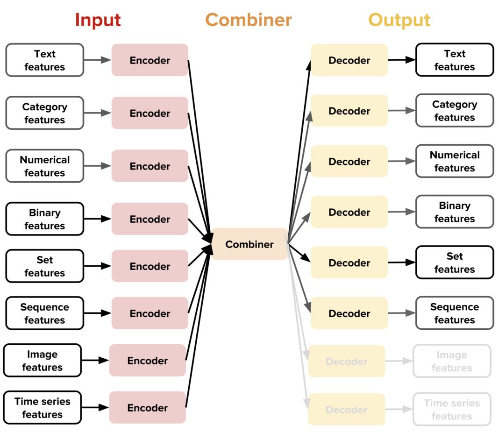
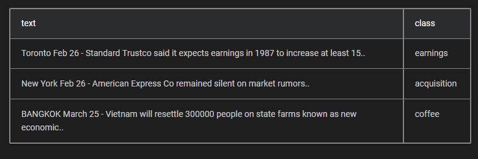
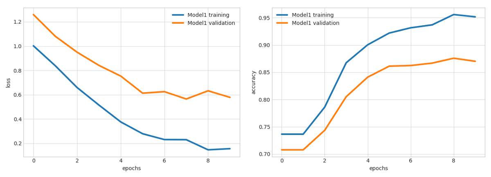
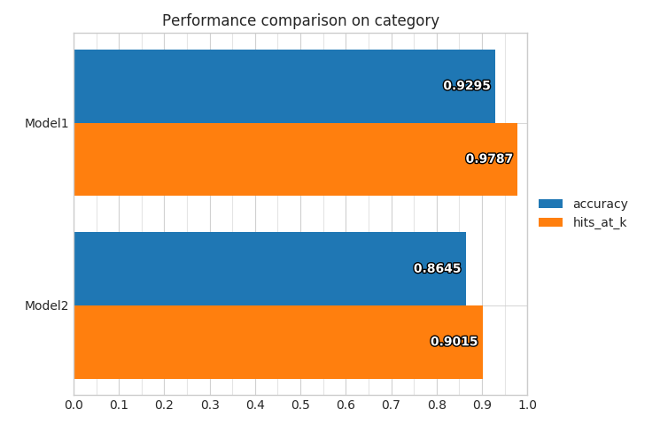

# 介绍Uber的路德维希
## 一个无需编写任何代码即可训练深度学习模型的新工具箱


Uber继续疯狂地发布深度学习技术。 自去年以来，Uber AI实验室团队已开源各种框架，这些框架使深度学习解决方案的许多基本构建模块成为可能。 Uber工程团队的生产力令人印象深刻：Pyro是在PyTorch之上构建的概率编程框架，Horovod是基于Tensor-Flow的分布式学习框架，Manifold致力于视觉调试和可解释性，当然， Michelangelo是大规模机器学习解决方案的参考体系结构。 Uber AI Labs的最新创建是Ludwig，这是一个无需编写任何代码即可训练深度学习模型的工具箱。

培训是深度学习应用程序中开发人员最密集的方面之一。 通常，数据科学家花费大量时间来尝试不同的深度学习模型，以更好地执行特定训练数据集。 这个过程不仅涉及培训，还包括其他几个方面，例如模型比较，评估，工作负载分配等。 鉴于深度学习模型的高度技术性，它是一项通常仅限于数据科学家和机器学习专家的活动，其中包括大量的代码。 尽管对于任何机器学习解决方案都可以普遍使用此问题，但在深度学习体系结构中，问题通常变得更为严重，因为它们通常涉及许多层和层次。 简化培训流程是可以简化深度学习解决方案中的实验阶段的首要因素。
# 输入路德维希

Ludwig是一个基于TensorFlow的工具箱，无需编写代码即可训练和测试深度学习模型。 路德维希（Ludwig）在过去两年的Uber孵化中，终于开源了，以纳入数据科学界的贡献。 从概念上讲，路德维希是根据五个基本原则创建的：
+ 无需编码：不需要任何编码技能即可训练模型并将其用于获得预测。
+ 通用性：一种基于数据类型的新方法来进行深度学习模型设计，使该工具可在许多不同的用例中使用。
+ 灵活性：经验丰富的用户对模型的建立和培训具有广泛的控制权，而新用户会发现它易于使用。
+ 可扩展性：易于添加新的模型架构和新的特征数据类型。
+ 可理解性：深度学习模型内部通常被认为是黑匣子，但我们提供标准的可视化效果以了解其性能并比较其预测。

使用Ludwig，数据科学家可以通过简单地提供一个包含训练数据的CSV文件以及一个带有模型输入和输出的YAML文件来训练深度学习模型。 使用这两个数据点，路德维希执行多任务学习例程，以同时预测所有输出并评估结果。 在幕后，路德维希提供了一系列深度学习模型，这些模型会不断进行评估，并且可以结合到最终的体系结构中。 Uber工程团队使用以下类比来解释此过程：“如果深度学习图书馆提供了建造建筑物的基础，路德维希提供了建造城市的建筑物，您可以在可用的建筑物中进行选择，也可以将自己的建筑物添加到 可用的集合。”

路德维希背后的主要创新是基于特定于数据类型的编码器和解码器的思想。 路德维希针对支持的任何给定数据类型使用特定的编码器和解码器。 与其他深度学习架构一样，编码器负责将原始数据映射到张量，而解码器将张量映射到输出。 路德维希（Ludwig）的体系结构还包括组合器的概念，该组合器用于组合所有输入编码器中的张量，对其进行处理并返回将要用于输出解码器的张量。


路德维希灵活的编码器/解码器体系结构甚至允许没有经验的数据科学家来训练极其复杂的模型。 例如，对于给定的自然语言处理场景，Ludwig可以使用卷积神经网络（CNN）作为编码器，并使用递归神经网络（RNN）作为解码器。 这些决定基于数据的特征，并且需要数据科学家的最少投入。
# 路德维希在行动

数据科学家将把路德维希用于两个主要功能：训练和预测。 假设我们正在使用以下数据集处理文本分类方案。


我们可以使用以下命令来安装Ludwig：
```
pip install ludwigpython -m spacy download en
```

下一步将是配置模型定义YAML文件，该文件指定模型的输入和输出功能。
```
input_features:    -        name: text        type: text        encoder: parallel_cnn        level: wordoutput_features:    -        name: class        type: category
```

通过这两个输入（训练数据和YAML配置），我们可以使用以下命令训练深度学习模型：
```
ludwig experiment \  --data_csv reuters-allcats.csv \  --model_definition_file model_definition.yaml
```

路德维希提供了一系列可视化效果，可在训练和预测期间使用。 例如，学习曲线可视化使我们对模型的训练和测试性能有了一个了解。


训练后，我们可以使用以下命令评估模型的预测：
```
ludwig predict --data_csv path/to/data.csv --model_path /path/to/model
```

其他可视化可用于评估模型的性能。


完整的路德维希功能集可通过API以编程方式获得。 使用Python重新创建示例仅需几行代码：
```
from ludwig import LudwigModel# train a modelmodel_definition = {...}model = LudwigModel(model_definition)train_stats = model.train(training_dataframe)# or load a modelmodel = LudwigModel.load(model_path)# obtain predictionspredictions = model.predict(test_dataframe)model.close()
```

尽管Ludwig具有强大的功能，但它为数据科学家提供了一个非常可扩展的体系结构，以结合他们自己的编码器和解码器以及用于预处理数据的功能。 例如，创建新的Ludwig编码器只需实现init和call方法即可，如以下代码所示：
```
def __init__(    self,    should_embed=True,    vocab=None,    representation='dense',    embedding_size=256,    embeddings_trainable=True,    pretrained_embeddings=None,    embeddings_on_cpu=False,    num_layers=1,    state_size=256,    cell_type='rnn',    bidirectional=False,    dropout=False,    initializer=None,    regularize=True,    reduce_output='last',    **kwargs):__call__(    self,    input_placeholder,    regularizer,    dropout,    is_training)
```

路德维希（Ludwig）是用于深度学习模型的训练和实验的非常有用的工具箱。 使用路德维希甚至可以让初级数据科学家无需编写任何代码即可训练和测试高度复杂的深度学习模型。 路德维希的简单培训和交互式可视化过程可以大大缩短深度学习应用程序中的实验周期，使专家可以专注于微调目标模型的体系结构，而不必花费大量时间进行重复的培训工作。
```
(本文翻译自Jesus Rodriguez的文章《Introducing Uber’s Ludwig》，参考：https://towardsdatascience.com/introducing-ubers-ludwig-5bd275a73eda)
```
