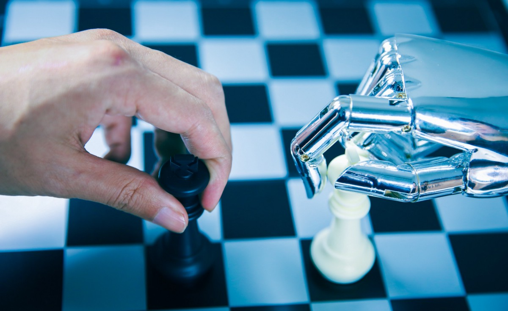
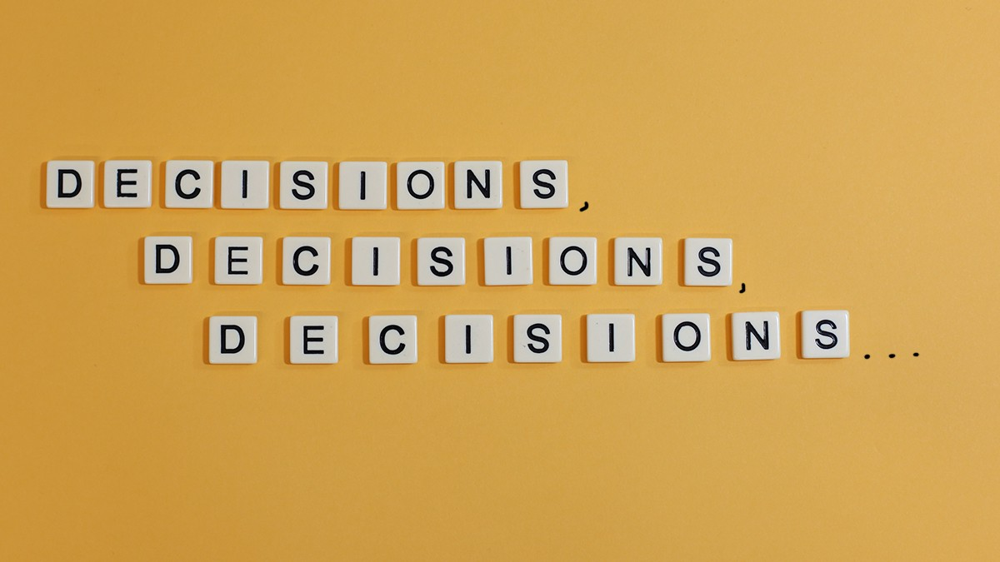
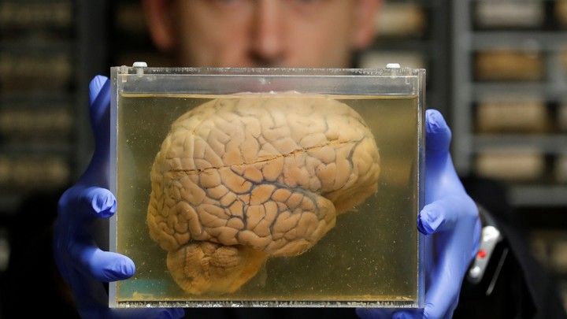

# 决策智能简介
## 人工智能时代领导力的新学科

好奇地知道避免在大草原上避开狮子的心理与负责任的AI领导以及设计数据仓库的挑战有什么共同点吗？ 欢迎使用决策情报！

> Source: xijian/Getty

决策智能是一门新兴的学科，涉及在选项之间进行选择的所有方面。 它将最佳的应用数据科学，社会科学和管理科学整合到一个统一的领域中，可以帮助人们使用数据来改善他们的生活，他们的业务以及他们周围的世界。 这是AI时代的一门至关重要的科学，涵盖了负责任地领导AI项目所需的技能以及大规模自动化的设计目标，指标和安全网。

决策智能是将信息变成各种规模的更好行动的准则。

让我们浏览其基本术语和概念。 这些部分的目的是便于阅读（也可以跳过阅读，这就是跳过无聊的部分……有时甚至完全跳过阅读行为的地方）。
## 怎么决定

数据很漂亮，但是重要的决定。 通过我们的决定（我们的行动），我们才能影响周围的世界。

我们将“决策”一词定义为表示任何实体在选项之间进行的选择，因此对话的范围比MBA式的困境（例如是否在伦敦开设分支机构）更为广泛。

通过我们的决定（我们的行动），我们才能影响周围的世界。

用这种术语来说，将照片标记为“猫”还是“非猫”是由计算机系统执行的决定，而弄清楚是否启动该系统则是负责该项目的人类领导者（我希望！）经过深思熟虑后做出的决定。

## 什么是决策者？

用我们的话说，“决策制定者”不是急于否决项目团队意图的利益相关者或投资者，而是负责决策体系结构和上下文框架的人。 换句话说，一个精心设计的目标的创造者，而不是其破坏者。
## 什么决策？

决策这个词在不同学科中使用不同，因此可以指：
+ 在存在其他选择时采取措施（从这种意义上讲，可以谈论计算机或蜥蜴的决策）。
+ 履行（人类）决策者的职能，其中一部分负责决策。 即使计算机系统可以执行决策，它也不会被称为决策者，因为它对输出不承担任何责任-责任完全落在创建决策者的肩膀上。
## 决策情报分类

学习决策智能的一种方法是沿传统思路将其分解为定量方面（与应用数据科学大部分重叠）和定性方面（主要由社会科学和管理科学的研究人员开发）。
## 定性方面：决策科学

传统上，构成定性方面的学科被称为决策科学，我很喜欢将其称为“整体”（s，我们不可能总是拥有想要的东西）。

决策科学涉及以下问题：
+ “您应该如何设置决策标准和设计指标？”（全部）
+ “您选择的指标激励兼容吗？”（经济）
+ “您应该以哪种质量做出此决定，以及应该为完美的信息付出多少？”（决策分析）
+ “情绪，试探法和偏见如何影响决策？”（心理学）
+ “皮质醇水平等生物学因素如何影响决策？”（神经经济学）
+ “改变信息的表示方式如何影响选择行为？”（行为经济学）
+ “在团队环境中做出决策时如何优化结果？”（实验博弈论）
+ “在设计决策环境时如何平衡众多约束和多阶段目标？”（设计）
+ “谁将经历决策的后果，各个团队将如何看待这种经历？”（UX研究）
+ “决策客观符合道德吗？”（哲学）

这只是一个小味道……还有更多！ 这也不是所涉及学科的完整列表。 将决策科学方面视为以模糊的存储形式（人脑）来处理决策设置和信息处理，而不是整齐地写在半永久性存储（纸或电子）中的那种形式（我们称之为数据）。
## 你的大脑有麻烦

在上个世纪，称赞任何将一堆数学知识投入到一些毫无戒心的人类工作中的人都是时髦的。 通常，采用定量方法要比漫不经心的混乱更好，但是有一种方法可以做得更好。

基于纯数学合理性的策略相对较幼稚，并且表现不佳。

相对于基于定量和定性方面共同掌握的策略，基于纯数学理性的策略对决策和人类行为没有定性的了解可能很幼稚，并且往往表现不佳。 （请继续关注有关社会科学理性历史的博客文章，以及心理学胜过数学的行为博弈论的例子。）

人类不是最优化者，我们是满意者，这对弯角刀是个幻想。

人不是最优化者，我们是满意者，这对于那些对足够好而不是完美感到满意的切角刀是个幻想。 （这也是一个足以震撼我们物种傲慢的概念，这是值得诺贝尔奖的。这是面对有理性，无瑕无瑕的理性人的一拳。）

> Image: Source.

实际上，我们所有人都使用认知启发法来节省时间和精力。 这通常是一件好事； 找出一条理想的逃生路线来逃避大草原上的狮子，会在我们还没开始计算之前就被我们吃掉了。 满足感还可以降低生活中的卡路里消耗，这同样也是如此，因为我们的大脑实际上是非常耗电的设备，尽管重量约为3磅，却消耗了我们大约五分之一的能量消耗。（我敢打赌，您的体重超过了 一共15磅，对吧？

我们削减的一些角落导致可预测的次优结果。

现在，我们大多数人都不会把时间花在逃避狮子的事情上，因此我们削减的一些角落会导致可预测的垃圾结果。 我们的大脑并非完全针对现代环境进行了优化。 了解我们的物种将信息转化为行动的方式，可以使您使用决策过程来保护自己免受自己大脑的缺点（以及那些故意捕食你的直觉的人）的伤害。 它还可以帮助您构建工具，以提高性能，并使环境适应大脑，如果可怜的事物在赶上la Darwin方面异常缓慢。

如果您认为AI将人类排除在外，请再三考虑！

顺便说一句，如果您认为AI将人类排除在外，那就再想一想！ 所有技术都是其创造者的反映，大规模运行的系统会加剧人为缺陷，这就是为什么开发决策智能技能对于负责任的AI领导如此必要的原因之一。 在这里了解更多。

## 也许您没有做出决定

有时候，仔细考虑您的决策标准会使您意识到，世界上没有任何事实会改变主意-您已经选择了行动，而现在您只是在寻找一种让自己感觉更好的方式。 这是一个有用的认识-它可以避免您浪费更多的时间，并可以帮助您在进行打算做的事情时重定向情绪上的不适，而该死的数据也该死。

“他使用统计数据，而喝醉了的人使用灯柱……只是为了支撑而不是照明。”-安德鲁·朗（Andrew Lang）

除非您针对不为人知的不同事实采取不同的行动，否则这里就没有决定……尽管有时进行决策分析培训可以使您更清楚地了解这些情况。
## 完美信息下的决策

现在想象一下，您将非常谨慎地制定对事实敏感的决策，并且可以动动手指以查看执行决策所需的事实信息。 您需要数据科学做什么？ 没什么，就是那样。

首要任务应该是弄清楚我们如何对事实做出反应。

没有比事实更好的东西了-您可以肯定地知道一些事情（是的，我知道这里有一个相对的相对主义兔子洞，让我们继续前进）-因此，如果我们有事实，我们总是更愿意根据事实做出决定。 因此，首要任务应该是弄清楚我们如何处理事实。 您想将您的理想信息用于以下哪些用途？

> Your author particularly enjoyed this wall in Jamaica.

## 你能用事实做什么？
+ 您可以使用事实做出一个重要的预先确定的决定。 如果它足够重要，则您需要在事物的定性方面投入大量精力，以明智地制定决策。 心理学家知道，如果您让自己受到意外信息的困扰，它会以您不希望的方式操纵您，因此他们（和其他人）对于如何选择预先接受的信息有很多话要说。
+ 您可以使用事实来表达意见（“我希望外面阳光明媚”变成“我知道外面阳光明媚”）。
+ 您可以使用事实做出一个重要的基于存在的重要决策。 基于存在的决策（“我刚刚发现隔壁有埃博拉病毒病例，所以我要离开这里……”）是一个以前未知的事物的存在极大地动摇了您方法的基础的决策 在事后看来，您意识到自己的决策环境草率地制定了框架。
+ 您可以使用事实来自动执行大量决策。 在传统编程中，人员指定一组指令，用于将事实输入转换为适当的操作，可能涉及查找表之类的操作。
+ 您可以使用事实来揭示自动化解决方案。 通过查看有关系统的事实，您可以基于它们编写代码。 这是对传统编程更好的方法，而不是通过在没有信息的情况下认真思考来提出解决方案的结构。 例如，如果您不知道如何从摄氏温度转换为华氏温度，但可以使用数据集在摄氏温度输入中查找与摄氏温度输入一起使用的条目…但是，如果您分析该查找表本身，就会发现 连接它们的公式。 然后，您只需编写该公式（“模型”）即可为您做一些肮脏的工作，并失去笨拙的表格。
+ 您可以使用事实为完美解决的自动化问题生成最佳解决方案。 这是传统的优化。 您会在运筹学领域找到很多例子，其中包括如何纠缠约束以获得理想结果，例如完成一系列任务的最佳顺序。
+ 您可以利用事实来激发您如何处理未来的重要决策。 这是分析的一部分，也属于部分信息部分。 保持那个想法！
+ 您可以使用事实来评估您要处理的内容。 这可以帮助您了解可用于将来决策的各种输入，并设计如何更好地整理信息。 如果您刚刚继承了一个巨大的，黑暗的（数据）仓库，里面装满了可能的原料，那么您必须等到有人查看之后才能知道其中的内容。 幸运的是，您的分析师有一个手电筒和旱冰鞋。
+ 您可以随意使用事实来做出无框框框的决定。 当决策的赌注足够低，以至于他们不保证需要认真努力进行决策时，例如“我今天应该吃什么午餐？”，尝试在所有决策中始终保持严格，这会产生长期的效果 /一生的结果，属于毫无意义的完美主义。 在最重要的情况下节省您的精力，但是请不要忘记，即使使用低质量的低工作量方法非常有效，但最佳决策方法仍然是低质量的。 当您采用这种方法时，您不应该th胸或者过分自信……如果您偷工减料，就意味着自己举步维艰。 在某些情况下，脆弱的工作无法完成，但这并不会突然使您的结论变得坚定。 不要依靠它。 如果要进行高质量的决策，则需要更严格的方法。

通过决策科学方面的培训，您将学会减少做出基于事实的严格决策所需的工作量，这意味着相同数量的工作现在可以帮助您全面地进行高质量的决策。 这是一项非常有价值的技能，但是需要大量的工作才能进行磨练。 例如，行为经济学的学生养成在信息之前设置决策标准的习惯。 我们中那些从要求苛刻的决策科学培训计划中跳出来的人不禁要问自己，例如，在我们抬高价格之前，我们要为机票支付的最高金额是多少？
## 数据收集与数据工程

如果有事实，我们已经完成了。 las，我们生活在现实世界中，通常我们必须为我们的信息而努力。 数据工程是一门复杂的学科，其重点是使信息可靠地大规模获得。 前往杂货店购买一品脱冰淇淋很容易，只要所有可用的相关信息都适合电子表格，数据工程就很容易。

当您开始要求交付200万吨冰淇淋时，事情就变得棘手了……不允许融化！ 如果您必须设计，设置和维护一个巨大的仓库，事情变得更加棘手，甚至不知道未来会要求您下一步存储什么—也许是几吨鱼，也许是………祝您好运！

当您甚至不知道下周将要存储什么物品时，建立一个仓库很棘手-也许是几吨鱼，也许是…...祝您好运！

尽管数据工程是决策情报的独立姊妹学科和关键合作者，但决策科学在为事实收集的设计和管理提供建议方面具有悠久的专业知识传统。
## 定量方面：数据科学

制定好决策后，您可以使用搜索引擎或分析师（由您执行人工搜索引擎的角色）来查找所需的所有事实，剩下的就是执行决策。 你完成了！ 无需花哨的数据科学。

如果经过了所有的日常工作和柔术后，交付的事实不是您理想地做出决定所需的事实，该怎么办？ 如果它们只是部分事实怎么办？ 也许您想要明天的事实，但只有过去可以告诉您。 （当我们不记得未来时，这很烦人。）也许您想知道所有潜在用户对您产品的看法，但您只能问一百个。 然后，您正在处理不确定性！ 您所知道的不是您希望您所知道的。 输入数据科学！

当您被迫超越数据领域而飞跃时，数据科学将变得有趣起来。但是请务必避免使用类似于Icarus的图示！

自然，当您掌握的事实不是您所需要的事实时，您应该期望您的方法会发生变化。 也许它们只是更大难题中的一个难题（例如来自更大人群的样本）。 也许这是一个错误的难题，但却是您的最佳选择（例如使用过去来预测未来）。 当您被迫超越数据领域而飞跃时，数据科学将变得有趣起来。但是请务必避免使用类似于Icarus的图示！
+ 您可以使用部分事实通过统计推断来做出单个重要的预先确定的决策，并在假设的基础上补充信息，以查看是否应更改操作。 这是频率（古典）统计。
+ 您可以使用部分事实来合理地将意见更新为更明智（但仍不完善和个人化）的意见。 这是贝叶斯统计。
+ 您的部分事实可能包含关于存在的事实，这意味着您可以事后考虑将其用于基于存在的决策（请参见上文）。
+ 您可以使用部分事实来自动执行大量决策。 这是传统的编程方式，使用的是诸如查找表之类的东西，您可以将以前从未见过的东西转换成最接近的东西，然后照常进行。 （简而言之，这就是k-NN的功能……通常，当其中包含更多内容时，它会更好地发挥作用。）
+ 您可以使用部分事实来激发自动化解决方案。 通过查看有关系统的部分事实，您仍然可以根据所看到的内容编写代码。 这就是分析。
+ 您可以使用部分事实来为不完美解决的自动化问题生成一个体面的解决方案，因此您不必自己解决这个问题。 这是机器学习和AI。
+ 您可以使用部分事实来激发您如何处理未来的重要决策。 这就是分析。
+ 您可以使用部分事实来了解您要处理的内容（请参见上文），并通过高级分析来加快自动化解决方案的开发，例如，通过启发将信息融合在一起以进行有用的模型输入的新方法（此术语为术语） 是“特征工程”）或尝试在AI项目中使用的新方法。
+ 您可以草率地使用部分事实来做出无框的决定，但是要知道质量甚至比草率地使用事实时还要低，因为您实际知道的内容与您希望的内容相距仅一步之遥。

对于所有这些用途，有一些方法可以整合以前孤立的各种学科的智慧，从而更有效地进行决策。 这就是决策情报的全部内容！ 它汇集了各种决策观点，使我们所有人变得更加强大，并为他们提供了新的声音，而不受他们研究领域的传统约束。

> To return to the kitchen analogy for AI, if research AI is building microwaves and applied AI is using microwaves, decision intelligence is using microwaves safely to meet your goals and using something else when you don’t need a microwave. The goal (objective) is always the starting point for decision intelligence.

如果您想了解更多信息，那么我在Medium.com上的大部分文章都是从决策情报的角度撰写的。 我启动AI项目的指南可能是最微妙的，因此，如果您还没有按照本文中的链接选择自己的冒险之旅，建议您去那里进行潜水。
