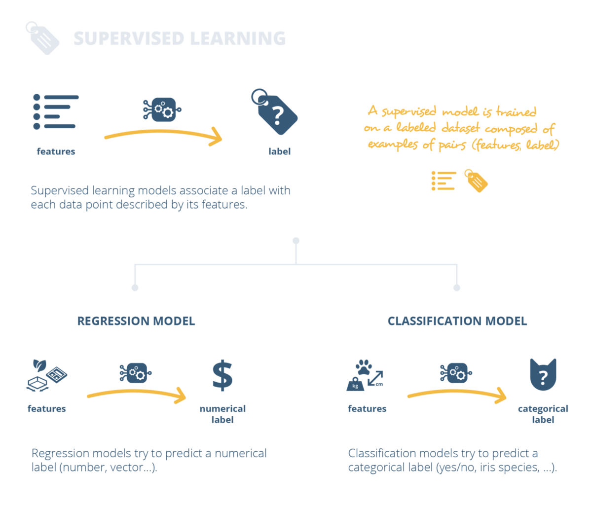

## 在机器学习中处理不平衡的数据集
### 面对班级失衡的问题，应该做什么和不应该做什么？
## 从线性回归到神经网络的轻松旅程
### 对一些机器学习和深度学习概念的简要介绍。

Baptiste Rocca撰写的有关该主题的上一篇文章：
## 从线性回归到神经网络的轻松旅程
### 对一些机器学习和深度学习概念的简要介绍。
## 在机器学习中处理不平衡的数据集
### 面对班级失衡的问题，应该做什么和不应该做什么？
# 结论

在结束本文之前，我们要提到机器学习并不是什么新鲜事物，并且驱动当今应用程序的许多算法已经存在了很多年。 尽管如此，随着时间的推移，仍取得了一些重大进展：我们建立了比以往更大的数据集，我们提高了计算能力，并设想了新的前沿模型。 如果这些进步已经使我们能够接近并且在某些情况下甚至在许多任务上甚至超出了人类的能力，那么毫无疑问，我们只是在探索一切可能的事物！

我们真的希望您喜欢这篇文章。 请随时留下反馈，并在评论部分中告诉我们，如果您对即将到来的视频感兴趣的主题是什么。

感谢您的阅读，很快就会在Towards Data Science上见！
# 有监督和无监督的模型

机器学习技术的两个主要类别是监督学习和无监督学习。

在监督学习中，我们希望获得一个模型来根据数据的特征预测数据的标签。 为了学习特征和标签之间的映射，必须将模型与给定的特征示例及其相关的标签进行拟合。 我们说“模型是在标记的数据集上训练的。”

预测标签可以是数字或类别。 例如，我们可能正在建立一个预测房屋价格的模型，这意味着我们希望预测一个数字标签。 在这种情况下，我们将讨论回归模型。 否则，我们可能还想基于给定特征定义一个预测类别的模型，例如“猫”或“非猫”。 在这种情况下，我们将讨论分类模型。

> Overview of supervised learning (not exhaustive).


在无监督学习中，我们希望定义一个模型，该模型揭示某些数据中仅由其特征描述但没有标签的结构。 例如，无监督学习算法可以帮助回答诸如“我的数据中是否存在组？”或“是否有任何方法可以简化我的数据描述？”之类的问题。

该模型可以在数据中寻找不同种类的基础结构。 如果它试图在数据中查找组，我们将讨论聚类模型。 聚类模型的一个示例是根据公司的个人资料对公司客户进行细分的模型。 否则，如果我们有一个可以转换数据并用较少数量的特征表示数据的模型，那么我们将讨论降维模型。 一个示例就是一个模型，该模型将一些汽车的多种技术特征归纳为几个主要指标。

> Overview of unsupervised learning (not exhaustive).


总而言之，监督学习模型将标签与其特征描述的每个数据点相关联，而无监督学习模型则在所有数据点之间找到结构。

从某种意义上说，有监督的学习类似于从图画书中学习水果的名称：将水果的特征（特征）与标签上写的名称相关联。 监督学习算法的经典示例是线性回归，逻辑回归，支持向量机，神经网络等。

另一方面，无监督学习就像拍摄同一本水果图画书，分析所有水果以检测图案，然后决定按颜色和大小对水果进行分组。 无监督学习算法的经典示例是k均值聚类，分层聚类，主成分分析，自动编码器等。
# 机器学习的定义

但是什么是机器学习呢？ 这些神奇的算法背后是什么？ 以及他们如何使用数据如此出色地工作？

正式地，机器学习是使计算机无需显式编程即可实现任务的科学。 换句话说，经典算法和机器学习算法之间的最大区别在于我们定义它们的方式。


为经典算法提供了准确而完整的规则来完成任务。 给出了机器学习算法的一般准则，这些准则定义了模型以及数据。 此数据应包含模型完成任务所需的缺少信息。 因此，当针对数据调整了模型后，机器学习算法便可以完成其任务。 我们说我们“使模型适合数据”或“必须对数据进行模型训练”。

让我们用一个简单的例子来说明这一点。 假设我们要根据房屋的大小，花园的大小以及所拥有的房间数来预测房屋的价格。

> Features we are going to consider in our house pricing example.


我们可以尝试构建一个可以解决此问题的经典算法。 该算法必须采用三个房屋特征，并根据显式规则返回预测价格。 在此示例中，确切的房屋定价公式必须已知并明确编码。 但是实际上，这个公式通常是未知的。

> For our house pricing example, a classical programming approach would consists in coding explicitly the formula that gives the price of a house depending on the three features we are considering.


另一方面，我们可以构建机器学习算法。 首先，这种算法将定义一个模型，该模型可能是根据我们有限的知识创建的不完整公式。 然后，将通过对给定的房价示例进行培训来调整模型。 这样做，我们将模型与一些数据结合在一起。

> For our house pricing example, a machine learning approach would consists in defining a model that contains a partial knowledge about the house pricing formula and use the available data to “specify” the model (we fit the model on the data).


通常，当我们掌握的信息不完整或信息太复杂而无法手工编码时，机器学习对于难以完成的任务非常有用。 在这种情况下，我们可以为模型提供可用的信息，然后让这个人“学习”它本身需要的缺失信息。 然后，该算法将使用统计技术直接从数据中提取缺失的知识。
# 介绍

我们目前生活在一个“数据时代”，每天收集和存储大量数据。 面对不断增长的数据量，机器学习方法已成为必然。 如此之多，以至于您一天可能会无数次使用它们！

让我们从一个为数百万用户提供“日常”机器学习贡献的示例开始：Facebook新闻源背后的算法。 Facebook使用机器学习来利用用户的数据和反馈来个性化其提要。 如果您“喜欢”帖子或停止滚动以阅读内容，该算法将从中吸取教训，并开始使用其他类似内容填充您的供稿。 这种学习是连续进行的，因此您的新闻提要中建议的材料会随您的喜好而变化，从而使您的用户体验更加愉悦。

> Facebook uses likes, comments and other signals from users to learn what they are interested in and populate their new feeds in consequences.


这只是一个例子！ 还有很多。 Apple可以在您刚拍摄的照片中识别出朋友的脸。 Amazon Echo可以理解您并可以回答您的问题。 当Netflix推荐与您的个人资料相匹配的视频时，您的吸尘器甚至可以在您的房屋周围四处导航！ 机器学习已成为我们日常生活的重要组成部分，并且很快就不会普及。

> Machine learning can now be found in many tools that we use on a daily basis.

# 机器学习导论
## 有关ML的数据科学入门视频。

> Credit: congerdesign on Pixabay


这篇文章是为实现数据科学而实现的名为“机器学习简介”的视频的抄本。 该视频的脚本是由Anne Bonner编写的。 您可以在视频中听到的声音是Alice Irizarry的声音。
```
(本文翻译自Joseph Rocca的文章《Introduction to Machine Learning》，参考：https://towardsdatascience.com/introduction-to-machine-learning-f41aabc55264)
```
