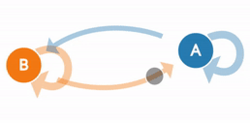
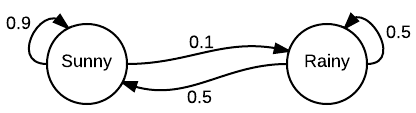
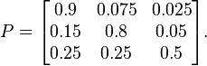
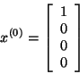

# 马尔可夫链导论
## 什么是马尔可夫链，何时使用它们，以及它们如何工作

> (Generated from http://setosa.io/ev/markov-chains/)


马尔可夫链是统计随机过程的一种相当普遍且相对简单的方法。 它们已用于许多不同的领域，从文本生成到财务建模。 一个流行的示例是r / SubredditSimulator，它使用Markov链自动为整个subreddit创建内容。 总体而言，马尔可夫链在概念上非常直观，并且易于访问，因为无需使用任何高级统计或数学概念即可实现它们。 它们是开始学习概率建模和数据科学技术的好方法。
## 情境

首先，我将以一个非常常见的示例来描述它们：
```
Imagine that there were two possible states for weather: sunny or cloudy. You can always directly observe the current weather state, and it is guaranteed to always be one of the two aforementioned states.Now, you decide you want to be able to predict what the weather will be like tomorrow. Intuitively, you assume that there is an inherent transition in this process, in that the current weather has some bearing on what the next day’s weather will be. So, being the dedicated person that you are, you collect weather data over several years, and calculate that the chance of a sunny day occurring after a cloudy day is 0.25. You also note that, by extension, the chance of a cloudy day occurring after a cloudy day must be 0.75, since there are only two possible states.You can now use this distribution to predict weather for days to come, based on what the current weather state is at the time.
```

此示例说明了马尔可夫链的许多关键概念。 马尔可夫链本质上由一组过渡组成，这些过渡由某种概率分布确定，满足马尔可夫性质。

观察在该示例中如何仅通过观察从当天到下一天的转换来获得概率分布。 这说明了马尔可夫特性，它是马尔可夫过程的独特特征，使它们无记忆。 这通常会使他们无法成功产生预期会出现某些潜在趋势的序列。 例如，尽管马尔可夫链可能能够根据词频来模仿作者的写作风格，但由于它们是在更长的文本序列上形成的，因此它无法生成包含深层含义或主题意义的文本。 因此，由于它们无法考虑先前状态的完整链，因此它们缺乏产生上下文相关内容的能力。

> A visualization of the weather example

## 该模型

形式上，马尔可夫链是一个概率自动机。 状态转移的概率分布通常表示为马尔可夫链的转移矩阵。 如果马尔可夫链具有N个可能的状态，则矩阵将是N x N矩阵，因此条目（I，J）是从状态I转换为状态J的概率。此外，转换矩阵必须是随机矩阵， 一个矩阵，其每一行中的项之和必须恰好为1。这很有意义，因为每一行代表其自己的概率分布。

> General view of a sample Markov chain, with states as circles, and edges as transitions


> Sample transition matrix with 3 possible states


另外，马尔可夫链还具有一个初始状态向量，表示为N x 1矩阵（向量），它描述了从N个可能状态中的每个状态开始的概率分布。 向量的条目I描述了链从状态I开始的概率。

> Initial State Vector with 4 possible states


这两个实体通常是表示马尔可夫链所需的全部。

现在，我们知道如何获得从一种状态过渡到另一种状态的机会，但是如何找到在多个步骤中发生这种过渡的机会呢？ 为了对此进行形式化，我们现在要确定经过M步从状态I转移到状态J的概率。 事实证明，这实际上非常简单。 给定一个转换矩阵P，可以通过计算将P提高到M的幂获得的矩阵的项（I，J）的值来确定。对于M的较小值，可以轻松地通过手动乘法来完成 。 但是，对于较大的M值，如果您熟悉简单的线性代数，将矩阵求幂的更有效方法是首先对角矩阵。
## 结论

既然您已经了解了马尔可夫链的基础知识，那么您现在应该能够轻松地以您选择的语言来实现它们。 如果编码不是您的专长，那么还可以使用马尔可夫链和马尔可夫过程的许多更高级的属性。 我认为，沿着理论路线的自然发展将是向隐马尔可夫过程或MCMC迈进。 简单的马尔可夫链是其他更复杂的建模技术的基石，因此，借助此知识，您现在可以进入主题内的各种技术，例如信念建模和抽样。
```
(本文翻译自Devin Soni的文章《Introduction to Markov Chains》，参考：https://towardsdatascience.com/introduction-to-markov-chains-50da3645a50d)
```
