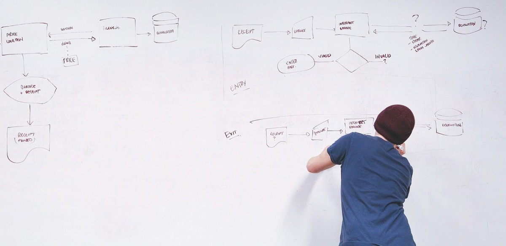
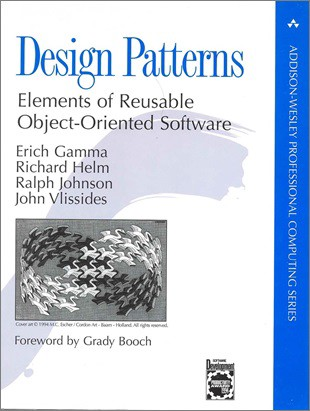
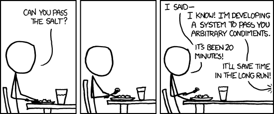
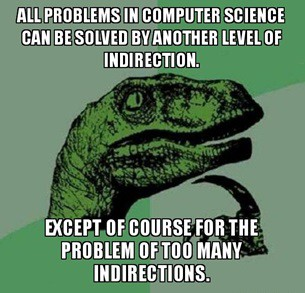

如果您陷入了设计模式的僵局，为什么不使用最实用的编程技巧来节省自己：重构？ 如果您想更深入地了解编码和设计，请订阅Young Coder每月电子报。
# 是时候克服设计模式了吗？
## 没有什么比用错误的手聪明的方式更危险

> Image by StartupStockPhotos from Pixabay

好的程序设计的核心原则之一是不要两次解决相同的问题。 如果有人已经发明了完美的泡泡糖，那么您就没事做自己的事了。 如果您有合理的正则表达式来验证电子邮件地址，则无需自己做。 等等。

这种逻辑很容易理解。 每次您重新设计一项功能时，都有可能会横盘整理。 您可能会引入新的错误，也可能会遇到意想不到的缺点。 充其量，您的代码将占用额外的测试时间。 最糟糕的情况是，您会产生隐藏在应用程序接缝和接缝中的问题，例如旧床架角落的臭虫。

因此，很容易理解设计模式的魅力。 如果我们要一遍又一遍地解决相同的问题，我们明智地使用规范的解决方案，这些解决方案是由更聪明的程序员创建的，并且经过了千千万万个测试。 或者，换句话说，我们不是有责任使用经过战斗考验的模式来节省时间并确保最终产品达到最佳状态吗？

这就是设计模式吸引您的方式。
# 设计模式简史

模式的概念-您可以定义和重用的概念模型-根深蒂固，可以追溯到真实的建筑（建筑物）和Christopher Alexander的工作。 但是大多数程序员都知道的设计模式在1994年问世，当时四位编码天才写了一本书，名为《设计模式：可重用的面向对象软件的元素》。

> The book that launched a thousand design reviews

设计模式列出了23种基本模式，分为三类：创造型，结构型和行为型。 您可以在此处查看所有内容。 令人惊奇的是，当人们谈论当今的设计模式时（大约25年后），他们通常指的是本书最早编纂的一种古老的模式。

这种成功绝非偶然。 不可否认，原始设计模式是由比您本人更敏锐的程序员编写的。 但是设计模式并不是软件设计的中性部分，使用它们的价格通常被忽略。
# 复杂性的代价

设计模式通常与架构类推销给程序员。 想象您正在建造一个新家。 您是否希望商人从事这项工作以重新发明家用管道系统？ 您想让电工用自己的方法来组装保险丝吗？
![A couple of design patterns short of perfection / [Pixabay]](1*n_cSh97qGQuN4DyEkc78ZA.png)
> A couple of design patterns short of perfection / [Pixabay]

但是构建软件系统与构建房屋有很大不同。 一方面，设计模式不是您可以直接放入代码中的要素，就像类库中的便捷函数一样。 相反，每个模式都是需要实现的模型。 大多数设计模式都定义了跨越不同对象的交互，这意味着您需要对多个类进行更改。 此额外代码的绝对分量使您的设计复杂化。 对于新开发人员来说，它们尤其危险，因为他们从未见过自己不想做的编码旁听。

即使设计模式处于最佳状态，它们也会迫使您将简单性换成其他东西。 通常，“其他”仅仅是对良好封装和温暖模糊感的模糊承诺。

> The general problem / XKCD

设计模式是固执己见的。 他们将自己嵌入到您的代码中，并向特定的方向拉动您的类。

即使是最简单的模式也要付出代价，并会带来复杂性。 考虑谦虚的Singleton模式-一个仅允许一个实例的类。 尽管从概念上讲它很简单，但是根据您需要线程安全性，延迟加载，可序列化性，对继承的支持还是只喜欢枚举，大约有十二种不同的实现Singleton模式的技术。

并不是说Singleton设计是一个高级概念。 不可能将任何单一代码成分设计成完全通用化并完全适合每个用例。 直到今天，建筑师仍在争论Singleton是一种优质的镀金图案还是一种反图案-您应努力避免这种情况，因为总有一天会背叛您。
# 模棱两可的可扩展性

设计模式都是关于增加代码中的抽象性的。 诸如Proxy，Bridge，Adapter和Facade之类的模式会在对象之间添加图层。 起初，这似乎是编程的天堂。 哪个贤惠的程序员不希望对象之间的依赖性降低？

我们都知道规则：计算机科学中的所有问题都可以通过另一层间接解决。 但是也有副作用。 间接的每一额外层都会添加一个新的地方，您可以在其中放置一个解决方案。

换句话说，您对设计进行抽象化的方式越多，您打开的空间就越多，可以供其他人更改代码。 未来的程序员将很难弄清楚要修改系统的哪个部分，以及如何扩展代码而又不会使工作与其他人的更改发生冲突。

最严重的违法者是中介者模式，该模式旨在让两个对象相互作用而不相互了解。 结果要么是神圣的抽象必杀技，要么是严重混淆类模型中责任的方法。

有两种方法可以破坏汽车：1）撕开汽车。 2）将其称为通用道路限制运输容器，然后开始添加它。
# 不匹配和不合适

在不了解上下文的情况下很容易着手实施模式，换句话说，这些模式如何适合您选择的语言，框架和应用程序类型？

答案可能很模糊。 诸如泛型之类的现代语言功能改变了模式的使用方式。 就像Peter Norvig所言，从Lisp到Python的动态语言使许多模式变得过时了。 函数式编程语言以完全不同的模式存在于并行世界中。

这些不一致不仅限于语言功能。 其他模式不适用于某些类型的基础架构。 例如，如果您正在处理网络协议，则不需要聊天对象，而多线程代码可能会破坏大多数原始23种设计模式的标准实现。

模式在框架设计者手中处于最佳状态，他们可以将其直接集成到框架中。 例如，事件是观察者模式的现代示例。 原型模式已融合到JavaScript（及其所有面向对象功能的来源）中。 像ASP.NET这样的服务器端Web框架实现了传奇的Model View Controller模式。 等等。
# 解药：简单

如果设计模式很危险，那么解决方案是什么？ 答案是采取简单庄严的保证。 这是编程世界的一种希波克拉底誓言：

首先，要简单。

如果您深陷棘手的问题，在分号和类关系的迷雾中，请尝试解除责任并保持一切可管理，暂停。 不要让设计模式短路您的批判性思维。 毕竟，拥有图案并不能保护您免受不良设计的影响。 无法保证您认为要解决的问题是您需要解决的问题。 而且，添加无法解决正确问题（或根本没有问题）的模式是通往软件维护地狱的必经之路。

如果您不能保证程序的其他功能，请保证使其简单。

> Standards / XKCD

# 模式是一种设计语言

设计模式的真正价值不是规定性的（告诉您要做什么）。 描述性的（告诉别人您所做的事情）。 设计模式不是配方。 他们是一种语言。

当您将设计模式视为可以帮助您讨论应用程序设计的语言时，就会发生好事。 您无需开始尝试使用模式。 取而代之的是，随着经验的积累，您将开始认识到在代码中明确形成的模式的轮廓。 例如，如果您对Web服务进行编码，则几乎可以肯定地使用Facade模式，无论您是否识别出它。 认识到代码的新兴结构后，您就可以使用设计模式的语言（如工厂，装饰器和门面等概念）来形式化您所做的工作。

设计模式无法教您软件架构。 它们并不是写大量代码的借口，也不是避免深入考虑设计的一种方法。 但是它们可以帮助您以更高的抽象水平思考设计。 那可能就是四人帮一直希望的。
