# Kalman过滤器：Python逐步实施指南
## 本文将为您简化卡尔曼滤波器。 希望您会学到和解密Google卡尔曼过滤器中在Wikipedia中发现的所有这些神秘事物。

因此，让我们开始吧！

要了解卡尔曼滤波器，我们需要了解基础知识。 在卡尔曼滤波器中，分布由所谓的高斯给出。

高斯是什么？

高斯是位置空间上的连续函数，其下面的面积之和最多为1。
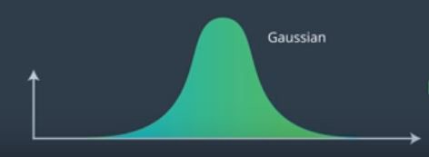
> Gaussian in graph

高斯由两个参数定义，平均值（通常用希腊字母Mu缩写）和高斯的宽度通常称为方差（西格玛平方）。 因此，我们在常见阶段的工作是维持Mu和Sigma正方形，作为对我们要查找的对象位置的最佳估计。
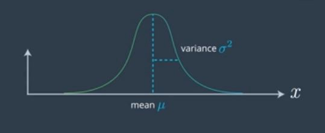
> Graph showing mean & variance

确切的公式是二次函数的指数，此处我们取表达式的指数。 现在，在下面的方程式中，如果x等于Mu，则分子变为0，如果x为0，即1。 事实证明，我们必须通过2 Pi Sigma平方的平方根上的常数1对其进行归一化。
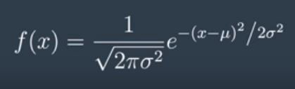
> Gaussian Equation

什么是方差？

方差是高斯分布（即曲线下面积的分布）的量度。 方差越大，高斯越短。 差异也是确定性的度量； 如果您想找到最确定的位置，例如汽车的位置，则需要一个高斯，其均值是汽车的位置，并且不确定性/传播范围最小。
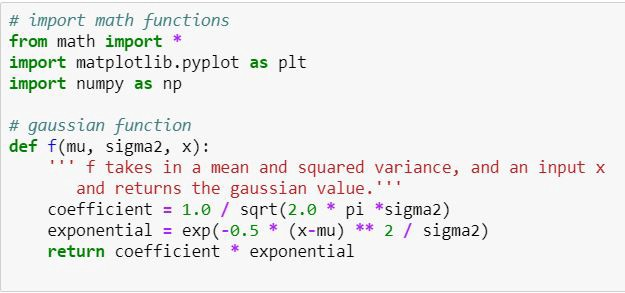
> Gaussian Function Implementation in Code

如何移动均值？

在卡尔曼滤波器中，我们迭代测量（测量更新）和运动（预测）。 并且更新将使用贝叶斯规则，该规则仅是乘积或乘法。 在预测中，我们使用总概率，它是卷积或简单地是加法。
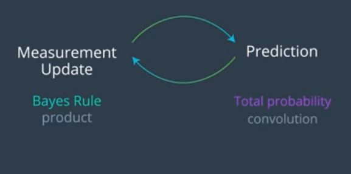
> Measurement update & Prediction cycle

根据Udacity的计算机视觉课程，执行测量周期，然后执行预测周期如下：
+ 假设您正在对另一辆车进行本地化，并且您具有一个如下所示的先前分布； 这是一个非常宽泛的高斯平均值。 这是我们之前的一个例子，我们对位置不确定，但是测量结果告诉我们有关车辆的位置。
+ 最终均值在两个旧均值，先验均值和测量均值之间移动。 在测量方面，它要稍远一些，因为与以前相比，测量可以更加确定车辆的位置。 我们越确定，就越会在确定答案的方向上拉均值。
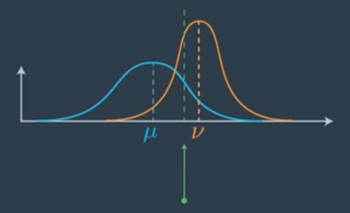
> Localization of the mean (in green)

如何更新参数？
+ 假设我们按照贝叶斯规则将两个高斯乘以一个先验概率和一个测量概率。 先验值具有Mu的平均值和Sigma平方的方差，而度量值具有Nu的平均值和r平方的协方差。
+ 那么，新均值Mu prime是旧均值的加权和。 Mu由r平方加权，Mu由Sigma平方加权，由加权因子之和标准化。 新的方差项将是Sigma平方素数。
+ 显然，先验的高斯不确定性要高得多，因此，Sigma平方更大，这意味着nu的权重比Mu大得多。 因此，均值将比mu更接近nu。 有趣的是，方差项不受实际方法的影响，它仅使用以前的方差。
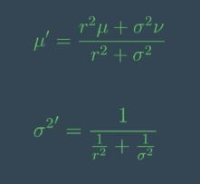
> Update Function

其在代码中的实现如下：
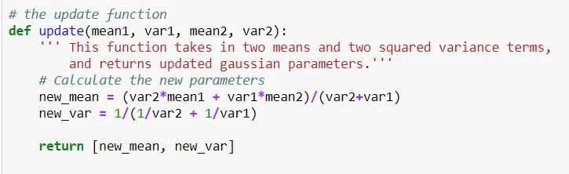

如何实现高斯运动？
+ 新的均值是您的旧均值加上通常称为u的运动。 因此，如果您在x方向上移动了10米，那么它将是10米，并且您知道sigma square是您的旧sigma平方加上运动高斯的方差。 这就是您所需要知道的，仅仅是补充。
+ 预测步骤中得到的高斯仅将这两件事加起来，即mu加u和sigma平方加r平方。
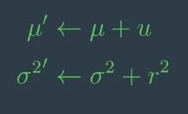
> The motion update/ predict function

它的代码实现如下：

现在，让我们将所有内容放在一起。 让我们编写一个包含这两个功能的主程序，进行更新和预测，并馈入一系列测量和运动。 在示例中，我选择了：5、6、7、9和10的测量值分别为1.，1，，2、1、1、1。

如果初始估计值为5，那么所有这些都将非常有效，但是我们将其设置为0，不确定性为10,000。 假设：测量不确定度为常数4，运动不确定度为常数2。
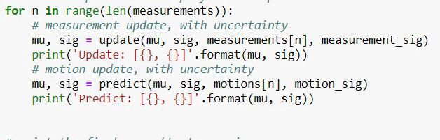

当您运行此命令时，该头寸的第一笔估算值基本上应该变为5–4.99，原因是您的初始不确定性太大，因此该估算值以第一笔测量为主。 您的不确定性减少到3.99，这比测量不确定性要好一些。 然后，您预测将增加1，但不确定性增加到5.99，这是运动不确定性2。根据测量6再次更新，您将获得5.99的估计值，几乎是6。再次移动1。 您测量了7。您移动了2.您测量了9.您移动了1.您测量了10，然后移动了最后一个1。最后得出的结果是，该位置的预测为10.99，即您移动的10个位置 1，不确定性-剩余不确定性4。
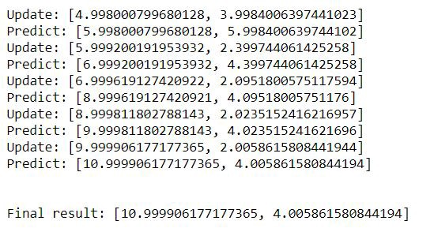
> Output

通过循环遍历x值范围并创建结果高斯值列表来绘制高斯图将导致：
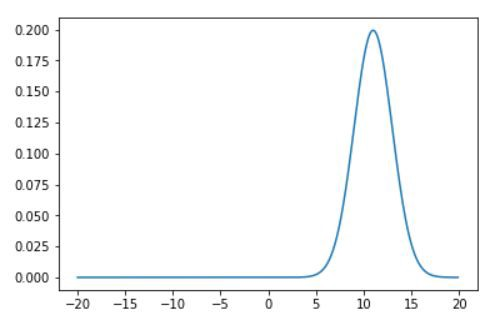
> Graph

想在代码中查看吗？

单击此处：卡尔曼滤波器！
