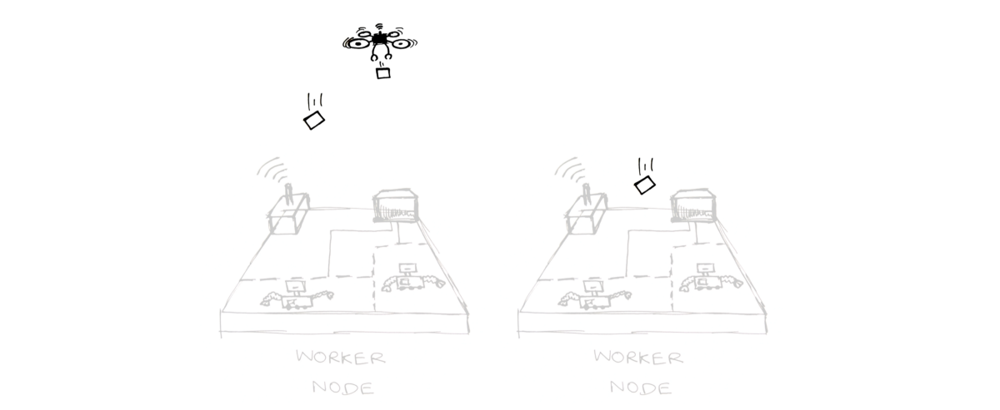

# 了解Kubernetes —以图片方式

最近，我开始了Kubernetes之旅，希望更好地了解其内部。 我在这些方面做了一个演讲，这是它的博客版本
# 容器

在我们尝试了解Kubernetes之前，让我们花一点时间来澄清什么是容器以及它们为什么如此受欢迎。 毕竟，在不知道容器是什么的情况下谈论容器编排器（Kubernetes）毫无意义。

> Container

“容器”是……一个用来存放您放入的所有物品的容器。

像应用程序代码，依赖库以及它的依赖关系一直到内核。 这里的关键概念是隔离。 将所有内容与其余内容隔离开，以便您更好地控制它们。 容器提供三种隔离类型
+ 工作区隔离（流程，网络）
+ 资源隔离（CPU，内存）
+ 文件系统隔离（联合文件系统）

考虑一下像VM一样的容器。 它们精简，快速（启动）且体积小。 而且，所有这些都没有建立起来。 取而代之的是，他们使用linux系统中存在的构造（例如cgroups，名称空间）在其上构建了一个不错的抽象

现在我们知道什么是容器了，很容易理解为什么它们很受欢迎。 不仅可以仅分发应用程序二进制/代码，还可以以实用的方式交付运行应用程序所需的整个环境，因为可以将容器构建为非常小的单元。 解决“在我的机器上工作”问题的完美解决方案
# 什么时候使用Kubernetes？

容器一切都很好，软件开发人员的生活现在要好得多。 那么，为什么我们需要另一项技术，如Kubernetes这样的容器协调器呢？

进入此状态时，需要用到太多容器来管理

问：我的前端容器在哪里，我要在其中运行多少个容器？ 使用容器协调器

问：如何使前端容器与新创建的后端容器对话？答：对IP进行硬编码。 或者，使用容器协调器

问：如何进行滚动升级？答：在每个步骤中手动握住。 或者，使用容器协调器
# 为什么我更喜欢Kubernetes

有多个编排器，例如docker swarm，Mesos和Kubernetes。 我的选择是Kubernetes（因此是本文），因为Kubernetes是……

……就像乐高积木一样。 它不仅具有大规模运行容器协调器所需的组件，而且还具有使用自定义组件灵活地交换不同组件的灵活性。 想要有一个自定义的调度程序，请确保将其插入。需要有一个新的资源类型，编写一个CRD。 此外，社区非常活跃，并且工具迅速发展
# Kubernetes体系结构

每个Kubernetes集群都有两种类型的节点（机器）。 主人和工人。 顾名思义，Master是在工作程序运行有效负载（应用程序）的地方控制和监视群集

群集可以与单个主节点一起使用。 但是最好拥有三个以实现高可用性（称为HA群集）

让我们仔细看一下母版及其组成

etcd：数据库，用于存储有关kubernetes对象，其当前状态，访问信息和其他集群配置信息的所有数据

API服务器：RESTful API服务器，公开端点以操作集群。 主节点和工作节点中的几乎所有组件都与该服务器通信以执行其职责

调度程序：负责决定哪个有效负载需要在哪台机器上运行

控制管理器：这是一个控制循环，它监视群集的状态（通过调用API服务器来获取此数据）并采取措施将其置于预期状态

kubelet：是工作程序节点的心脏。 它与主节点API服务器通信并运行为其节点安排的容器

kube代理：使用IP表/ IPVS处理Pod的网络需求

Pod：运行您所有容器的kubernetes的功劳。 如果没有Pod的抽象，就无法在kubernetes中运行容器。 Pod添加了对容器之间的kuberenetes联网方式至关重要的功能

> Happy pod

一个Pod可以有多个容器，并且在这些容器中运行的所有服务器都可以将彼此视为本地主机。 这使得将应用程序的不同方面分离为单独的容器，并将它们全部作为一个容器加载在一起非常方便。 有不同的吊舱模式，例如挎斗，代理和大使，可以满足不同的需求。 查看本文以了解有关它们的更多信息

Pod联网接口提供了一种将其与同一节点和其他工作程序节点中的其他Pod联网的机制

此外，每个Pod都将分配有自己的IP地址，kube-proxy会使用该IP地址来路由流量。 而且此IP地址仅在群集中可见

所有容器也可以看到安装在容器内的卷，有时这些卷可用于在容器之间进行异步通信。 例如，假设您的应用是照片上传应用（例如instagram），它可以将这些文件保存在一个卷中，而同一容器中的另一个容器可以监视该卷中的新文件，并开始对其进行处理以创建多种尺寸， 将它们上传到云存储
# 控制器

在kubernetes中，有很多控制器，例如ReplicaSet，Replication Controllers，Deployments，StatefulSet和Service。 这些是以一种或另一种方式控制吊舱的对象。 让我们看一些重要的
# 复制集

> ReplicaSet doing what it is good at. Replicating pods

该控制器的主要职责是创建给定Pod的副本。 如果吊舱因某种原因死亡，则会通知该控制器，并立即采取行动以创建新的吊舱
# 部署方式

> Deployment (with a messy hair) trying to control the ReplicaSet

部署是一个高阶对象，它使用ReplicaSet来管理副本。 它通过放大新的ReplicaSet和缩小（最终删除）现有的ReplicaSet来提供滚动升级。
# 服务

> Service represented as a drone delivering data packets to corresponding pods

服务是一个控制器对象，其主要职责是在将“数据包”分发到相应节点时充当负载平衡器。 基本上，它是一种控制器构造，用于在工作节点之间对相似的Pod（通常由Pod标签标识）进行分组。

假设您的“前端”应用程序想与“后端”应用程序通信，则每个应用程序可能有许多正在运行的实例。 您不必担心对每个后端Pod的IP进行硬编码，而是将数据包发送到后端服务，然后由后端服务决定如何进行负载平衡并相应地转发

PS：请注意，服务更像是一个虚拟实体，因为所有数据包路由均由IP表/ IPVS / CNI插件处理。 它只是使它更容易被视为一个真正的实体，让他们脱颖而出以了解其在kubernetes生态系统中的作用
# 入口

> Ingress a floating platform through which all the packets flow into the cluster

入口控制器是与外界联系的单点，可以与集群中运行的所有服务进行对话。 这使我们可以轻松地在单个位置设置安全策略，监控甚至记录日志

P.S：Kubernetes中还有很多其他控制器对象，例如DaemonSets，StatefulSets和Jobs。 还有一些诸如Secrets，ConfigMaps之类的对象，用于存储应用程序的机密和配置。 我将在收到下一篇博客文章时介绍它们。
