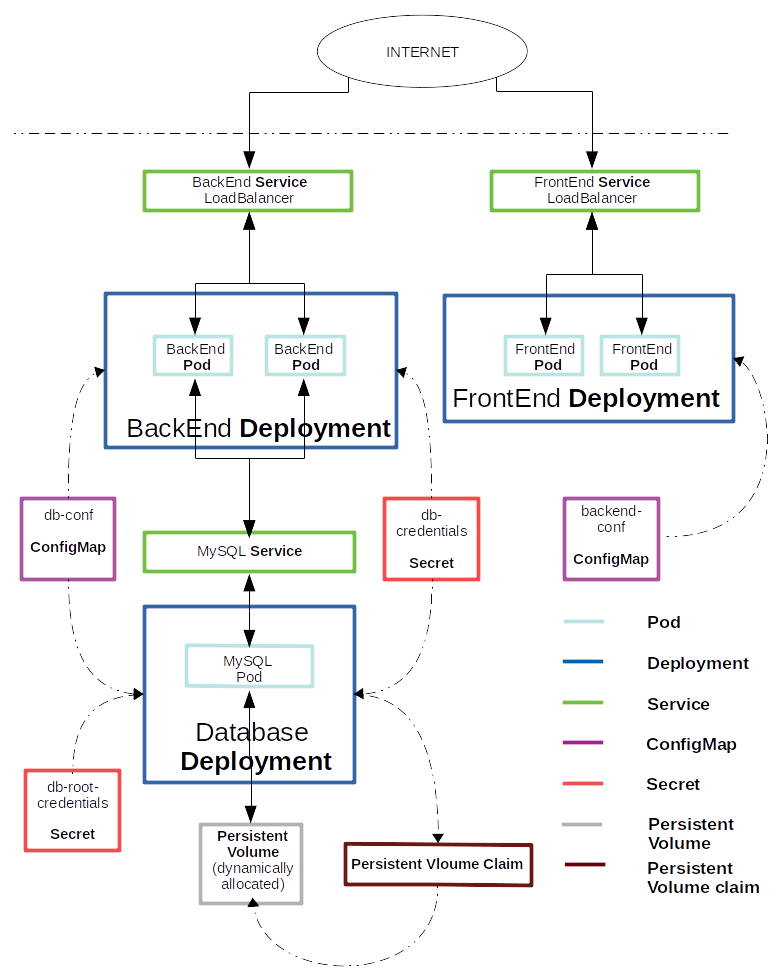
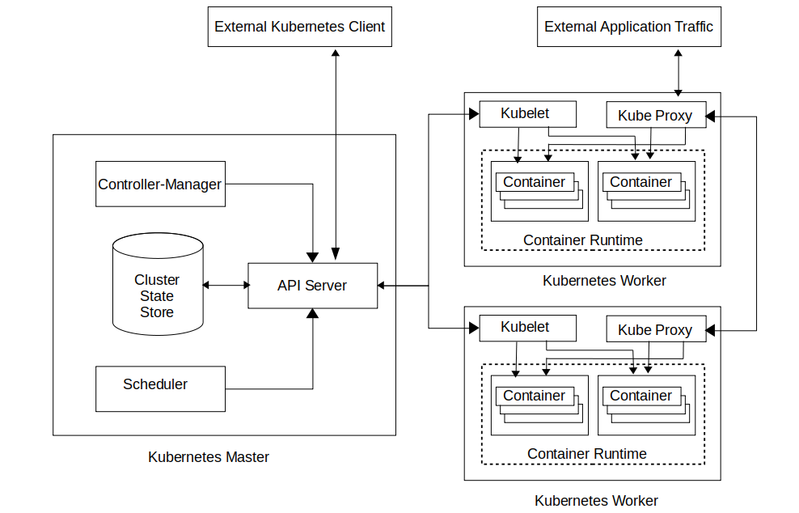
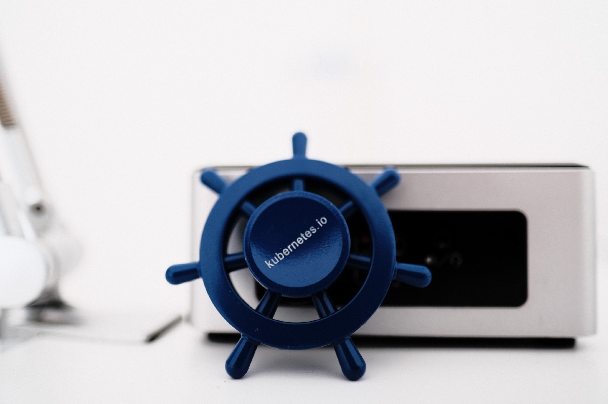

# 如何使用Kubernetes和一个简单示例

现在我们已经了解了Kubernetes的基础知识，我们将详细研究一个简单的示例。 在此示例中，我们将使用Kubernetes部署Web应用程序。 我们将使用Docker作为我们的容器运行时。 我们的示例中的应用程序包含三个不同的部分：
+ 数据库（MySQL服务器）
+ 后端（Java Spring Boot应用程序）
+ 前端（Angular应用）

我们将在Kubernetes集群上部署所有这些组件。 我们将有一个数据库副本，两个后端副本和两个前端副本。 前端实例将通过HTTP与后端进行通信。 后端实例将与数据库通信。 为了促进这种通信，我们必须相应地配置Kubernetes。

我们将通过创建Kubernetes对象来配置集群。 这些Kubernetes对象将包含所需的部署状态。 一旦这些对象被持久保存到集群状态存储中，Kubernetes的内部架构将采取必要的步骤，以确保集群状态存储中的抽象状态与集群的物理状态相同。

我们将使用kubectl创建对象。 Kubernetes支持命令式和声明式创建对象的方式。 生产环境通常通过声明性方法进行配置。 在此示例中，我们将使用声明式方法。 对于每个对象，我们将首先准备一个清单文件，一个yaml文件，其中包含与该对象有关的所有信息。 然后，我们将执行kubectl命令，kubectl apply -f <FILE_NAME>将对象持久保存在集群状态存储中。

我们将首先容器化已实现的应用程序代码。 之后，我们将配置数据库的部署，然后配置后端。 我们将通过配置前端来完成示例。
## 步骤1.将应用程序容器化并将图像上载到容器图像注册表

第一步是为我们已实现的应用程序创建一个容器映像，并将其上传到容器注册表。

容器映像是容器化应用程序的打包形式。 就像任何普通文件一样，它可以在计算机之间传输。 容器运行时环境可以使用容器映像创建容器化应用程序的运行实例。

容器注册表通常是存储容器映像的集中式存储库。 可以将容器映像上载到容器注册表，并在需要时随时随地下载它们。 有许多可用的容器注册表服务：Azure容器注册表，Google容器注册表，Amazon ECR等。在此示例中，我们将使用Docker集线器，但是可以使用适合其用例的任何图像注册表（公共或私有）。

我们将要部署的应用程序的前端通过Angular Framework实现，后端通过Spring Boot Framework实现。 在本文的最后部分，提供了包含代码的GitHub存储库的链接。 一旦按照要求实现了代码，便将使用构建工具（在这种情况下为Angular CLI和Maven）构建可执行文件。

现在，我们将通过使用Dockerfile构建docker镜像来创建容器镜像。 本示例中使用的前端和后端的Dockerfile如下所示。
```
FROM node:7.7-alpine

# install dependencies
ADD package.json /tmp/package.json
RUN cd /tmp && npm install

# Copy dependencies
RUN mkdir -p /opt/to-do-app && cp -a /tmp/node_modules /opt/to-do-app

# Setup workdir
WORKDIR /opt/to-do-app

RUN mkdir /opt/to-do-app/dist
COPY dist /opt/to-do-app/dist
COPY server.js /opt/to-do-app
COPY initialize.js /opt/to-do-app

# run
EXPOSE 8080
CMD ["sh", "-c", "node initialize && node server"]

```
```
FROM openjdk:10-jre-slim
RUN mkdir -p /opt/to-do-app/ 
COPY ./target/to-do-listEntity-app-0.0.1-SNAPSHOT.jar /opt/to-do-app/
WORKDIR /opt/to-do-app/
EXPOSE 8080
CMD ["java", "-jar", "to-do-listEntity-app-0.0.1-SNAPSHOT.jar"]

```

创建容器映像后，我们可以将其上传到任何容器映像注册表。 在这里，我们将这些图像上传到Docker Hub。 我们已上传名称为kubernetesdemo / to-do-app-frontend的前端映像，以及后端名称为kubernetesdemo / to-do-app-backend的后端映像。 我们将从官方的MySQL docker存储库mysql获取数据库映像。 官方Docker映像通常没有任何前缀，例如mysql。 非官方图片必须具有前缀kubernetesdemo / here。

我们必须在Kubernetes清单文件中提及这些图像的名称，我们将在下面看到。 Kubernetes将在需要时在相应的群集节点上获取并运行这些映像。
## 步骤2.设置Kubernetes集群和CLI

有许多解决方案可用于设置Kubernetes集群。 不同的Kubernetes解决方案满足不同的要求：易于维护，安全性，控制，可用资源以及操作和管理集群所需的专业知识。 有关如何设置集群的更多详细信息，请参考官方文档。 此示例已在本地（Minikube）和云提供商（GKE）设置中复制。 Kops是一个旨在简化Kubernetes集群设置过程的项目。

如前所述，我们将使用kubectl作为我们的CLI。 有关安装kubectl的说明，请参见此处。 安装kubectl后，应将其配置为与我们已设置的Kubernetes集群通信。 对于Minikube，minikube start命令将自动配置kubectl。 对于云设置，可以在其各自的快速入门指南（例如：GKE）中找到说明。
## 步骤3.数据库配置设置

后端实例需要与数据库进行通信。 与数据库连接所需的所有配置详细信息都存储在配置文件中。

让我们看一下此示例中的后端spring配置文件
```
spring:
  datasource:
    type: com.zaxxer.hikari.HikariDataSource
    hikari:
      idle-timeout: 10000
    platform: mysql
    username: ${DB_USERNAME}
    password: ${DB_PASSWORD}
    url: jdbc:mysql://${DB_HOST}/${DB_NAME}
  jpa:
    hibernate:
      naming:
        physical-strategy: org.hibernate.boot.model.naming.PhysicalNamingStrategyStandardImpl
```

该配置文件需要一些环境变量，例如DB_USERNAME，DB_PASSWORD，DB_HOST和DB_NAME。 我们将通过configMaps和secret将这些变量的值传递给Kubernetes。 然后，我们将配置后端容器以从configMaps和secrets中读取环境变量。

MySQL数据库docker映像需要一些环境变量。 我们将需要配置以下环境变量MYSQL_ROOT_PASSWORD，MYSQL_USER，MYSQL_PASSWORD，MYSQL_DATABASE。

现在，我们对应用程序所需的配置有了一个想法，我们将在Kubernetes集群中使用所需的数据创建configMaps和密钥。

首先，要保存数据库的特定信息，我们将创建一个configMap和两个秘密。 configMap将包含有关数据库设置的非敏感信息，例如数据库的托管位置和数据库名称。 我们将定义一个Kubernetes服务，这将公开数据库的位置。 Kuberebetes DNS将在运行时将服务名称解析为数据库的实际IP地址。 下面是configMap，在此示例中，它用于存储与数据库有关的非敏感信息
```
# Define 'Configmap' to store non-sensitive database configuration 
apiVersion: v1
kind: ConfigMap
metadata:
  name: db-conf  # name of ConfigMap, referenced in other files
data:
  host: mysql   # host address of mysql server, we are using DNS of Service
  name: to-do-app-db # name of the database for application


```

我们将使用两个秘密来存储敏感数据。 第一个机密将包含数据库根用户凭据，第二个机密将包含应用程序用户凭据。 以下是这两个文件
```
# Define 'Secret' to store 'root' user Credentials
apiVersion: v1
kind: Secret
metadata:
  name: db-root-credentials # Name of the Secret
data:
  password: bWFnaWM= # base64 encoded 'root' password 

```
```
# Define 'Secret' to store db-credentials 
apiVersion: v1
kind: Secret
metadata:
  name: db-credentials # Name of the 'Secret'
data:
  username: dXNlcg==  # base64 encoded 'Secret' username
  password: ZGV2ZWxvcA== # base64 encoded 'Secret' password
```

通过执行kubectl apply -f <FILE_NAME>，我们将在我们的Kubernetes集群状态存储中创建ConfigMap和Secret对象。 我们将主机和名称的值存储在此ConfigMap对象中，并将用户名和密码存储在Secret对象中。 我们将在后续步骤中访问这些秘密和ConfigMap，以配置我们的部署。

同样，前端的配置需要环境变量SERVER_URI，该变量将指示后端的托管位置。 我们将在配置后端部署之后创建此configMap。
## 步骤4.为数据库配置PVC，服务和部署

我们的下一步将是创建数据库设置所需的服务和部署。 以下是为该应用程序中的数据库设置创建相关的Kubernetes服务和Kubernetes部署的文件。
```
# Define a 'Service' To Expose mysql to Other Services
apiVersion: v1
kind: Service
metadata:
  name: mysql  # DNS name 
  labels:
    app: mysql
    tier: database
spec:
  ports:
    - port: 3306
      targetPort: 3306
  selector:       # mysql Pod Should contain same labels
    app: mysql
    tier: database
  clusterIP: None  # We Use DNS, Thus ClusterIP is not relevant
---
# Define a 'Persistent Voulume Claim'(PVC) for Mysql Storage, dynamically provisioned by cluster
apiVersion: v1
kind: PersistentVolumeClaim
metadata:
  name: mysql-pv-claim # name of PVC essential for identifying the storage data 
  labels:
    app: mysql
    tier: database
spec:
  accessModes:
    - ReadWriteOnce
  resources:
    requests:
      storage: 1Gi
---
# Configure 'Deployment' of mysql server
apiVersion: apps/v1
kind: Deployment
metadata:
  name: mysql
  labels:
    app: mysql
    tier: database
spec:
  selector: # mysql Pod Should contain same labels 
    matchLabels:
      app: mysql
      tier: database
  strategy:
    type: Recreate
  template:
    metadata:
      labels: # Must match 'Service' and 'Deployment' selectors
        app: mysql
        tier: database
    spec:
      containers:
      - image: mysql:5.7 # image from docker-hub
        args:
          - "--ignore-db-dir=lost+found" # Workaround for https://github.com/docker-library/mysql/issues/186
        name: mysql 
        env:
        - name: MYSQL_ROOT_PASSWORD # Setting Root Password of mysql From a 'Secret'
          valueFrom:
            secretKeyRef:
              name: db-root-credentials # Name of the 'Secret'
              key: password   # 'key' inside the Secret which contains required 'value'
        - name: MYSQL_USER # Setting USER username on mysql From a 'Secret'
          valueFrom:
            secretKeyRef:
              name: db-credentials
              key: username
        - name: MYSQL_PASSWORD # Setting USER Password on mysql From a 'Secret'
          valueFrom:
            secretKeyRef:
              name: db-credentials
              key: password
        - name: MYSQL_DATABASE # Setting Database Name from a 'ConfigMap'
          valueFrom:
            configMapKeyRef:
              name: db-conf
              key: name
        ports:
        - containerPort: 3306
          name: mysql
        volumeMounts:        # Mounting voulume obtained from Persistent Volume Claim
        - name: mysql-persistent-storage
          mountPath: /var/lib/mysql
      volumes:
      - name: mysql-persistent-storage # Obtaining 'vloume' from PVC
        persistentVolumeClaim:
          claimName: mysql-pv-claim
```

通过此文件，我们创建了多个Kubernetes对象。 首先，我们创建了一个名为mysql的Kubernetes服务，用于访问运行MySQL容器的pod。 接下来，我们创建了一个1 GB的持久卷声明（PVC），这将导致Kubernetes集群为MySQL动态分配所需的持久存储（如果您的集群中未启用，则启用默认动态存储）。 此后，我们创建了一个Deployment对象，它配置了集群中MySQL Server的部署。 使用上一步中创建的configMaps和服务，将诸如MYSQL_ROOT_PASSWORD，MYSQL_USER，MYSQL_PASSWORD和MYSQL_DATABASE之类的环境变量注入到MySQL容器中。
## 步骤5.为后端配置服务和部署

接下来，我们设置后端应用程序部署。 以下是创建所需Kubernetes对象的yaml文件。
```
# Define 'Service' to expose backend application deployment
apiVersion: v1
kind: Service
metadata:
  name: to-do-app-backend  
spec:
  selector:  # backend application pod lables should match these
    app: to-do-app
    tier: backend
  ports:
  - protocol: "TCP"
    port: 80
    targetPort: 8080
  type: LoadBalancer   # use NodePort, if you are not running Kubernetes on cloud
---
# Configure 'Deployment' of backend application
apiVersion: apps/v1
kind: Deployment
metadata:
  name: to-do-app-backend
  labels: 
    app: to-do-app
    tier: backend
spec:
  replicas: 2    # Number of replicas of back-end application to be deployed
  selector:
    matchLabels: # backend application pod labels should match these
      app: to-do-app
      tier: backend
  template:
    metadata:
      labels: # Must macth 'Service' and 'Deployment' labels
        app: to-do-app
        tier: backend  
    spec:                 
      containers: 
      - name: to-do-app-backend 
        image: kubernetesdemo/to-do-app-backend   # docker image of backend application
        env:   # Setting Enviornmental Variables
          - name: DB_HOST   # Setting Database host address from configMap
            valueFrom: 
              configMapKeyRef:
                name: db-conf  # name of configMap
                key: host
          - name: DB_NAME  # Setting Database name from configMap
            valueFrom:
              configMapKeyRef:
                name: db-conf 
                key: name
          - name: DB_USERNAME  # Setting Database username from Secret
            valueFrom:
              secretKeyRef:
                name: db-credentials # Secret Name
                key: username
          - name: DB_PASSWORD # Setting Database password from Secret
            valueFrom:
              secretKeyRef:
                name: db-credentials
                key: password     
        ports:
        - containerPort: 8080
```

在这里，我们首先创建了一个类型为LoadBalancer的服务（如果您在本地运行Kubernetes，则使用NodePort），该服务公开了后端实例。 Loadbalancer类型提供了一个External-IP，通过它可以从外部访问后端服务。 （如果您使用的是minikube，请在端口上使用minikube ip）。 接下来，我们创建了Deployment对象，该对象配置为包含后端实例的两个副本。 然后从前面创建的configMap和秘密中注入所需的环境变量。 此部署将使用我们在第一步中创建的映像kubernetesdemo / to-do-app-backend。
## 步骤6.前端配置设置

前端希望在上述步骤中生成的后端的External-IP值以环境变量SERVER_URI的形式传递。 现在，我们将创建一个配置映射来存储与后端设置有关的信息。
```
# ConfigMap to expose configuration related to backend application
apiVersion: v1
kind: ConfigMap
metadata:
  name: backend-conf # name of configMap
data:
  server-uri: 34.66.207.42 # enternal ip of backend application 'Service'

```

在下一步中，我们将在配置前端部署时使用此configMap注入SERVER_URI值。
## 步骤7.为前端配置服务和部署

接下来，我们设置前端应用程序部署。 以下是创建所需Kubernetes对象的yaml文件。
```
# Define 'Service' to expose FrontEnd Application
apiVersion: v1
kind: Service
metadata:
  name: to-do-app-frontend
spec:
  selector: # pod labels should match these
    app: to-do-app
    tier: frontend
  ports:
  - protocol: "TCP"
    port: 80
    targetPort: 8080
  type: LoadBalancer # use NodePort if you are not running Kubernetes on Cloud
---
# 'Deployment' to manage of configuration of frontEnd Deployment
apiVersion: apps/v1
kind: Deployment
metadata:
  name: to-do-app-frontend
  labels: # pod labels should match these
    app: to-do-app
    tier: frontend
spec:
  replicas: 2  # number of replicas of frontEnd application
  selector:
    matchLabels: 
      app: to-do-app
      tier: frontend
  template:
    metadata:
      labels: # Must match 'Service' and 'Deployment' labels
        app: to-do-app
        tier: frontend  
    spec:                 
      containers: 
      - name: to-do-app-frontend 
        image: kubernetesdemo/to-do-app-frontend # docker image of frontend application
        env: # Setting Environmental Variables
          -  name: SERVER_URI # Setting Backend URI from configMap
             valueFrom:
               configMapKeyRef:
                 name: backend-conf # Name of configMap
                 key: server-uri
        ports:
        - containerPort: 8080
```

在这里，我们首先创建了一个类型为LoadBalancer的服务（如果您在本地运行Kubernetes，则使用NodePort），该服务公开了前端实例。 负载平衡器类型提供了一个External-IP，通过它可以从外部访问前端服务。 （如果您使用的是minikube，请在端口上使用minikube ip）。 接下来，我们创建了Deployment对象，该对象配置为包含前端实例的两个副本。 此部署将使用我们在第一步中创建的映像kubernetesdemo / to-do-app-frontend。 此后，我们从在上面的设置中创建的configMap注入了环境变量SERVER_URI。

而已。 我们的简单应用程序现已完全部署。 之后，应该可以通过任何浏览器使用前端服务External-IP访问应用程序的前端。 Angular应用程序将通过HTTP调用后端，并且后端将与MySQL数据库进行通信，我们的应用程序数据将保留在该数据库中。 下图显示了此示例中描述的总体设置

> High-Level View of To-Do-App Deployment Setup on Kubernetes


现在，整个部署由Kubernetes管理。 如果某个吊舱因未知原因而掉落，Kubernetes将在没有任何手动干预的情况下启动新吊舱。 使用kubectl，我们可以在需要时监视和更新此部署。
# 外部链接
+ 可以在此处找到包含用于本文讨论的Kubernetes Cluster的部署和配置的清单文件的GitHub存储库。
+ 包含本文讨论的后端实现的GitHub存储库可在此处找到。
+ 包含本文讨论的前端实现的GitHub存储库可在此处找到。
# Kubernetes对象

Kubernetes定义了大量抽象对象。 为简便起见，我们将只讨论对于理解我们的示例绝对必要的Kubernetes对象。
+ Pod：我们知道，通过Kubernetes，我们可以运行容器化的应用程序。 Kubernetes并没有将单个容器抽象为Kubernetes对象，而是定义了pod，pod是一组一个或多个容器。 此选择具有一个优势。 对于更简单的情况，系统中的每个吊舱可以代表一个容器。 但是，只要需要部署与容器的核心业务功能不直接相关的其他功能（例如对日志记录，缓存等的支持），我们都可以选择将这些其他功能打包到单独的容器中并将其放入 一个豆荚。 这样可以确保他们始终保持逻辑上的在一起。 Pod是可以在Kubernetes中创建和管理的最小的可部署计算单元。 这是最终用户实现的实际应用程序代码运行的地方。 每个Pod都有自己的IP地址，并且与主机完全分离。
+ 服务：在Kubernetes中，豆荚是易变的。为了确保高可用性和优化使用计算资源，Kubernetes可以动态终止并创建Pod。因此，容器的IP地址不是访问容器提供的业务功能的可靠方法。相反，Kubernetes建议使用服务来访问业务功能。 Kubernetes服务是一种抽象，定义了一组逻辑上的Pod和访问它们的策略。每个Kubernetes服务都有一个IP地址，但是与pod的IP地址不同，它是稳定的。 Kubernetes服务持续跟踪系统中的所有Pod，并识别预期要定位的Pod。每当访问特定业务功能的请求到达服务时，它将把请求重定向到该时间点在系统中处于活动状态的Pod之一的IP地址。理想情况下，要从集群外部访问Pod，必须使用Ingress。但是，到目前为止，Kubernetes Ingress功能仍为beta。因此，在此示例中，我们还将使用服务在外部公开流量。
+ 持久卷和持久卷声明：管理存储与管理计算是一个明显的问题。 Kubernetes定义了两个关键抽象来处理此问题，即持久卷和持久卷Claim。 在Kubernetes中，持久卷是集群中的一块存储，已被调配以供集群用于其存储需求。 持久卷声明是应用程序请求使用通过持久卷声明的抽象存储资源的请求。 为了使持久性存储可用于Kubernetes中运行的应用程序，应首先声明持久性卷，然后配置该应用程序以声明使用该卷。
+ ConfigMap：Configmap是Kubernetes的抽象概念，旨在使与环境相关的应用程序配置数据与容器化应用程序脱钩，从而使它们在整个环境中保持可移植性。
+ 机密：机密是包含少量敏感数据（例如密码，令牌或密钥）的对象。 将此类敏感信息保密后，可以更好地控制其使用方式，并降低意外暴露的风险。
+ 部署：部署是一种抽象，旨在表示Kubernetes上实际部署的所需状态。 部署对象通常包含所有必需的信息-获取和构建容器化应用程序的位置，预期用于打包和运行这些容器的Pod的配置，应维护的每个Pod的副本数，就以下方面而言应用程序配置的位置： 容器要使用的配置映射和机密，数据存储的配置（如果应用程序需要持久性数据存储）。 所有这些都可以在部署中声明。 尽管可以在Kubernetes中创建单独的Pod和服务，但是建议使用一种部署来管理部署。 通过使用部署对象，可以大大简化诸如转出，回滚和监视之类的典型操作。
# Kubernetes背后的设计原理和架构

Kubernetes的设计遵循一组设计原则。 为了更好地理解Kubernetes为何以这种方式构建，应该熟悉这些原理。 因此，让我们在这里开始讨论。
## Kubernetes的设计原理
+ 可移植性：Kubernetes可以在任何地方运行。 Kubernetes在各种环境-公共云，私有云，本地或个人笔记本电脑中以一致的行为运行。 Kubernetes上部署的应用程序可以轻松地跨不同环境移植。
+ 通用：Kubernetes对可以通过它部署什么类型的应用程序没有任何限制。 尽管它专注于微服务和云原生应用程序的部署和管理，但是可以通过Kubernetes部署任何类型的工作负载（批处理作业，无状态或有状态服务，遗留的整体式单实例应用程序）。 可以用任何语言或框架编写应用程序而没有任何限制。
+ 灵活：Kubernetes允许将其功能的许多部分替换为自定义的内置解决方案。 这样就可以在必要时与Kubernetes一起使用专门的解决方案。 为了确保这种灵活性，Kubernetes构建为可插入组件和层的集合。
+ 可扩展：Kubernetes可以在必要时促进添加专用功能。 这可以通过公开接口来实现，可以将其实现以在现有功能之上添加新功能。 这允许为Kubernetes开发许多附加组件。
+ 自动化：Kubernetes旨在减轻手动操作的负担。 配置完成后，通过Kubernetes部署的应用程序将可以扩展和自我修复，而无需任何手动干预。 Kubernetes可以与持续集成（CI）管道集成在一起，从而允许开发人员提交的代码更改自动部署到测试环境中。

这些原则中的每一项都为使用Kubernetes的最终用户带来了巨大的价值。 可移植性允许在各种环境（例如测试和生产）上对应用程序进行可靠的测试，并防止被单一的云提供商或供应商锁定。

通用目的使开发人员可以自由选择满足业务功能所需的确切开发工具和框架，而不必担心基础结构或部署。

灵活性和可扩展性允许在内置功能不足的地方添加自定义功能。

自动化确保将维护大规模应用程序所需的手动工作保持在最低限度。 这允许相对较小的团队成功维护部署在云上的大规模分布式应用程序。

现在让我们讨论Kubernetes架构，该架构是在考虑这些原则的基础上开发的
## Kubernetes的架构

高级Kubernetes由主系统和工作人员组成。 主系统控制工作程序并在其上运行应用程序。 群集的所需状态（计算资源）表示为抽象对象。 这些抽象的Kubernetes对象是意图的记录。 Kubernetes将不断努力以确保这些抽象对象中表示的状态是集群的实际物理状态。 外部客户端可以连接到主服务器，并获取有关群集状态的信息，并发出命令以根据需要对其进行更改。

每当有人希望更新集群的物理状态时，他们所要做的就是更新抽象的Kubernetes对象，而Kubernetes将负责其余的工作。 让我们深入探讨一下，简要讨论主系统和工作人员的组件。
## Kubernetes Master的组件

Kubernetes主系统（也称为控制窗格）被设计为一组组件。 让我们简要讨论一下它的关键组成部分。
+ API服务器：Kubernetes大多使用REST API进行内部和外部通信。 所有抽象的Kubernetes对象都作为REST资源公开。 API服务器是负责处理REST请求，对其进行验证并在相应的抽象Kubernetes对象上执行适当的CRUD操作的组件。
+ 群集状态存储：要执行CRUD操作，API服务器将需要一个后备数据存储。 顾名思义，集群状态存储是一个持久性存储实例，用于存储系统中配置的所有抽象Kubernetes对象的状态。 群集状态存储支持监视功能。 通过此功能，每当对对象进行更改时，所有协调组件都可以快速得到通知。
+ 控制器管理器：这是运行控制器的主机的组件。 控制器运行循环并监视实际的群集状态和抽象Kubernetes对象中表示的状态。 每当通知集群状态更改时，它们负责执行必要的操作，以使实际状态和抽象状态相互一致。 Kubernetes有许多控制器，每个控制器负责一组不同的Kubernetes对象。
+ 调度程序：调度程序是主机的组件，负责在群集上分配物理资源以运行添加到抽象数据存储中的应用程序/作业。 这些调度决策是在考虑到诸如硬件/软件约束之类的众多因素之后做出的。

Kubernetes主系统可以对每个组件具有多个副本以确保高可用性，并且可以与工作节点组件一起部署在单个物理实例上。 但是，为简单起见，安装脚本通常在同一台计算机上启动所有主组件，并且不在该计算机上运行任何辅助实例。

确切的群集设置取决于最终用户的要求。 对于较小的应用程序，具有主组件和辅助组件的单个实例绰绰有余。 对于大型应用程序，自定义工作对于配置Kubernetes集群至关重要。
## Kubernetes worker的组成部分

工作程序实例或节点也由多个组件组成。 Kubernetes worker组件的主要功能是处理来自master的指令并在节点上执行它们。 以下是工作程序节点的关键组件：
+ Kubelet：它是工作程序的组件，负责确保由主服务器在此节点上调度的容器正在运行并且状态良好。
+ 容器运行时：容器运行时是负责运行容器的软件。 Kubernetes支持多个运行时以及Kubernetes CRI的任何实现。 每个工作节点都使用它来运行由主节点调度的容器化应用程序。 不鼓励运行非容器化的应用程序，Kubernetes不支持这种应用程序。
+ Kube代理：它是Worker的组件，负责维护Worker上的网络规则并执行连接转发。 这从根本上实现了整个集群之间的高效通信。 外部应用程序流量将通过这些组件重定向到适当的容器。
## 外部Kubernetes客户端

从理论上讲，外部Kubernetes客户端可以是可以通过定义良好的REST API与API服务器通信的任何应用程序。 但是最主要的选择是使用Kubectl。

Kubectl是一个命令行工具，供负责管理应用程序部署的最终用户使用。 Kubectl用户可以在终端上执行命令。 这些命令中的每一个都会在后台转换为API调用，并发送到Kubernetes主服务器上的API服务器，在此将执行必要的操作。

> High-Level Kubernetes Architecture


让我们退后一步，看看Kubernetes的总体架构。 可能会注意到，它是作为一组松散耦合的组件一起工作而设计的，而不是由单个整体实例负责所有功能。 我们已经讨论了这种建筑风格的各种优点。 特别是，这种选择可使Kubernetes保持灵活性和可扩展性。

选择使用rest来创建和更新集群配置可确保在一个环境中创建的任何配置都可在任何其他环境中使用。 这使在Kubernetes上创建的应用程序部署保持可移植性。

控制器管理器和调度程序充当持续监视集群状态存储中抽象对象更改的组件。 它们在必要时将指令发送到工作节点，以自动更新集群的实际状态。这种设计选择省去了大量的人工工作，并确保Kubernetes具有自主性。 实际上，这种声明式的集群管理方法是导致Kubernetes迅速被采用的主要特征之一。

通过通过与接口与容器运行时交互来选择仅运行容器化应用程序的选择，可以确保任何类型的应用程序都可以在Kubernetes上运行，并使Kubernetes保持通用。

现在，我们可以研究用于表示和管理Kubernetes中集群状态的抽象对象。 了解这些Kubernetes对象是我们深入研究示例之前需要理解的最后一个难题
# Kubernetes：部署有状态应用程序的详细示例
## 这是两部分系列的第二部分

> Photo by Ihor Dvoretskyi on Unsplash


在本系列的第一部分中，我们讨论了：
+ 什么是Kubernetes？
+ 它旨在解决什么问题？
+ 什么时候应该选择使用Kubernetes？ 有哪些替代选择？

在这一部分中，我们将探索
+ Kubernetes的设计原理和架构是什么？
+ 如何使用Kubernetes，还有一个简单的示例。

要理解描述如何在Kubernetes上部署应用程序的示例，首先应该对Kubernetes的体系结构和对象有一个初步的了解。 因此，我们将首先概述Kubernetes的设计原理和体系结构，然后简要说明相关的Kubernetes对象，最后是示例本身。
```
本文翻译自Srikanth Koraveni的文章《Kubernetes: A Detailed Example of Deployment of a Stateful Application》，参考：https://medium.com/better-programming/kubernetes-a-detailed-example-of-deployment-of-a-stateful-application-de3de33c8632
```
