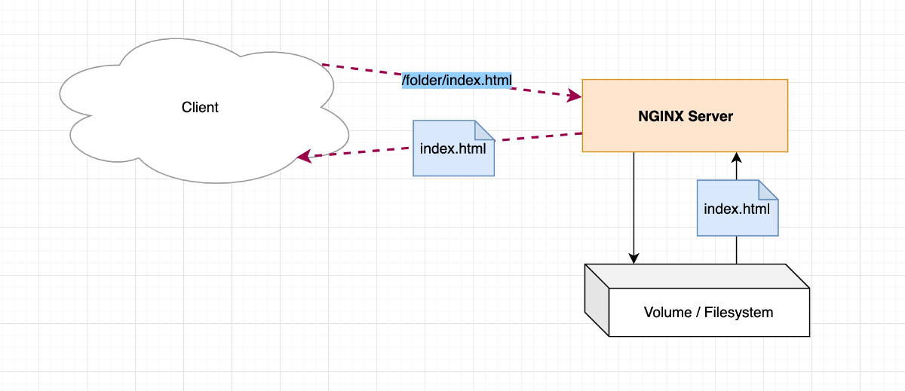
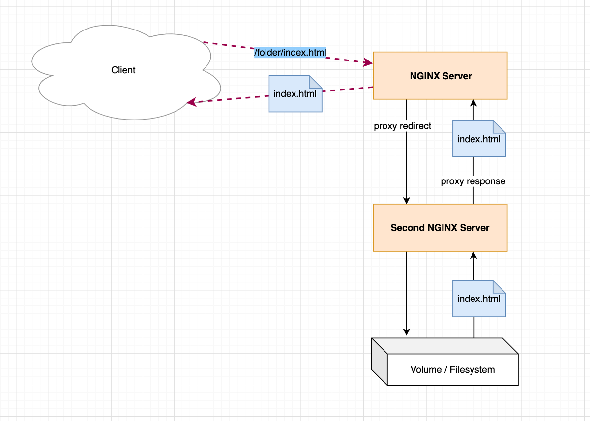
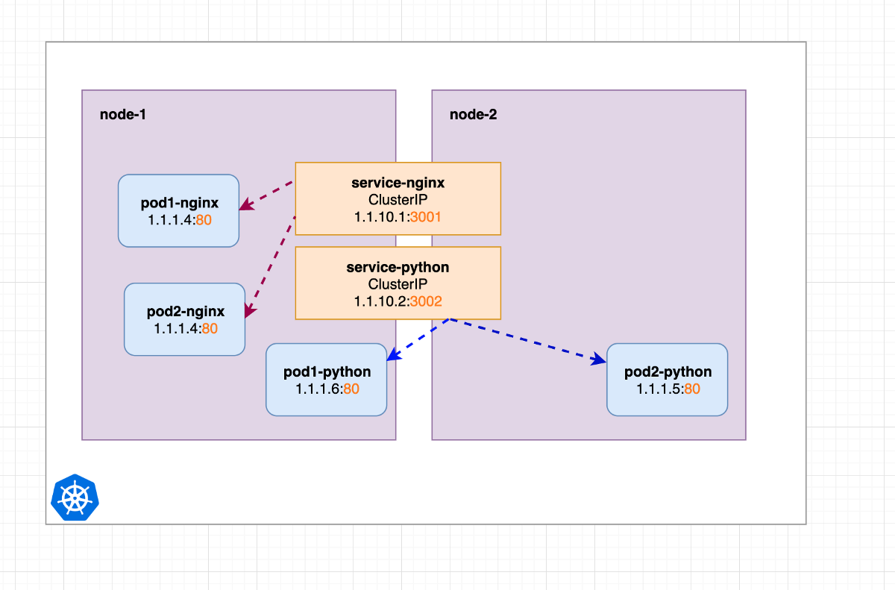
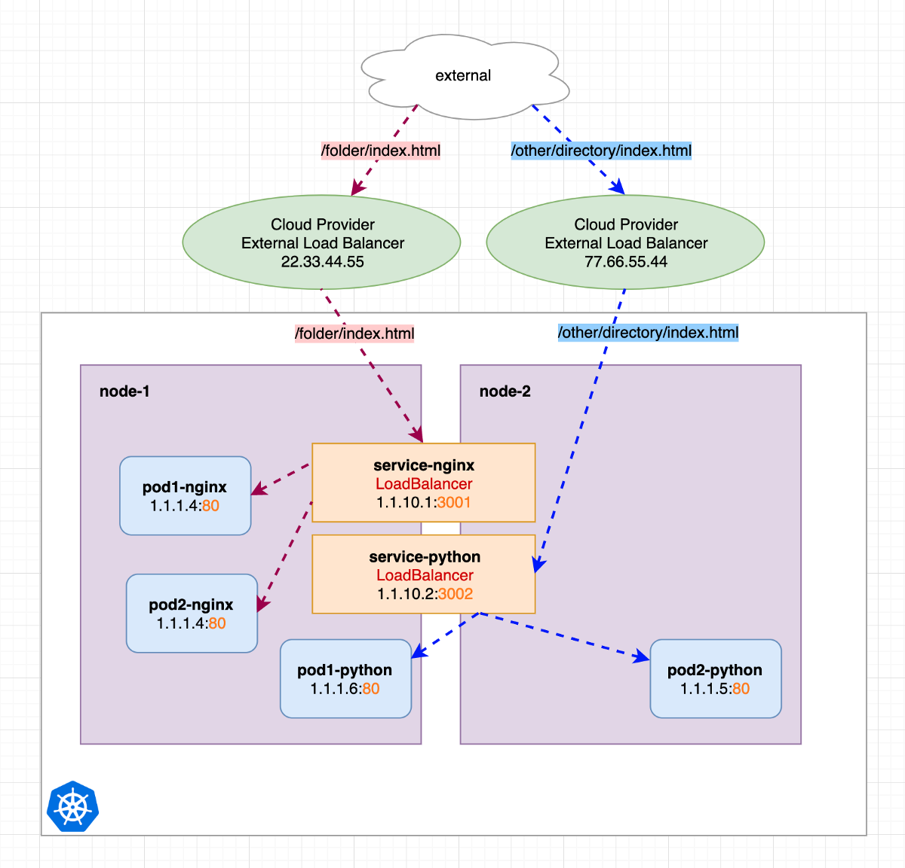
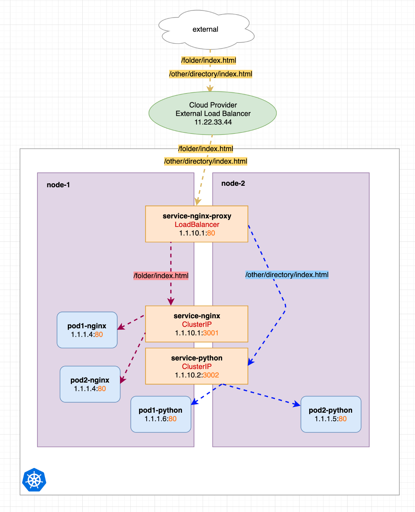
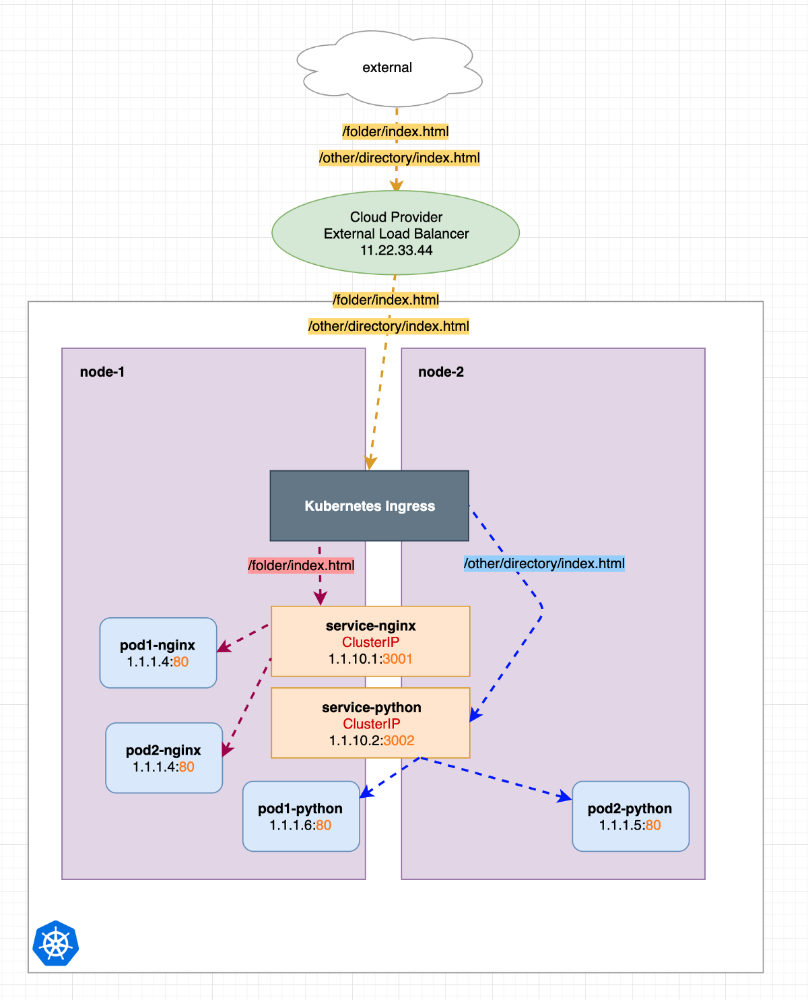
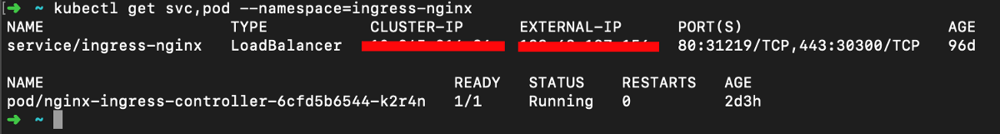
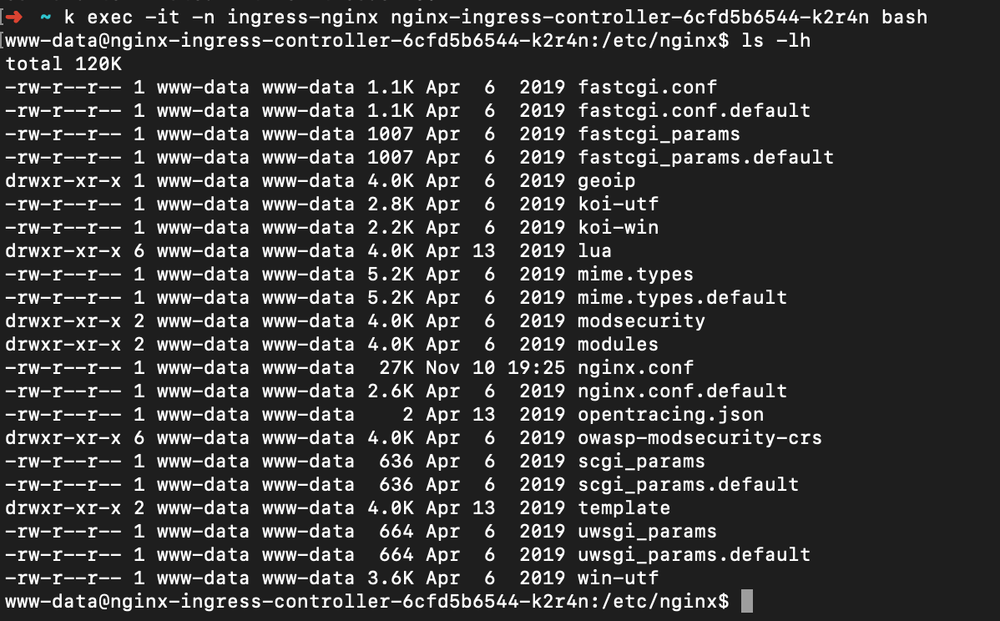
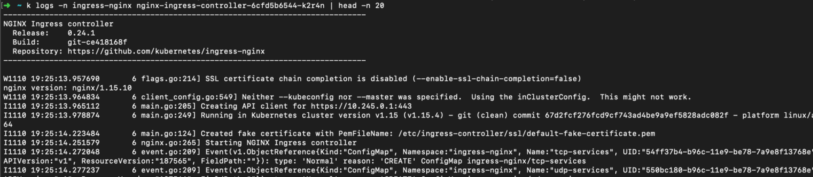

# Kubernetes Ingress只需直观地说明


确保您了解第1部分中的Kubernetes服务：
+ 第1部分：Kubernetes服务在视觉上简单地说明
+ 第2部分：本文
# TL; DR

Kubernetes Ingress不是Kubernetes服务。 非常简化的只是一个Nginx Pod，它将请求重定向到其他内部（ClusterIP）服务。 该Pod本身可以通过Kubernetes服务（通常是LoadBalancer）来访问。
# 你甚至应该读这个吗？

首先，我希望我能为您提供这个神秘的Kubernetes Ingress背后的内容的简单明了的概述，然后使您更容易理解您实际上正在实施的内容或什至应该这样做。

稍后，我将基于本文中使用的示例展示一些示例配置。
# 为什么要使用Ingress？

您可以使用它来从群集外部访问内部服务。 它省去了宝贵的静态IP，因为您无需声明多个LoadBalancer服务。 而且，如我们所见，它还允许进行更多的配置和更容易的设置。
# 我们在这里做什么？
+ 首先，我们对HTTP服务器（尤其是Nginx）如何工作以及它们可以做什么进行了非常简短的考察。
+ 然后，我们将说明如何手动设置Ingress，从而完全不用花哨的Kubernetes Ingress资源。
+ 接下来，我们将看到Kubernetes Ingress只是预配置的Nginx服务器。

听起来令人困惑？ 只要在这里跟随我。
# 简要了解简单HTTP服务器的世界

在这里，我们回到容器，Kubernetes和现代云世界之前的时代。 和我在一起，时间会很短。
## （Nginx）HTTP服务器可以做什么？

它可以通过HTTP协议接收针对特定文件路径的请求，检查附加文件系统上的文件路径，如果该文件存在，则将其返回：


在Nginx中，例如可以通过以下方式完成此操作：
```
location /folder {    root /var/www/;    index index.html;}
```
## （Nginx）HTTP服务器还能做什么？

它可以接收对特定文件路径的请求，将该请求重定向到另一台服务器（这意味着它充当代理），然后将该服务器的响应重定向回客户端。 对于客户端，没有任何变化，接收到的结果仍然是请求的文件（如果存在）。


我们不会深入探讨这一点，但是在Nginx中，例如可以将代理重定向配置为：
```
location /folder {    proxy_pass http://second-nginx-server:8000;}
```

这意味着Nginx可以充当代理来从文件系统提供文件或将响应重定向到其他服务器并返回其响应。
# 一个简单的Kubernetes示例：
## 使用ClusterIP服务

同样，从这一点开始，您应该了解Kubernetes Services。 我们有两个工作节点，这里我们忽略主节点。 我们有两个服务service-nginx和service-python指向不同的容器。

服务不是在任何特定的节点上调度的，只能说它们“在群集中的任何地方都可用”。


您应该了解这里发生了什么。 在我们集群的内部，我们可以通过它们的服务访问Nginx pod和Python pod。 接下来，我们还要从集群外部提供这些资源。 因此，我们将它们转换为LoadBalancer服务：
## 使用LoadBalancer服务

您可以看到我们将ClusterIP服务转换为LoadBalancer服务。 因为我们的Kubernetes集群托管有可以处理此问题的云提供商（Gcloud，AWS，DigitalOcean…），所以它创建了两个外部负载均衡器，可将请求重定向到我们的外部节点IP，再将其重定向到内部ClusterIP服务。


我们看到两个LoadBalancers，每个都有自己的IP。 如果我们向LoadBalancer 22.33.44.55发送请求，它将被重定向到我们的内部服务nginx。 如果我们将请求发送到77.66.55.44，它将被重定向到内部服务python。

这很棒！ 但是IP地址很少，LoadBalancer的定价取决于云提供商。 现在想象一下，我们要创建LoadBalancers的不仅仅是内部服务，而是更多的内部服务，成本将会增加。

可能会有另一种解决方案，使我们仅使用一个LoadBalancer（具有一个IP），但仍可以直接访问我们的两个内部服务吗？ 首先，我们通过实施手动（非Kubernetes）方法来对此进行探讨。
## 手动将Nginx服务配置为代理

如前所述，Nginx可以充当代理。 在下图中，我们看到一个名为service-nginx-proxy的新服务，它实际上是我们唯一的LoadBalancer服务。 service-nginx-proxy仍将指向一个或多个Nginx-pod端点，但是为简单起见，我未在图形中包括该端点。 之前的其他两项服务将转换回简单的ClusterIP服务：


我们可以看到，我们只打了一个LoadBalancer（11.22.33.44），但是使用了不同的http URL，这些请求以黄色显示为相同的目标，并且只包含不同的内容（请求url）。

服务service-nginx-proxy根据所传递的URL决定（通过使用Nginx代理传递和位置），他应将请求重定向到哪个服务。

在这种情况下，我们有两个选择，红色和蓝色。 红色重定向到service-nginx，蓝色重定向到service-python。
```
# very simplified Nginx config examplelocation /folder {    proxy_pass http://service-nginx:3001;}location /other {    proxy_pass http://service-python:3002;}
```

当前，我们需要手动配置service-nginx-proxy。 就像创建指向我们的ClusterIP服务的正确的Nginx配置文件一样。 这是一个可能的，可行的且通用的解决方案。

并且由于这是/是常见的解决方案，因此创建了Kubernetes Ingress以使配置更容易且更易于管理。

从这一点开始，您应该了解图像中显示的上述示例的优势。 如果您不愿意，请随时在下面添加评论以进行讨论。
# 在我们的示例中使用Kubernetes Ingress

将以下图像与上一张图像进行比较。 真的没多大变化。 我们只使用了预先配置的Nginx（Kubernetes Ingress），它已经为我们完成了所有代理重定向，从而节省了很多手动配置工作：


这就是了解Kubernetes Ingress是什么的全部。 现在，让我们转到一些示例配置。
# 安装Kubernetes入口控制器

Kubernetes Ingress是额外的Kubernetes资源，可以通过以下方式安装：
```
kubectl apply -f https://raw.githubusercontent.com/kubernetes/ingress-nginx/nginx-0.24.1/deploy/mandatory.yamlkubectl apply -f https://raw.githubusercontent.com/kubernetes/ingress-nginx/nginx-0.24.1/deploy/provider/cloud-generic.yaml
```

使用以下命令，您将看到k8s资源已安装在名称空间ingress-nginx中：
```
kubectl get svc,pod --namespace=ingress-nginx
```


您会看到带有外部IP和附属Pod的常规LoadBalancer服务。 您甚至可以将kubectl exec放入该pod中，以查看其中包含预先配置的Nginx服务器：


在nginx.conf中，您会看到各种代理重定向设置和其他相关配置。
# 示例Kubernetes入口配置

我们一直在使用的示例Ingress yaml可能如下所示：
```
# just example, not testedapiVersion: networking.k8s.io/v1beta1kind: Ingressmetadata:  annotations:    kubernetes.io/ingress.class: nginx  namespace: default  name: test-ingressspec:  rules:  - http:      paths:      - path: /folder        backend:          serviceName: service-nginx          servicePort: 3001  - http:      paths:      - path: /other        backend:          serviceName: service-python          servicePort: 3002
```

我们需要像通过kubectl create -f ingress.yaml来创建其他任何资源一样的yaml。 然后，该Yaml将由先前安装的Ingress Controller转换为Nginx配置。
# 示例Kubernetes入口/不同的命名空间

现在，如果Ingress应该重定向到的内部服务之一在另一个名称空间中，该怎么办？ 因为您定义的入口资源是命名空间。 在Ingress配置中，您只能重定向到相同名称空间中的服务。

如果定义了多个Ingress yaml配置，则这些配置将由一个Ingress Controller合并到一个Nginx配置中。 含义：所有人也都使用相同的LoadBalancer IP。

因此，我们考虑将service-nginx设置为默认名称空间：
```
# just example, not testedapiVersion: networking.k8s.io/v1beta1kind: Ingressmetadata:  annotations:    kubernetes.io/ingress.class: nginx  namespace: default  name: ingress1spec:  rules:  - http:      paths:      - path: /folder        backend:          serviceName: service-nginx          servicePort: 3001
```

然后service-python在命名空间namespace2中：
```
# just example, not testedapiVersion: networking.k8s.io/v1beta1kind: Ingressmetadata:  annotations:    kubernetes.io/ingress.class: nginx  namespace: namespace2  name: ingress2spec:  rules:  - http:      paths:      - path: /other        backend:          serviceName: service-python          servicePort: 3002
```

因此，我们创建了两个Ingress yaml资源。
# 如何微调Ingress Nginx配置？

您可以通过Inhgress Kubernetes资源上的注释来做到这一点。 例如，您可以配置通常可以直接在Nginx中配置的各种选项：
```
kind: Ingressmetadata:  name: ingress  annotations:      kubernetes.io/ingress.class: nginx      nginx.ingress.kubernetes.io/proxy-connect-timeout: '30'      nginx.ingress.kubernetes.io/proxy-send-timeout: '500'      nginx.ingress.kubernetes.io/proxy-read-timeout: '500'      nginx.ingress.kubernetes.io/send-timeout: "500"      nginx.ingress.kubernetes.io/enable-cors: "true"      nginx.ingress.kubernetes.io/cors-allow-methods: "*"      nginx.ingress.kubernetes.io/cors-allow-origin: "*"...
```

您甚至可以执行非常具体的规则，例如：
```
nginx.ingress.kubernetes.io/configuration-snippet: |  if ($host = 'www.wuestkamp.com' ) {    rewrite ^ https://wuestkamp.com$request_uri permanent;  }
```

使用www。 是“ so 2008”！

然后，这些注释将转换为Nginx配置。 您始终可以通过手动将（kubectl exec）连接到Ingress Nginx pod并查看配置来进行检查。

有各种配置示例：

https://github.com/kubernetes/ingress-nginx/tree/master/docs/user-guide/nginx-configuration

https://github.com/kubernetes/ingress-nginx/blob/master/docs/user-guide/nginx-configuration/annotations.md#lua-resty-waf
# 检查入口/ Nginx日志

找出问题或错误，查看Ingress日志也很有帮助：
```
kubectl logs -n ingress-nginx ingress-nginx-controller-6cfd5b6544-k2r4n
```

# 使用Curl测试设置

如果要测试您的Ingress / Nginx重定向规则，则最好使用curl -v yourhost.com而不是浏览器，以避免缓存等。
# 重定向方式/入口规则

在本文的示例中，我们使用了/ folder或/ other / directory之类的路径来重定向到其他服务。 这称为“路径列表”。

还可以通过请求的主机名来区分请求，例如将api.myurl.com和website.myurl.com重定向到其他内部ClusterIP服务。 可能看起来像这样：
```
apiVersion: networking.k8s.io/v1beta1kind: Ingressmetadata:  name: simple-fanout-examplespec:  rules:  - host: api.myurl.com    http:      paths:      - path: /foo        backend:          serviceName: service1          servicePort: 4200      - path: /bar        backend:          serviceName: service2          servicePort: 8080  - host: website.myurl.com    http:      paths:      - path: /        backend:          serviceName: service3          servicePort: 3333
```

在此示例中，我们看到对于特定的主机名，我们将不同的http路径重定向到不同的内部服务。
# SSL / HTTPS

SSL。 你听说过吗？ :)您可能希望通过安全的https访问您的网站。 Kubernetes Ingress提供了非常简单的“ TLS终止”，这意味着它可以处理所有SSL通信，解密/终止SSL请求，然后将解密后的请求发送到您的内部服务。

如果您的多个内部服务使用的是相同（甚至是通配符）SSL证书，那就非常好，因为这样一来，您只需在Ingress上配置一次即可，而不必在所有其他内部服务上进行配置。 入口可以使用已配置的TLS Kubernetes Secret中的SSL证书。
```
apiVersion: networking.k8s.io/v1beta1kind: Ingressmetadata:  name: tls-example-ingressspec:  tls:  - hosts:    - sslexample.foo.com    secretName: testsecret-tls  rules:    - host: sslexample.foo.com      http:        paths:        - path: /          backend:            serviceName: service1            servicePort: 80
```

您只需要确保如果在不同的名称空间中有多个Ingress资源，则TLS秘密也必须在使用它定义了Ingress资源的所有名称空间中都可用。
# 概括

我只是想为您提供有关神秘的Kubernetes Ingress背后的内容的广泛概述。 简化：无非是一种轻松配置Nginx服务器的方法，该服务器会将请求重定向到其他内部服务。

这为您节省了宝贵的静态IP和LoadBalancers。 但是，不应将Kubernetes Ingress视为Kubernetes服务之一。 Ingress本身不是Kubernetes服务，但通常使用一个，主要是LoadBalancer。

请注意，还有其他Kubernetes Ingress类型不在内部设置Nginx服务，但可能使用其他代理技术。
```
(本文翻译自Kim Wuestkamp的文章《Kubernetes Ingress simply visually explained》，参考：https://codeburst.io/kubernetes-ingress-simply-visually-explained-d9cad44e4419)
```
