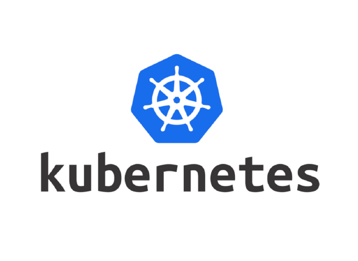
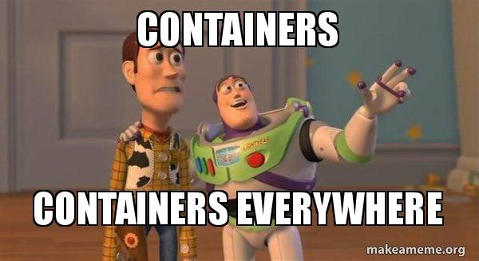

# 无状态很容易； 有状态很难

让我们举一个非常非常简单的非技术示例：

您坐在餐厅里，服务员走过来，接您的订单，并以他无穷的智慧决定不写下您的订单，而是将其记入内存，然后再下令将订单交给厨房。

问：如果那个服务员在去厨房的途中突然摔死，会发生什么？？？

A.在Kubernetes供电的餐厅里，我们不必担心，因为控制飞机只会旋转另一个看上去和最后一个完全一样的服务员……但是，哦，等等……我们有一个新的服务员，但是我们发生了什么事 订购？ 它和第一个服务员一起死了！

现在，这是一个非常人为的示例，但是…这是我的尤里卡时刻：

运营商实质上是一种使我们能够为Kubernetes提供更多特定于域的方式来执行复杂任务的方式，而不仅仅是其默认的“替代已死的事物”方法。
# DevOps表示DevOps

容器向我们承诺了一种更好的滚动部署和运行应用程序的简便方法。 并在很大程度上实现了这一目标。 我们可以使用Web应用程序创建一个容器，使用NGINX创建一个容器，并使用Redis实例创建一个容器，将它们全部放到K8s服务中，通过一个不错的YAML进行部署，并且可以立即启动并运行它们。 如果我们丢失了缓存，NGINX或我们的应用程序，我们就可以放心，因为它很快就会回来，并会根据需要扩展等。

但是，我们的应用程序中更复杂的部分呢？ 那我们的数据库呢？

好吧……我们当然可以创建一个带有我们数据库图像的容器，准备将其部署到Kubernetes中，但是我们如何：
+ 将多个数据库实例配置为主从配置？
+ 设置我们的复制作业？
+ 安排我们的备份？

好的，这可能有点麻烦，但是让我们采用另一种方法。 如果我们想扩展一些云基础架构作为服务的一部分怎么办？ 像Azure ServiceBus一样？
+ 我们甚至怎么可能将服务总线集装箱化？
+ 我们如何配置和扩展ServiceBus？

这就是容器解决我们所有DevOps问题的承诺真正开始显示出裂缝的地方。
# 要经营还是不经营……这就是问题所在

现在，我想退后一步，承认我个人对操作员仍然有不同的感觉，还有一个问题似乎仍在我脑海中浮现：

仅仅因为我可以写一个Operator来自动化和管理某些东西。 这意味着我应该吗？

免责声明时间：我是Terraform的忠实拥护者，说实话，我认为在很长的一段时间内，对于DevOps来说这可能是最好的事情。 对我来说，架构是可以生存和发展的代码，可以进行协作和审查。

我只需运行脚本即可启动，修改和拆除复杂的基础架构项目。

现在，我还可以将所有这些转换为运算符； 说我写了一个CosmosDB的操作员和ServiceBus等的操作员，这在维护方面有很多开销。 Terraform拥有一个蓬勃发展的社区，它使我能够利用经验丰富的，经验丰富的提供商为我服务。

但是，另一方面，想象一下一个世界，每个操作员都已经被编写并且可以完美地工作，并且具有与Terraform相同的支持和配置可能性……一个.yaml文件，一个kubectl命令，然后有了它，我们非常复杂的应用程序体系结构 部署并且从未考虑过。 我们的通话电话永远不会响，永远不会有任何有关规模或容量的警报，因为我们知道Kubernetes正在为我们完成所有艰苦的工作，因此感到安全：

……现在，这将不是一个可爱的DevOps世界吗？
# Kubernetes初学者运算符

# 前言

好的，所以我知道这不是新技术（但是），但是它似乎在K8s领域正在积聚很多动力，环顾四周，当我刚开始工作时，并没有很多“ 低级”文档。

经过大量的头部抓挠，阅读，更多的头部抓挠，YouTube视频，甚至更多的头部抓挠……我终于有了灯泡尤里卡的时刻，这一切对我来说都变得很有意义。 因此，我想写这篇博客文章是为了减轻人们的痛苦。
# 什么是运算符？

Right让我们从头开始...我想您到达此页面的原因是：
+ 您正在从事一个涉及Kubernetes的项目
+ 有人提到过许多Kubernetes流行语之一（控制器，操作员，CRD，组或种类）
+ 有人随机说：“如果Kubernetes可以为我自动化这件事，那不是很好吗？”
+ 您已经阅读了有关操作员的资料，并坐在那里像“ WTF？！？！？！”

> it’s enough to make you cry

## 好吧，不用担心，帮助随时可用！

我们可以将运算符视为逻辑的捆绑单元，它在Kubernetes中执行一些复杂的业务逻辑。

好的，很好，但这是非常抽象的。

事实是，我们可能已经与Kubernetes运营商打过交道，我们只是不知道：
```
kubectl get pods
```

在非常抽象的级别上，上面的命令使用默认的K8s运算符之一，“ Pod”运算符，而我们正在执行的操作数是“ get” op。

而且，如果我们要创建或删除新的Pod，我们也可以为这些任务提供操作员。 我们只需要知道如何使用它们以及何时使用它们。 我们不需要知道Kubernetes是如何创建Pod的，也不需要知道如何获取Pod的信息，这就是我们不在乎的K8s级别的业务逻辑。 但是我们关心的是，一旦我们有一个Pod和在该Pod上运行的服务，Kubernetes将对其进行监视并在它出现问题并终止时重新创建它。
# 但是Kubernetes已经为我做了所有这一切吗？

好的，所以我们有我们的定义，但是现在您坐在那里，对自己进行思考：“无论如何，Kubernetes已经为我做了所有这些事情……当豆荚死了而我没有做任何事情时，它会自动缩放事物并旋转新事物？ 我为什么要在乎？”

您将是正确的，它确实做到了这些事情，即使您不必考虑使用运算符，也可以实现9/10倍的工作。 但是事情变得有趣的地方是您必须开始考虑状态！

```
(本文翻译自C:\Dave\Storey的文章《Kubernetes Operators for beginners》，参考：https://medium.com/@stoz_das/kubernetes-operators-for-beginners-8f53ead07097)
```
