# Kubernetes Services只需直观地说明

> https://unsplash.com/photos/OKOOGO578eo

## 部分
+ 第1部分：本文
+ 第2部分：简单地从视觉上解释了Kubernetes Ingress
## TL; DR

有四个主要服务，其中ClusterIP是圣杯：
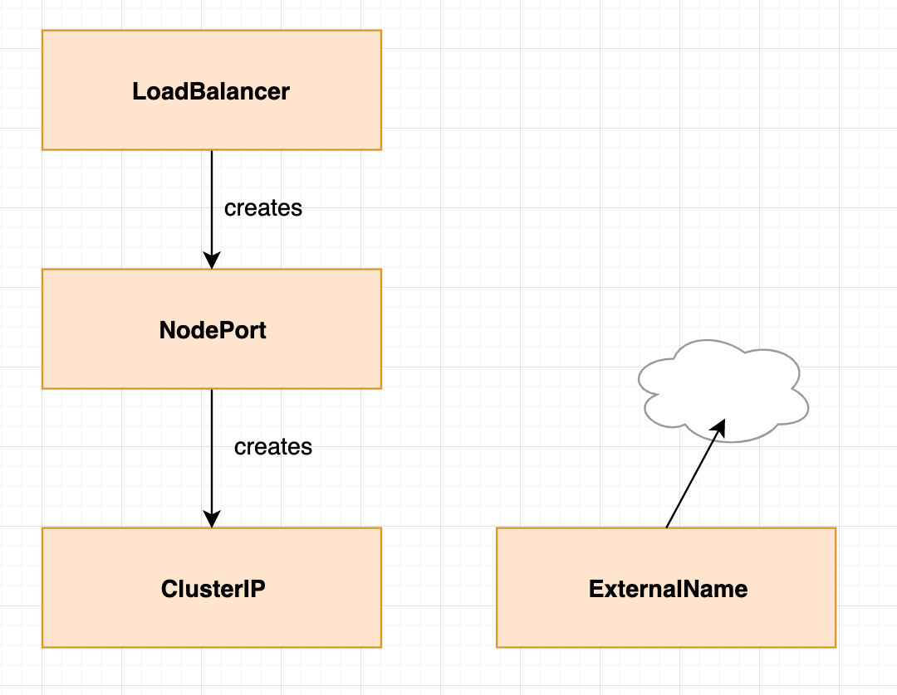

我想让您想象一下，如果您创建一个NodePort服务，它也会创建一个ClusterIP服务。 如果创建LoadBalancer，它会创建一个NodePort，然后再创建ClusterIP。 如果这样做，k8s服务将很容易。 我们将在本文中逐步解决。
## 服务和豆荚

服务指向吊舱。 服务不指向部署或副本集。 服务直接使用标签指向吊舱。 这提供了极大的灵活性，因为创建Pod的方式多种多样（甚至是自定义的）无关紧要。

我们将从一个简单的示例开始，我们将逐步扩展不同的服务类型，以了解它们是如何在彼此之上构建的。
# 没有服务

我们从没有任何服务开始。
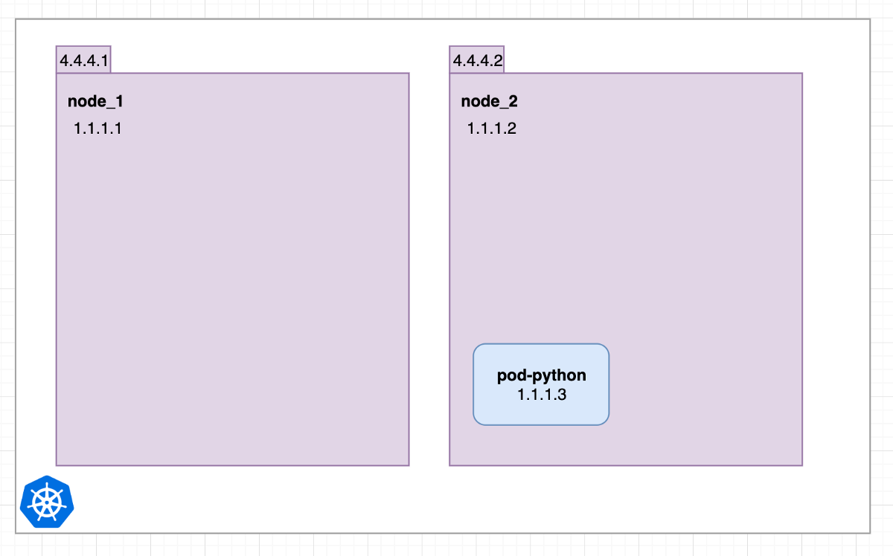

我们有两个节点，一个吊舱。 节点具有外部（4.4.4.1、4.4.4.2）和内部（1.1.1.1、1.1.1.2）IP地址。 pod pod-python只有一个内部的。
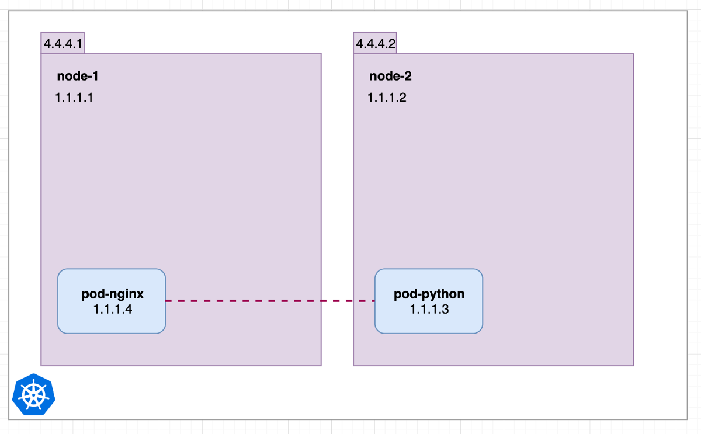

现在，我们添加第二个pod pod-nginx，它已安排在节点1上。 情况不一定如此，对于连接也没关系。 在Kubernetes中，无论它们在哪个节点上运行，所有Pod都可以访问其内部IP地址上的所有Pod。

这意味着pod-nginx可以使用其内部IP 1.1.1.3 ping并连接到pod-python。
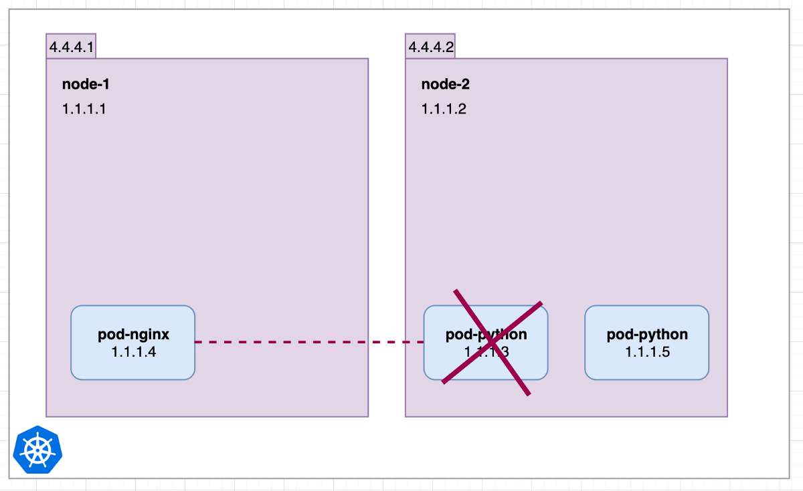

现在考虑一下pod-python模具，然后创建一个新模具。 （本文不介绍如何管理和控制Pod。）pod-nginx突然无法再达到1.1.1.3，世界突然间爆发出可怕的火焰……但是为了防止这种情况，我们创建了我们的第一项服务！
# 集群IP
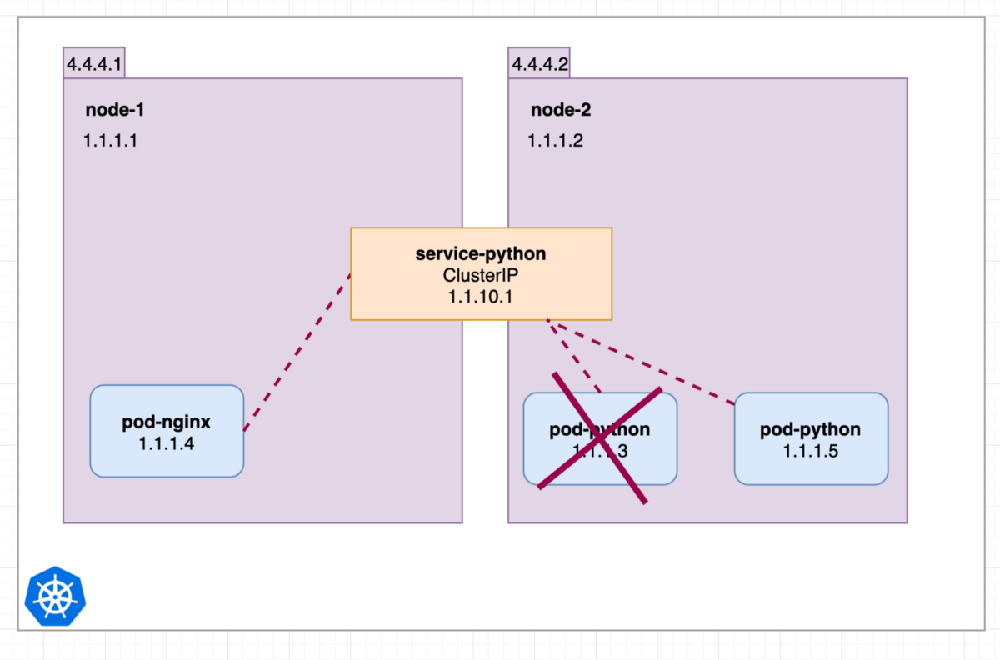

相同的情况，但是我们配置了ClusterIP服务。 没有在Pod之类的特定节点上调度服务。 对于本文而言，假设服务仅在整个集群的内存中可用就足够了。

Pod-nginx始终可以安全地连接到1.1.10.1或dns名称service-python，并重定向到活动的python pod。 美丽。 没有火焰。 阳光。
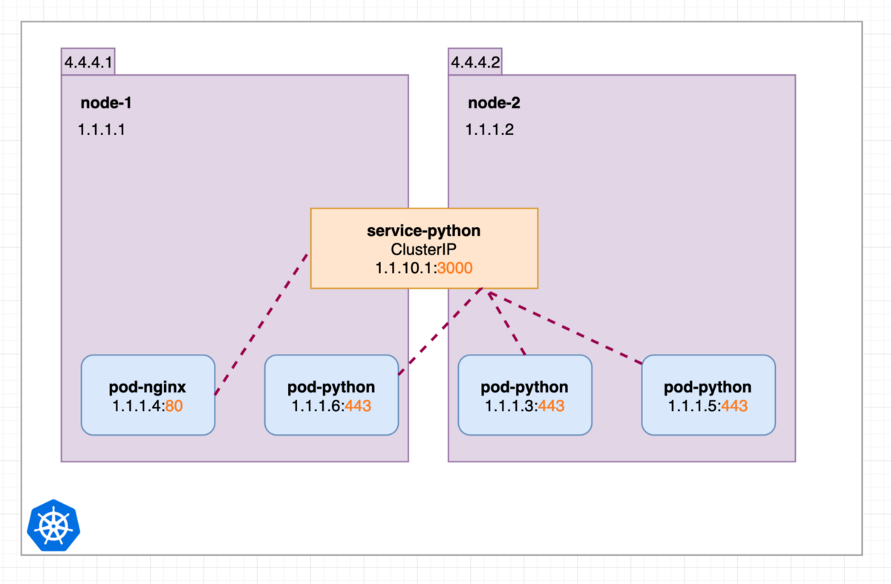

我们扩展示例，启动3个python实例，现在我们显示所有Pod和服务的内部IP地址的端口。

集群中的所有Pod都可以通过http://1.1.10.1:3000或http：// service-python：3000到达其端口443上的python pod。 ClusterIP服务python基于随机或轮询方法分发请求。 这就是ClusterIP服务的工作，它通过名称和IP使Pod在群集内可用。

上图中的service-python可能具有以下yaml：
```
apiVersion: v1kind: Servicemetadata:  name: service-pythonspec:  ports:  - port: 3000    protocol: TCP    targetPort: 443  selector:    run: pod-python  type: ClusterIP
```

运行kubectl get svc：
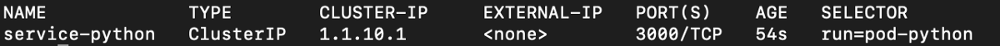
# 节点端口

现在，我们想从外部使用ClusterIP服务，为此，我们将其转换为NodePort。 在我们的示例中，我们仅通过两个简单的yaml更改即可转换service-python：
```
apiVersion: v1kind: Servicemetadata:  name: service-pythonspec:  ports:  - port: 3000    protocol: TCP    targetPort: 443    nodePort: 30080  selector:    run: pod-python  type: NodePort
```
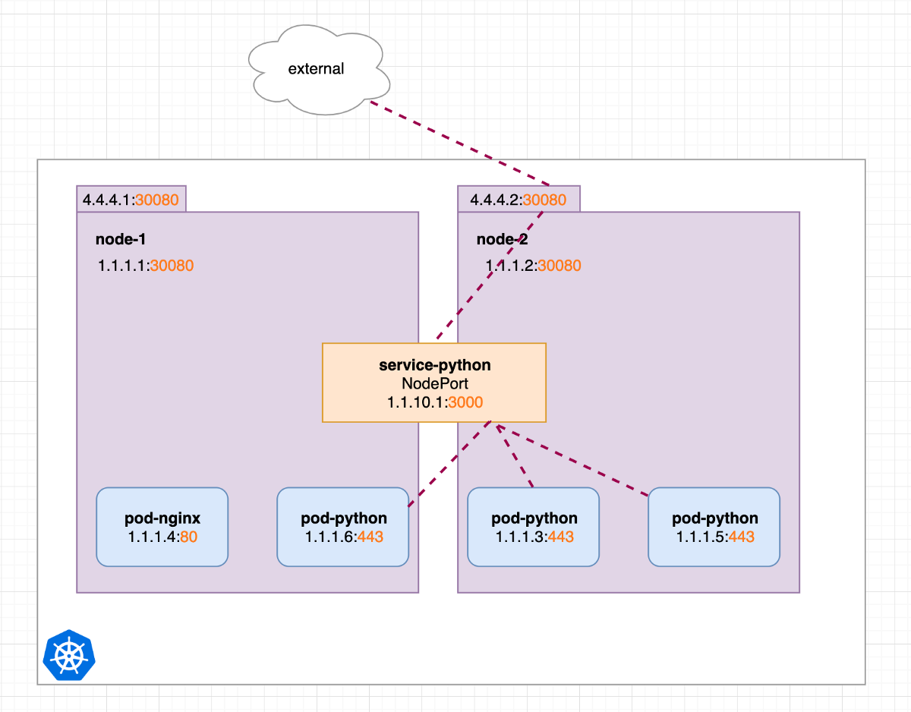
> external request over node-2


这意味着我们现在也可以从端口30080上的每个节点内部和外部IP地址访问我们的内部服务python。
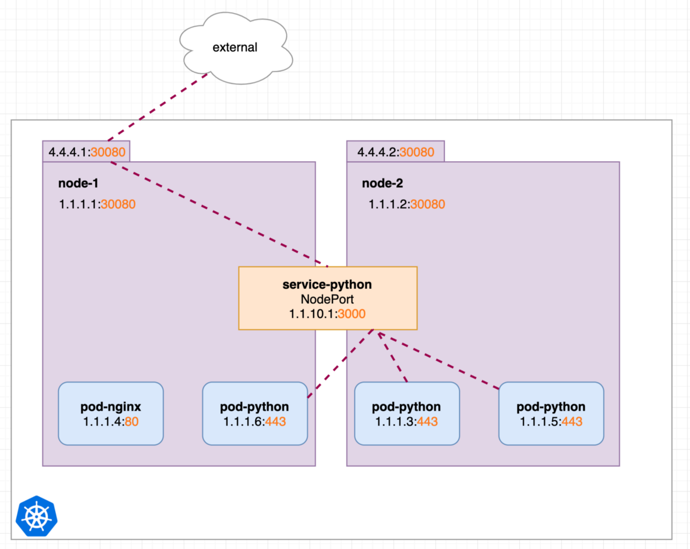
> external request over node-1


群集中的Pod也可以连接到端口30080上的内部节点IP。
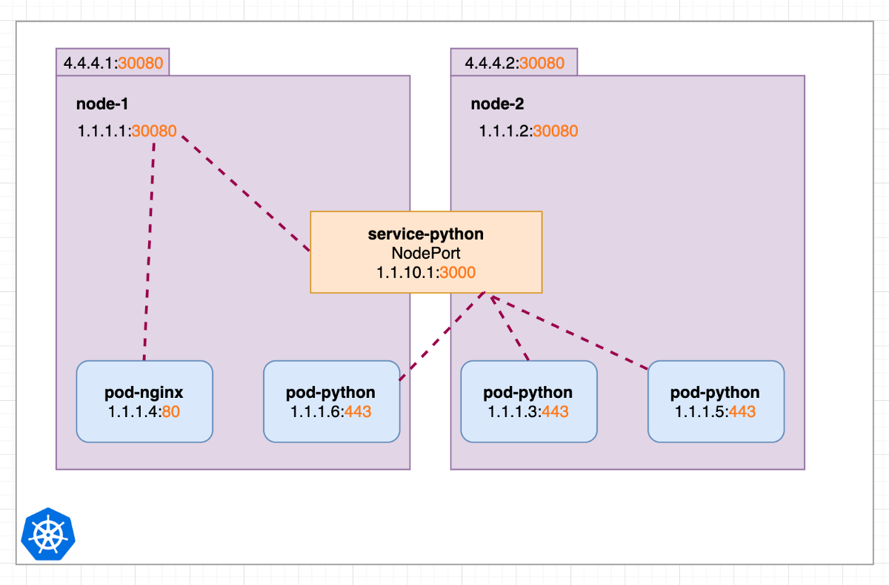

运行kubectl get svc显示相同的集群ip。 只是不同的类型和其他节点端口：
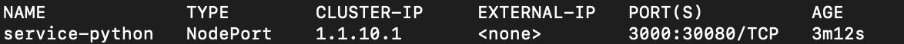

在内部，NodePort服务以前仍充当ClusterIP服务。 可以想像，即使不再有多余的ClusterIP对象，NodePort服务也会创建ClusterIP服务。
# 负载均衡器

如果我们希望有一个IP（使用诸如轮询等方法将请求分发到所有外部节点IP），则可以使用LoadBalancer服务。 因此，它是基于NodePort服务构建的：
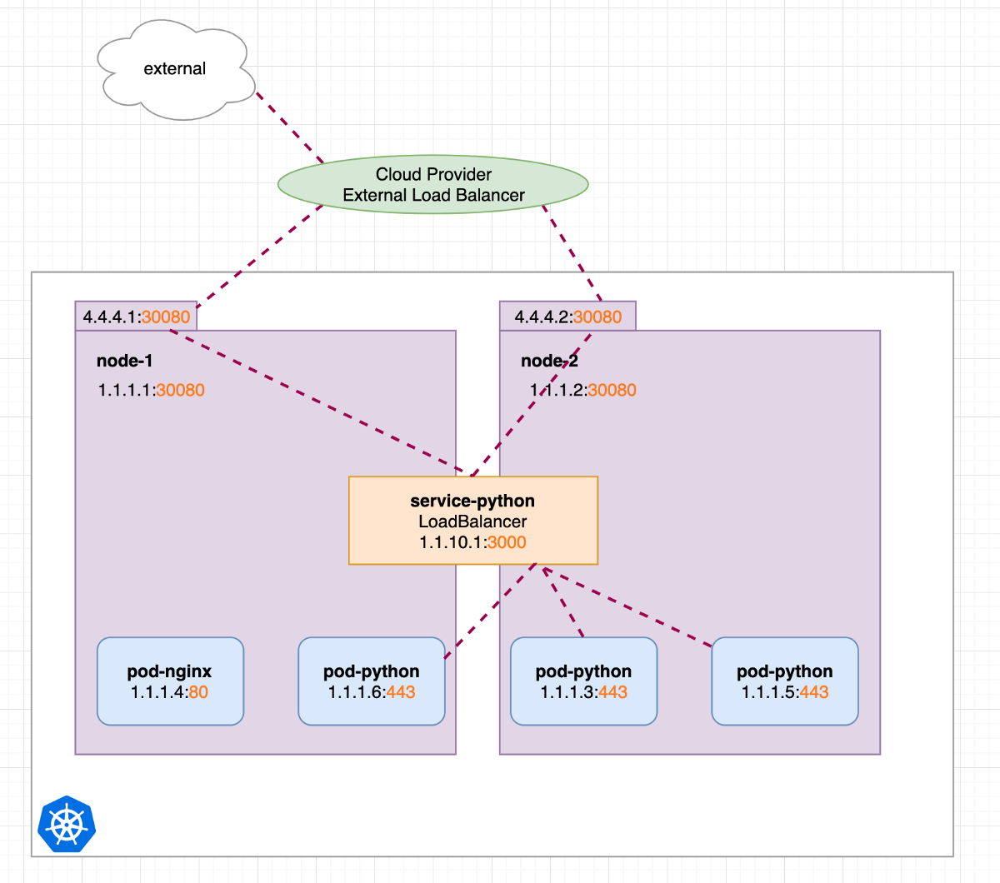

想象一下，LoadBalancer服务创建了一个NodePort服务，该服务创建了ClusterIP服务。 与之前的NodePort相比，针对LoadBalancer更改的yaml很简单：
```
apiVersion: v1kind: Servicemetadata:  name: service-pythonspec:  ports:  - port: 3000    protocol: TCP    targetPort: 443    nodePort: 30080  selector:    run: pod-python  type: LoadBalancer
```

LoadBalancer服务要做的只是创建一个NodePort服务。 此外，它还会向托管Kubernetes集群的提供商发送一条消息，要求设置指向所有外部节点IP和特定nodePort的负载均衡器。 如果提供者不支持请求消息，那么什么也不会发生，并且LoadBalancer等同于NodePort服务。

运行kubectl get svc只会显示EXTERNAL-IP和其他类型的添加：
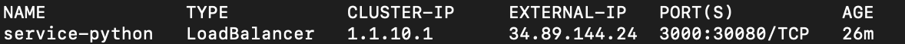

与以前一样，LoadBalancer服务仍在内部和外部IP节点上打开端口30080。 而且它仍然像ClusterIP服务一样。
# 外部名称

最后，ExternalName服务可以被认为是有点分开的，并且与我们之前处理过的3不在同一堆栈上。 简而言之：它创建一个内部服务，其端点指向DNS名称。

以我们早期的示例为例，我们现在假设pod-nginx已经在我们闪亮的新Kubernetes集群中。 但是python api仍然在外面：
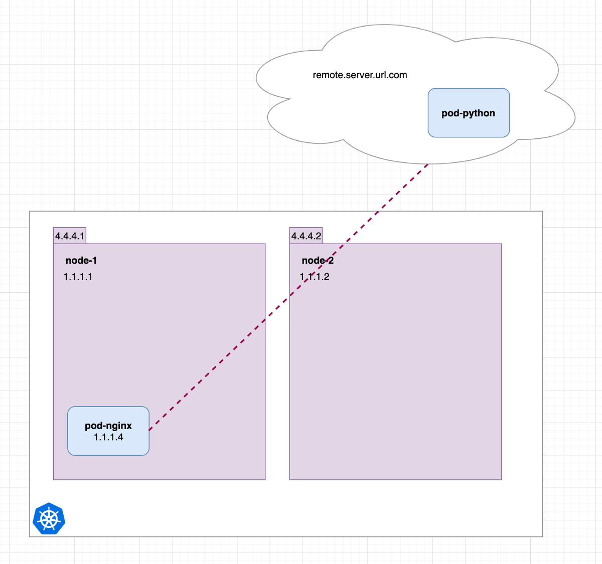

在这里，pod-nginx必须连接到http://remote.server.url.com，它肯定可以工作。 但是不久之后，我们希望将python api集成到集群中，直到那时，我们可以创建一个ExternalName服务：
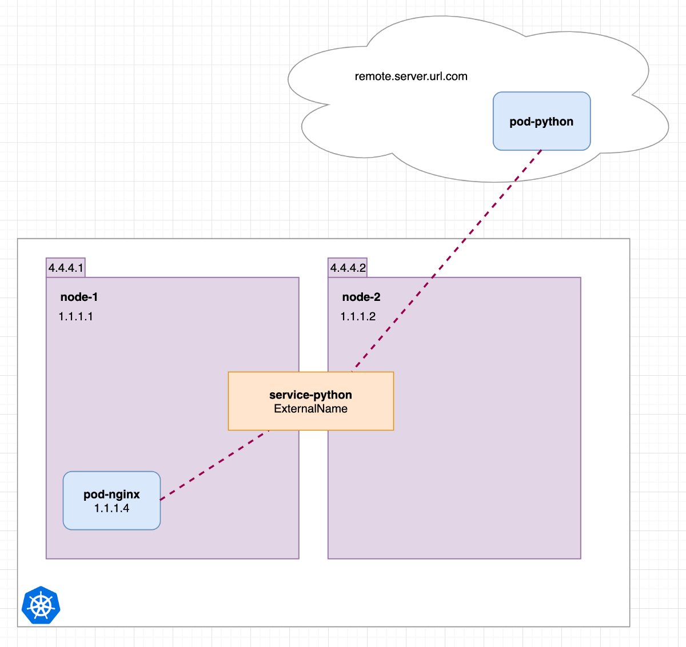

可以使用以下yaml完成此操作：
```
kind: ServiceapiVersion: v1metadata:  name: service-pythonspec:  ports:  - port: 3000    protocol: TCP    targetPort: 443  type: ExternalName  externalName: remote.server.url.com
```

现在pod-nginx可以简单地连接到http：// service-python：3000，就像使用ClusterIP服务一样。 当我们最终决定在美丽的Kubernetes集群中迁移python api时，我们只需要将服务更改为具有正确标签集的ClusterIP即可：
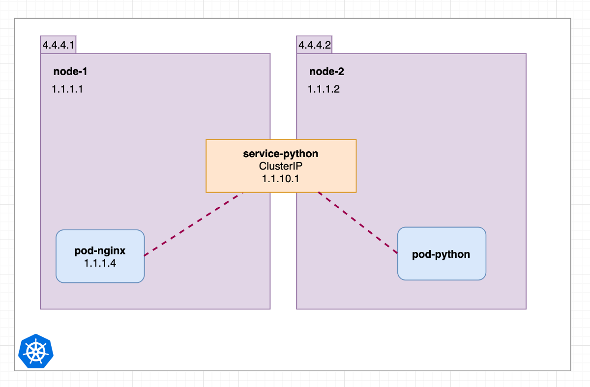
> Python api still reachable at http://service-python


使用ExternalName服务的最大优势在于，即使某些服务可能仍在外部，您也已经可以创建完整的Kubernetes基础结构，并且已经基于服务和IP应用了规则和限制。
# 概括

今天不是很多回顾的日子，我确实害怕其他读者。
```
(本文翻译自Kim Wuestkamp的文章《Kubernetes Services simply visually explained》，参考：https://medium.com/swlh/kubernetes-services-simply-visually-explained-2d84e58d70e5)
```
