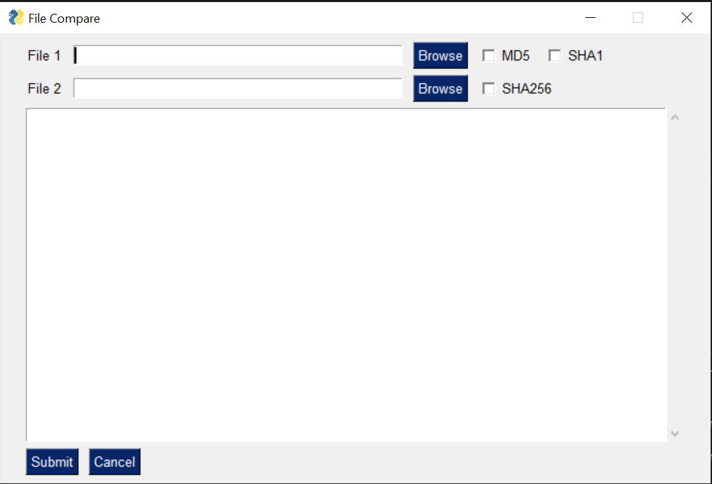
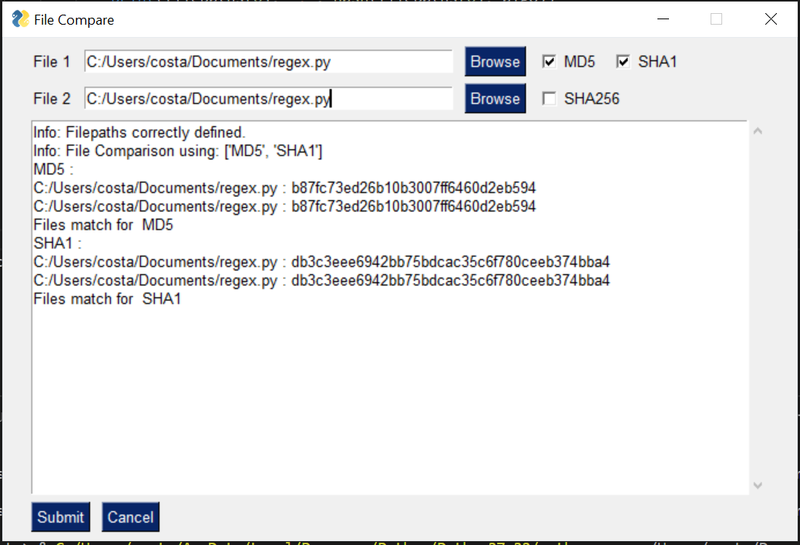

## 3种在Python中比较数据的快速方法
### 对于从事分析工作的任何人来说，接收比较数据的请求都将非常熟悉。 不管是...
# 了解如何在Python中快速创建UI
## 最后，您可以在5分钟内找到图书馆

> Photo by Eftakher Alam on Unsplash


python的最大优点是易用性以及几乎所有内容的丰富库。 只需几行代码，您便无所不能。 只要您的python脚本供个人使用或目标读者足够技术，您甚至都无需考虑用户界面（UI）。

但是，有时您的目标受众还不够技术。 他们很乐意使用您的python脚本，但前提是他们不必只看一行代码。 在那种情况下，提供命令行脚本根本不会削减它。 理想情况下，您需要为他们提供一个UI。 尽管您会遇到典型的桌面客户端与基于Web的UI辩论，我不会感到惊讶，但在此博客文章中，我们的目标是专门使用Python。
# 可用于UI的Python库

本质上有3个大型Python UI库； Tkinter，wxPython和PyQT。 在回顾所有这三个库时，我意识到使用Python库找不到我喜欢的一切。 通常，Python库在抽象超级技术方面做得很好。 如果需要使用面向对象编程，那么我可能还已经加载了Java或.Net。

然而，令我非常高兴的是，我遇到了第四个选择，它似乎可以满足我的喜好。 我开始审查并最终选择从中创建Python UI的库称为PySimpleGUI。 有趣的是，该库使用了所有3种流行的库，但是抽象了超级技术。

事不宜迟，让我们通过同时解决一个实际问题来深入研究该库。
# 检查两个文件是否相同

使用我以前的文章3用Python比较数据的快速方法，我们可以使用第一部分“检查数据的完整性”来尝试构建UI。
## 3种在Python中比较数据的快速方法
### 对于从事分析工作的任何人来说，接收比较数据的请求都将非常熟悉。 不管是...

本质上，我们需要一种加载两个文件的方式，然后选择我们要用于进行文件比较的加密。
## 编写用户界面

要构建该UI，我们可以使用以下代码：
```
import PySimpleGUI as sglayout = [    [sg.Text('File 1'), sg.InputText(), sg.FileBrowse(),     sg.Checkbox('MD5'), sg.Checkbox('SHA1')     ],    [sg.Text('File 2'), sg.InputText(), sg.FileBrowse(),     sg.Checkbox('SHA256')     ],    [sg.Output(size=(88, 20))],    [sg.Submit(), sg.Cancel()]]window = sg.Window('File Compare', layout)while True:                             # The Event Loop    event, values = window.read()    # print(event, values) #debug    if event in (None, 'Exit', 'Cancel'):        break
```

结果是：

> Simply Python UI, generated by the above code

## 插入逻辑

有了用户界面，就很容易看到如何插入其余代码。 我们只需要监视用户输入的内容，然后采取相应的措施即可。 我们可以使用以下代码轻松地做到这一点。
```
import PySimpleGUI as sgimport reimport hashlibdef hash(fname, algo):    if algo == 'MD5':        hash = hashlib.md5()    elif algo == 'SHA1':        hash = hashlib.sha1()    elif algo == 'SHA256':        hash = hashlib.sha256()    with open(fname) as handle: #opening the file one line at a time for memory considerations        for line in handle:            hash.update(line.encode(encoding = 'utf-8'))    return(hash.hexdigest())layout = [    [sg.Text('File 1'), sg.InputText(), sg.FileBrowse(),     sg.Checkbox('MD5'), sg.Checkbox('SHA1')     ],    [sg.Text('File 2'), sg.InputText(), sg.FileBrowse(),     sg.Checkbox('SHA256')     ],    [sg.Output(size=(88, 20))],    [sg.Submit(), sg.Cancel()]]window = sg.Window('File Compare', layout)while True:                             # The Event Loop    event, values = window.read()    # print(event, values) #debug    if event in (None, 'Exit', 'Cancel'):        break    if event == 'Submit':        file1 = file2 = isitago = None        # print(values[0],values[3])        if values[0] and values[3]:            file1 = re.findall('.+:\/.+\.+.', values[0])            file2 = re.findall('.+:\/.+\.+.', values[3])            isitago = 1            if not file1 and file1 is not None:                print('Error: File 1 path not valid.')                isitago = 0            elif not file2 and file2 is not None:                print('Error: File 2 path not valid.')                isitago = 0            elif values[1] is not True and values[2] is not True and values[4] is not True:                print('Error: Choose at least one type of Encryption Algorithm')            elif isitago == 1:                print('Info: Filepaths correctly defined.')                algos = [] #algos to compare                if values[1] == True: algos.append('MD5')                if values[2] == True: algos.append('SHA1')                if values[4] == True: algos.append('SHA256')                filepaths = [] #files                filepaths.append(values[0])                filepaths.append(values[3])                print('Info: File Comparison using:', algos)                for algo in algos:                    print(algo, ':')                    print(filepaths[0], ':', hash(filepaths[0], algo))                    print(filepaths[1], ':', hash(filepaths[1], algo))                    if hash(filepaths[0],algo) == hash(filepaths[1],algo):                        print('Files match for ', algo)                    else:                        print('Files do NOT match for ', algo)        else:            print('Please choose 2 files.')window.close()
```

运行上面的代码将为您提供以下结果：

# 总结思想

尽管不是最漂亮的UI，但该库允许您快速启动简单的python UI并与可能需要的人共享。 更重要的是，您所需的代码是简单易读的。 您仍然会遇到必须运行代码来获取UI的问题，这可能会使共享变得有些困难，但是您可以考虑使用PyInstaller之类的工具，它将您的python脚本转换为.exe，人们只需双击即可。
