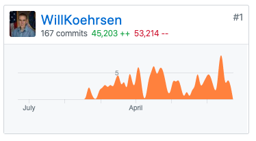
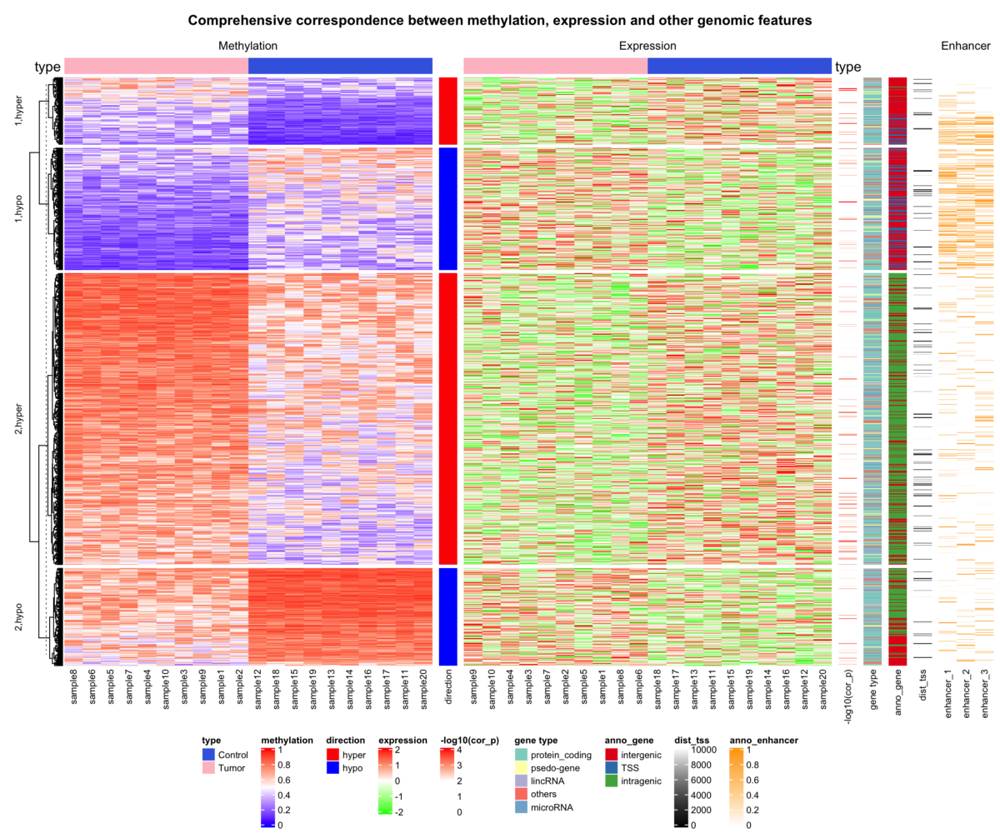
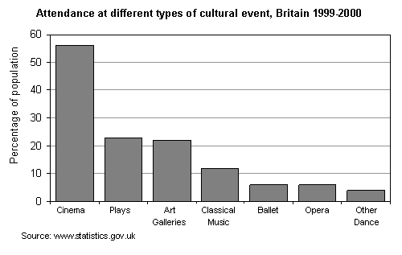
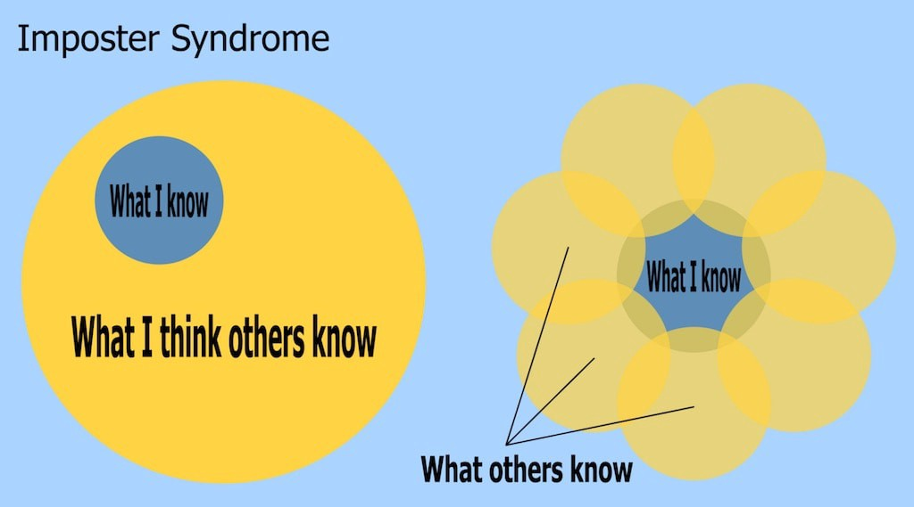

我感谢反馈和建设性的批评。 可以在下面的回复中或在Twitter @koehrsen_will上找到与我联系的最佳地点。
# 结论

在该领域工作了一年之后，我最初对数据科学的无限乐观已被谨慎的热情所取代。 机器学习可以很好地解决一小部分问题（比人类更好），但不能解决所有人为错误。 必须认识到该领域的局限性，以避免过度销售数据科学，从而导致未兑现的承诺。 尽管如此，以一种现实的态度并牢记这些教训，机器学习仍可以带来令人印象深刻的结果。 最后，最好的机器学习系统应旨在通过允许我们更有效地完成工作来帮助人类，而不是取代人类。

即使在您解释了计算机如何做出决定之后，该建议也可能会被忽略，因为人们并不完全理性。 当出现客观上更好的选择时，人们可能出于各种原因选择另一种选择：习惯，不信任，熟悉，错误信息。

考虑一下风景优美的路线选择：有时候，人们似乎出于逻辑上的原因会沿着两个地方走更长的路线。 为什么？ 因为沿途风景更美。 天真的数据科学家可能只显示模型建议的最短路线，但是，了解她的客户的数据科学家会知道，他们希望在旅途中看到更多的州际公路。

同样，可能不会使用最佳的机器学习预测，因为准确性不是唯一的考虑因素。 例如，我们预测了建筑工程师开始为其建筑物供暖的理想时间，但是许多工程师仍会更早地打开设备，因为他们不希望租户感到不适。 这是不合理的（我们按时提出建议，以确保在租户到达时建筑物将处于正确的温度），但是，直到我们从决策过程中驱除人员之前，我们将不得不调整计算机 系统而不是其他方式。

也许除了您的计算机科学课程外，还可以参加一些社会学课程来了解您的人类同胞（或阅读行为经济学书籍，例如理查德·泰勒（Richard Thaler）的《行为不端》或丹尼尔·卡尼曼（Daniel Kahnemann）的《思想，快与慢》，这两位诺贝尔经济学奖得主。
# 使用标准工具，并且采用新技术的速度较慢

确保您的算法不包含任何错误的最佳方法是什么？ 从sklearn导入模型，而不是自己编写模型。 除非您进行前沿研究，否则几乎没有理由编写自己的机器学习模型版本。 取而代之的是，使用来自广泛使用且经过测试的库中的函数（我称之为标准工具）来完成任务。

在最近的一条推文中，我说过，最差的数据科学家编写了自己的算法，而最优秀的科学家则从标准库中导入了算法。 我当时是在开玩笑，但我坚持以下原则：使用经过测试的开源库代码几乎总是比开发自己的代码更有效。

使用标准工具的逻辑不仅适用于机器学习模型。 您可能要对数据集执行的所有操作均已在pandas中实现（假设您使用Python），因此请先在此处查找解决方案。 同样，也有用于统计，绘图，测试，调度，部署任务以及机器学习管道的大部分内容的标准库。

我从2位博士学位接任我的职位。 曾渴望发明自己的数据结构，度量标准，算法，文件加载等的强烈要求（可能证明自己的学位合适）的数据科学家，这导致了一大堆没人知道的混乱代码。 我在工作的前六个月主要是用三个import语句替换了100行脚本，直到今天，我很自豪成为我们机器学习库的一个净负贡献者。

> Via Negativa: addition by subtraction


此外，不要仅仅因为新的库/技术/框架/数据库而切换到新库/技术/框架/数据库。 标准工具（例如SQL数据库，用于机器学习的sklearn和用于数据操作的pandas）可以正常工作。 它们可能是无聊的，因为它们（相对）古老，但是它们也经过了测试和可靠。 刚开始时，作为早期采用者似乎很有趣，但是当您与错误和有限的文档进行斗争时，它很快就会变得筋疲力尽。

尽管新技术驱动了媒体周期，但它们通常对实际工作的人员和公司几乎没有影响，甚至没有立即影响（当心工程媒体）。 我的年轻一代不敢相信我在说这话，但与那些尚未取得成果的令人兴奋的新颖技术相比，我现在更喜欢乏味，成熟的技术。 在内部，我们的工程团队对升级库版本进行了长时间的辩论，并且，如果没有明显的好处或需求，那么我们就不会升级，因为有新版本发布。 向我们的机器学习代码库添加一个库需要证明的需求，因为另一个库意味着要管理的另一个依赖项。

寿命最长的公司是那些做事平凡而行动缓慢的公司（例如Caterpillar），而行动迅速而又做“酷”事情的初创公司往往会在几年内消散。 最强大的机器学习系统将不会是使用尖端技术的系统，而是那些将使用久经考验的数据科学标准工具。
# 通过外部简单性隐藏数据科学的内部复杂性

计算机非常擅长处理大量数字。 人类几乎无法处理几个数字。 为了最有效地结合计算机和人类的能力，我们应该使用计算机来分析大型数据集，并仅将最关键的数据呈现给人类进行决策。 数百万个数字输入，尽可能少的数字输出。 内部有复杂的模型，外部有可行的建议。

在过去的一年中，我发展了一种理论，即图表中的数据点越多，数字越少（也许是7？），它的作用就越小。 人类只是没有能力准确地分析复杂的定量图。 热图很酷，但是有没有人从具有1000个数据点的热图（与具有五个数字的条形图相比）做出关键决定？

> Cool, but what am I supposed to do with this information? (Source)


作为一个通常喜欢细读数字并听取机器学习模型细节的人，我很难适应大多数人不想要更多信息的想法。 客户和做出决定的人们都渴望外卖，仅此而已。 更少的墨水意味着更好的图表。 （如果需要制作图表的帮助，请查阅定量信息的可视化显示或数据可视化基础知识）。

> Dull? Probably. Informative? Absolutely.


外部简单性的论点并不意味着仅使用线性模型。 数据科学可能涉及复杂的算法和高度技术性的操作。 对于非技术人员来说，只有数据科学的外部部分必须足够简单。 不过，请注意使模型如此复杂，以至于您甚至都不理解它。 为了降低精度而以无法解释您的模型为代价，值得使用混合模型吗？ 可能不会。

为了用外部简单性掩盖内部复杂性，请使用有助于描述模型决策的工具。 SHAP值是一种有用的技术，您可以使用其他方法。 为了说明建筑物的最佳开始时间建议，我们对所有特征（包括工程特征）采用SHAP值，并将其组合为人类可理解的特征组，例如天气和建筑物内部条件。 我们采用复杂的机器学习算法，使用SHAP值对其进行简化以供我们理解，然后在向客户展示产品之前进一步利用我们的知识对其进行精简。

简化定量信息的一种方法是准备仅以一个数字开头的报告，然后根据需要添加其他数字（这也适用于图形）。 这种累加方法无需从大量图形开始并删除它们，而是确保没有无关紧要的统计数据进入演示和报告。 请记住，人不是计算机，您不应像他们那样呈现结果。
# +1每个人都会感到冒名顶替综合症并犯错； 都不会让你退缩

最后，由于这是数据科学（及其他专业）中的重要问题，因此，这里值得鼓励的一课是：不要让冒名顶替综合症或错误使您失望。

每个人都会感觉到他们不属于该职位，或者最终会因为无法胜任而最终被“发现”，所以请不要为此烦恼。 取而代之的是，改变对形势的看法：您不是唯一拥有这些想法的人，学习新事物与产生结果一样重要，而且，如果您是相对较新的人，那么成为新手会有所裨益（例如寻找新方法） 解决问题）。 此外，很容易环顾四周并看到人们取得了巨大的成功，但是您看不到的是他们一路上遇到的所有失败（一种生存偏见）。

> People have different areas of knowledge (Source)


即使是表现最好的人，也从初学者开始就犯了（并且继续犯）自己的错误。 错误并不意味着您不应该是数据科学家或计算机程序员。 他们意味着您有机会学习如何做得更好。 在数据科学领域，我们需要更多的人和更多的人，而且我担心我们将数据科学家描绘成站在专业技能的巅峰，从而排除了技术人才。 这是一个神话，因为您只能通过在某个领域工作来获得专业知识，而这并不是您进入职业生涯之前所拥有的东西。 事实是，数据科学是开放的，并且没有进入该领域的“典型”途径。 如果您由于背景或缺乏专业知识而不属于自己，那么好消息就是那是一种扭曲； 数据科学不是只为少数精英保留的专业。

数据科学的主观性是否意味着我们应该放弃所有关于真理的观念？ 我认为我们应该重新构想这个问题：我们不使用一个有缺陷的数据科学，而是寻找一个正确的答案，而是朝着更好的解决方案的方向发展。 毕竟，数据科学是科学的一个子领域，其目标是随着时间的流逝减少错误。 同样，研究问题的人员越多，并比较他们的工作，我们就越接近获得更好的结果。 那20位科学家可能进行了20次不同的分析，但是如果他们随后比较了他们的方法并共同努力，那么最终的成果将优于任何单个项目。

在实践数据科学时，我们必须记住，就像任何领域一样，数据科学也不是没有缺陷，也不容置疑。 实践负责任的数据科学意味着以不确定的时间间隔呈现结果，寻找理由来反驳您的结论，将您的结果与其他类似工作进行比较，并且在呈现发现结果时要切合实际。

由于数据科学取决于人类的判断力，所以我们需要意识到
# 人际关系和沟通技巧至关重要

尽管看上去很明显（在任何领域，沟通技能都是负面的吗？），但我每天都在提醒我，需要与各个技术领域的人们进行有效的机器学习交流。 仅仅了解您的ML行话是不够的； 您需要能够与他们了解的人见面，并仅告诉他们他们需要了解的细节。

（作为一个幽默的例子，我的工作对某些人来说是“计算机的东西”，而对其他人则是半小时的关于机器学习细节的讨论。）

至少在我们的情况下，机器学习决策不能代替人工选择（即使更准确），因为建筑工程师可以使用我们的建议。 （自主建筑的运行可能比自主车辆更远）。 仅建立模型，显示模型的准确性并将结果提供给希望他们立即实施预测的客户是不够的。 数据科学家仍然必须掌握混乱的社交互动艺术。 您可以产生最佳的机器学习模型，但是如果您不能说服人们使用它，那么它将不会有任何影响。

我工作中最普通的方面是通过内部和外部小组的写作和演示来解释方法，了解我们的客户当前如何做出决策，并与领域专家交谈以将其知识转化为数据科学系统。 大学里没有提到这些，我被告知数据科学家可以躲在完美的客观数字后面。
# 生产数据科学主要是计算机科学

当被问到工作中最困难的部分时，考虑到我们所有的机器学习都像这样，我坚决回答这不是机器学习：
```
from sklearn import ModelModel.fit(features, target)predictions = model.predict(testing_features)
```

取而代之的是，数据科学中最困难的部分是开发建模前后所发生的一切。 在具备以下条件之前：从数据库加载数据，功能工程，数据验证和数据处理管道（假设我们的工作在数据被摄取后开始）。 在我们需要验证结果之后，将任务设置为按计划自动运行，将结果写回到我们的数据库中，并发送webhooks来触发其他服务。

这些外围动作构成了机器学习的大部分工作，都需要扎实的计算机科学实践。 这些与开发代码有关的实践中，有一些编写短函数，每个短函数都做得很好，开发实现相关功能的类，正确的命名约定，对代码和数据编写单元测试，编写旨在 阅读，而不重复代码。 另外，还有其他计算机科学实践可应用于代码本身，例如版本控制，代码审查，持续集成，代码覆盖和部署，这些实践现在催生了一个完全独立的机器学习操作（MLOps）领域。

尽管我设法完成了机械工程->数据科学家的过渡，但回想起来，进行工程->计算机科学->数据科学本来会更有生产力。 第二种方法本来意味着我不必学习在数据科学课程中学习到的不良编码实践。 换句话说，我认为在扎实的计算机科学背景之上添加数据科学要比先学习数据科学然后学习计算机科学要容易得多（但两种方法都是可行的）。

计算机科学涉及一种完全不同的系统思维方式，即在编码之前进行有计划的规划，缓慢地编写代码以及在编写代码后进行测试。 干净的代码与数十个半写笔记本（我们所有人都拥有名为Untitled12.ipynb的笔记本）的数据科学通常随心所欲的本质形成鲜明对比，并且强调获得即时结果，而不是编写相当无错误的代码， 可以重复使用。

所有数据科学家都可以从计算机科学最佳编码实践课程中受益。 结构化脚本和程序包，编写简洁的代码，测试和记录代码的能力使从探索性数据科学到生产机器学习的过渡更加易于管理。 此外，他们灌输了一种思维模式，从而导致易于理解的可重用代码。 即使是通常会编写数据科学脚本以分析论文数据的学术数据科学家也将受益于更好的实践。 如果科学家编写更简洁的代码并包含用于验证输入，输出和功能行为的单元测试，则科学中的可再现性问题可能会得到改善。

数据科学中有很多主题需要学习，有时可能会感到不知所措。 但是，计算机科学不应被视为附加组件。 相反，对于希望看到其代码可操作的数据科学家来说，它应该被视为基础。 幸运的是，有很多资源，例如软件木工，任何人都可以用来学习和应用这些实践。
# 数据科学仍然是高度主观的

数据科学承诺使用数据而不是人类的判断来做出最佳决策。 这是一个崇高的原因，但与当前现实相去甚远，因为我们用来分析数据的数据和方法在很大程度上受到人类的影响。 甚至数据科学的所谓客观领域也取决于人类行为。 正如Vicki Boykis在其出色的Normcore Tech电子报中所说的那样，Neural Nets一直都是人。

典型的机器学习系统的每个步骤都会受到个人选择的影响。 以下是其中一些决定：
+ 收集数据：我们收集什么数据？ 我们使用什么传感器？ 我们调查谁？ 我们如何表达我们的问题？
+ 功能工程：我们制作什么功能？ 我们使用领域知识还是自动化功能工程？ 我们如何填写缺失的值？ 什么意见应删除？
+ 建模：我们应该使用哪些超参数？ 我们应该建立模型有多复杂？
+ 验证：什么是评估指标？ 验证程序是什么？ 我们需要什么水平的性能？
+ 部署：我们是否相信这些数字足以向客户展示？ 我们是否需要人工评估预测以进行健全性检查？

不可避免地，通过这个过程，不同的人将得出不同的结论。 《许多分析师，一个数据集》一书中记录了一个这样的例子，该文章描述了数据科学家如何使用相同的数据集来得出相互矛盾的决策，因为他们采用了多种方法。 毫不夸张地说，您可以使用一个数据集来通过改变分析来证明一个论点及其对立面。 这说明您不应该对一项研究得出的任何结论抱有过多的信念，而应该（怀着怀疑的态度）着眼于荟萃分析（并阅读《如何利用统计学撒谎》）。

此外，人为的偏见（无论是有意还是无意的）都会进入数据，从而影响机器学习模型。 如《数学毁灭性武器》一书中所示，将决策移交给机器并不能消除歧视，而是编纂了出现在现实世界数据中的现有偏见。 最终目标是用数据科学来偏误决策，这是崇高的，但是只要涉及人类，我们就不能盲目地依靠机器学习预测。

> (Source)

# 数据科学领域一年的经验教训
## 在Cortex Building Intelligence中从学习到将机器学习投入生产的五个要点

在过去的一年中，我从编写Jupyter Notebook的简单世界，转到了开发机器学习管道的机器学习管道，该管道向全天候的建筑工程师提供实时建议。 尽管我有改进的余地（我仍然犯了很多编码和数据科学错误），但是我设法学到了一些关于数据科学的知识，我们将在本文中介绍这些知识。 希望通过下面的课程，您可以避免我在日常数据科学前沿学习到的许多错误。
+ 生产数据科学主要是计算机科学
+ 数据科学仍然是高度主观的
+ 人际关系和沟通技巧至关重要
+ 使用标准工具，并且采用新技术的速度较慢
+ 通过外部简单性隐藏数据科学的内部复杂性

作者的注释：这是从单一角度写的，并不代表数据科学的整个领域。 请记住，这是来自从事建筑能源行业的端到端（已部署的机器学习系统的概念）数据科学家的工作，可为高效运营建筑物提供实时建议。 如果您有不同的经历或想与我矛盾，请在“评论”部分等待您的回复。
```
(本文翻译自Will Koehrsen的文章《Lessons from a Year in the Data Science Trenches》，参考：https://towardsdatascience.com/lessons-from-a-year-in-the-data-science-trenches-f06efa6355fd)
```
