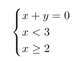
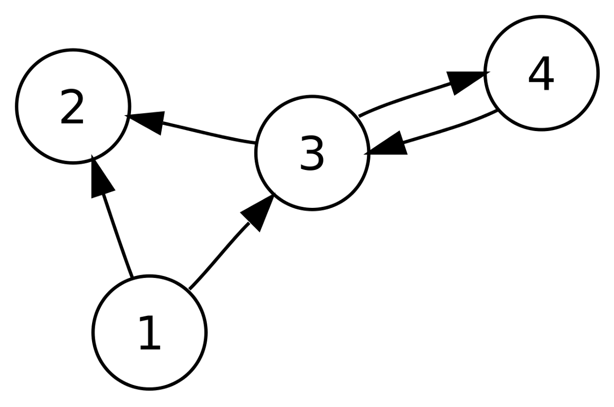

# 结论

在本教程中，我们仅涉及逻辑编程可以完成的工作。 团体理论和人工智能（尤其是自然语言处理）中有更先进的应用，仅举几例。 希望您现在对逻辑编程的一般概念是什么以及如何将其应用于各种问题有了更好的了解。
# 约束逻辑编程

到目前为止，我们一直在研究Herbrand域，但是序言（通常是逻辑编程）真正的亮点是在有限域CLP（FD）或实数CLP（ℝ）上工作。
## CLP（R）

ℝ上的约束逻辑编程使您可以根据实数来简化和求解方程组。 在序言中，我们首先需要将其导入，如下所示：
```
:- use_module(library(clpr)).
```

为了给出一个简单明了的示例，让我们看一下以下方程组：


在序言中表示这一点非常容易：
```
?- {X + Y = 0, X < 3, X >= 2}.
```

在这种情况下，此查询的结果将是上述系统的最简化版本：
```
{X>=2.0, X<3.0, Y= -X}.
```

这可用于简化（求解）具有许多不同约束的方程。
## 中电（FD）

有限域上的约束编程更适用于日常问题，例如任务计划，优化或解决难题（例如n皇后问题）。

让我们通过一个简单的示例介绍CLP（FD）。 我们将考虑以下难题：我们需要为每个字母分配整数，以便


在序言中，我们可以编写这个简单的程序来解决上述难题：
```
:- use_module(library(clpfd)).puzzle([V,E,R,Y] + [N,I,C,E] = [M,E,M,E,S]) :-     Variables = [V,E,R,Y,N,I,C,M,S],     Variables ins 0..9,     all_different(Variables),     (1000*V + 100*E + 10*R + Y) +      (1000*N + 100*I + 10*C + E) #=     (10000*M  + 1000*E + 100*M + 10*E + S),     V #\= 0, N #\=0, M#\=0,     label(Variables).
```

我们首先将需要为其分配数值的所有变量归为一组。 接下来要做的是指定它们的域（介于0到9之间）。 然后，我们迫使它们全部不同。 主要部分包括放置拼图给出的主要约束（在CLP（FD）中，约束“ =”的语法为“＃=”）。 此外，我们确保V，N和M不同于0。我们要做的最后一件事是标记，这迫使prolog吐出单个解，而不是打印出最终的传播约束。

现在，我们可以进行以下查询以获得解决方案：
```
?- puzzle(X).X = ([7, 6, 2, 3]+[8, 5, 4, 6]=[1, 6, 1, 6, 9])
```
# 处理关系-苏格拉底是凡人吗？

逻辑编程中最基本的概念之一是关系。 但是究竟是什么关系？

为了更清楚地了解这一点，让我们看一下序言中非常简单的一段代码（您可以在此处下载序言）
```
mortal(X) :- man(X).
```

通常，将“ A：-B”给出的关系理解为“如果B则A”。 上面的例子可以理解为“如果你是男人，那么你就是凡人”，也就是“男人是凡人”。 请注意，句点正好结束关系。 现在，假设我们添加以下内容：
```
man(socrates).
```

这只是说：“自食其果是一个男人”。 现在，您可能会想，“这很棒，但是有什么意义呢？”之所以定义关系，是因为我们能够执行查询。 在序言中，我们可以执行简单的查询：
```
?- mortal(socrates).true.
```

上面查询的结果是“ socrates mortal”。 它使用我们构建的关系数据库来查看苏格拉底是一个人，并且由于人是凡人，所以苏格拉底也必须是凡人。 相反，如果我们想遍历所有凡人，我们可以做到：
```
?- mortal(X).X = socrates.
```

在序言中，大写字母用于表示变量。
## 有向图的简单示例

为了用更详尽的示例说明这一点，假设我们得到了以下有向图，并且对建模和从中进行推论感兴趣。

> Image Source: wikipedia


我们要做的第一件事是，以某种方式找到图形的表示形式。 最明显的方法是根据其连接来表示它。
```
arrow(1,2).arrow(1,3).arrow(3,2).arrow(3,4).arrow(4,3).
```

这应该很直观。 例如，arrow（1,2）仅表示从顶点1到顶点2的箭头。

现在，假设我们希望确定是否存在从给定节点A到节点B的路径。我们如何使用逻辑编程对此进行建模？ 让我们直观地思考问题。 有两种可能的情况：A和B是邻居，在这种情况下，我们需要检查是否存在从A到B的箭头。否则，如果存在从A到其他箭头的箭头，则存在从A到B的路径。 顶点C和从C到B的路径。

第一个关系可以很容易地写成：
```
is_path(A,B) :- arrow(A, B). 
```

第二个也很简单：
```
is_path(A,B) :-     arrow(A, C),     is_path(C, B). 
```

在第二种情况下，逗号用于表示逻辑“和”。 例如，存在从1到4的路径，因为存在从1到3的箭头和从3到4的路径。

我们可以走得更远，找出路径本身。 我们可以如下定义is_path / 3（在这里，/ 3仅表示有3个参数）：
```
is_path(A, B, P). 
```

现在，我们要提供条件以确定P是从A到B的路径。要清楚一点，我们想以这样的方式定义is_path / 3，以便为查询获得以下结果：
```
?- is_path(1,4,[1,3,4]).true
```

让我们一次写is_path / 3。 基本情况非常简单：我们只需检查P是否为[A，B]，以及是否存在从A到B的箭头。
```
is_path(A, B, P) :-     P  = [A, B],     arrow(A,B). 
```

另一种情况可以如下进行：
```
is_path(A, B, P) :-     P = [A|Tail],     arrow(A, C),      is_path(C, B, Tail).
```

现在，让我们仔细看一下上面的代码。 我们要做的第一件事是检查P的形式为：A加上一个包含A之后的元素的列表。然后，我们要做的就是检查是否存在从A到其他顶点C的箭头，然后递归尝试查看是否 P的尾巴是从C到B的路径。

如果将其应用于上一个示例is_path（1,4，[1,3,4]），我们需要检查[1,3,4]是否是从1到4的路径。我们看到P可以是 书面[1 | 尾]，尾为[3,4]。 因此，[1,3,4]是从1到4的路径。
# 逻辑编程-重新思考我们的编程方式
## 介绍Prolog逻辑编程（和约束逻辑编程）中一些最基本的概念。

> Image Source: Janeb13

# 介绍

如果您之前进行过编码，那么您很可能熟悉命令式语言，例如Python，Java或C ++。 在这种范例中，程序是一列指令的列表，这些指令在执行时会修改其状态。 尽管这是最常见的编程方式，但这并不是本文的重点。

相反，我们将介绍一种不同的编程范例，即逻辑编程，其中程序是关系数据库。 我们将尝试使用一种最流行的逻辑语言，即序言来解决一些简单的问题时，将列出主要概念。
```
(本文翻译自Louis de Benoist的文章《Logic Programming — Rethinking The Way We Program》，参考：https://towardsdatascience.com/logic-programming-rethinking-the-way-we-program-8706b2adc3f1)
```
