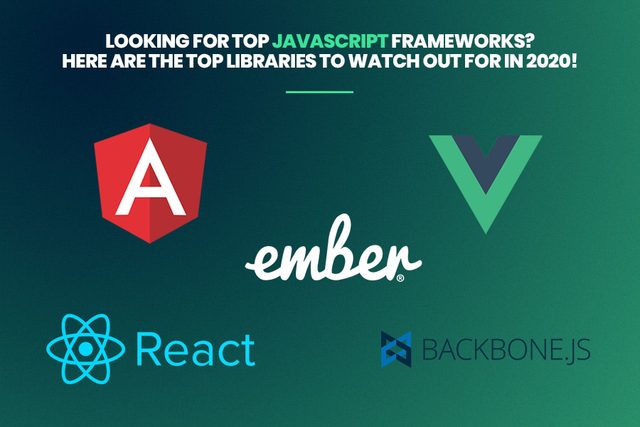
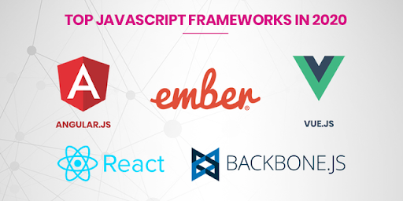
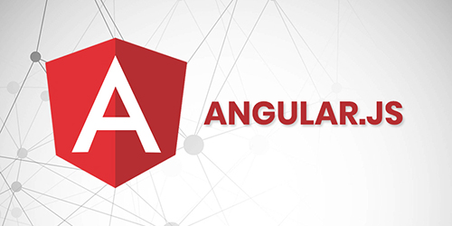
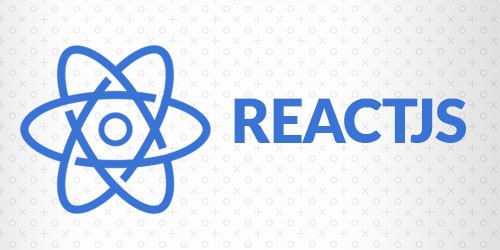
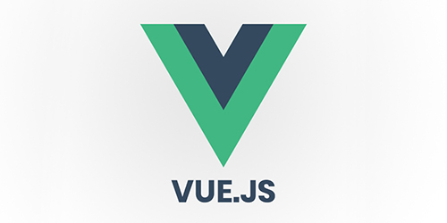
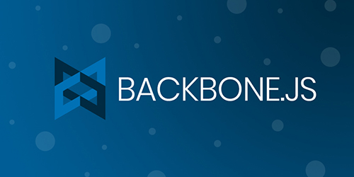
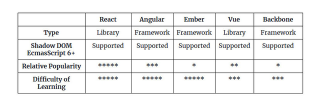

# 寻找顶级JavaScript框架？ 以下是2020年值得关注的顶级图书馆！


“ Java是JavaScript，就像火腿是仓鼠。”-Jeremy Keith

JavaScript世界正在快速发展，不仅是正常的发展，而且发展迅速。 随着Web应用程序开发的趋势和技术的不断发展，javascript框架的主导地位继续进一步提高。 全球越来越多的开发人员开始采用这种语言，因此很容易将其构成为最有效的编程语言之一。

如今javascript变得流行和苛刻的主要原因之一是因为该语言的生态系统现在变得越来越丰富并且变得更好。

是! 就生态系统而言，我明确指出

Javascript框架不过是一个倾向于呈现交互式和数据驱动接口的Javascript库。

每当用户在界面或应用程序上触发交互时，都会向用户提供数据。 在过去的几年中，大量的Web开发框架已经开始与javascript联手，因此2020年对于javascript框架来说是光明的。

因此，为帮助您在2020年成为前端大师，我们列出了所有javascript开发人员的javascript框架列表。在做出选择之前，您可以权衡每个JS框架的优缺点。
## 让我们开始！
# 2020年顶级Javascript框架


不断更新最好的javascript库2020，这是您将来可以考虑的决策。 这不仅会阻止您投资在市场上不再流行的JS框架，而且还可以帮助您选择会影响企业的投资回报率和最终结果的选择。
# 1. AngularJS


AngularJS是2020年最受欢迎的JavaScript框架之一，换句话说，它是最可靠的前端框架之一，该框架已经在市场上占据了相当一段时间。 不仅如此，而且似乎在未来几年内还将继续这样做。 是的，在Angular 5发行后以及新版本的Angular 6中，角度缩放的新高度很快流行起来。

AngularJS被称为MVW（无论模型如何查看）框架，因此非常适合满足初创企业和中型企业的需求。 结构框架基于HTML，HTML基于应用程序中组件的需求。 这使开发人员可以轻松地编写，编辑和修改语法。
# 在2020年选择AngularJS的原因
+ AngularJS将提供两种方式将数据绑定到用户和开发人员。 如果用户界面发生任何类型的更改，那么它将立即对对象应用产生影响，反之亦然
+ 该框架中的声明式范式用于在Angularjs中构建模式。 它创建的代码更加轻量
+ AngularJS是一种使用HTML的模式语言，因此它倾向于使用指令扩展，然后将这些指令添加到重要行为的代码信息中。
+ AngularJS得到了Google长期的强大支持，因此对许多外包软件公司来说确实是有益的。
+ Angularjs由专业的技术专家构建和操作。 它涉及核心开发团队的成员以及其他专业人员。
# 2. ReactJS


ReactJS由Facebook开发，因此被构造为构造用户界面使用最广泛的Javascript库之一。 它有助于构建交互式和可重用的UI组件。 根据有关各种资源的最新数据，该语言被认为是Web开发公司采用的最高质量的设置之一。

实际上，有些开发人员认为它比angularJS更快。 对于需要简单，可扩展和快速的框架的人来说，此框架是理想的选择。 与其他javascript框架相比，该框架被全球38％的开发人员使用，并且已成为Netflix，Paypal，BBC和许多其他组织等企业的第一选择。
# 在2020年选择ReactJS的原因
+ 它为用户提供了一套很好的文档以及在线资源，因此由于数据或信息的单向流动而提供了稳定的代码。
+ 服务器端渲染是有可能的，因此它仅是视图层，因此很适合任何框架。
+ 它具有易于学习的曲线，因此它是一种快速，高效，灵活和小巧的框架，因此被许多移动应用程序开发公司所使用。
+ 虚拟DOM为用户提供了更好的用户体验，因此也有助于提高性能。
+ 开源库鼓励贡献
# 3. Vue.JS


Vue是用于视图层的javascript库，类似于ReactJS。 在这里可以看到虚拟DOM倾向于提高性能。 该框架是Angular和ReactJS的组合。 此概念本身已在市场中引入。 当归结为与React JS的相似性时，Vue.js还会验证并要求开发人员和专家将样式表之外的组件逻辑和布局存储在一个文件或文件夹中。 不仅如此，框架还包括与React JS的相似之处，因此它使用道具和状态对象。

毫无疑问，如果用户熟悉Angular和ReactJS框架，那么他们在操作该框架时也不会遇到任何问题。 因此，如果您想雇用使用Vue.js作为项目框架的Web开发人员，那将是一个不错的决定。 但是，还有另一个原因使Vue.JS受到关注。 想法是该框架具有Redux库，该库有助于开发复杂的大规模应用程序。
## 阅读更多：看看为什么这些主要的Web开发趋势和技术将统治2020年
# 在2020年选择VueJS的原因
+ 该框架由轻量文件组成，换句话说，Vue.js的文件尺寸较小
+ 它是易于理解，开发和理解的那些框架之一，因此使用户的任务变得容易。
+ 该框架包括一个简单的集成和全面的文档
+ 该框架以其灵活性着称。 因此，它允许用户在任何平台上都变得灵活。
+ 这对促进双向通信很有用，因此，在租用编码器时，您会清楚地知道项目中需要什么。
+ 它为开发人员提供了快速的采用。 用户应该知道它自发布以来仅几年时间； 因此，有几家企业已开始将Vue纳入其技术堆栈，并且该框架的前景一片光明
+ 该框架在集成方面更容易，因此使用HTML元素更实惠
# 4. Ember.Js


这是一个真正基于MVVM模式的开源客户端javascript框架，它用于借助代码惯用法和其他仅适用于Web应用程序的分类来构建可伸缩的单个网页。

Ember.js将HTML和CSS用作开发目的的主要模型，其路由和功能用于URL的管理。 该框架的体系结构由以下部分组成：适配器，组件，控制器，路由，模型，帮助程序和插件，因此这就是许多软件开发公司采用该框架的原因。 该框架的最佳功能之一是其命令行界面工具。 这可以帮助前端开发人员提高生产力，并允许他们通过准备就绪的设置来完成项目。
# 在2020年选择Ember.js的原因
+ ember的命令行界面有助于快速制作原型，并有助于管理依赖性。
+ 服务器有助于构建用于应用程序开发的框架，并为移动应用程序开发解决方案提供适当的服务
+ 将授予用户Ember js库和Ember数据用于数据管理。
+ 它为用户提供了适用于chrome和firefox浏览器的检查器开发工具。
+ 为开发人员提供了Qunit测试
# 5. Backbone.js


在雇用软件开发人员并开始工作之前，还有一个框架在市场上引起了不小的轰动。 Backbone.js是基于MVC架构的框架。 该框架有助于实现与控制器相同的组件逻辑。 它使用诸如mustache和underscore.js之类的引擎

它是允许快速开发单页应用程序的最灵活的框架之一。 为了充分利用此框架，用户必须选择工具：卓别林，胸部，车把和许多此类工具。 如果用户需要设计具有不同类型的受众群体的应用程序，则可以使用骨干集合来分离模型。
# 2020年使用Backbone.js的原因
+ 骨干库由事件，模型，视图，集合，路由器和其他内容组成
+ 用户可以使用模板引擎，例如mustache和jQUery tmpl
+ 为用户提供用于构建骨干应用程序的骨干生成器CLI
+ Backplug在线存储库CLI，用于构建主干应用程序
+ 它是前端和后端开发的理想选择之一，并且该框架支持REST API，这些REST API用于同步前端和后端。
+ 当您为项目雇用移动应用程序开发人员时，此框架将使他们的工作变得容易。
# 比较五个框架：哪个适合您的项目？


并非每个基于javascript的框架都是一个框架，但是如果您将其与几个库组合在一起，并构建那些不像真正的框架那样的框架场景。

因此，无论您选择哪种框架，都要确保它们与项目相符，并且可以与项目相称。 即将做出决定的Java应用程序开发公司应首先考虑上述因素。
## 阅读更多：Java vs JavaScript：2019年最佳选择是什么？
# 结论

您可能仍处在困境中，您将遇到以下问题：我应该选择哪一个？

好吧，没有确切的答案。 首先，这取决于结果。 必须考虑要计划和使用的其他工具。 毕竟，某些框架在集成的帮助下表现更好，而其他框架则可以拥有完整的组件，而不太适合辅助解决方案。

雇用Java应用程序开发人员时，请确保他们精通框架。

我们希望本文为您想到的问题提供所有可能的答案。 如果您有与类似主题相关的任何疑问，则可以在下面的评论部分中给我们写信。 专业人士和专家将尝试解决问题，并为您提供必要的帮助。
```
(本文翻译自Sophia Martin的文章《Looking for Top JavaScript Frameworks? Here are the top Libraries to watch out for in 2020!》，参考：https://medium.com/dataseries/looking-for-top-javascript-frameworks-here-are-the-top-libraries-to-watch-out-for-in-2020-7722a283e23c)
```
