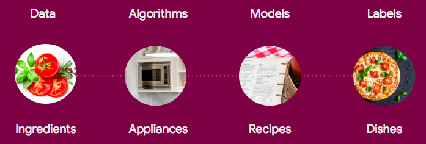

# 机器学习-皇帝穿衣服吗？
## 幕后研究了机器学习的工作原理


机器学习使用数据中的模式来标记事物。 听起来神奇吗？ 核心概念实际上非常简单。 我说“尴尬”，因为如果有人让您觉得这很神秘，那么他们应该会感到尴尬。 在这里，让我为您解决。

核心概念非常简单。

我们的事物标签示例将涉及将葡萄酒分类为好吃或不那么好吃，我们将使所有创意保持足够简单，以便与一杯或三杯葡萄酒一起享受。 如果不是您要喝酒，那么这里是同一文本的无酒精版本。
# 它是如何工作的？

> ML’s not magic — it’s impossible to learn without data, so I’ll have to taste some wine. If you must know, this one got a N label, N for nope-let’s-not-try-this-again . And I got it all over myself. The things we do for science.

## 数据

要学习，您需要学习一些东西。 假设我品尝了50种葡萄酒（用于科学！），并在下面可视化了它们的信息，以供您欣赏。 每种葡萄酒都有多年的年龄和评价得分，以及我们尝试学习的正确答案：Y代表美味，N代表不太美味。

> After I’ve tasted the wines and recorded their data in a spreadsheet (left), good manners dictate that I show the info to you in a more eye-friendly format (right). If you’re craving dataset jargon like features and instances, here’s my guide to that stuff. Since we’re among friends, “inputs” will do just fine.

## 算法

通过选择要使用的机器学习算法，我们选择了将要获得的食谱类型。 你为什么不成为我的算法？ 您的整个工作是将红色与蓝色分开。 你可以做到吗？

机器学习算法的目的是选择最明智的位置，以便在数据中放置栅栏。

如果您想画一条线，那么恭喜您！ 您刚刚发明了一种名为…perceptron的机器学习算法。 是的，这么简单的事情就这么科幻名字！ 请不要被机器学习中的行话吓倒，它通常不应该受到惊吓，并且敬畏这个名字。

> How would you cordon off the red things from the blue?


但是你的电话线去哪儿了？ 希望您会同意，平装电话不是一个非常明智的解决方案。 我们的目标是将Y与N分开，而不是装饰地平线。

机器学习算法的目的是选择最合适的放置栅栏的位置，并根据您的数据点到达的位置来决定。 它是如何做到的？ 通过优化目标函数。
## 优化

我计划在自己的博客文章中进行优化，但现在就这样思考：目标函数就像是为棋盘游戏评分的规则，优化它是在弄清楚如何玩游戏，以便尽可能获得最高分。

> An objective function (loss function) is like the point system for a board game. This photo suggests that back in college I had yet to learn optimization… why am I playing the land-war-in-Asia strategy?


传统上，在ML中，我们比胡萝卜更喜欢棍棒–分数是对错误的惩罚（在错误的栅栏上贴上标签），而游戏则是尽可能减少这些不良点。 这就是为什么ML中的目标函数往往被称为“损失函数”，而目标是使损失最小化的原因。

损失功能就像是为棋盘游戏评分的规则，对其进行优化可以找出玩法，从而获得最佳分数。

想去玩？ 返回上图，将手指水平放在屏幕上并旋转，直到获得零分的不良分数（没有任何分数可以逃脱手指粗暴的怒气）。 恭喜Perceptron同志！ 感觉未来主义了吗？

机器学习中的行话通常不应该受到惊吓，敬请敬畏。

希望您找到的解决方案是这样的：

> In the leftmost image, c’mon; we’re not even trying. Hopefully you’ll agree that the middle one is better, but it still doesn’t fit as well as it can. I’m a fan of rightmost one.

## 生活的香料

如果您喜欢多种语言，那么您会喜欢算法。 有很多。 它们彼此不同的一种方式是，他们如何在分隔边界的不同位置上尝试。

如果您喜欢多种语言，那么您会喜欢算法。 有这么多！

优化书呆子会告诉您，以很小的增量旋转栅栏确实很la脚（对不起，您被骗了！），还有许多更好的方法可以更快地到达最佳位置。 一些研究人员一生都致力于找到在最少的跃点中获得最佳栅栏位置的方法，而不管地形（由您的输入确定）如何变态。

多样性的另一个来源是边界的形状。 原来栅栏不一定要直。 不同的算法使用不同种类的栅栏。

> When we pick these gobbledygook names, we are simply picking the shape of the boundary that we are drawing between the labels. Do we want to separate them with one diagonal line or many horizontal/vertical lines or flexible squigglers… or something else? There are lots and lots of algorithms to pick from.

## 赶时髦的人的算法

这些天来，没有任何一个数据科学界热衷于谦虚的直线。 灵活，波浪状的形状在当今时尚人群中风行一时（您可能将它们称为神经网络，尽管关于神经网络的知识并不多-半个世纪以来，它们的名字颇为理想，似乎没人喜欢我的 建议将它们重命名为“瑜伽网络”或“许多数学运算层”）。

> Instead of the marketing-hype-scented comparison of other algorithms with lines and neural networks with brains, it’s better to think of them in terms of contortionist ability. Those other methods are simply less talented at data yoga. Nothing is free, however, and neural networks exact a hefty price (more on this soon!), so don’t trust anyone who tells you they’re always the best solution.


神经网络也可以称为“瑜伽网络”，它们的特殊功能为您提供了非常灵活的边界。

这些gobbledygook算法名称会告诉您他们打算将哪种围墙形状尝试放入您的数据中。 如果您是应用机器学习的狂热者，那么您可以不记住它们就可以了-实际上，您将通过尽可能多的算法来推送数据，然后对看起来很有希望的事物进行迭代。 一直在吃布丁的证据……所以就吃吧。
![Even if you study the textbook, you won’t get the solution right on your first try. Don’t sweat it. This isn’t a game with one right answer and no one gets their solution on the first try. Give yourself permission to tinker, dabble, and play. The proof of machine learning pudding’s in the eating — does it work on new data? Leave the “how does it work” for researchers who design new algorithms. (And you’ll probably end up getting familiar with those names the same way you learned the characters of whichever bad soap opera haunts your town’s TV screens. Against your will. Give it time.)](1*CV27-phNZaekYzum3L3vqg.png)
> Even if you study the textbook, you won’t get the solution right on your first try. Don’t sweat it. This isn’t a game with one right answer and no one gets their solution on the first try. Give yourself permission to tinker, dabble, and play. The proof of machine learning pudding’s in the eating — does it work on new data? Leave the “how does it work” for researchers who design new algorithms. (And you’ll probably end up getting familiar with those names the same way you learned the characters of whichever bad soap opera haunts your town’s TV screens. Against your will. Give it time.)

## 模型

栅栏到位后，算法就完成了，您从中得到的就是您想要的东西：一个模型，这只是菜谱里的一个花哨词。 现在，这是一些指令，供计算机在下次给我展示一瓶新酒时用来将数据转换为决策。 如果数据落在蓝色位，则将其称为蓝色。 在红色的位？ 称它为红色。

## 标签

将刚创建的模型投入生产后，就可以通过向计算机输入年龄和评论评分来使用它。 您的系统查找对应的区域并输出标签。

> When I get four new bottles of wine, I simply match their input data against the recipe’s red and blue regions and label them accordingly. See? It’s easy!


我们如何知道它是否有效？ 我们以同样的方式知道打字机上是否有一群猴子写了莎士比亚作品。 通过检查输出！

吃的时候有布丁的证明。

通过运行一堆新数据来测试您的系统，并确保其性能良好。 实际上，无论是算法还是程序员为您准备了该配方，无论如何都要这样做。
## 摘要

这是我的另一篇文章为您提供的直观摘要：

## 诗人的机器学习

如果这令人困惑，也许您会更喜欢这个比喻：一位诗人选择了一种在纸上写单词的方法（算法）。 该方法确定了最终的诗歌形式（边界形状）-是句还是十四行诗？ 一旦他们完成了最佳的十四行诗充实，这就是一首诗（模特）。 一首诗怎么写？ 打我-我乐于接受建议。 不过，其余的类比工作。
## ML模型与传统代码

我想指出的是，该食谱与程序员通过盯着问题并手动制定一些规则而编写的代码并没有什么不同。 已经退出拟人化机器学习。 从概念上讲，模型与常规代码具有相同的含义。 你知道，这种食谱是由一些拥有观点和咖啡因的人手工制作的。

已经退出拟人化机器学习。

undefined
## 这就是全部吗？

是的，差不多。 机器学习工程的困难部分是安装软件包，然后整理数据集的毛茸茸的野兽，以便设计出挑剔的算法。 接下来就是千篇一律的代码设置（不要让高贵的名字“超参数调整”欺骗了您），直到出现错误为止！ 一个模型！ 当您评估其在新数据上的性能时，结果证明那是行不通的……您一次又一次地回到绘图板上，直到最后一片苍白，您的解决方案不再让自己尴尬。 这就是为什么为此工作聘请容错的人物如此重要的原因。

不要因为简单而讨厌它。 杠杆也很简单，但是它们可以移动世界。


如果您期待魔术，那么，越失望越好。 科幻迷信兴奋之死为重生铺平了道路：为完成有趣的事情而兴奋。 机器学习可能是平淡无奇的，但是您能用它做什么却是不可思议的！ 它可以帮助您编写自己无法想到的代码，从而使无法解释的事情自动化。 不要因为简单而讨厌它。 杠杆也很简单，但是它们可以移动世界。

如果您渴望开始AI / ML项目，请在这里为您提供逐步指南。 请享用！
```
(本文翻译自Cassie Kozyrkov的文章《Machine learning — Is the emperor wearing clothes?》，参考：https://medium.com/hackernoon/machine-learning-is-the-emperor-wearing-clothes-59933d12a3cc)
```
