## 密谋实验—散点图
### 使用Plotly深入研究散点图
## Python中数据可视化的新层次
### 如何使用单行Python制作美观，完全交互的图
## 图库示例-Seaborn 0.9.0文档
### 编辑描述
## Plotly Python图形库
### Plotly的Python图形库可生成交互式的，具有出版物质量的图形。 如何制作线图的示例…

参考文献：
## Plotly Python图形库
### Plotly的Python图形库可生成交互式的，具有出版物质量的图形。 如何制作线图的示例…
## 图库示例-Seaborn 0.9.0文档
### 编辑描述
## Python中数据可视化的新层次
### 如何使用单行Python制作美观，完全交互的图
## 密谋实验—散点图
### 使用Plotly深入研究散点图
# Matplotlib vs.Seaborn vs.Plotly
## 您如何扩大数据可视化？

清晰有效的数据可视化是优化传达结果的能力的关键。 使用Matplotlib，Seaborn和Plotly等各种软件包时，了解它们的功能以及其背后的语法可能会令人迷惑。 我将指导您使用2017 Spotify热门曲目的csv文件使用上述每个程序包在Python中创建一些常见的图形。

首先，我将导入pandas软件包以将我的csv读取到易于阅读的数据框中。
```
import pandas as pddf = pd.DataFrame(pd.read_csv('featuresdf.csv'))
```
# 直方图

我需要导入matplotlib软件包：
```
import matplotlib.pyplot as plt%matplotlib inline
```

要绘制覆盖可跳舞性和能量得分的直方图，我可以使用以下代码：
```
#set figuref, ax = plt.subplots(1,1)#graph histogramplt.hist(df['danceability'], bins=10, alpha=0.5, color='purple', label='Danceability')plt.hist(df['energy'], bins=10, alpha = 0.5, color='blue', label='Energy')#set legendplt.legend(loc='upper right')#set title & axis titlesax.set_title('Danceability Histogram', fontsize=20)ax.set_xlabel('Danceability')ax.set_ylabel('Frequency')#set x & y rangesplt.xlim(0,1)plt.ylim(0, 30)plt.show()
```
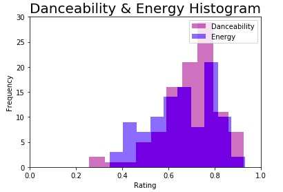

注意该图的稀疏性质。 但是，运行以下代码后，您可以看到图形的改进方式：
```
import seaborn as snssns.set(style='darkgrid')
```
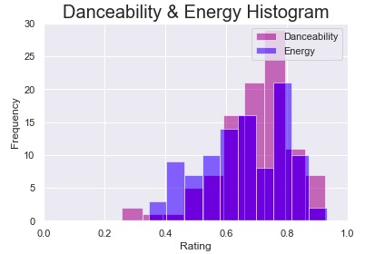

Seaborn允许我们在场景中添加漂亮的背景并改进字体。 您可以设置样式= darkgrid，whitegrid，dark，white和ticks。 我们也可以使用seaborn称为distplot绘制同一图形：
```
f, ax = plt.subplots(1,1)sns.distplot(df['danceability'], bins=10, label='Danceability', color='purple')sns.distplot(df['energy'], bins=10, label='Energy', color='blue')ax.set_title('Danceability & Energy Histogram', fontsize=20)ax.set(xlabel='Rating', ylabel='Frequency')ax.set_xlim([0, 1])ax.legend()
```
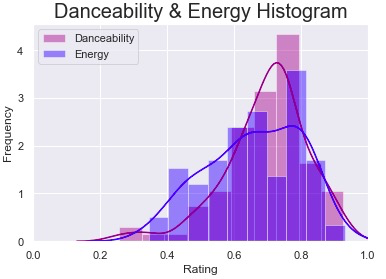

几乎完全一样，对不对？ Seaborn基于matplotlib构建，因此您可以同时使用它们。 Seaborn仅具有自己的图形库，并且内置了令人愉快的格式。但是，它不具有matplotlib的所有相同功能。 例如，如果要创建相同的直方图，但两个变量彼此相邻堆叠而不是覆盖，则需要回退到matplotlib：
```
#set figuref, ax = plt.subplots(1,1)#next to each otherplt.hist([df['danceability'], df['energy']], bins=10, alpha=0.5, color=['red', 'blue'], label = ['Danceability', 'Energy'])#set legendplt.legend(loc='upper right')#set title & axis titlesax.set_title('Danceability & Energy Histogram', fontsize=20)ax.set_xlabel('Rating')ax.set_ylabel('Frequency')#set x & y rangesplt.xlim(0,1)plt.ylim(0, 30)plt.show()
```
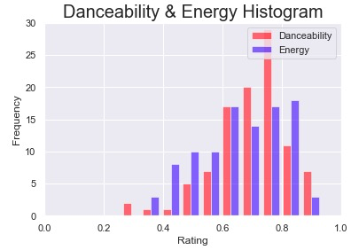

Seaborn的图形内置功能可能会有所帮助，但如果您想进一步自定义图形，则可能会受到限制。

Matplotlib和Seaborn可能是最常用的数据可视化程序包，但是有一种更简单的方法可以生成优于以下任何一种图形的图形：Plotly。 要开始使用Jupyter笔记本，请运行以下代码：
```
pip install chart-studioconda install -c plotly chart-studio# Standard plotly importsfrom chart_studio.plotly import plot, iplot as pyimport plotly.graph_objects as gofrom plotly.offline import iplot, init_notebook_mode# Using plotly + cufflinks in offline modeimport cufflinkscufflinks.go_offline(connected=True)init_notebook_mode(connected=True)
```

要使用默认的Plotly设置绘制与上述相同的重叠直方图：
```
fig = df[['danceability', 'energy']].iplot(kind='hist', color=['purple', 'blue'], xTitle='Danceability',                  yTitle='Frequency', title='Danceability Histogram')
```
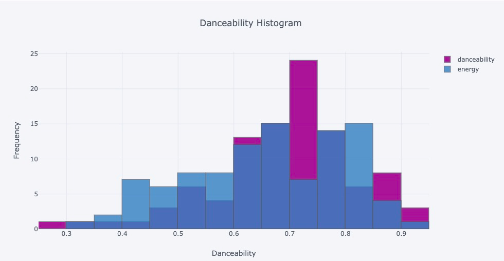

图表会自动具有悬停工具功能-将鼠标悬停在任何数据条上都会显示数值。

要并排绘制条形图或以其他方式自定义图形，代码会更长一些，但相当直观。 您可以从越来越多的可用默认主题列表中指定所需的主题，包括一个以seaborn为原型的模型（如下所述）。
```
#install themes & view availableimport plotly.io as piopio.templates
```

您还可以使用以下默认颜色代码指定颜色：
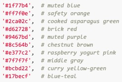

最后，绘制图形：
```
#plottrace1 = go.Histogram(    x=df['danceability'],    name='danceability', #name used in legend and hover labels    xbins=dict( #bins used for histogram        start=0,        end=10,        size=0.1    ),    marker=dict(        color='#1f77b4',    ),    opacity=0.75)trace2 = go.Histogram(    x=df['energy'],    name='energy', #name used in legend and hover labels    xbins=dict( #bins used for histogram        start=0,        end=10,        size=0.1    ),    marker=dict(        color='#9467bd'    ),    opacity=0.75)data = [trace1, trace2]layout = go.Layout(template='seaborn', #set theme    title='Danceability & Energy Histogram',    xaxis=dict(        title='Danceability & Energy'    ),    yaxis=dict(        title='Frequency'    ),    bargap=0.2,    bargroupgap=0.1)fig = go.Figure(data=data, layout=layout)iplot(fig, filename='styled histogram')
```
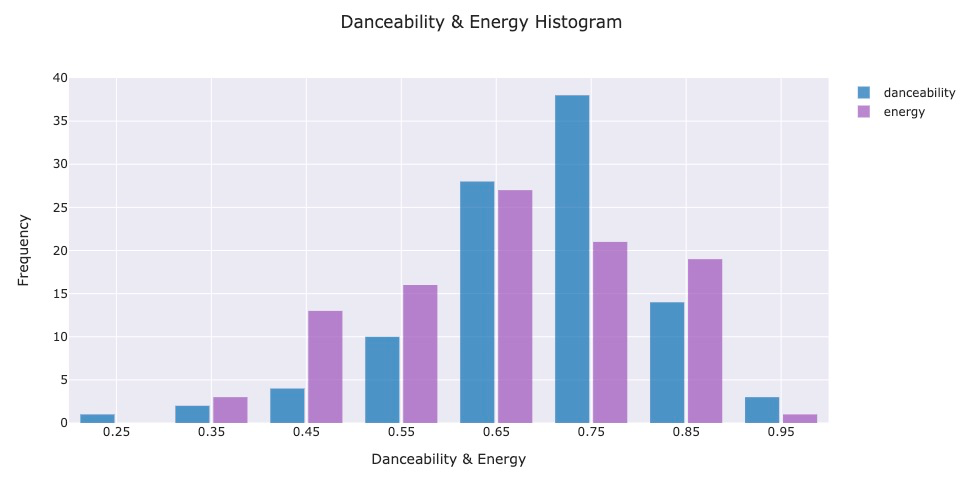
# 散点图

要在matplotlib中绘制响度得分与价的关系，请执行以下操作：
```
#set figuref, ax = plt.subplots(1,1)#plotplt.scatter(df['loudness'], df['valence'], s=df['energy']*100)#set title & labelsplt.title('Scatterplot: Loudness vs. Valence', fontsize=20)plt.xlabel('Loudness')plt.ylabel('Positivity')#set x rangeax.set_xlim([0, -10])plt.show()
```
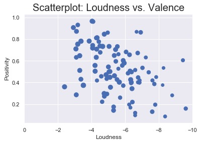

在seaborn中：
```
fig = sns.scatterplot(x=df['loudness'], y=df['valence'], size = df['energy'],sizes = (40,200))fig.figure.suptitle("Scatterplot: Loudness vs. Valence", fontsize = 25)fig.set(xlabel='Loudness', ylabel='Positivity')fig.set_xlim([0,-10])
```
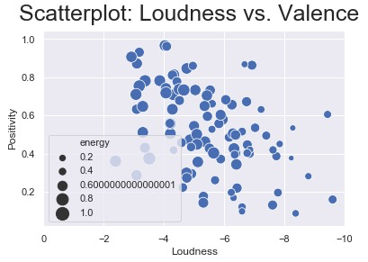

如果要向图形添加回归线，则Seaborn的regplot图形将使此操作变得无限简单：
```
fig = sns.regplot(df['loudness'], y=df['valence'], data=df)fig.figure.suptitle("Scatterplot: Loudness vs. Valence", fontsize = 25)fig.set(xlabel='Loudness', ylabel='Positivity')fig.set_xlim([0,-10])
```

要为此添加相关系数，请从scipy导入pearson.r程序包，然后执行以下步骤：
```
import numpy as npfrom scipy.stats import pearsonr#calculate correlation coefficientcorr = pearsonr(df['loudness'], df['valence'])corr = [np.round(c, 2) for c in corr]#add the coefficient to your graphtext = 'r=%s, p=%s' % (corr[0], corr[1])ax = sns.regplot(x="loudness", y="valence", data=df)ax.text(-7.5, 0.9, text, fontsize=12)
```
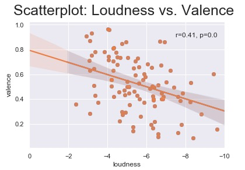

最后，借助Plotly，我们可以使用默认设置再次创建散点图：
```
fig = go.Figure(data=go.Scatter(x=df[‘loudness’], y=df[‘valence’],mode=’markers’))fig.update_layout(title=’Loudness vs. Valence (Positivity)’)fig.layout.template = ‘seaborn’fig.show()
```
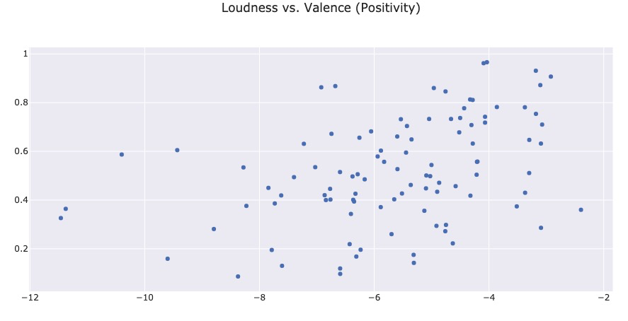

通过添加另一个称为“ lineOfBestFit”的跟踪并使用numpy计算回归，我们可以绘制回归线：
```
dataPoints = go.Scattergl(    x=df.loudness,    y=df.valence,    mode='markers',    marker=dict(        opacity=1,        line=dict(            color='white'        )    ),    name='Data points')data=[dataPoints]layout.update(    yaxis=dict(        title='Energy'),    xaxis=dict(        title='Danceability'    ))figure.update(    data=data,    layout=layout)m,b = np.polyfit(df.loudness, df.valence, 1)bestfit_y = (df.loudness * m + b)lineOfBestFit=go.Scattergl(    x=df.loudness,    y=bestfit_y,    name='Line of best fit',    line=dict(        color='blue',    ))data=[dataPoints, lineOfBestFit]figure = go.Figure(data=data, layout=layout)figure.update_xaxes(autorange="reversed")figure.layout.template = 'plotly_dark'iplot(figure)
```
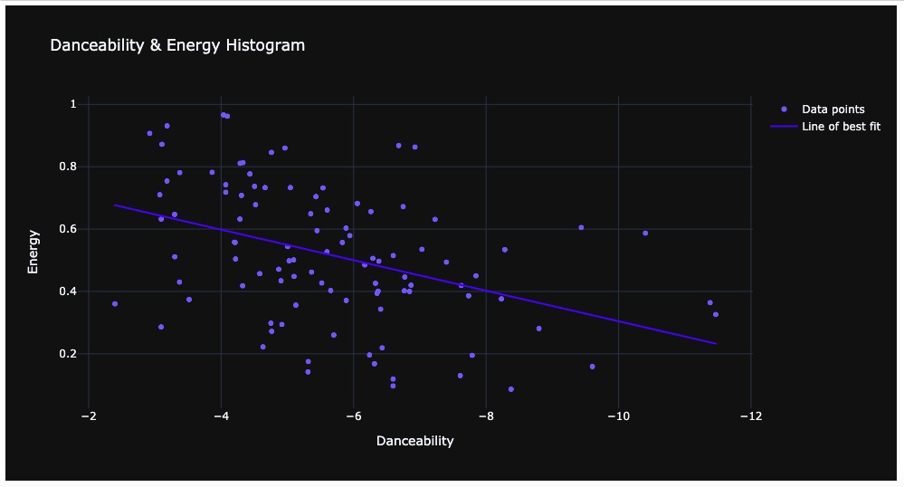

undefined
