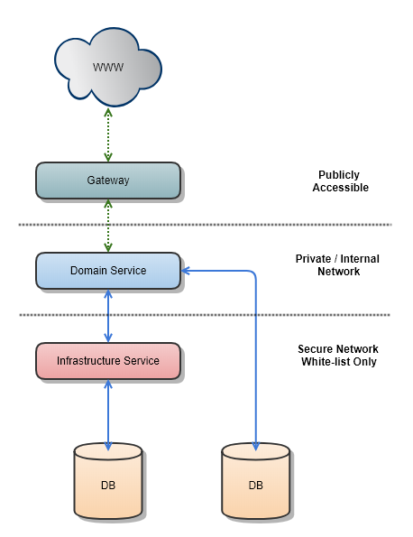
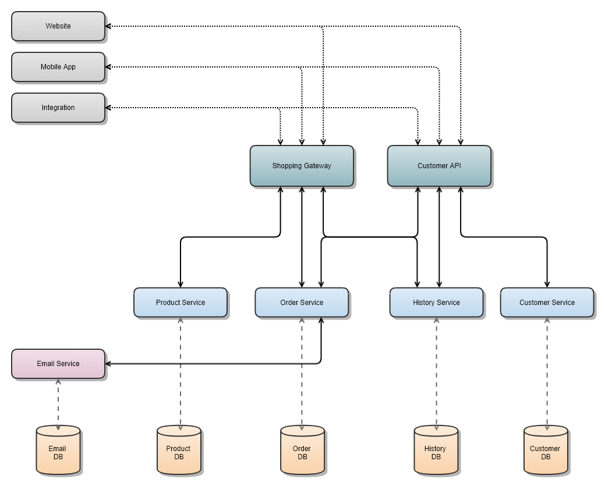
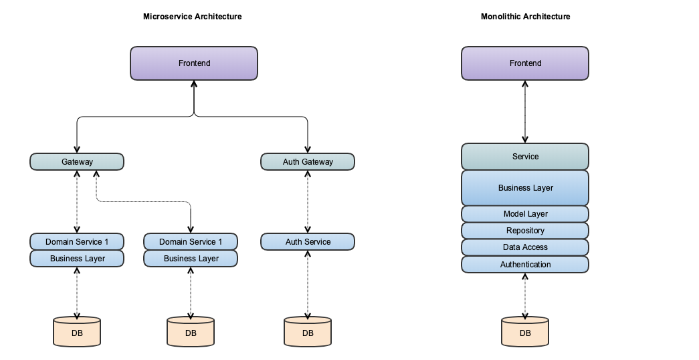

# 结论

您是选择使用微服务，无服务器功能还是坚持使用整体服务； 最终，您必须选择最适合您的平台和团队的内容。 您必须考虑到公司采用的技术标准或语言，或者公司希望采用的技术指导。我坚信微服务应该成为构建现代Web服务的标准。

有许多方法可以沿着微服务道路走，许多人对此事有很强的见解。 不要害怕慢慢地遍历一个模式，看看什么有效，什么无效。 如果它开始不适合您的目标，请进行调整。 不用遗憾，这是我们学习和改进现有模式的方法！

随着我对无服务器功能的了解越来越多，肯定有一个地方可以填补微服务的空白。 但是，在某些情况下，也可以完全取代它，例如处理来自第三方服务（例如Twilio）的Web挂钩。 即弃即用模式是学习无服务器并防止微服务执行过多操作的绝对完美方法。 但这是我们应该在另一篇文章中探讨的内容。
# 好的，微服务适合我，现在呢？

有很多策略可以将整体拆分为微服务，我将在另一篇文章中深入介绍。 但是在此之前，让我们介绍一些高层次的兴趣点。 有四个要点要解决，我将按照采用的顺序进行介绍。

1-突破基础架构服务：将基础级别的功能区域分解为整个集群可以使用的服务，这是打破整体的重要的第一步。

电子邮件微服务就是一个很好的例子。 您可以轻松引用Sendgrid nuget包并开始发送电子邮件。 但是，如果您想对每封电子邮件应用逻辑（例如将其包装在模板中），该怎么办？ 您应该站起来一个微服务，该微服务采用通用的数据合同来发送电子邮件，将其封装在服务内的模板逻辑，并使其完成发送电子邮件的工作。 这也使您能够更改电子邮件提供商/机制并仅部署微服务。

2 —将可重复使用的项目移至“包引用”中：与上面的相同，但不需要扩展名或基于租户的自定义。

一个示例是与RabbitMQ实例对话的持久队列连接器。 将此功能包装在服务中没有任何意义。 仅创建一个nuget包并允许服务引用它并调用队列就可以了。

3-识别域服务：识别域可能是进入微服务领域最具挑战性的部分。 开发人员经常为可能（表面上）存在于两个逻辑域之间的业务逻辑块而苦恼。 永远不要重复这种逻辑，如果不能决定，我建议您坚持一个经常问自己的问题：该记录的根数据类型是什么，或者最经常请求哪个域。

参考上面的购物车示例，例如“ GetRecentOrders”之类的调用。 这些数据的根源是历史记录，但由客户提供。 我要做的就是将此呼叫放入“历史记录”服务中，并需要一个CustomerId来获取数据。

4 —识别网关服务：在定义服务拓扑之前，最后一项真正的任务是识别网关。 这可能很困难，因为它是对域进行分组并确定前端（或第三方消费者）如何导航服务的好地方。 但是，您不需要太多的网关。

这样的一个例子是在逻辑上将您的管理服务分组在“ Admin Gateway”后面，并实施更严格的身份验证要求和角色管理。 您甚至可以使用网关将允许使用此网关的IP地址或应用程序列入白名单。


由于每种解决方案都不相同，因此很难给出将整体分解为微服务的蓝图。 但我希望您现在有一个制定自己的策略的基础。
# 微服务适合我吗？

微服务并非适合所有人。 迈出下一步还意味着要做好准备……成功和失败。 这是为工作选择合适的工具。 有时，这意味着您不必选择“热门”技术。 兴奋并没有羞耻，但保持公正很重要。

如果您无法构建整体，那么为什么您认为微服务才是答案？-西蒙·布朗


采用微服务与成熟度和刚性有关。 您必须准备好在部署和Pipepine流程中引入一些麻烦，因为使用微服务，您可以独立部署较小的代码单元，并且必须确保一旦部署，它不会破坏现有的任何内容。

您必须准备好完全采用语义版本控制和包管理。 引入微服务时，我经常听到工程师对软件包管理和“转换版本”的抱怨。 是的，这可能很麻烦，但部署时会有些许痛苦，但会引起一些注意。
# 数据库每个服务还是共享数据库？

进入微服务时，您首先要做出的决定之一是选择每个服务使用一个数据库还是跨服务使用共享数据库。 就个人而言，我更喜欢每个服务使用一个数据库来解耦数据并创建更容易的部署管道。 如果选择这种方式，则需要确定如何跨数据库整合外键或查找数据。 如果您需要将这些数据放在一起进行分析或报告，通常可以将其ETL放入数据仓库并整理数据。

示例：如果您有一个用于客户的微服务和一个用于订单历史记录的微服务，则需要将CustomerId与订单历史记录一起存储。 当ETL运行此历史记录记录时，您将预取客户记录并将数据展平以存储在数据池中的表中。
# 优点缺点

选择微服务有很多优点和缺点，您必须确定最适合您的解决方案的地方。

现在您有100个问题：在过去采用微服务时，我看到的一个结果是，开发人员试图使一切都成为微服务。 我认为，出于抽象的考虑，它离抽象有点太近了。 对于某些人来说这可能是个滑坡，除非您有成熟的团队，否则这可能成为不利条件。

除非您的系统过于复杂而无法作为一个整体进行管理，否则甚至不要考虑使用微服务。 大多数软件系统应构建为单个整体应用程序。 请务必注意该整体中的良好模块化，但不要尝试将其分为单独的服务。-Martin Fowler

独立部署：一个巨大的（有点明显）优势是单个服务的部署可以打破大型“爆炸式”部署。 一旦功能完成并针对生态系统的其余部分进行了集成测试，您就可以部署它，而不必部署整个堆栈。

隔离域：我想向人们介绍的一个概念是安全域概念。 在设计微服务的拓扑时，应考虑这一点。 控制访问权限和服务的生存方式是使服务在需要的地方保持简单但在其他地方保持健壮和安全的一种很好的方法。 以这种方式控制访问也不再需要向“授权”工程师抽象超敏感服务。

> Secure Domains using Infrastructure as Security


通过基础架构实现安全性：将应用程序划分为微服务的一个真正令人敬畏的结果是，能够将敏感或管理服务抽象到防火墙后，并且仅将对它的访问权限列入白名单。 这意味着，例如，电子邮件微服务不可公开访问，但是您的公共服务可以使用它。 这大大减少了应用程序的公共空间。

共享基础结构：沿着这种模式，您应该假设，您在域堆栈中越走越远，服务就可以变得越“共享”。 并非总是如此，但绝对是多数。 电子邮件服务就是一个很好的例子。 与允许每个服务与SendGrid通信（例如）相反，我将构建一个微服务来承担该责任。 所有需要电子邮件功能的服务都需要与该服务进行对话，以便我可以控制谁可以访问。 它还为我提供了一个处理品牌或模板的位置！
# 让我们分解一个例子

系好安全带，这可能需要一点时间。 让我们更深入一点，设计一个理论架构。 在不深入研究杂草的情况下，让我们定义一个跨越几个重要边界的非常简单的商务应用程序。

问题：我们想构建一个公共API来跟踪客户，允许下订单并保留订单的历史记录。 我们希望允许该API支持现代的前端，移动应用程序和第三方集成。 我们还知道，用户在高峰时段浏览产品的频率要比下订单的频率高100倍。 用户创建订单时，我们要向他们发送电子邮件。

> An example microservice architecture to support a commerce application.


解决方案：上面的解决方案乍看之下似乎很复杂，但对我来说几乎没有。 我的第一步是定义我的域，在本例中是产品，订单，历史记录和客户。 我不希望我的服务集成必须单独处理每个服务，否则可能会导致业务逻辑出现一些其他严重问题。

但是为什么要有两个网关？ 这是两倍。 我想避免网关做太多事情，但是它也允许集成有选择地实现功能。 这也使我可以在购物周围部署更新，而不必部署与客户相关的更新。 我们要避免网关变得单一。

每个服务都应该是自包含的，并且不应跨越域壁垒。 这也包括数据存储。 如果需要合并两个服务之间的逻辑，请在网关中将调用绑定在一起。 “不要越过溪流！”


要提到的一件事是电子邮件集成。 这是参数的一个示例：服务或包引用。 我个人认为，应该将诸如SendGrid之类的电子邮件集成包装在基础结构服务中，以便您可以标准化处理电子邮件的方式。 电子邮件集成的很多因素使简单的软件包参考变得复杂。 让我们举几个……
+ 批量发送电子邮件？
+ 交货时间表？
+ 缓存的电子邮件模板？
+ 客户品牌？
+ 电子邮件记录？

如果有这些，则可能需要考虑将其包装在服务中，并将元数据存储在该服务的数据库中。

好了，最后一项…数据位于一堆不同的数据库中，那么报告呢？ 我有一个建议给你； 每个独立的数据库都应具有自己的ETL过程，该过程可以对数据进行非规范化并将其存储在数据湖中。 我还建议任何BI工具都应直接从数据湖查询。 有很多方法可以给猫咪贴皮，但是我喜欢看到人们提出的创新解决方案。
# 混合代码？ 嗯？

微服务架构的一个很酷的方面是，您的整个基础架构不必全部都是相同的结构甚至是相同的语言！ 将应用程序的逻辑域分解为微服务可以使您能够使用正确的工具来完成正确的工作。 如果您的代码库是.net，但您确实希望在Elixir中编写基础结构的线程密集型部分，则可以！ 这也有其自身的问题，但我确实鼓励混合水平的团队组成。 不同的平台和语言都有各自的优缺点。 如果做得对，这可以带来很多好处：
+ 跨团队的交叉授粉模式
+ 向您的工程师介绍新技术
+ 允许感兴趣的工程师突破常规并使用其他语言进行实验
# 门户：您不得通过

可以控制基础结构暴露的一种方法是网关。 可以将它视为控制服务的数据/逻辑流的一种方法，或者将一个或多个域包装在一起的一种方法。 我什至使用网关将外部OAuth身份验证转换为我的内部基础结构可以理解的标准共享密钥，以使其轻巧。 对于那些熟悉域驱动设计的人，我最好的建议是将每个微服务视为有界上下文，并将每个网关都视为域。


实施网关有很多好处：
+ 使用网关来分解身份验证类型或访问方法。
+ 使用网关来拆分域。
+ 使用网关按用户类型，区域或租户指示流量。
+ 使用网关将外部流量与管理流量分开。
# 微服务架构与设计

> Photo by Tatiana Latino on Unsplash


注意：本文内容是我的见解，而不是我的雇主或其他实体的见解。
# 什么是微服务？

从最简单的定义来看，微服务架构是在将逻辑域划分为独立服务的同时开发软件的行为。 在过去的六年中，我听说微服务方法学以惊人的速度增长。 每个人都在谈论微服务！

还有另一个转变，那就是从云计算到微服务。〜Steve Singh（Concur）

大多数尚未使用微服务的工程师都生活在整体代码库中。 生活在一个单一的世界中并不都是一件坏事，并且可以使用许多已建立的架构模式来构建应用程序。 归根结底，您必须选择最适合您的应用的应用，而不是流行的应用。 如果将微服务作为体系结构模式，则逻辑和数据流在服务之间的分解和分布方式之间存在一些根本差异。 让我们快速看一下下面的两个示例。

> Microservices vs Monoliths


通过分解整体并分离层，您可以交换/更新单个层，而无需部署整个代码库！ 不过，这仅仅是开始。

现在，您可以创建物理抽象层以分解代码和逻辑。 创建这些域可以使工程师轻松找到并修复功能。 这也允许独立部署域。 这些抽象也可以通过诸如nuget / npm / etc之类的Package References共享代码。

微服务引入的另一个概念是隔离的数据存储。 微服务中的数据存储有两种思路：隔离数据库或共享数据库。 如果它是共享数据库，则建议按架构拆分域。 虽然，如果它是一个隔离的数据库，您可以决定是否要为不同的域使用不同类型的数据存储。 您的客户域可能使用Sql Server数据库，而您的订单历史记录域可能使用MongoDB。 同样，使用正确的工具完成正确的工作！
```
(本文翻译自Chris Fryer的文章《Microservice Architecture & Design》，参考：https://medium.com/@cfryerdev/microservice-architecture-design-2ac7eaae532)
```
