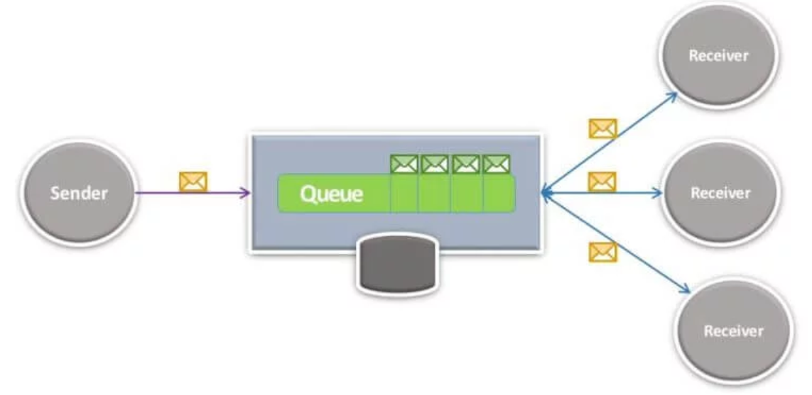

# 现代开源消息传递：NATS，RabbitMQ，Apache Kafka，hmbdc，Synapse，NSQ和Pulsar


＃NATS：先是Ruby，然后是https://nats.io/

https://github.com/nats-io/nats-streaming-serverNATS最初是使用Ruby构建的，每秒可实现150k消息的可观速度。 该团队在Go中重写了它，现在您可以每秒荒谬地发送8-11百万条消息。 它可以用作发布-订阅引擎，但是您也可以使用综合排队。

优点：口号：始终可用，拨号音简洁设计低CPU消耗快速：高速通信总线高可用性高可扩展性轻巧：体积很小，只有3MB Docker映像！ 一旦部署

缺点：忘却，没有持久性：NATS不进行持久性消息传递； 如果您处于离线状态，则不会收到消息。 没有交易没有增强的交付方式没有企业排队

总的来说，NATS和Redis更适合较小的消息（远低于1MB），其中延迟通常在不到毫秒的时间内达到四个9.NATS不是HTTP，它是它自己的非常简单的基于文本的协议，类似于RPC 。 因此，它不会在邮件信封中添加任何标题。

NATS没有复制，分片或整体订购。 使用NATS，队列可以有效地按节点分片。 如果节点死亡，则其消息将丢失。 到活动节点的传入消息仍将传递给已连接的订户，并且订户应重新连接到可用节点池。 一旦先前死掉的节点重新加入，它将开始接收消息。在这种情况下，NATS会替换HAProxy之类的内容； 一个简单的内存路由器，用于请求后端。

NATS的用户包括Buzzfeed，Tinder，Stripe，Rakutan，Ericsson，HTC，Siemens，VMware，Pivotal，GE和Baidu。一个用例：“我们使用NATS进行同步通信，每秒通过它发送约1万条消息。 。 必须说，即使负载更大（超过10MB），稳定性也很高。 我们已经在生产环境中运行了几周，并且没有任何问题。 主要限制是没有联盟和大规模集群。 您可以拥有一个非常强大的集群，但是每个节点只能转发一次，这是有限制的。”

＃RabbitMQ：RabbitMQ是遵循代理的AMQP 0.9.1定义的消息传递引擎。 它遵循标准的存储转发模式，您可以选择将数据存储在RAM中，在磁盘上还是在这两者中。 它支持各种消息路由范例。 RabbitMQ可以以集群方式进行部署以提高性能，而可以通过镜像方式进行部署以实现高可用性。 消费者直接在队列上侦听，但是发布者只知道“交换”。这些交换通过绑定（指定路由范式）与绑定链接到队列。 绑定队列和事务传递语义。 因此，RabbitMQ是一种更为“重量级”的排队解决方案，并倾向于为此付出额外的费用。

缺点：RabbitMQ的高可用性支持非常糟糕。 无论您如何转动，这都是单点故障，因为它无法合并因裂脑情况而导致的冲突队列。 分区不仅会在网络中断时发生，还会在高负载情况下发生。RabbitMQ不会将消息持久保存到磁盘。

＃Kafka：Scala使用Kafka，您可以进行实时处理和批处理。 Kafka在JVM上运行（具体来说是Scala）。 摄取大量数据，通过发布-订阅（或排队）路由。 经纪人对消费者几乎一无所知。 真正存储的只是一个“偏移”值，该值指定使用者在日志中保留的位置。 与许多假定消费者主要在线的集成代理不同，Kafka可以成功保存大量数据并支持“重播”方案。 该体系结构非常独特。 主题按分区排列（用于并行性），分区跨节点复制（以实现高可用性）。

与Kafka相比，NATS是一个很小的基础架构，独角兽初创公司，物联网，健康和大型金融组织（LinkedIn，FB，Netflix，GE，美国银行，房利美，大通银行等）都使用Kafka。与Nats相比，Kafka更成熟，并且在巨大的数据流中表现出色。NATSServer在Kafka中具有部分功能，因为它专注于狭窄的用例集。 NATS被设计用于以下场景：高性能和低延迟至关重要，但是如果需要，可以丢失一些数据以跟上数据的步伐-NATS文档将其描述为“一劳永逸”。从结构上讲，这是因为NATS没有持久性层可用于持久存储数据，而Kafka却具有持久性层（使用群集中的存储）。为了完全确保消息不会丢失，它看起来像您需要将队列声明为持久+将您的消息标记为持久+使用发布者确认。这花费了数百毫秒的延迟。

相对分区分区而言，相对安全的唯一队列或发布/订阅系统是Kafka。 当您需要5至50台服务器时，Kafka就是一个非常可靠的工程。 拥有那么多服务器，您每秒可以处理数百万条消息，这通常对于中型公司而言已经足够。

由于多种原因，Kafka完全不适合RPC。 首先，它的数据模型将队列中的数据分片，每个分区只能由一个使用者使用。 假设我们有分区1和2。P1为空，P2有大量消息。 现在，当C2工作时，您将拥有一个空闲的使用者C1。 C1无法承担C2的任何工作，因为它只能处理自己的分区。 换句话说：一个缓慢的使用者可以阻塞队列的很大一部分。 Kafka专为快速（或至少表现均匀）的消费者而设计。

* NATS与Kafka的关系NATS最近加入了CNCF（托管Kubernetes，Prometheus等项目-在这里查看Golang的优势！）协议-Kafka是基于TCP的二进制文件，而不是NATS是简单文本（也基于TCP）的消息传递模式-两者都支持发布-订阅和队列，但是NATS也支持请求-应答（同步和异步）。NATS具有队列的概念（当然具有唯一的名称），并且挂接到同一队列的所有订户最终都成为一部分属于同一队列组。 （可能多个）订户中只有一个收到消息。多个此类队列组也将接收同一组消息。这使其成为混合的发布－订阅（一对多）和队列（点对点）。 Kafka通过消费者组支持相同的事物，这些用户组可以从一个或多个主题中提取数据。流处理— NATS不像Kafka那样对Kafka Streams提供一流的功能，因此不支持流处理。相对于NATS，NATS提取消息的方式与服务器本身将消息路由到客户端的NATS（内部维护兴趣图）相对。NATS可以采取敏感措施，因为它可以切断不符合生产速度的消费者以及不响应心跳请求的客户。消费者活跃度检查也由Kafka执行。这是从客户端本身完成/启动的，因此可能会导致复杂的情况（例如，当您处于消息处理循环中且未轮询时）。有很多配置参数/旋钮（在客户端上）可调整此行为。交付语义-NATS最多支持一次（并且NATS流至少支持一次），而Kafka则仅支持一次（ NATs似乎没有像Kafka那样对分区/分片消息的概念，在NATS情况下没有外部依赖性。 Kafka要求ZookeeperNATS Streaming似乎与Kafka功能集相似，但是使用Go构建并且看起来更易于设置.NATS目前不支持复制（或实际上没有任何高可用性设置）。与Kafka相比，这是一个主要的缺失功能。

＃hmbdc：C ++

https://bitbucket.org/hmbd/hmbdc-rel/overview http://www.hummingbirdcode.net/设计：https://bitbucket.org/hmbd/hmbdc-rel/wiki/首页效果：http：// 例如：以8字节的消息为例，本地计算机（线程间或IPC）上每秒接收超过100M消息，而在千兆位网络上每秒接收超过600万消息.https：/ /bitbucket.org/hmbd/hmbdc-rel/src/default/perf-sample.txt?fileviewer=file-view-defaultHmbdc可能不会在整个行业中广泛使用。 通过互联网找不到使用hmbdc的网站[1]。

＃突触：C ++

http://open.syn3.nl/syn3/trac/default/wiki/projects/synapse通过检查https://github.com/psy0rz/Synapse，我怀疑这个项目已经过期（3年前）。

＃NSQ：golanghttp：//nsq.io，易于设置NSQ似乎更灵活，它支持消息持久性，并且在持久性要求不高的情况下，还提供类似于NATS的临时通道。 它配备了NATS缺少的闪亮的管理仪表板。 当优先考虑原始性能时，NATS很有用.NATS和NSQ队列均支持按消息TTL，以修剪时间敏感消息。

Kafka很复杂，但保证不会丢失任何数据。 适合订购日志。 NSQ缺乏持久性和复制能力。 大规模操作非常简单。Kafka的性能和增强的保证以难以操作为代价。有了Kafka，除了Kafka经纪人，您还需要一个Zookeeper集群。 Kafka需要考虑分区和偏移量，最好将Kafka视为分布式日志服务，而不是消息传递代理，例如数据库中的预写日志而不是printf语句。

NSQ是一种更为传统的缓冲消息系统。 它具有文件持久性，但仅作为a）优化以防止一旦内存用完就会丢失消息，以及b）作为使用者档案。 但是，节点的严重丢失意味着尚未传递的那些消息可能会丢失，因为无法保证它们会在其他地方发布。 此外，不能保证发布到主题和频道的消息顺序是消费者接收到的消息顺序。 使用NSQ，有一个内置实用程序nsq_to_file，它成为您将每个消息主题归档到磁盘时的另一个使用方。 它提供了简单的邮件存档功能，但不提供任何本地重播功能。

＃Apache Pulsar（pulsar.incubator.apache.org）：Java它是雅虎公司设计的，是一种高性能，低延迟，可扩展的持久解决方案，用于发布订阅消息和消息排队。 Apache Pulsar将高性能流（Apache Kafka追求）和灵活的传统排队（RabbitMQ追求）结合在一起，成为统一的消息传递模型和API。 Pulsar使用统一的API为您提供具有相同高性能的流和排队系统。 总而言之，Kafka的目标是高吞吐量，Pulsar的目标是低延迟。

Pulsar — ProsFeature丰富—持久性/非持久性主题，多租户，ACL，多DC复制等。更易于使用的更灵活的客户端API（包括CompletableFutures，流畅的接口等）。Java客户端组件是线程安全的，消费者可以确认消息 来自不同的线程

Pulsar-ConsJava客户端几乎没有JavadocSmall社区-当前有8个stackoverflow问题与BookKeeper绑定的MessageId概念-与连续数字序列的Kafka偏移量相比，消费者无法轻松地将自己定位在主题上。读者无法轻松阅读关于该主题的最后一条消息 —无需浏览所有消息，直到末尾。无交易。更高的操作复杂性— Zookeeper + Broker节点+ BookKeeper —所有clusterLatency都可疑— Broker节点与BookKeeper之间有一个额外的远程调用（与Kafka相比）

Kafka-ProsMature：非常丰富和有用的JavaDocKafka StreamsMature和广泛的社区在生产中易于操作-更少的组件-代理节点还提供storageTransactions-主题内的原子读取和写入偏移形成连续序列-消费者可以轻松地寻找到最后一条消息

Kafka-ConsConsumer无法确认来自其他线程的消息没有多租户没有健壮的Multi-DC复制-（在Confluent Enterprise中提供）在云环境中的管理很困难。

＃参考：[1] [用于延迟敏感软件开发的高性能C ++（14）消息传递库：cpp] https://www.reddit.com/r/cpp/comments/894y48/a_high_performance_c_14_messaging_lib_for_latency/

[现代开源消息传递：Apache Kafka，RabbitMQ和NATS的应用-Richard Seroter的Architecture Musings] https://seroter.wordpress.com/2016/05/16/modern-open-source-messaging-apache-kafka-rabbitmq- 行动中的本质/

[开源消息传递景观] https://www.slideshare.net/rseroter/the-open-source-messaging-landscape

[NATS.IO是Kafka的真正替代产品吗？ 谁在生产中使用过它？ — Quora] https://www.quora.com/Is-NATS-IO-a-real-alternative-to-Kafka-Who-used-it-in-a-production

[RabbitMQ vs Kafka vs NSQ 2018消息队列比较| StackShare]良好的并排比较https://stackshare.io/stackups/kafka-vs-nsq-vs-rabbitmq

[Kafka vs NSQ 2018消息队列比较| StackShare] https://stackshare.io/stackups/kafka-vs-nsq

[作为在生产中使用RabbitMQ多年的人，您应该… 黑客新闻] https://news.ycombinator.com/item?id=11284489

[Jepsen：RabbitMQ] https://aphyr.com/posts/315-jepsen-rabbitmq

[NATS和Kafka：随机注释| 简单分发]好https://simplydistributed.wordpress.com/2018/03/30/kafka-nats-random-notes/

[在OpenMessaging基准测试中，Apache Pulsar的性能比Apache Kafka高出2.5倍| 美国商业资讯] https://www.businesswire.com/news/home/20180306005633/en/Apache-Pulsar-Outperforms-Apache-Kafka-2.5x-OpenMessaging

[与Apache Pulsar相比，Kafka的优缺点是什么-堆栈溢出] https://stackoverflow.com/questions/46048608/what-are-the-advantages-and-disadvantages-kafka-over-apache-pulsar

[比较Pulsar和Kafka：统一排队和流式传输]很好https://streaml.io/blog/pulsar-streaming-queuing

[Apache Pulsar：它是KAFKA杀手吗？ -巴格文 索尼（Soni）-中]] https://medium.com/@bhagwanssoni/apache-pulsar-is-it-a-kafka-killer-a7538afedd0b

＃好的基准测试报告：[基准测试消息队列延迟-勇敢的新奇] https://bravenewgeek.com/benchmarking-message-queue-latency/ [基准测试NATS流和Apache Kafka — DZone性能] https://dzone.com/ 文章/基准测试nats-streaming和apache-kafka
```
(本文翻译自Philip Feng Ph.D的文章《Modern Open Source Messaging: NATS, RabbitMQ, Apache Kafka, hmbdc, Synapse, NSQ and Pulsar》，参考：https://medium.com/@philipfeng/modern-open-source-messaging-apache-kafka-rabbitmq-nats-pulsar-and-nsq-ca3bf7422db5)
```
