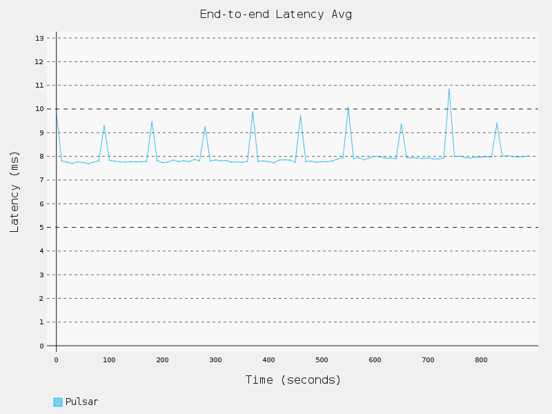
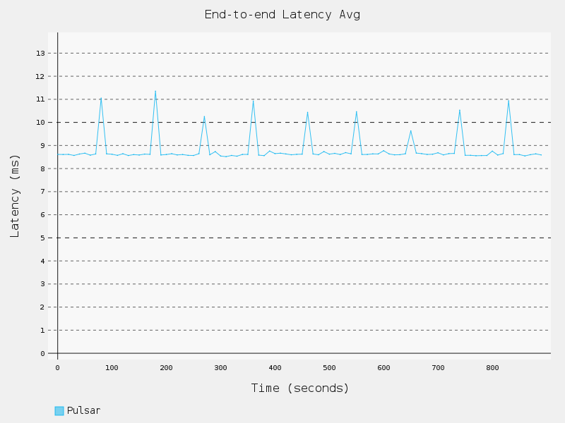
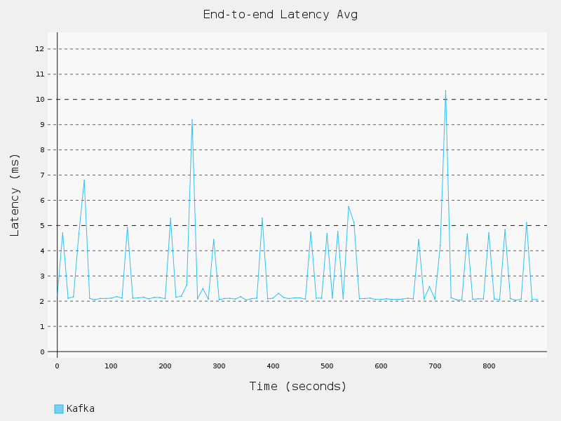
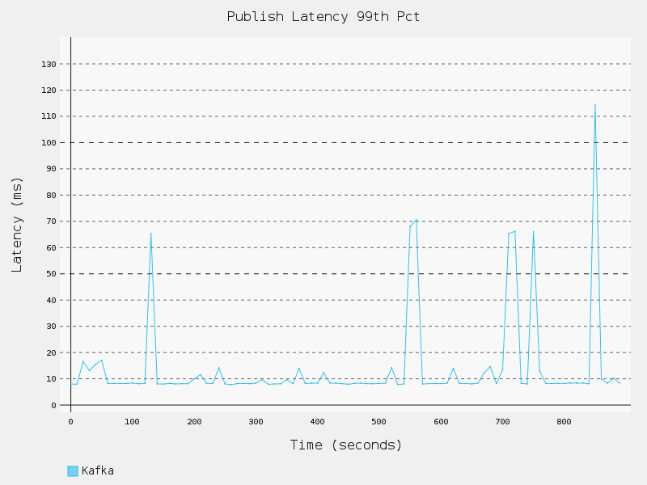
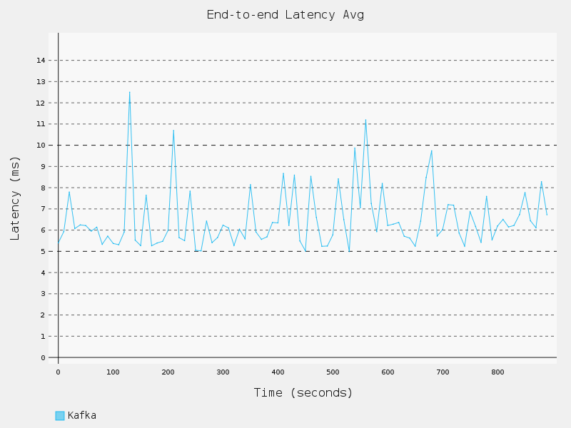

最初于2019年8月29日发布在Kafkaesque博客上。

Apache Pulsar，Apache Kafka和Apache BookKeeper是Apache Software Foundation的商标。

想看看Pulsar是什么？ 只需注册由Pulsar支持的Kafkaesque服务的免费计划即可尝试一下。 只需一分钟即可上手。

# Apache Pulsar和Kafka之间的性能比较：延迟

Apache Kafka以其高性能而闻名。 它能够处理高速率的消息，同时保持较低的延迟。 Apache Pulsar是Kafka的快速增长的替代品。 有报告表明，Pulsar具有比Kafka更好的性能特征，但原始结果不容易找到。 此外，这些报告均基于Pulsar和Kafka的较旧版本，它们都是快速发展的项目。 因此，在一系列文章中，我们将通过一系列性能测试来运行最新的稳定的Kafka（2.3.0）和Pulsar（2.4.0）版本，并发布这些结果。

在第一篇文章中，我们将重点讨论延迟。 在以后的文章中，我们将讨论吞吐量。 在深入测试结果之前，让我们先介绍一下测试方法。
# 消息系统的性能测试

Kafka和Pulsar都将性能测试工具作为其软件包的一部分提供。 虽然可以从任何一个修改性能工具以同时使用它们，但是我们将使用Linux基础协作项目OpenMessaging Project中的第三方基准框架。 OpenMessaging项目的目标是为消息传递和流技术提供与供应商无关的独立于语言的标准。 该项目包括一个性能测试框架，该框架支持各种消息传递技术。 这些测试中使用的所有代码都在OpenMessaging基准测试GitHub存储库中。 这些测试旨在在公共云提供商中运行。 在我们的案例中，我们将使用标准EC2实例在Amazon Web Services（AWS）中运行所有测试。

我们将以一系列GitHub要点发布每次测试运行的完整输出。 因此，欢迎您分析数据并提出自己的见解。 当然，您也可以自己运行测试并生成新数据。 您应该得到类似的结果，因为我们发现即使使用不同的EC2实例集，测试也可以可靠地运行。 在测试过程中，我们多次站起来并拆除了环境。

尽管我们使用OpenMessaging基准测试工具来运行包含一组工作负载的测试，但是我们将添加一些工作负载，这些工作负载的灵感来自LinkedIn Engineering网站上题为“基准化Apache Kafka：每秒200万次写入（ 三台便宜的机器”，因为我们认为进行比较会很有趣。 但是，这是一篇很老的博客文章。 如今，硬件虽然更好，但我们使用的不一定便宜。 因此-扰流板警报-Kafka和Pulsar都可以在博客标题中每秒处理200万次写入，而不会冒汗，我们将在以后的文章中看到。
# OpenMessaging基准测试

OpenMessaging基准测试是一个开放且可扩展的框架。 要添加消息技术进行测试，您只需要添加Terraform配置，Ansible手册和Java库的实现，该Java库控制测试工具中的生产者和使用者。 当前为Kafka和Pulsar提供的Terraform配置相同，在AWS中启动相同的EC2实例集。 显然，出于比较目的，在相同的硬件配置上运行测试非常重要。 因此，现有的基准代码可以轻松比较Kafka和Pulsar。 如前所述，所有运行这些测试的代码都在OpenMessaging GitHub基准测试存储库中。

在开始实际测试阶段之前，所有测试均以预热期开始。 延迟测试以固定的速率发布，并定期记录延迟和吞吐量。

如果您打算自己运行这些测试，请注意。 在AWS中运行测试并不便宜。 需要大量功能强大的EC2实例。 在进行软件基准测试时，这很有意义。 您要确保硬件不是瓶颈，所以您超额订购了硬件。 但是，如果您不小心的话，这种超额订购的成本（每小时5美元，每月3.8万美元）会在您的AWS账单上打上记号。 如果您不使用环境（例如，整夜），则不想让其运行，并确保在运行测试后删除所有资源。
# 性能考量

在深入测试结果之前，我们需要涵盖一些重要概念以将结果置于上下文中。 首先，我们需要检查测试所测量的内容：延迟。 接下来，我们需要检查消息的持久性，尤其是在将消息存储到磁盘时。 最后，我们需要了解Kafka和Pulsar中使用的消息复制的不同模型。

Kafka和Pulsar之间有很多相似之处，但是有一些明显的差异会影响性能。 为了公平地评估两个系统，您需要了解这些差异。
# 延迟测试的注意事项

所有延迟测量都必须包括应用程序和消息传递系统之间的网络延迟。 假设所有测试均在相同的网络配置中执行，并且该网络提供一致的延迟，则网络延迟是一个常数，会平等地影响所有测试。 因此，在比较等待时间测量值时，进行比较时保持网络恒定很重要。

我们指出这一点是因为这些测试中的延迟与LinkedIn工程博客中发布的延迟不同。 这些测试在（大概）专用的1 GB以太网上运行。 我们的测试在公共云提供商的黑盒网络中运行，并提供“高达10吉比特”网络性能的实例。 因此，此测试中的延迟时间数不能直接与该博客文章中的延迟数进行比较。 但是，由于我们保持网络配置不变，因此我们应该能够在测试中比较两个消息传递系统之间的延迟结果。

我们正在测量两种类型的延迟：发布延迟和端到端延迟。
# 端到端延迟

让我们开始讨论端到端延迟，因为它相对简单。 端到端延迟只是从生产者发送消息到消费者接收消息的时间。 在基准的Pulsar和Kafka实施中，发布时间戳是由API在发送消息时生成的。 当消费者收到消息时，将使用第二个时间戳。 两次之间的差异是端到端延迟。

端到端延迟变得复杂的地方在于用于进行这些时间戳测量的时钟。 在测量端到端延迟时，必须同步用于时间戳的时钟。 如果它们不同步，则时钟之间的差异将影响您的测量。 您最终需要测量时钟的差异以及消息传递系统的延迟。 由于时钟会随时间漂移，因此在长时间运行的测试中，问题会变得更加严重。

理想情况下，生产者和消费者位于同一台服务器上，因此时间戳使用同一时钟获取，因此没有差异。 不幸的是，基准测试旨在将生产者和使用者分离到不同的服务器上以分配负载。

第二个最佳选择是尽可能精确地同步服务器之间的时钟。 幸运的是，AWS提供了一个免费的时间同步服务，该服务与chrony相结合，似乎可以使EC2实例之间的时钟保持非常紧密的同步（在参考时钟的几微秒之内）。 对于这些测试，我们在所有客户端服务器上安装了chrony并将其配置为使用AWS时间源。
# 发布延迟

发布等待时间是从消息发送到接收到消息传递系统的确认为止的时间量。 确认表示消息传递系统已保留该消息并将保证其传递。 实质上，该确认表示处理消息的责任已成功地从生产应用程序传递到消息传递系统。 一致的低发布延迟对应用程序来说很不错。 当应用程序准备好传递消息的传递时，消息传递系统会迅速接受该消息，从而使应用程序可以继续处理应用程序级别的问题，例如业务逻辑。 消息责任的移交是任何消息传递系统的关键功能。

在基准测试中，消息是异步发送的，因此生产者实际上并不会阻止等待消息的确认。 发送消息的调用立即返回，并且回调在到达时处理确认。 在执行异步发送时，发布延迟似乎并不那么重要，但它却很重要。 Kafka（max.in.flight.requests.per.connection）和Pulsar（maxPendingMessages）生产者都有一个缓冲区，用于保存未确认的消息。 如果此缓冲区已满，则对send方法的调用将开始阻塞（或失败，具体取决于配置）。 因此，如果消息传递系统没有快速确认消息，则可能导致生产应用程序等待消息传递系统。

在基准测试中，发布延迟是从调用send方法到触发确认回调之间的时间进行测量的。 这两个时间戳是在生产者中完成的，因此不需要担心时钟同步。
# 持久性和刷新消息到磁盘

消息系统中的持久性意味着，如果系统的某些部分发生故障，则消息不会丢失。为确保这一点，需要将消息存储在某个位置，该位置将在运行消息传递系统软件的服务器崩溃后幸免。 Kafka和Pulsar最终都将消息写入磁盘，以提供持久性。但是，仅告诉操作系统将消息写入文件系统是不够的。所有POSIX系统都会在内存中缓存对文件系统的读写操作，以提高性能。写入文件系统仅表示已将数据放入写入缓存中，但不一定将其安全地存储在物理磁盘上。由于如果服务器崩溃（例如，断电，内核崩溃），此缓存驻留在内存中，因此已写入缓存但尚未写入或刷新到磁盘的数据将丢失。强制将高速缓存的数据写入物理磁盘的操作称为fsync。为了保证消息已存储在磁盘上，在写入每条消息后，必须通过触发fsync操作将文件缓存刷新到磁盘。

默认情况下，Kafka不会将每个消息显式刷新到磁盘。 它决定何时刷新到操作系统。 因此，如果服务器崩溃，则可能会丢失一些未定义的消息数据。 由于性能原因，这是默认设置。 写入物理磁盘的速度比写入内存缓存的速度慢，因此这种刷新会降低消息处理性能。 可以将Kafka配置为定期（甚至是每条消息）刷新消息，但是出于效率方面的考虑，Kafka文档建议不要这样做。

另一方面，默认情况下，Pulsar将每个消息刷新到磁盘。 直到将消息存储在物理磁盘上之前，该消息才被确认给生产者。 如果服务器崩溃，这将提供更强的耐用性保证。 正如我们将看到的，它还能在保持高性能的同时提供这些耐用性保证。 之所以能够做到这一点，是因为它使用Apache Bookkeeper来存储消息，这是为此目的而优化的分布式日志存储系统。 但是，可以在Pulsar中禁用此fsync行为。

由于刷新到磁盘会影响性能，因此我们将对Kafka和Pulsar都运行两次性能测试，一次是将每个消息刷新到磁盘，一次是禁用它。 这样可以在两个系统之间进行更好的比较。
# 讯息复制

Kafka和Pulsar都通过复制每条消息来提高消息的持久性。 这样，即使由于某种原因丢失了邮件的一个副本，也将有其他副本可用于恢复。 消息复制会影响性能，并且在Kafka和Pulsar上的实现方式有所不同。 我们要确保在测试中我们在Kafka和Pulsar之间得到类似的复制行为。

Kafka使用领导者跟随复制模型。 其中一名卡夫卡经纪人当选为分区负责人。 所有消息最初都会写入领导者，而关注者则从领导者那里读取并复制消息。 Kafka监视每个追随者是否被追赶，或与领导者“同步”。 使用Kafka，您可以控制消息的副本总数（复制因子），以及在消息被成功存储和存储之前，需要同步的最小副本数（min.insync.replicas）。 向制作人承认。 典型的配置是让Kafka制作一条消息的3个副本，并且仅在确认至少两个（大多数）成功写入后才进行确认。 这是我们将用于所有Kafka测试的配置（replication-factor = 3，in.sync.replicas = 2，acks = all）。

Pulsar使用法定投票复制模型。 并行写入消息的多个副本（写仲裁）。 一旦确认已存储一定数量的副本，便确认该消息（确认仲裁）。 与领导者跟随者模型通常将副本写入特定主题分区的同一组领导者和关注者不同，Pulsar可以在一组存储节点（集合）上散布（或条带化）副本，这可以提高读写性能 。 在我们的测试中，我们只有3个存储节点，并且想要像Kafka配置一样制作3个副本，因此我们的设置将不会利用条带化。 我们对Pulsar的配置（合奏= 3，写入仲裁= 3，确认仲裁= 2）提供了与Kafka类似的复制行为：消息的3个副本，在确认2个之后进行确认。

现在，我们已经涵盖了其中一些重要概念，让我们继续进行测试的详细信息。
# 设定基准

要设置基准测试，我们遵循了OpenMessaging网站上记录的步骤。 应用Terraform配置后，您将获得以下EC2实例集：

用于Pulsar / Bookkeeper和Kafka代理的i3.4xlarge实例包括2个NVMe SSD，以提高磁盘性能。 这些是功能强大的虚拟机，具有16个vCPU，122 GiB内存以及其高性能磁盘。 拥有2个SSD非常适合Pulsar设置，因为它会写入2个可以在磁盘上并行化的数据流。 Kafka还通过在两个驱动器上分配分区来利用这两个SSD。

针对Pulsar和Kafka的Ansible剧本使用tuned-adm命令（延迟性能配置文件）调整了低延迟性能。
# 工作量

尽管基准测试附带了一些工作负载，我们可以立即使用它们，但是我们将对其进行一些修改，以使其与LinkedIn工程博客中针对Kafka的基准测试结果更加紧密地结合在一起。 定义新的工作负载很容易。 您只需要使用更新后的参数创建一个YAML文件即可用于测试。

如果您查看LinkedIn博客中的测试，则将看到它们均以100字节的消息运行。 给出“在这些测试中专注于小型记录的原因是，这对于消息传递系统而言（通常）更困难。 ”“这是有道理的，因为不管每个消息的大小如何，都有固定数量的工作要做，因此，小的消息将衡量系统在处理消息时的效率。 更高的效率通常会导致更高的性能。 它还降低了测试受到网络或磁盘吞吐量限制的影响的可能性。 消息系统在处理大消息时的性能可能是一个有趣的基准，但是目前，我们将专注于小消息。

股票基准工作负载的另一个变化是，我们添加了6分区测试。 LinkedIn测试中广泛使用了六个分区，因此我们希望将该工作负载包括在我们的集合中。

您可能会注意到，LinkedIn博客包括仅生产者和仅消费者的工作负载。 由于以下两个原因，我们所有的工作量都将包括生产者和消费者。 首先，就目前而言，基准测试不支持独立的仅生产者或仅消费者工作负载。 其次，在现实世界中，消息传递系统将始终同时为生产者和消费者提供服务。 因此，在测试过程中生成和使用消息都会提供更实际的测试方案。

话虽如此，这是我们用于这些测试的一组工作负载：

Kafka消费群体和Pulsar订阅是相似的概念。 它们都允许一个或多个消费者接收有关某个主题的所有消息。 如果一个主题具有与之关联的多个消费者组/订阅，则消息传递系统将提供该主题中每个消息的多个副本，或“散开”该消息。 对于发布到主题中的每条消息，都会向每个消费者组/订阅发送一条消息。 如果所有消息都发送到具有单个消费者组/订阅的单个主题，则生产者比率和消费者比率相等。 例如，如果有两个消费者组/订阅，则消费者比率是生产者比率的两倍。 对于这些测试，我们保持简单。 仅有一个消费者组/订阅，因此生产者率和消费者率是相等的。
# Apache Pulsar结果

以下各节介绍了Apache Pulsar测试的延迟结果。 我们首先介绍启用了按消息冲洗的结果，因为这是Pulsar开箱即用的工作方式，其次是禁用了按消息冲洗的结果。 对于每种工作负载，我们都包含两个图形：一个用于测试期间第99个百分点的发布延迟，另一个用于平均端到端延迟。 这些图后面是一个表格，该表格总结了延迟分布。 表中报告的等待时间测量值在测试期间进行汇总。 端到端延迟的百分比计算的精度低于发布延迟，因为端到端计算使用的是自动放置在消息头中的时间戳，并且该时间戳仅具有ms精度。 使用纳秒精度计算发布延迟。

所有测试均使用100字节的消息。 在每个测试的15分钟内，生产速率和消耗速率恒定为50K msgs / s。 仅使用了两个客户端服务器。 用于测试的Apache Pulsar版本为2.4.0。
## 冲洗延迟
## 测试1：1主题，1分区

您可以在此处获取命令输出和原始结果。


```
Latency Type,Average,50th,75th,95th,99th,99.9th,99.99th,Maximum
Publishing (milliseconds),2.969,2.916,3.481,3.911,4.003,4.095,52.958,266.671
End-to-end (milliseconds),9.052,9.0,11.0,13.0,14.0,128.0,213.0,267.0
```
## 测试2：1个主题，共6个分区

您可以在此处获取命令输出和原始结果。


```
Latency Type,Average,50th,75th,95th,99th,99.9th,99.99th,Maximum
Publishing (milliseconds),2.800,2.775,3.368,3.848,3.978,4.153,11.224,252.395
End-to-end (milliseconds),8.060,8.0,10.0,13.0,14.0,110.0,199.0,253.0
```
## 测试3：1个主题，16个分区

您可以在此处获取命令输出和原始结果。


```
Latency Type,Average,50th,75th,95th,99th,99.9th,99.99th,Maximum
Publishing (milliseconds),2.723,2.721,3.332,3.843,3.977,4.135,9.712,254.427
End-to-end (milliseconds),3.170,3.0,4.0,4.0,12.0,89.0,178.0,255.0
```
## 讨论区

由于分区在Pulsar和Kafka中都是并行性的单位，因此随着分区数量的增加，我们期望延迟减少，而这正是我们得到的结果。 总体而言，随着分区数量的增加，发布和端到端的等待时间都减少了。 每个测试中都有一些异常值，但是最大延迟不会超过267 ms。 发布延迟比端到端延迟更严格。 在任何测试中，发布延迟的第99.99个百分点都不会超过11.6 ms。 额外分区对延迟的影响在16个分区的端到端延迟结果中最为明显。 16分区测试记录的平均等待时间（3 ms）是1分区测试（9 ms）的三分之一。

Pulsar随时间提供一致的发布延迟。 所有测试运行15分钟。 如图所示，平均发布延迟在测试期间显示很小的变化。 端到端等待时间显示出随时间的变化，平均等待时间在大约90秒的固定时间内增加了大约2 ms。 有趣的是，无论端到端等待时间如何，该2毫秒的周期性凸起似乎都是恒定的。 例如，一个分区的平均端到端延迟为9毫秒，而16分区的平均端到端延迟仅为3毫秒，但两种情况下的峰值均为2毫秒（9至11、3至5）。
# 没有冲洗的延迟

除了通过在bookkeeper.conf文件中设置journalSyncData = false并重新启动软件（Pulsar broker和Bookkeeper）来禁用按消息刷新到磁盘外，以下测试与以前的测试相同。
## 测试4：1个主题，1个分区

您可以在此处获取命令输出和原始结果。


```
Latency Type,Average,50th,75th,95th,99th,99.9th,99.99th,Maximum
Publishing (milliseconds),2.726,2.694,3.245,3.668,3.783,3.928,4.508,253.055
End-to-end (milliseconds),8.819,9.0,11.0,13.0,14.0,108.0,205.0,253.0
```
## 测试5：1个主题，共6个分区

您可以在此处获取命令输出和原始结果。


```
Latency Type,Average,50th,75th,95th,99th,99.9th,99.99th,Maximum
Publishing (milliseconds),2.670,2.634,3.211,3.679,3.809,3.952,5.212,239.408
End-to-end (milliseconds),7.930,8.0,10.0,13.0,13.0,116.0,215.0,244.0
```
## 测试6：1个主题，共16个分区

您可以在此处获取命令输出和原始结果。


```
Latency Type,Average,50th,75th,95th,99th,99.9th,99.99th,Maximum
Publishing (milliseconds),2.677,2.655,3.23,3.691,3.825,3.994,20.883,265.625
End-to-end (milliseconds),3.165,3.0,3.0,4.0,12.0,104.0,190.0,265.0

```
## 讨论区

如预期的那样，不刷新结果提供了较低的延迟，但不是很多。 例如，刷新到磁盘时具有1个分区的第99个百分位数发布延迟为4.129毫秒，但不刷新时降至仅3.928毫秒。 实际上，在16分区测试中，刷新和不刷新情况之间几乎没有差异。 在这些测试中，在相同的时间间隔内，端到端延迟的周期性2毫秒峰值仍然存在。

考虑到禁用刷新到磁盘所带来的持久性折衷，从使用延迟的角度来看，使用Apache Pulsar禁用它似乎不值得。
# Apache Kafka结果

由于Kafka的默认行为是不将每条消息刷新到磁盘，因此我们将从这些结果开始，然后是将每条消息刷新到磁盘时的结果。 与Pulsar测试一样，所有测试都使用100字节的消息，消息速率为50K msgs / s。 仅使用了两个客户端服务器。 表中报告的等待时间测量值在测试期间进行汇总。

这些测试的Apache Kafka版本为2.11–2.3.0。
## 无冲洗延迟
## 测试7：1个主题，1个分区

您可以在此处获取命令输出和原始结果。


```
Latency Type,Average,50th,75th,95th,99th,99.9th,99.99th,Maximum
Publishing (milliseconds),2.191,1.733,2.157,2.732,3.15,149.616,201.701,225.463
End-to-end (milliseconds),2.865,2.0,2.0,3.0,7.0,189.0,277.0,341.0
```
## 测试8：1个主题，共6个分区

您可以在此处获取命令输出和原始结果。


```
Latency Type,Average,50th,75th,95th,99th,99.9th,99.99th,Maximum
Publishing (milliseconds),4.475,3.657,5.814,7.474,8.349,139.389,205.085,213.136
End-to-end (milliseconds),6.508,5.0,7.0,9.0,19.0,189.0,220.0,277.0
```
## 测试9：1个主题，共16个分区

您可以在此处获取命令输出和原始结果。


```
Latency Type,Average,50th,75th,95th,99th,99.9th,99.99th,Maximum
Publishing (milliseconds),8.479,8.152,8.781,9.635,10.656,169.557,211.642,234.369
End-to-end (milliseconds),11.031,10.0,11.0,12.0,28.0,209.0,259.0,319.0
```
## 讨论区

首先看一下具有1个分区的发布延迟，我们发现，无论是否将每个消息都刷新到磁盘上，不进行每条消息刷新的Kafka平均而言（2.19 ms）的延迟要低于Pulsar（2.969 ms刷新，2.72 ms不刷新）。 ）但是，在延迟的分布上，我们看到了Pulsar和Kafka之间的主要差异。 尽管Pulsar的延迟分布一直很紧密，一直到第99.9个百分点（从第50个到99.9个百分点从2.916到4.095 ms），但Kafka延迟在第99.9个百分点达到149.616 ms。 这是完全不同的。 在具有1个分区的第99.99个百分点处，Pulsar延迟为52.958毫秒，而Kafka则为201.701毫秒，几乎高出4倍。 在这里，我们正在比较默认模式，因此Pulsar会将每个消息刷新到磁盘，而Kafka则不会。 如果您禁用了对Pulsar的磁盘刷新功能，则第99.99个延迟将降至4.508 ms。

当查看时间上第99个百分位发布延迟的图表时，卡夫卡中大量发布延迟异常值的原因似乎很明显。 Kafka显示了周期性的峰值，其中发布延迟从个位数跃升到100毫秒以上。 随着分区数量的增加，效果会减弱，但仍然存在。 将其与Pulsar进行比较，在整个测试期间，第99个百分点的发布延迟基本上是一条直线。

Pulsar和Kafka之间的另一个有趣的区别是，增加分区数可以降低Pulsar的发布延迟，但对Kafka却具有相反的作用。 尽管对于1分区测试，Kafka的平均发布延迟低于Pulsar，但对于6分区和16分区测试，Pulsar较低。 对于16个分区的测试，Pulsar给出的平均发布延迟少于3 ms，而Kafka的发布延迟接近8.5 ms。

从平均端到端延迟来看，Kafka在最低的分区数量上击败了Pulsar，但是与发布延迟一样，端到端延迟随着分区数量的增加而增加，因此在16个分区上，Kafka的平均端 -端延迟为11 ms，而Pulsar接近3 ms。 随着时间的流逝，我们看到了Pulsar周期性的2 ms尖峰。 使用Kafka，我们同样会看到尖峰，但它们更频繁且通常更高，通常超过5 ms。
# 冲洗延迟

这些测试与以前的测试相同，除了启用了按消息刷新（fsync）。 已针对测试中使用的所有主题进行了配置（flush.messages = 1，flush.ms = 0）。
## 测试10：1个主题，1个分区

您可以在此处获取命令输出和原始结果。


```
Latency Type,Average,50th,75th,95th,99th,99.9th,99.99th,Maximum
Publishing (milliseconds),6.652,6.747,7.277,8.032,8.641,22.416,194.108,219.741
End-to-end (milliseconds),7.129,7.0,7.0,8.0,9.0,170.0,210.0,243.0
```
## 测试11：1个主题，共6个分区

您可以在此处获取命令输出和原始结果。


```
Latency Type,Average,50th,75th,95th,99th,99.9th,99.99th,Maximum
Publishing (milliseconds),11.125,10.823,11.33,12.081,13.517,132.025,212.062,225.853
End-to-end (milliseconds),13.857,13.0,13.0,15.0,32.0,208.0,239.0,287.0

```
## 测试12：1个主题，共16个分区

您可以在此处获取命令输出和原始结果。


```
Latency Type,Average,50th,75th,95th,99th,99.9th,99.99th,Maximum
Publishing (milliseconds),18.454,17.935,19.815,22.075,23.404,123.801,222.137,290.615
End-to-end (milliseconds),21.119,20.0,22.0,25.0,33.0,199.0,259.0,334.0

```
## 讨论区

这组测试是对Pulsar将每条消息刷新到磁盘的默认行为的逐个比较。 在这种比较中，脉冲星显然更好。 在1分区测试中，当卡夫卡没有冲刷到磁盘时，卡夫卡比普尔萨尔有优势。当两个系统都冲刷到磁盘时，卡夫卡的平均延迟为2.969毫秒，而卡夫卡的平均延迟为6.652毫秒，是原来的两倍多。 由于在这些测试中添加分区仍然会增加Kafka的延迟，因此，在16个分区中，Pulsar的延迟为2.72 ms，而Kafka的时钟为18.454 ms，这是6倍，差距甚至更大。

当Kafka配置为将每条消息刷新到磁盘时，仍然会出现较大的发布延迟峰值，但是这种情况很少发生。

对于平均的端到端延迟，毫不奇怪地刷新到磁盘会增加整个Kafka的延迟。 实际上，Kafka在1分区的情况下具有优势（7.129 vs 9.052 ms），但在6分区和16分区的情况下Pulsar显然更好。 从Kafka的时间来看端到端延迟，仍然存在高达5 ms的周期性尖峰。
# 包起来

基于这组结果，我们可以得出以下结论：
+ 随着时间的推移，Pulsar可以提供更多可预测的延迟。 与Kafka相比，Pulsar随时间推移的潜伏期图更加平滑。 此比较图显示了一种情况，其中Kafka延迟实际上低于Pulsar，但Pulsar图的变化较小：

> Average end-to-end latency, 6-partition, no flushing

+ 脉冲星具有更严格的延迟。 大多数Kafka测试显示，延迟时间提高了99.9个百分点。 在极少数情况下，Pulsar的延迟增加，发生在第99.99个百分点。 该比较表清楚地显示了与Kafka相比，有限的Pulsar延迟如何：

> 99th percentile publishing latency, 6-partition, flushing

+ 当使用单个生产者和使用者时，增加Pulsar主题的分区数可减少延迟。 增加Kafka主题的分区数量会增加单个生产者和消费者的延迟。
+ 考虑到最高消息持久性的需求，Pulsar提供的延迟比Kafka低。
+ 使用Pulsar禁用将消息刷新到磁盘可带来较小的延迟增加，并且考虑到持久性，因此不保证这样做。

对于延迟敏感的工作负载，Pulsar是整体赢家。 它能够提供一致的低延迟以及强大的耐用性保证。 当然，并非所有工作负载都对延迟敏感。 一些人可能愿意权衡延迟以获得更高的吞吐量。 在以后的文章中，我们将对Apache Kafka和Apache Pulsar之间的吞吐量性能进行类似的比较。

如果您发现此帖子有用，请在评论中告知我们。
```
(本文翻译自Chris Bartholomew的文章《Performance Comparison Between Apache Pulsar and Kafka: Latency》，参考：https://medium.com/swlh/performance-comparison-between-apache-pulsar-and-kafka-latency-79fb0367f407)
```
