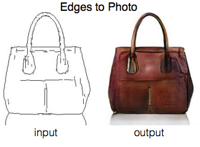
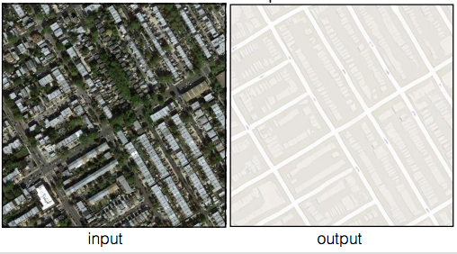
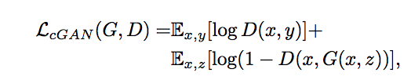
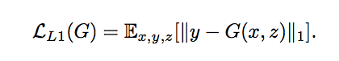
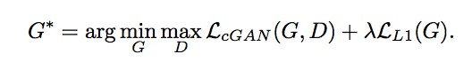
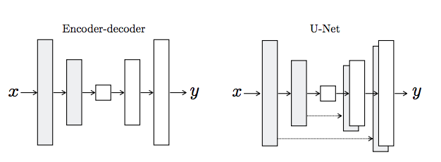
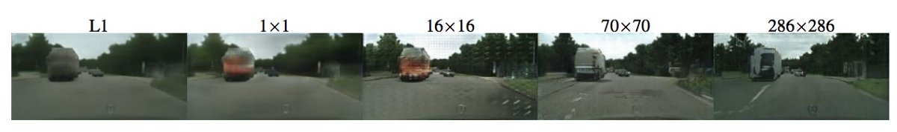
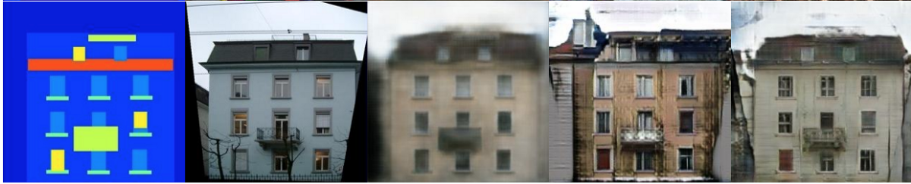

## 条件对抗网络的图像到图像翻译
### 我们研究条件对抗网络，将其作为解决图像间转换问题的通用解决方案...
# Pix2Pix

> Shocking result of Edges-to-Photo Image-to-Image translation using the Pix2Pix GAN Algorithm


本文将解释有关使用条件GAN进行图像到图像转换的流行论文的基本机制，Pix2Pix，以下是该论文的链接：
## 条件对抗网络的图像到图像翻译
### 我们研究条件对抗网络，将其作为解决图像间转换问题的通用解决方案...
# 文章大纲

一，引言

二。 具有对抗性和L1损失的双重目标函数

三， U网发生器

IV。 PatchGAN鉴别器

五，评估
# 介绍

图像到图像的转换是生成对抗网络（GAN）非常适合的另一个任务示例。 在这些任务中，几乎不可能对损失函数进行硬编码。 关于GAN的大多数研究都涉及新颖的图像合成，即从随机向量z转换为图像。 图像到图像的转换将一个图像转换为另一图像，例如上方袋子的边缘转换为照片图像。 另一个有趣的示例如下所示：

> Interesting idea of translating from satellite imagery into a Google Maps-style street view


图像到图像的转换在着色和超分辨率等应用中也很有用。 但是，许多pix2pix算法特有的实现思想也与那些研究新型图像合成的思想有关。


上文描述了图像到图像翻译体系结构的非常高级的视图。 与许多图像合成模型相似，它使用了Conditional-GAN框架。 条件图像x用作生成器的输入和鉴别器的输入。
# 具有对抗性和L1损失的双重目标函数

进行图像到图像翻译的一种幼稚方法是完全放弃对抗性框架。 源图像将仅通过参数函数传递，结果图像与地面真实输出中的差异将用于更新网络的权重。 但是，使用标准距离度量（例如L1和L2）设计此损失函数将无法捕获这些图像之间的许多重要独特特征。 但是，作者确实发现L1损失函数具有一些价值，可以作为对抗性损失函数的加权补充。

有条件的从业亏损（生成者对鉴别者）的格式很普遍，如下所示：


前面提到的L1损失函数如下所示：


组合这些功能将导致：


在实验中，作者报告说，他们发现lambda参数等于100时最成功。
# U网发生器

GAN生成器中使用的U-Net架构是本文非常有趣的组成部分。 图像合成架构通常会采用大小为100x1的随机矢量，将其投影到具有完全连接层的更高维度的矢量中，对其进行整形，然后应用一系列反卷积操作，直到获得所需的空间分辨率为止。 相反，pix2pix中的Generator类似于自动编码器。

> The Skip Connections in the U-Net differentiate it from a standard Encoder-decoder architecture


生成器接收要翻译的图像，并将其压缩为低维“ Bottleneck”矢量表示。 然后，生成器学习如何将其上采样到输出图像中。 如上图所示，考虑标准的Encoder-Decoder结构和U-Net之间的差异很有趣。 U-Net与ResNet的相似之处在于，将来自较早层的信息集成到较后层中。 U-Net跳过连接也很有趣，因为它们不需要任何大小调整，投影等操作，因为要连接的各层的空间分辨率已经相互匹配。
# PatchGAN鉴别器

pix2pix中使用的PatchGAN鉴别器是该设计的另一个独特组件。 PatchGAN / Markovian鉴别器的工作原理是将图像中的各个（N x N）个色块分类为“真实与假”，而不是将整个图像分类为“真实与假”。 作者认为，这会施加更多的限制，从而激发清晰的高频细节。 此外，与对整个图像进行分类相比，PatchGAN具有更少的参数并且运行速度更快。 下图显示了针对N x N个要分类的补丁使用N大小进行实验的结果：

> The 70 x 70 Patch is found to produce the best results

# 评价

评估GAN的输出很困难，并且有许多不同的方法可以做到这一点。 pix2pix的作者使用两种不同的策略来评估其结果。

第一种策略是使用人类评分。 真实图像和用pix2pix创建的图像被随机堆叠在一起，并且人类记分员在看到图像1秒钟后将其标记为真实或伪造。 这是使用Amazon Mechanical Turk平台完成的。

我发现另一个非常有趣的评估策略是在合成生成的网络上使用语义分割网络。 这类似于另一种非常流行的针对GAN输出的定量评估指标，称为“初始得分”，其中基于预先训练的Inception模型对图像进行分类的能力来对合成图像的质量进行评估。

> Far Left: Semantic Segmentation Label, Second: Ground Truth Image, Third: L1 Distance Used, Fourth: cGAN used, Far Right: L1 Distance + cGAN

# 结论

Pix2Pix是一种非常有趣的图像到图像转换策略，它结合了L1距离和对抗性损失以及生成器和鉴别器设计中的其他新颖性。 感谢您的阅读，请查看本文以获取更多实施细节以及实验结果的说明！
```
(本文翻译自Connor Shorten的文章《Pix2Pix》，参考：https://towardsdatascience.com/pix2pix-869c17900998)
```
