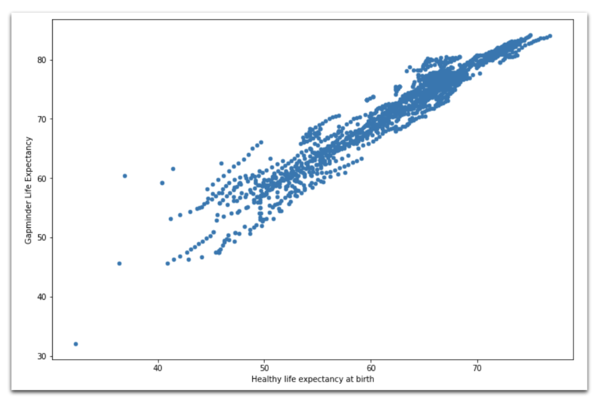

# 很棒：使用plotly创建很棒的交互式图

> Photo by Chris Leipelt on Unsplash


最后，不再需要Matplotlib！ Plotly具有三个重要功能：
+ 悬停：将鼠标悬停在图表上时，将弹出注释
+ 交互性：无需任何其他设置即可使图表互动（例如，穿越时空的旅程）
+ 漂亮的地理空间图：Plotly具有一些内置的基本地图绘制功能，但是另外，可以使用mapbox集成来生成惊人的图表。
## 散点图

我们通过运行fig = x。<PLOT TYPE>（PARAMS）然后调用fig.show（）来调用绘图：
```
fig = px.scatter(    data_frame=data[data['Year'] == 2018],     x="Log GDP per capita",     y="Life Ladder",     size="Gapminder Population",     color="Continent",    hover_name="Country name",    size_max=60)fig.show()
```

> Plotly scatter plot, plotting Log GDP per capita against Life Ladder, where color indicates continent and size of the marker the population

## 散点图-漫步时光
```
fig = px.scatter(    data_frame=data,     x="Log GDP per capita",     y="Life Ladder",     animation_frame="Year",     animation_group="Country name",    size="Gapminder Population",     color="Continent",     hover_name="Country name",     facet_col="Continent",    size_max=45,    category_orders={'Year':list(range(2007,2019))}     )fig.show()
```

> Visualization of how the plotted data changes over the years

## 并行类别-一种可视化类别的有趣方式
```
def q_bin_in_3(col):    return pd.qcut(        col,        q=3,        labels=['Low','Medium','High']    )_ = data.copy()_['Social support'] = _.groupby('Year')['Social support'].transform(q_bin_in_3)_['Life Expectancy'] = _.groupby('Year')['Healthy life expectancy at birth'].transform(q_bin_in_3)_['Generosity'] = _.groupby('Year')['Generosity'].transform(q_bin_in_3)_['Perceptions of corruption'] = _.groupby('Year')['Perceptions of corruption'].transform(q_bin_in_3)_ = _.groupby(['Social support','Life Expectancy','Generosity','Perceptions of corruption'])['Life Ladder'].mean().reset_index()fig = px.parallel_categories(_, color="Life Ladder", color_continuous_scale=px.colors.sequential.Inferno)fig.show()
```

> Seems like not all countries with high life expectations are happy!

## 条形图—交互式过滤器的示例
```
fig = px.bar(    data,     x="Continent",     y="Gapminder Population",     color="Mean Log GDP per capita",     barmode="stack",     facet_col="Year",    category_orders={"Year": range(2007,2019)},    hover_name='Country name',    hover_data=[        "Mean Log GDP per capita",        "Gapminder Population",        "Life Ladder"    ])fig.show()
```

> Filtering a bar chart is easy. Not surprisingly, South Korea is among the wealthy countries in Asia.

## 整体情节-幸福如何随着时间而变化
```
fig = px.choropleth(    data,     locations="ISO3",     color="Life Ladder",     hover_name="Country name",     animation_frame="Year")fig.show()
```

> Map visualization of how happiness evolves over the years. Syria and Afghanistan are at the very end of the Life Ladder range (unsurprisingly)

# 摘要和结束语

今天就这样。 在本文中，您学习了如何成为真正的Python可视化忍者。 您了解了如何在快速探索方面提高效率，以及在再次召开该死的董事会会议时如何创建更精美的图表。 您学习了如何创建交互式地物图，这在绘制地理空间数据时特别有用。

如果您发现了一些很棒的新可视化效果，想要提供反馈或只是聊天，请在LinkedIn上与我联系。

如果您喜欢阅读的内容，请查看我在Medium上撰写的其他文章。
# 漂亮：与Seaborn的高级绘图

> Photo by Pavel Nekoranec on Unsplash


Seaborn利用绘图默认值。 为了确保您的结果与我的匹配，请运行以下命令。
```
sns.reset_defaults()sns.set(    rc={'figure.figsize':(7,5)},     style="white" # nicer layout)
```
## 绘制单变量分布

如前所述，我非常喜欢发行。 直方图和核密度分布都是可视化特定变量的关键特征的有效方法。 让我们看看如何在一个图表中为单个变量或多个变量分配生成分布。

> Left chart: Histogram and kernel density estimation of “Life Ladder” for Asian countries in 2018; Right chart: Kernel density estimation of “Life Ladder” for five buckets of GDP per Capita — Money can buy happiness

## 绘制双变量分布

每当我想直观地探索两个或多个变量之间的关系时，通常都会归结为某种形式的散点图和分布评估。 概念上相似的图有三种变体。 在每个图中，中心图（散点图，双变量KDE和hexbin）有助于理解两个变量之间的联合频率分布。 此外，在中心图的右边界和上边界，描绘了各个变量的边际单变量分布（作为KDE或直方图）。
```
sns.jointplot(    x='Log GDP per capita',    y='Life Ladder',    data=data,    kind='scatter' # or 'kde' or 'hex')
```

> Seaborn jointplot with scatter, bivariate kde, and hexbin in the center graph and marginal distributions left and on top of the center graph.

## 散点图

散点图是一种可视化两个变量的联合密度分布的方法。 我们可以通过添加色相来添加第三个变量，并通过添加size参数来添加第四个变量。
```
sns.scatterplot(    x='Log GDP per capita',    y='Life Ladder',    data=data[data['Year'] == 2018],        hue='Continent',    size='Gapminder Population')# both, hue and size are optionalsns.despine() # prettier layout
```

> Log GDP per capita against Life Ladder, colors based on the continent and size on population

## 小提琴情节

小提琴图是箱形图和籽粒密度估计值的组合。 它起着箱形图的作用。 它显示了跨类别变量的定量数据分布，以便可以比较那些分布。
```
sns.set(    rc={'figure.figsize':(18,6)},     style="white")sns.violinplot(    x='Continent',    y='Life Ladder',    hue='Mean Log GDP per capita',    data=data)sns.despine()
```

> Violin plot where we plot continents against Life Ladder, we use the Mean Log GDP per capita to group the data. It looks like a higher GDP per capita makes for higher happiness

## 配对图

Seaborn对图在一个大网格中绘制了两个变量散点图的所有组合。 我通常感觉这有点信息过载，但是它可以帮助发现模式。
```
sns.set(    style="white",     palette="muted",     color_codes=True)sns.pairplot(    data[data.Year == 2018][[        'Life Ladder','Log GDP per capita',         'Social support','Healthy life expectancy at birth',         'Freedom to make life choices','Generosity',         'Perceptions of corruption', 'Positive affect',        'Negative affect','Confidence in national government',        'Mean Log GDP per capita'    ]].dropna(),     hue='Mean Log GDP per capita')
```

> Seaborn scatterplot grid where all selected variables a scattered against every other variable in the lower and upper part of the grid, the diagonal contains a kde plot.

## 刻面网格

对我而言，Seaborn的FacetGrid是使用Seaborn的最令人信服的论点之一，因为它使创建多图变得轻而易举。 通过对图，我们已经看到了FacetGrid的示例。 FacetGrid允许创建按变量分段的多个图表。 例如，行可以是一个变量（人均GDP类别），列可以是另一个变量（大陆）。

它确实比我个人需要更多的自定义（即，使用matplotlib），但这仍然很吸引人。

FacetGrid —线图
```
g = sns.FacetGrid(    data.groupby(['Mean Log GDP per capita','Year','Continent'])['Life Ladder'].mean().reset_index(),    row='Mean Log GDP per capita',    col='Continent',    margin_titles=True)g = (g.map(plt.plot, 'Year','Life Ladder'))
```

> Life Ladder on the Y-axis, Year on the X-axis. The grid’s columns are the continent, and the grid’s rows are the different levels of Mean Log GDP per capita. Overall things seem to be getting better for the countries with a Low Mean Log GDP per Capita in North America and the countries with a Medium or High Mean Log GDP per Capita in Europe


FacetGrid —直方图
```
g = sns.FacetGrid(data, col="Continent", col_wrap=3,height=4)g = (g.map(plt.hist, "Life Ladder",bins=np.arange(2,9,0.5)))
```

> FacetGrid with a histogram of LifeLadder by continent


FacetGrid —带注释的KDE图

也可以向网格中的每个图表添加构面特定的符号。 在下面的示例中，我们添加平均值和标准偏差，并在该平均值处绘制一条垂直线（下面的代码）。

> Life Ladder kernel density estimation based on the continent, annotated with a mean and standard deviation

```python
def vertical_mean_line(x, **kwargs):
    plt.axvline(x.mean(), linestyle ="--", 
                color = kwargs.get("color", "r"))
    txkw = dict(size=15, color = kwargs.get("color", "r"))

    label_x_pos_adjustment = 0.08 # this needs customization based on your data
    label_y_pos_adjustment = 5 # this needs customization based on your data
    if x.mean() < 6: # this needs customization based on your data
        tx = "mean: {:.2f}\n(std: {:.2f})".format(x.mean(),x.std())
        plt.text(x.mean() + label_x_pos_adjustment, label_y_pos_adjustment, tx, **txkw)
    else:
        tx = "mean: {:.2f}\n  (std: {:.2f})".format(x.mean(),x.std())
        plt.text(x.mean() -1.4, label_y_pos_adjustment, tx, **txkw)

_ = data.groupby(['Continent','Year'])['Life Ladder'].mean().reset_index()

g = sns.FacetGrid(_, col="Continent", height=4, aspect=0.9, col_wrap=3, margin_titles=True)
g.map(sns.kdeplot, "Life Ladder", shade=True, color='royalblue')
g.map(vertical_mean_line, "Life Ladder")
```

FacetGrid —热图图

我最喜欢的绘图类型之一是热图FacetGrid，即网格每个面中的热图。 这种类型的绘图对于在一个绘图中可视化四个维度和一个度量很有用。 该代码有点麻烦，但可以根据需要快速进行调整。 值得注意的是，这种图表需要相对大量的数据或适当的细分，因为它不能很好地处理缺失值。

> Facet heatmap, visualizing on the outer rows a year range, outer columns the GDP per Capita, on the inner rows the level of perceived corruption and the inner columns the continents. We see that happiness increases towards the top right (i.e., high GDP per Capita and low perceived corruption). The effect of time is not definite, and some continents (Europe and North America) seem to be happier than others (Africa).

```python
def draw_heatmap(data,inner_row, inner_col, outer_row, outer_col, values, vmin,vmax):
    sns.set(font_scale=1)
    fg = sns.FacetGrid(
        data, 
        row=outer_row,
        col=outer_col, 
        margin_titles=True
    )

    position = left, bottom, width, height = 1.4, .2, .1, .6
    cbar_ax = fg.fig.add_axes(position) 

    fg.map_dataframe(
        draw_heatmap_facet, 
        x_col=inner_col,
        y_col=inner_row, 
        values=values, 
        cbar_ax=cbar_ax,
        vmin=vmin, 
        vmax=vmax
    )

    fg.fig.subplots_adjust(right=1.3)  
    plt.show()

def draw_heatmap_facet(*args, **kwargs):
    data = kwargs.pop('data')
    x_col = kwargs.pop('x_col')
    y_col = kwargs.pop('y_col')
    values = kwargs.pop('values')
    d = data.pivot(index=y_col, columns=x_col, values=values)
    annot = round(d,4).values
    cmap = sns.color_palette("Blues",30) + sns.color_palette("Blues",30)[0::2]
    #cmap = sns.color_palette("Blues",30)
    sns.heatmap(
        d, 
        **kwargs,
        annot=annot, 
        center=0, 
        cmap=cmap, 
        linewidth=.5
    )

# Data preparation
_ = data.copy()
_['Year'] = pd.cut(_['Year'],bins=[2006,2008,2012,2018])

_['GDP per Capita'] = _.groupby(['Continent','Year'])['Log GDP per capita'].transform(
    pd.qcut,
    q=3,
    labels=(['Low','Medium','High'])
).fillna('Low')

_['Corruption'] = _.groupby(['Continent','GDP per Capita'])['Perceptions of corruption'].transform(
    pd.qcut,
    q=3,
    labels=(['Low','Medium','High'])
)

_ = _[_['Continent'] != 'Oceania'].groupby(['Year','Continent','GDP per Capita','Corruption'])['Life Ladder'].mean().reset_index()
_['Life Ladder'] = _['Life Ladder'].fillna(-10)

draw_heatmap(
    data=_,
    outer_row='Corruption',
    outer_col='GDP per Capita',
    inner_row='Year',
    inner_col='Continent',
    values='Life Ladder',
    vmin=3,
    vmax=8,
)
```
# 加载数据和包导入

> Photo by Kelli Tungay on Unsplash


让我们加载本文中将要使用的数据。 我确实对数据进行了一些预处理。 我在有意义的地方进行推断。
```
# Load the datadata = pd.read_csv('https://raw.githubusercontent.com/FBosler/AdvancedPlotting/master/combined_set.csv')# this assigns labels per yeardata['Mean Log GDP per capita']  = data.groupby('Year')['Log GDP per capita'].transform(    pd.qcut,    q=5,    labels=(['Lowest','Low','Medium','High','Highest']))
```

数据集包含以下各列的值：
+ 年：计量年（从2007年到2018年）
+ 人生阶梯：受访者根据Cantril阶梯，以0到10的等级（10最佳）衡量他们今天的生活价值
+ 对数人均GDP：根据购买力平价（PPP）调整的人均GDP，根据世界银行于2018年11月14日发布的世界发展指标（WDI）得出
+ 社会支持：对问题的回答：“如果遇到麻烦，您是否有亲戚或朋友可以在需要时帮助您？”
+ 出生时的健康预期寿命：出生时的预期寿命是根据世界卫生组织（WHO）全球卫生观察站数据存储库中的数据构建的，其中提供了2005、2010、2015和2016年的数据。
+ 自由选择生活：对问题的回答：“您对选择自己的生活的自由感到满意还是不满意？”
+ 慷慨：与“人均GDP”相比，对“您在过去一个月向慈善机构捐款了吗？”的回应
+ 对腐败的看法：回答“腐败是否在整个政府范围内广泛存在？”和“腐败是否在企业内部广泛分布？”
+ 积极影响：包括前一天的幸福，笑声和享受的平均频率。
+ 负面影响：包括前一天担忧，悲伤和愤怒的平均频率。
+ 对国家政府的信心：不言自明
+ 民主素质：一个国家的民主程度
+ 交付质量：一个国家兑现其政策的效果如何
+ Gapminder预期寿命：Gapminder的预期寿命
+ Gapminder人口：一个国家的人口
## 进口货
```
import plotlyimport pandas as pdimport numpy as npimport seaborn as snsimport plotly.express as pximport matplotlib%matplotlib inlineassert matplotlib.__version__ == "3.1.0","""Please install matplotlib version 3.1.0 by running:1) !pip uninstall matplotlib 2) !pip install matplotlib==3.1.0"""
```
# 快速：使用Pandas进行基本绘图

> Photo by Marvin Meyer on Unsplash


Pandas具有内置的绘图功能，可以在Series或DataFrame上调用它。 我喜欢这些绘图功能，因为它们简洁，使用合理的默认值，并且可以快速了解发生的情况。

要创建绘图，请对数据调用.plot（kind = <TYPE OF PLOT>），如下所示：
```
np.exp(data[data['Year']==2018]['Log GDP per capita']).plot(    kind='hist')
```

运行上面的命令将产生以下图表。

> 2018: Histogram of the number of countries per GDP per Capita bucket. Not surprisingly, most countries are poor!


使用Pandas进行绘图时，有五个主要参数：
+ kind：Pandas必须知道您要创建哪种图，以下选项可用hist，bar，barh，scatter，area，kde，line，box，hexbin，饼图。
+ figsize：允许覆盖6英寸宽和4英寸高的默认输出大小。 figsize需要一个元组（例如，我经常使用的figsize =（12,8））
+ title：向图表添加标题。 在大多数情况下，我用它来澄清图表中显示的内容，以便当我回到图表上时，可以快速确定发生了什么。 title需要一个字符串。
+ bins：允许覆盖直方图的bin宽度。 bins需要一个列表或类似列表的值序列（例如bins = np.arange（2,8,0.25））
+ xlim / ylim：允许覆盖轴的最大值和最小值的默认值。 xlim和ylim都期望有一个元组（例如xlim =（0,5））

让我们快速浏览各种可用的地块类型。
## 垂直条形图
```
data[    data['Year'] == 2018].set_index('Country name')['Life Ladder'].nlargest(15).plot(    kind='bar',    figsize=(12,8))
```

> 2018: List of 15 happiest countries is led by Finnland

## 水平条形图
```
np.exp(data[    data['Year'] == 2018].groupby('Continent')['Log GDP per capita']\       .mean()).sort_values().plot(    kind='barh',    figsize=(12,8))
```

> Average GDP per capita by continent in 2011 USD Dollars clearly led by Australia and New Zealand

## 箱形图
```
data['Life Ladder'].plot(    kind='box',    figsize=(12,8))
```

> Box plot of the distribution of Life Ladder shows that the median is somewhere around 5.5 ranging from values below 3 to up 8.

## 散点图
```
data[['Healthy life expectancy at birth','Gapminder Life Expectancy']].plot(    kind='scatter',    x='Healthy life expectancy at birth',    y='Gapminder Life Expectancy',    figsize=(12,8))
```

> Scatter plot of the World Happiness Report life expectation against the Gapminder life expectation shows a high correlation between the two (to be expected)

## 六边形图
```
data[data['Year'] == 2018].plot(    kind='hexbin',    x='Healthy life expectancy at birth',    y='Generosity',    C='Life Ladder',    gridsize=20,    figsize=(12,8),    cmap="Blues", # defaults to greenish    sharex=False # required to get rid of a bug)
```

> 2018: Hexbin plot, plotting life expectancy against generosity. The color of bins indicates the average of life ladder in the respective bin.

## 饼形图
```
data[data['Year'] == 2018].groupby(    ['Continent'])['Gapminder Population'].sum().plot(    kind='pie',    figsize=(12,8),    cmap="Blues_r", # defaults to orangish)
```

> 2018: Pie chart showing the total population by continent

## 堆积面积图
```
data.groupby(    ['Year','Continent'])['Gapminder Population'].sum().unstack().plot(    kind='area',    figsize=(12,8),    cmap="Blues", # defaults to orangish)
```

> Population numbers accross the globe are on the rise.

## 折线图
```
data[    data['Country name'] == 'Germany'].set_index('Year')['Life Ladder'].plot(    kind='line',    figsize=(12,8))
```

> Line chart depicting the development of happiness in Germany.

## 关于熊猫绘图的结论

用熊猫绘图很方便。 它易于访问，而且速度很快。 地块很难看。 偏离默认值是不可能的，这是可以的，因为我们还有其他工具可以使图表更具美学吸引力。 前进到seaborn。
# 分布的重要性

> Photo by Jonny Caspari on Unsplash


在圣地亚哥学习期间，我教过统计学（Stats 119）。 统计119是统计的入门课程。 该课程包括统计基础，例如数据汇总（可视和定量），几率和概率的概念，回归，抽样以及最重要的分布。 这次是我对数量和现象的理解几乎全部转变为基于分布表示的时间（大部分时间是高斯）。

时至今日，我发现这两个数量的平均含义令人吃惊，而标准偏差可以帮助您把握现象。 仅通过了解这两个数字，就可以轻松得出特定结果的可能性。 人们立即知道大部分结果将在哪里。 它为您提供了一个参考框架，可以快速将轶事与有统计意义的事件区分开来，而无需进行过于复杂的计算。

一般而言，面对新数据时，我的第一步是尝试形象化其分布，以更好地理解数据。
# 我的Python绘图历史

> Photo by Krys Amon on Unsplash


大约两年前，我开始更认真地学习Python。 从那以后，几乎没有一个星期让我惊叹于Python本身或生态系统中众多令人惊叹的开源库之一的简单性和易用性。 我熟悉的命令，模式和概念越多，那么所有事情就越有意义。
## Matplotlib

使用Python进行绘图的情况恰恰相反。 最初，我用Matplotlib创建的几乎每个图表都看起来像是八十年代逃脱的罪行。 更糟糕的是，要创建这些可憎的东西，我通常不得不在Stackoverflow上花费数小时。 例如，研究nitty-gritty命令以更改x-ticks的倾斜度或类似的愚蠢行为。 甚至没有让我开始使用多张图表。 结果看起来令人印象深刻，并且以编程方式创建这些图表是一种奇妙的感觉。 例如，一次生成50个针对不同变量的图表。 但是，这只是很多工作，需要您记住很多其他本来没用的命令。
## 海生

了解Seaborn是一种解脱。 Seaborn提取了许多微调。 毫无疑问，最终图表的美学意义是一个巨大的飞跃。 但是，它也是基于Matplotlib构建的。 通常，对于非标准调整，仍然有必要深入了解机器级的matplotlib代码。
## 背景虚化

简要了解一下时间，我以为Bokeh将成为我的首选解决方案。 当我从事地理空间可视化工作时遇到了Bokeh。 但是，我很快意识到，虽然Bokeh与众不同，但它与matplotlib一样复杂。
## 密谋

我确实在一段时间前尝试了plot.ly（从现在开始被称为plotly）。 再一次，致力于地理空间数据的可视化。 那时，它似乎比前面提到的库荒谬。 您需要一个帐户，必须通过笔记本电脑登录，然后才能使所有内容在线呈现。 然后，您将下载结果图表。 我迅速放弃了。 但是，最近，我看了一个有关YouTube的视频，该视频关于plotly express和plotly 4.0，最重要的是，他们摆脱了所有这些在线废话。 我玩了一下，这篇文章就是它的结果。 我想迟到总比没有好。
## Kepler.gl（地理空间数据荣誉奖）

Kepler.gl虽然绝对不是Python库，但它是一种用于地理空间数据的基于Web的强大可视化工具。 您只需要CSV文件，即可使用Python轻松创建。 试试看！
## 我目前的工作流程

最终，我决定使用Pandas原始绘图进行快速检查，并使用Seaborn生成要在报告和演示文稿中使用的图表（在视觉上很重要）。
# 文章的结构

> Photo by Nik MacMillan on Unsplash


本文旨在作为代码指南，以及当您要查找特定类型的图时重新访问的参考点。 为了节省空间，我有时会将多个图表合并为一张图像。 但是请放心，您可以在此Repo或相应的Jupyter Notebook中找到所有基础代码。
## 目录
+ 我的Python绘图历史
+ 分布的重要性
+ 加载数据和包导入
+ 快速：使用Pandas进行基本绘图
+ 漂亮：与Seaborn的高级绘图
+ 很棒：使用plotly创建很棒的交互式图

我对文章的不同部分进行了超链接，因此，如果您不关心介绍部分，可以随时直接跳到绘图部分。 我不会判断。
## 用PYTHON指南进行最终绘图
# 了解如何使用Python创建美观而有见地的图表-Quick，Pretty和Awesome
## 全面的代码以及Python可视化指南，介绍了Pandas，Seaborn和Plotly的绘图。 在其他方面，我们可以想象到金钱可以带来幸福。

> 2018: Regplot showing how Life Ladder (Happiness) is positively correlated with Log GDP per capita (Money)


在今天的文章中，我们将研究使用Python绘制数据的三种不同方式。 我们将通过利用《 2019年世界幸福报告》中的数据来做到这一点。我用Gapminder和Wikipedia的信息丰富了《世界幸福报告》数据，以便探索新的关系和可视化。

《世界幸福报告》试图回答哪些因素影响着全世界的幸福。

报告中的幸福定义为对“ Cantril阶梯问题”的回答，要求被调查者以0到10的等级来评价他们今天的生活，最糟糕的寿命为0，最可能的寿命为10。

在整篇文章中，我将使用Life Ladder作为目标变量。 每当我们谈论人生阶梯时，请思考幸福。
