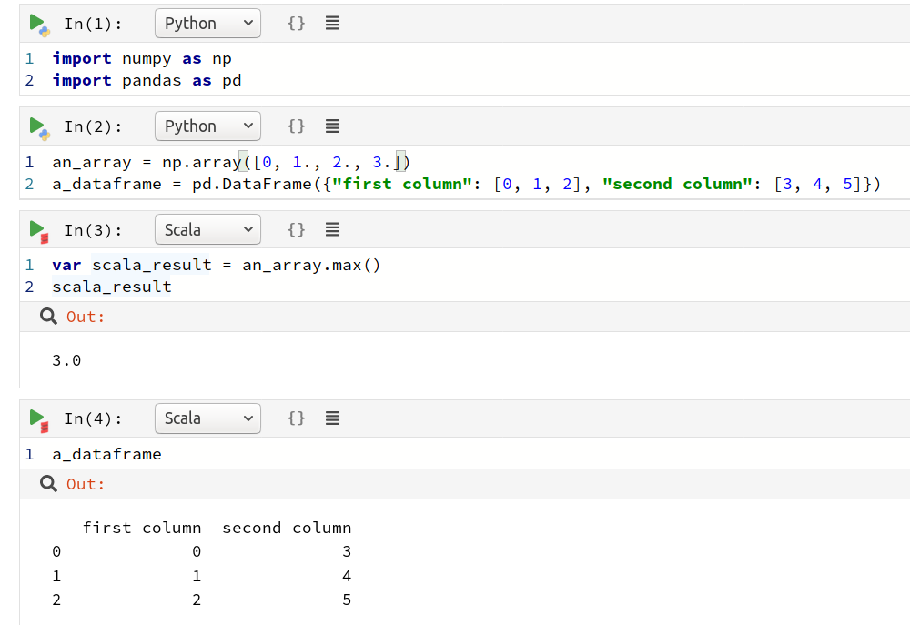
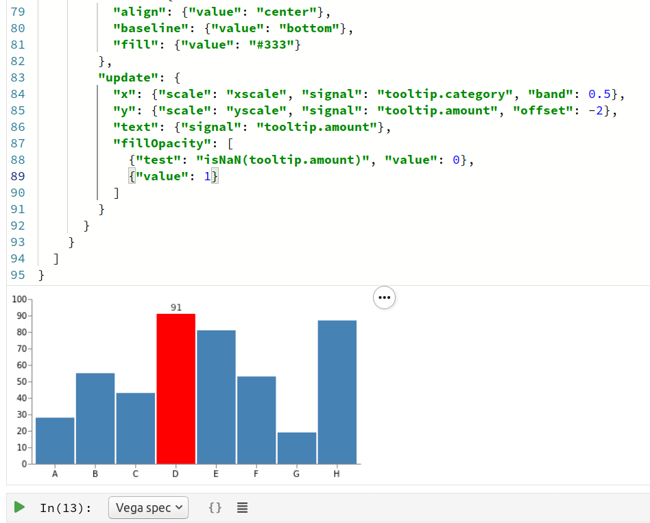
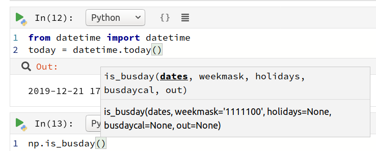
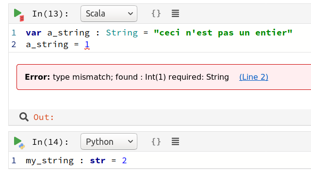

# Polynote：新的Jupyter？
## Netflix的多语言笔记本Polynote引起了很多关注。 但这是Jupyter杀手，还是所有炒作？

> Source: https://polynote.org/


如果您在过去的几年中使用Python做过任何类型的分析工作，那么您很有可能会遇到Jupyter笔记本。 执行新代码而无需重新运行整个脚本的能力使笔记本成为分析工作流程中无处不在的一部分，但是Jupyter笔记本并非没有问题。 例如，不支持代码编辑，提示和棉绒。 这会导致混乱，难以调试的代码，并使某些开发人员完全避免使用该工具。 在2019年，科技巨头Netflix开源了他们的笔记本工具Polynote，许多人都称其为Jupyter杀手。

与Jupyter一样，Polynote也具有多语言支持，但是Scala已作为Polynote中的“一流语言”被包括在内，另外还支持Python（+ Spark），SQL和Vega。 尽管Jupyter允许您使用其支持的一种语言（JUlia，PYThon，R）创建笔记本，但是Polynote可以在单个笔记本中提供多语言支持，甚至还可以实现以不同语言执行的代码之间的互操作性。
# 安装

与Jupyter不同，Polynote的核心是基于JVM的语言，这使得安装过程比pip install polynote的参与程度略高。 有问题的是，Polynote当前仅在Linux和OSX上可用。 关于包含Windows已有一些讨论，但这并不是开发团队的目标。 鉴于诸如Swift之类的流行工具的开放源代码Windows端口未能蓬勃发展，期望很快就可以在Windows上无缝体验Polynote是愚蠢的。

话虽这么说，让我们假设您有一台Linux或OSX计算机。 我将概述为使Polynote在Ubuntu 18.04上工作而采取的步骤。
+ 转到发行版并在最新发行版的“资产”下下载最新的polynote-dist.tar.gz
+ 用tar -zxvpf polynote-dist.tar.gz提取Polynote
+ 安装Java：sudo apt安装default-jre和sudo apt安装default-jdk
+ 使用export JAVA_HOME = / usr / lib / jvm / default-java /设置JAVA_HOME
+ pip3安装jep jedi virtualenv

Spark支持需要其他安装。 您可以在此处阅读有关安装Polynote的更多信息。

进入polynote目录并执行polynote.py，然后在浏览器中导航到提供的本地地址（我已经在Firefox和Chrome上进行了测试，没有问题）。
# 多语言笔记本

Polynote的同义功能是语言互操作性：如果您用一种语言定义变量，则可以在另一种语言中使用它。 这显然会有局限性，因为并非所有语言都共享相同的类型和对象概念，但是支持最重要的类型，包括numpy数组和pandas数据框。


我必须承认只掌握Scala的相关知识，所以我不确定会要求它与Python协同工作的特定用例，但是很明显，消除在两种语言之间转换数据的需求将使这种情况成为可能。 一个项目运行得更加顺利。

我从事的大多数项目只需要一种语言（大多数是Python，有些R），因此可以轻易相信，在大型项目之外，对于大多数数据科学家来说，语言混合将是多余的工具。 当然，作为一个开源项目，社区很可能会扩展所支持的语言套件（R，Julia和Java已经引起人们的兴趣），这将使Polynote在众多 开发人员； 就个人而言，我希望能够对R中的Python数据运行统计测试，而不是花时间尝试寻找有效的，维护的Python测试端口。
# 可视化

数据可视化是数据科学的重要组成部分，但它却经常被忽略。 Polynote通过从Scala数据生成Vega规范来强调高质量的可视化。

Vega是一种可视化语法，一种用于创建，保存和共享交互式可视化设计的声明性语言。 使用Vega，您可以JSON格式描述可视化的视觉外观和交互行为，并使用Canvas或SVG生成基于Web的视图。 — https://vega.github.io/vega/

Vega可以轻松生成美观，复杂的可视化效果。 流行的Python可视化库Altair建立在Vega-lite（Vega的统计可视化部分）的基础上（您可以在此处阅读有关在Altair中生成交互式地图的信息）。

不幸的是，没有直接支持可视化的Python数据，因此对于Python本地用户几乎没有好处。 当然，您仍然可以直接输入模式，但是在大多数情况下，使用Altair这样的工具会容易得多。

> An interactive bar chart? Try producing that in matplotlib

# 代码编辑

Jupyter笔记本电脑的一个很大的缺点是代码的不透明性：没有像在任何不错的IDE中会发现的不正确代码的视觉提示，也不存在函数的代码完成（这会导致我的API使用率显着增加）。 但是，Polynote弥补了脚本和笔记本之间的空白。

> With Polynote, there is no need to memorise swathes of functions


Scala中的类型错误将带有下划线，但是Polynote并不关心Python类型提示（很像Python社区）。


Polynote不能与最好的代码编辑器竞争，但是在这方面，对于Jupyter笔记本而言，它是一个巨大的改进。
# 摘要

Polynote的可能性让我很感兴趣。 数据科学界蜂拥而至，内置的Vega情节生成和语言间交流等功能听起来像是改变游戏规则的人。 但是，我认为Polynote所提供的功能不足以吸引大多数数据科学家离开Jupyter。 首先，缺乏Windows支持使许多人望而却步。 Windows是最流行的操作系统，许多企业和组织都要求使用Windows。 其次，尽管Scala有其优势，但它并不是日常数据科学中广泛使用的语言。 大多数分析项目可以并且仅通过Python就能充分执行，因此语言混合和内置Vega毫无益处。

Polynote的代码编辑是对Jupyter的重大改进，我希望Jupyter在这方面有所改进。 但是，作为一个更成熟，更积极发展的项目，我发现Jupyter提供了两者中更强大的产品。 Polynote当然是值得一看的。 它只需要一点时间。
```
(本文翻译自Tom Titcombe的文章《Polynote: the new Jupyter?》，参考：https://towardsdatascience.com/polynote-the-new-jupyter-c7696a321b09)
```
