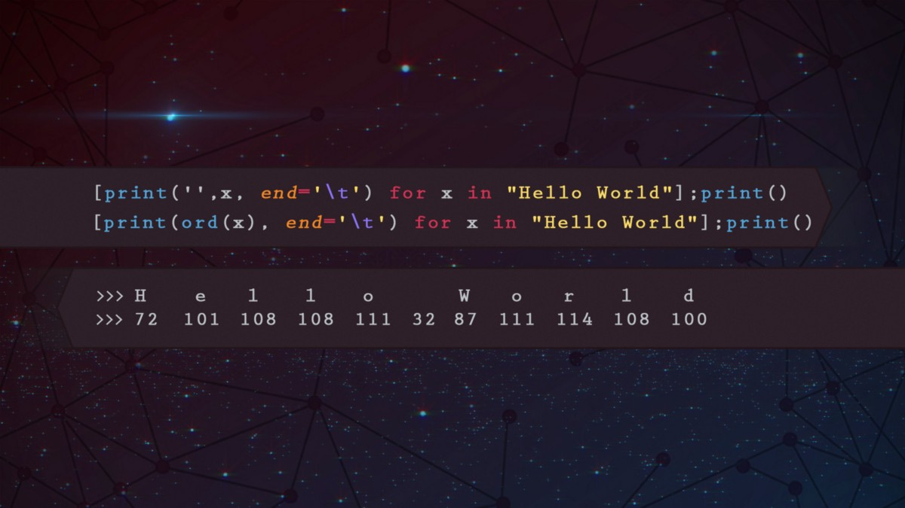

## 彼得·尼斯特鲁普（Peter Nistrup）-中
### 阅读Peter Nistrup在Medium上的文章。 数据科学，统计与人工智能...在Twitter上保持最新状态☞@PeterNistrup ...
# 总结思想

这只是我汇总的快速清单，目的是让您对Python可以做的一些很棒的事情有一个印象。 如果您想让我解释一些具体的问题，或者您觉得我做错了，请留下您的任何反馈意见！

谢谢阅读。 希望您发现这很有用！ 如果您喜欢这篇文章并希望了解更多内容，请务必关注我的个人资料！
## 彼得·尼斯特鲁普（Peter Nistrup）-中
### 阅读Peter Nistrup在Medium上的文章。 数据科学，统计与人工智能...在Twitter上保持最新状态☞@PeterNistrup ...
## 快速改善Python数据分析的7件事
### 使您的数据分析更上一层楼！
# 更像这样

如果您喜欢这些易于使用的东西来改善Python工作流程，请看一下我的新文章：
## 快速改善Python数据分析的7件事
### 使您的数据分析更上一层楼！
# ＃5：zip（）


还记得“ map（）”部分中有关在两个列表之间并行应用某些内容的示例吗？ zip（）使此操作更加容易。

假设我们有两个列表，一个包含名字，一个包含姓氏，我们如何以有序方式合并它们？ 使用zip（）!:
```
>>> first_names = ["Peter", "Christian", "Klaus"]>>> last_names = ["Jensen", "Smith", "Nistrup"]>>> print([' '.join(x) for x in zip(first_names, last_names)])['Peter Jensen', 'Christian Smith', 'Klaus Nistrup']
```

哇！ 犯错的地方是我，我叫Peter Jensen。但是我们知道如何轻松解决这个问题！：
```
>>> print([' '.join(x) for x in zip(first_names, last_names[::-1])])['Peter Nistrup', 'Christian Smith', 'Klaus Jensen']
```
## 仅使用1行Python即可浏览数据
### 在不到30秒的时间内完成所有标准数据分析。 熊猫分析的奇迹。
# ＃4：如果，否则，如果条件一线


在代码中的某处，您可能会遇到类似以下内容的情况：
```
>>> x = int(input())>>> if x >= 10:>>>     print("Horse")>>> elif 1 < x < 10:>>>     print("Duck")>>> else:>>>     print("Baguette")
```

运行此命令时，系统会提示您从input（）函数输入内容，假设我们输入5，我们将得到Duck。 但是我们也可以像下面这样写整个内容：
```
print("Horse" if x >= 10 else "Duck" if 1 < x < 10 else "Baguette")
```

真的很简单！ 仔细阅读旧代码，您会发现无数地方可以将简单的条件if / else语句简化为单行代码。

说到单行代码，是否只需要使用一行代码就能获得整个数据集的概览？ 看一下这个：
## 仅使用1行Python即可浏览数据
### 在不到30秒的时间内完成所有标准数据分析。 熊猫分析的奇迹。
# ＃3：Lambda和地图

> Crazy paint skills coming in from the right

## 拉姆达

Lambda有点怪异，但与该列表中的所有其他内容一样，它一经发布，便非常强大且直观。

Lambda函数基本上是一个小的匿名函数。 为什么要匿名？ 仅仅是因为Lambda最常用于执行小型/简单操作，而这些操作不需要像def my_function（）这样的正式函数定义。

让我们以上面的例子为例，对一个数字进行平方并加5。在上面，我们使用def stupid_func（x）定义了一个正式的函数定义，现在让我们使用lambda函数重新创建它：
```
>>> stupid_func = (lambda x : x ** 2 + 5)>>> print([stupid_func(1), stupid_func(3), stupid_func(5)])[6, 14, 30]
```

那么，为什么还要使用这种奇怪的语法呢？ 当您想执行一些简单的操作而不定义实际功能时，这很有用。 以数字列表为例，我们如何在Python中对这样的列表进行排序？ 一种方法是使用sorted（）方法：
```
>>> my_list = [2, 1, 0, -1, -2]>>> print(sorted(my_list))[-2, -1, 0, 1, 2]
```

确实达到了目的，但假设我们要按最小平方数排序，我们可以使用lambda函数定义键，这就是sorted（）方法用来确定如何排序的键。
```
>>> print(sorted(my_list, key = lambda x : x ** 2))[0, -1, 1, -2, 2]
```
## 地图

映射只是一个函数，用于将函数应用于列表等元素序列。 假设我们必须列出要在一个列表中将每个元素与另一个列表中的对应元素相乘的位置，我们该怎么做？ 使用lambda函数进行映射！：
```
>>> print(list(map(lambda x, y : x * y, [1, 2, 3], [4, 5, 6])))[4, 10, 18]
```

与这种怪诞相比，这是简单而优雅的：
```
>>> x, y = [1, 2, 3], [4, 5, 6]>>> z = []>>> for i in range(len(x)):>>>     z.append(x[i] * y[i])>>> print(z)[4, 10, 18]
```
# ＃2：列表理解


哦，天哪，一旦我了解了这些，我的整个世界都发生了变化（不是真的，但是足够亲密）。 这是在列表上进行快速操作的一种真正强大，直观且易读的方法。

假设我们有一个随机的函数，对数字进行平方并加5：
```
>>> def stupid_func(x):>>>     return x**2 + 5
```

现在假设我们要将此函数应用于列表中的所有奇数，这可能是您不了解列表推导方法的处理方式：
```
>>> my_list = [1, 2, 3, 4, 5]>>> new_list = []>>> for x in my_list:>>>     if x % 2 != 0:>>>         new_list.append(stupid_func(x))>>> print(new_list)[6, 14, 30]
```

但是有一种更简单的方法！：
```
>>> my_list = [1, 2, 3, 4, 5]>>> print([stupid_func(x) for x in my_list if x % 2 != 0])[6, 14, 30]
```

列表推导适用于[列表中项目的表达式]语法，如果您喜欢其他布尔条件，例如上述“奇数”条件：[列表中项目的表达式，如果有条件]，则与以下内容完全相同：
```
>>> for item in list:>>>     if conditional:>>>         expression
```

很酷！ 不过，我们仍然可以做得更好，因为我们确实不需要“ stupid_func”：
```
>>> print([x ** 2 + 5 for x in my_list if x % 2 != 0])[6, 14, 30]
```

繁荣！
# ＃1：字符串操作

> Pun definitely intended


Python非常擅长使用+和*之类的数学运算符确定要对字符串进行的处理：
```
>>> my_string = "Hi Medium..!">>> print(my_string * 2)Hi Medium..!Hi Medium..!>>> print(my_string + " I love Python" * 2)Hi Medium..! I love Python I love Python
```

我们也可以使用[::-1]轻松地反转字符串，这不仅限于字符串！：
```
>>> print(my_string[::-1])!..muideM iH>>> my_list = [1,2,3,4,5]>>> print(my_list[::-1])[5, 4, 3, 2, 1]
```

单词列表呢？ 我们可以做一个尤达翻译！
```
>>> word_list = ["awesome", "is", "this"]>>> print(' '.join(word_list[::-1]) + '!')this is awesome!
```

上面我们使用.join（）方法，将反向列表中的所有元素与''（空格）连接在一起，并添加感叹号。
# Python欺骗了101，这是每个新程序员都应该知道的。

> A pretty picture to catch your eye.


Python比以往任何时候都更加流行，并且人们每天都在证明Python是一种非常强大且易于使用的语言。

我从事Python编程已经有几年了，最近6个月是专业的，以下是我刚开始时希望知道的一些事情：
+ 字符串操作
+ 清单理解
+ lambda和map（）
+ 如果，否则，条件是单线
+ 压缩（）
```
(本文翻译自Peter Nistrup的文章《Python tricks 101, what every new programmer should know.》，参考：https://towardsdatascience.com/python-tricks-101-what-every-new-programmer-should-know-c512a9787022)
```
