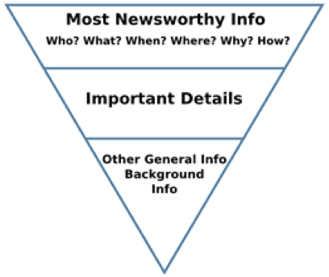

[1]为了清楚起见，在这里我们应该注意这是一种简化。 今天上午无法以昨晚的收盘价进行交易。 我们可以在新闻报道发布时对其进行评估，但这将需要比该项目更多的日内价格数据。 另外，值得注意的是，这里的重点是确定哪个新闻将推动市场发展，而不是确定该趋势将朝哪个方向发展。 （这就是说，给定一个，确定另一个可能相对简单-但是鉴于我们对波动率的历史关注，这就是我们的兴趣所在）

[2]请注意，我们并不是在推断因果关系。 在任何时刻，任何一种股价的变动都有多种因素驱动。 此外，我们关注的焦点是股价的变化超过同期S＆P500指数的波动，即，我们正在寻找超额收益（通常称为Alpha）。
# 阅读市场-机器学习与金融新闻

大量的金融新闻文章被发表。 但是，只有少数人会真正推动市场。 知道哪些可能会有所帮助。 机器学习可以指出道路吗？

[本文涵盖了今年五月在维也纳举行的QuantMinds国际会议上发表的工作，以及十二月在纽约举行的Quantitative Finance机器学习与人工智能会议上的最新动态。 它建立在衡量新闻情感的工作基础上，我们在《迈向数据科学：机器学习与新闻》中发表了此文章。

想象一下，您想击败股票市场。 您是一个勤奋的投资者。 市场开盘前的每个早晨，您都阅读自前一天休市以来发布的所有新闻。 在以某种方式确定了哪些文章会打动市场之后，您将运用自己的直觉和洞察力来进行当天的下注。 然后您去海滩。

这种理想情况的问题在于，数据量巨大，并且数据与结果之间的关系从未得到可靠的表述。 但这当然是我们希望将机器学习应用于这类问题的本质[1]。

道琼斯通讯社（Dow Jones Newswires）是主要的实时财经新闻提供商之一，每年载有几百万篇文章。 其中包括从主要报纸的文章到新闻稿和经纪人评论的所有内容。 即使我们对世界的看法仅限于与构成标准普尔500指数的公司明确相关的文章，我们每天仍然有数千篇文章。 如果我们在开市前一个小时到达工作地点，则只有两秒钟的时间来阅读和评估每篇文章。 我们也许可以按照这样的速度浏览几篇文章，并发现一些有趣的文章，但是我们的分析不太可能会很深入，而且几乎可以肯定的是，我们无法在一个小时的时间内保持这种速度 。 很久以来就很清楚，即使有足够的时间，投资者对市场的预测也不是那么出色。

想到的最大问题是：

是否有可能构建一种算法来成功找到将推动市场发展的商品？

继续阅读，您会发现答案最终是肯定的。 但是要实现这一目标，需要投入大量的精力来发展对现有新闻文章的本质的理解以及对相关工具和算法的直觉。
# 了解新闻

对于这个项目，我们使用自然语言处理，尤其是情感分析。 要引用Wikipedia定义：

> Wikipedia’s definition of Sentiment Analysis

在我们的上下文中，这意味着分析新闻文章的文本并确定它是“正面”还是“负面”。 有几种常用的库可以使用：

●斯坦福大学CoreNLP

●NLTK

●Google Cloud Platform

这些库中的每个库的操作方式都不相同，但是通常的想法是，它将消耗一些文本并返回分数，如果文章特别乐观，则文章的评分可能为+1，如果文章特别负面，则评分为-1，或者介于两者之间的其他值 适当。 本文介绍的结果是使用NLTK VADER获得的。 选择该选项主要是出于计算原因，因为它比替代方法要快得多。

为了举例说明，我们来看看传递给斯坦福大学情感分析器（可以在此处运行）的一些句子。

> Sentiment computed for a variety of sentences by Stanford’s CoreNLP

我们看到，一些琐碎的句子被评估为或多或少是积极的，这符合我们可能希望的期望。 当使用新数据或新库时，运行此类琐碎的测试来确定您可能遇到的弱点非常有用。 在所有库中都可以找到差劲的结果，并且为避免看起来有些卑鄙，在此不共享此类示例。
# 如何预测未来

一旦我们了解了新闻报道的情绪，我们就希望能够预测新闻发表是否会在市场上发生重大变化[2]。

用机器学习的术语来说，这是一个监督学习问题。 我们具有包含新闻功能（文章的属性）的历史新闻文章数据，并添加了一些标签（基本上为0或1），用于指定文章实际上是否跟着文章中提到的公司股价发生了重大变化。

我们将这些数据传递给分类器-一种分类算法，在我们的案例中，该算法试图推断某个特定商品是否有可能跟随价格的大幅变化。 在实践中，我们希望能够确定我们是否从可用的历史数据中学到了任何有用的信息。 为此，我们将历史数据分为训练和测试集。 在“学习”阶段，我们向算法显示训练数据中的功能和标签。 然后，在测试阶段，我们将提供训练有素的算法，该算法具有以前看不见的特征，指示它预测最可能的标签，然后将该预测与实际对应的标签进行比较。

在这种总体框架下，我们的工作必须朝两个方向进行：

●确定用于可用新闻文章的最佳功能集。

●确定分类器（及其参数化），这将最成功地了解我们的特征和标签之间的关系。
# 分类信息

我们将在短期内讨论我们要考虑的功能类型，但首先要对分类器进行一些评论。 存在许多用于监督学习问题的分类器。 最基本的是Logistic回归。 然后是诸如决策树和随机森林之类的算法。 在频谱的数学复杂端，我们找到了神经网络。 对于这个项目，我们使用神经网络找到了最好的结果，因此我们在这里呈现的结果就是这样获得的。

我们在这里不会尝试介绍神经网络。 可以说它们是一种非线性回归工具，其底层设计在简化人脑的基本结构中获得了启发。

过去几年中，我们在机器学习中经历的许多重大进步都利用了神经网络。 基本算法已经存在了数十年，但是随着处理能力和数据可用性的稳步提高，它已经成为一种独特的算法。

对于这个项目，我们使用Google流行的TensorFlow库在Python中实现了神经网络。 选择神经网络的特性，尤其是其复杂性，以平衡精度和泛化。 这对应于：

●准确预测样本中训练数据的标签

●准确预测样本外测试数据的标签

这听起来不那么容易。 显然，如果模型非常简单，即使在训练过程中“看到”的数据也不太可能表现良好。 随着模型变得更加复杂，它开始在训练数据上表现更好。 而且，如果运行良好，它将在以前看不见的测试数据上表现越来越好-即它将学会概括。 但是从某种程度的复杂性来看，它将继续在训练数据上表现更好，而在测试数据上表现越来越差。 因此，选择架构的目的是在测试数据上模型的准确性最高的那个最佳点落地。

思考这种现象的一种方法是，无法从数据中完美地了解任何关系。 这在很大程度上是因为数据本身并不是我们试图学习的关系的完美示例-总是有噪音。 随着模型变得越来越复杂，它获得了从训练数据中学习噪声的数值自由度。 但是，由于从这个角度来看，噪声基本上是随机的（因此是不可预测的），因此，这种知识只会分散学习未知数据有用的知识的注意力。

因此，诀窍在于找到一个网络，该网络足够复杂，可以学习数据中非线性关系的本质，但又不够丰富，无法有效地记住显示的数据（每个观察都包含特定的噪声，这些噪声会 不会在将来的数据中复制）。

这一点很重要，因为事实证明，记忆数据很难保证知识可以推广到以前未曾见过的案例。 从某种意义上说，对记忆的约束是洞察力的起源。 但是只是到了一定程度-给定足够有限的模型，我们既不会记住任何东西，也不会学到任何有用的东西。

达到我们目的的最佳网络架构如下：

●四个隐藏层-64、128、128和64个节点

●层已完全连接并使用Relu激活

●输出层包含具有S形激活的单个节点
# 特征工程

特征工程是确定可用数据的特定属性集的一种技巧，这将最有助于我们寻求推断的关系的学习。 我们可能会想象一些可以考虑其实用性的文章属性：

●文章文字

●载有该文章的出版物的名称

●文章发表的时间

●发布者的商品ID代码

随后，我们可能会确定将文章ID与我们的功能一起使用并没有帮助。 包括它甚至可能使结果变差。 从直觉上讲，我们可以认为此功能只是带来了额外的噪音，而这些噪音正阻碍算法寻找洞察力。 在这种情况下，从功能中删除商品ID实际上会消除干扰，并使学习更加轻松。

相反，对于我们的算法而言，文章本身本身可能很难学习任何内容。 因此，功能工程技术的另一个方面是研究可以从数据中得出哪些进一步的属性，以帮助突出显示关键关系并使算法的工作更轻松。 （如前所述，我们将使用“情感”等派生功能）
# 过程

为了获得此处介绍的结果，我们遵循一个非常典型的机器学习过程。 实际上，我们会将数据随机分为训练和测试集。 呈现的结果是将训练后的模型应用于测试测试所得的结果（即，没有用作训练模型一部分的数据集）。

首先，新闻文章只有一个功能-文章的情感。 我们将其与标签（0（表示股票的绝对超额收益小于1％）或1（表示绝对的超额收益大于1％）的标签相关联。

接下来，我们在随机选择的训练子集中训练分类器，然后通过从测试数据集中生成预测并将其与实际记录的股价历史走势进行比较来测试训练后的网络。

为了使这种比较在一组数据中有用，我们需要一个指标。 F1分数是评估分类问题解决方案是否成功的常用指标。 这在我们这样的情况下特别有用，例如在我们的数据集中存在大量“真实负面”信息的情况下-这意味着大多数文章并没有跟随股价的大幅波动。

请记住，如果模型期望新闻文章跟随市场走势，则模型将预测为1，否则为0，否则F1得分将计算为以下各项的谐波均值：

●我们模型中1个预测中实际上是1个（所谓的“精确度”）的比例，以及

●我们的模型正确预测为1（召回）的所有实际1的比例。

如果我们的结果是完美的，那么此值将为100％，如果完全没有用，则该值为0％，并且更可能介于两者之间。

为了说明此类项目的发展，我们将以渐进方式展示结果-查看我们在尝试不同功能集时发现的F1分数。 要记住的一个重要事实：

尽管添加功能的过程是由我们的直觉和智慧驱动的，但即使是我们最大的见识，现实也常常不会给他们留下深刻的印象，有时甚至会成为严厉的批评家。

无论如何，我们希望通过明智地添加功能来提高模型的预测能力！
# 第一步：那些困难的早期结果

看到最初的结果通常是您无畏的机器学习工程师或数据科学家陷入绝望的那一刻-因此我们必须束手无策，并对最终的结果持一定的乐观态度。

尽管我们还不够天真，无法想象用一个数字代表文章（它的情感）会给我们的分类器很大的希望，以推断文章是否会推动市场，但从这里开始仍然有用。

这有两个原因。 第一个是检查整个管道是否正常工作的一种方法-我们可以组装数据，构建功能，拆分测试数据，训练模型，根据测试数据评估模型等。第二个是 它有助于建立基线的准确度水平，我们可以据此做出有关添加其他数据功能或更改分类器架构的实用程序的决策。

不过，有人希望我们在现阶段所取得的结果会好于随机的，因为这至少会令人鼓舞。 本能地，由于我们正在考虑预测文章是否会推动市场发展，是/否，因此感觉很二元。 因此，人们很容易想到50％是随机猜测的结果。 因此，我们希望在测试数据上获得F1分数在50％到100％之间。

因此，当第一次跑步完成时，F1分数就会显示在屏幕上，并且它的值为25％，很难不感到沮丧。 稍加思考，就可以使我们感到安慰，因为只有不到一半的文章紧随其后的是大幅度的市场变动，因此以相同的频率选择0和1会导致较低的结果，因此我们的结果确实比随机结果要好。
## 进度检查：第一步

# 第二步：预处理文章

数据科学家最重要的活动之一就是了解数据。 有时这可能是微不足道的。 但是，如果一项工作非常复杂以至于需要一位数据科学家，那么数据集可能会很大且没有结构。 这种分析可能是令人沮丧且耗时的活动，但它也是必不可少的。

我们发现的第一篇文章显然是我们可以希望从中学到的东西：

Belvoir Lettings PLC（BLV.LN）周三表示，已超过了其2017年收购资产组合的目标。 这家英国房地产租赁公司表示，在2017年，特许经营者完成了23笔交易，使网络收入增加了330万英镑，超过了预期目标。

本文支持以下几点：

●显然与特定公司有关

●具有可以相对容易地推断出情感的语言

●它不包含很多中性或分散注意力的文字

我们开始注意到的许多其他文章不能说相同。 一些形式经常重复出现，其中包括：

●经纪人的价格更新

●带有免责声明的新闻稿

●标准普尔评级评论

●与多家公司有关的文章

其中第一种对于我们的目的没有多大用处，因为它们只是简单地列举了出售特定证券的价格。 实际上，它们几乎完全是数字形式的-尽管这并不妨碍它们有用，但我们的NLP情感算法并不适合于解释它们。 最好检测此类文章并将其排除在我们的流程之外。

新闻稿和标准普尔评级评论可能非常有用。 但是，它们通常以免责声明的形式包含很长的法律词汇。 情感计算为文档句子的平均值。 由于法律术语趋于中立，因此在分析文章时包括标准文本的这些较长段落将倾向于显着减弱文章报道的情绪。 因此，在评估之前，我们将从文章中删除此类标准文本。 这是一项繁琐的工作，但是可以使用一系列正则表达式有效地实现。

一些新闻文章总结了与不同公司有关的多条新闻。 由于这些格式遵循特定的格式（取决于发行商等），因此通常可以自动将它们拆分为一系列微型文章，每个微型文章仅覆盖一条新闻。

一旦建立并实施了一套用于预处理数据的规则，我们就可以重新运行分析并查看获得的测试结果。
## 进度检查：第二步

实际上，通过对商品进行这种预处理，我们的F1分数提高了15％。 这是第一个表明在了解您的问题领域和技术领域中都有真正价值的标志。 在这种情况下，意味着了解：

●在广阔的海洋中究竟能找到什么样的文章，以及

●算法将如何在各种类型的文章上执行
# 第三步：添加更多功能

为了提高我们的神经网络学习某些东西的机会，我们现在将为它提供更多数据-特别是，我们将为每篇新闻文章提供其他功能。

在我们这样做之前，反思一下新闻文章对我们来说“有用”的事实是有用的，仅是它改变了我们对某些事物的看法。 从简化的世界观来看，我们从关于某股票的新闻报道的情绪中得出了对该股票的情绪。 因此，如果新闻文章偏离我们先前对股票的看法，则可能会被认为是有趣的。 请注意，一篇文章不必与我们的当前观点相抵触，它可以使我们对我们的当前观点更有信心。 考虑到这些目标，我们为每篇文章介绍以下功能：

●该股近期新闻的平均情绪

●本文的观点与该股票的近期历史均值之间存在偏差

●股票近期商品人气的波动性

我们还可以想象，股票对新闻报道的反应可能取决于股票最近的交易方式，因此我们采取了以下措施：

●股票的交易量如何？

●股票相对于大盘表现如何？

●股票最近超额收益的波动性是什么？

最后，一些公司在正常时间很少被报告，而在重大事件发生时则更频繁地被报告。 因此，我们包括一种衡量股票报告频率相对于其长期平均水平最近的表现的方法。

将所有这些功能放在一起并重新运行我们的测试，我们看到F1分数从40％增加到49％。
## 进度检查：第三步

# 第四步：一点新闻见解

这类工作最重要的方面之一是对领域的理解。 许多新闻都是根据所谓的“倒金字塔”模型构建的。 从Wikipedia借用，我们可以将典型新闻文章的结构可视化如下：

> Inverted Pyramid Model of Journalism courtesy of Wikipedia

这是编写文章的相当标准的方法。 这个想法是在本文开头传达谁，什么等等，然后在随后的段落中提供越来越多的辅助细节。 前几句话称为文章的Lede（或Lead）。

我们可能会假设，莱德传达的情感与公司新闻中最重要的部分相关，并且我们越深入文章，就会越分散我们的注意力（关注于情感）。 不太重要的细节）。 如果我们对这个假设感兴趣，那么我们应该考虑运行网格搜索来确定要处理的文章的最佳部分。

为此，我们使用NLTK工具包将文章文本转换为句子。 接下来，我们从文章中选择前n个句子（每篇文章中相同的n个句子），然后仅对文本的这一部分进行其余的过程，并计算F1总体得分。 此外，我们迭代n的不同值，直到找到最佳的F1分数。 我们发现的结果如下所示：

> F1-score computed using a series of Lede lengths (in number-of-sentences)

这显示了大约十个句子的最佳情感信息内容，因此在完成第四步时，我们将处理限于十个句子的文章。
## 进度检查：第四步

# 停下来思考一下—我们被卡住了吗？

通过多次迭代，我们将结果推向了一个点，即对我们的结果具有一定的统计意义，但不足以保证撰写关于此结果的文章。 我们已经花了很多时间加深对新闻报道的理解，所以现在我们必须尝试加深对我们正在使用的AI工具的理解。

尤其值得反思的是，情感分析是否能很好地解决我们要解决的问题。 为此，我们必须更深入地了解可供我们使用的特定情感分析工具。 考虑建立每个主体的语料库的本质是很有见地的。 通常，流行的情绪分析器没有接受金融新闻报道的培训。 通常，它们是使用以下命令构建的：

●来自Amazon或IMDB的评论

●鸣叫

这些类型的文本中的每一种都有自己的特质。 推文肯定是用与全长新闻不同的语言编写的，因此针对推文进行良好校准的工具不太可能理解更正式写作的情感范围。

值得注意的是，从我们对股票的看法来看，“结果略有改善”这样的句子是正面的。 但斯坦福大学的CoreNLP将此句子归类为否定词。 同样，所有库都具有特质和不一致之处，因此，这并不是要批评CoreNLP。

所有这一切让我们怀疑，最好的方法是构建自己的专有情感分析器。 如果我们来看看可用的工具，很容易被Doc2vec的流行和声称的功能所吸引。 因此，让我们看一下是否有帮助。
# Doc2vec不断前进

Doc2vec是流行的Word2vec的扩展，有效地在文档级别而不是单个单词上应用了该技术。 Word2vec最初来自Google进行的研究。 Word2vec的思想是学习将单词映射到n维向量的函数。 该算法通过查看整个语料库中的单词序列来实现此目的。 在机械上，简单的神经网络用于学习预测哪个单词最有可能跟随任何给定单词。 第一个惊喜是在下一步。 扔掉神经网络的输出层，然后看倒数第二层中n个节点的激活。 然后可以将这些激活的值视为对应于我们对输入单词的矢量表示。

为什么有什么用呢？ 这种情况如何发生尚不确定，但是如果我们绘制一系列单词的向量值，就会开始注意到一些非常有趣的模式。 从Google Deep Mind的一位研究科学家的文章中获取以下图片：

> Word embeddings for related words under Word2vec

在这里，我们正在查看对应于一些常见单词的向量值的曲线图。 （实际矢量是高维的，但是在这里通过称为降维的数学过程对其进行了简化，以便可以在某种程度上在我们可以绘制的二维图中进行近似）

需要注意的是，尽管“慢”，“短”，“强”，“暗”之类的词都出现在图形的完全不同的位置（沿左侧），但相对位移却越来越慢（相对于 慢），基本上与我们看到的短/短/最短，强/强/最强等相同。

这几乎表明该算法已推断出语言语义的某种算法。 实际上，可以生成图表，显示出许多其他语言属性的相似结果。

除了要说Doc2vec将方法扩展到文档级别之外，我们在此不再赘述，并且在情感分析中使用Doc2vec文档向量化已经发表了几篇论文。

这非常有趣，因为可以轻松地在任意文档语料库上训练Doc2vec。 因此，我们建立了新闻报道的向量化，然后就像跟随这个新方向的激动一样，我们着眼于这一过程的下一步：训练我们的情感分析器。 我们意识到了这个问题。

有关将Doc2vec与情感分析结合使用的已发布工作很大程度上是通过审阅数据完成的，尤其是来自Amazon客户或IMDB电影审阅者的审阅数据。 这些案例带有的标签是我们没有的，即每条评论都包含文字和用户指定的星级。 两者的结合大大简化了从文本中学习情感的过程。

但是…就我们而言，我们只有文章，没有星级。 由于我们知道我们的目标是要拥有对情绪分析器进行培训，使其能够接受财经新闻而非电影评论中所使用的语言类型的培训，因此我们陷入了困境。
# 所以我们撞墙了

经过努力寻找解决问题的方法之后，出现了真正的障碍。 就像马拉松运动员必须在最后一次深入挖掘以找到出路一样，我们也必须如此。

考虑一下我们要做什么。 有效地有两个步骤：
+ 文本-> Doc2vec->情感，然后
+ 情感->市场预期

我们的问题是缺乏有用的情感价值。 但要注意，情感既是一步的输出，又是下一步的输入，难道我们不能简单化吗？

为什么不将市场结果用作情感的代表？ 这将使我们仅需一步：
+ 文本-> doc2vec->市场成果预测
# 第五步：集成Doc2vec

事实证明，以这种方式可以发现明显的改进。 尽管我们使用gensim而不是Google的实现，但实现起来相对简单。 结果如下所示。
## 进度检查：第五步

# 第六步：拿着香槟

在我们介绍的各种细节中，有一些使用Doc2vec时会出现的基本实际约束。 主要问题是，我们需要一套完整的文章来构建模型-无法动态添加新文章，然后对这些文章进行预测。 这意味着我们可能需要对出现的每篇新文章重新训练文档矢量化程序。

问题实际上比那更糟。 Doc2vec中的特定向量不是算法的本质-重点是不同文章的相对嵌入。 重建模型时，这些不同向量之间的形状可能会保留，但绝对值可能会发生变化。 由于我们用作分类器的神经网络与实际值有关，因此也有必要对其进行重新训练。

这是很大的计算负担，并且在每天有成千上万的新文章的实时环境中根本不方便。

我们可以认为基本约束源自Doc2vec，它需要完整的词汇表才能建立其矢量化模型。 给定足够多的特定领域训练数据集，在以前看不见的文章中几乎没有新词可以遇到。 但实际上，总会有一个新人的名字，地名，公司名称等。这表明我们可以尝试在不使用专有名称的情况下构建向量。 确实，有NLP工具使我们能够获取文本并标记每个单词的词性。 然后我们可以过滤出与专有名称相对应的单词。

这在直觉上很吸引人，因为它应该使归纳更加容易（因此，由于排除了股票名称，因此我们可以将了解到的一只股票的信息应用于另一只股票）。 当然，我们一定会找到更好的结果……让我们拭目以待。
## 进度检查：第六步

不幸的是，无论这个想法多么吸引人，这都无法改善我们的结果。

仔细检查后发现，潜在的词性过滤效果不是特别好-它会删除一些不是真正专有名词的词。 并需要一些删除的单词来推断情绪。

然而：

采取这一措施的关键点在于，通过执行此步骤，我们可以解决实时难题，而又不会显着影响结果的质量。
# 结论

在本文中，我们表明可以处理新闻文章并确定哪些新闻可能会影响股价。 这并不是说我们的模型正确地预测了市场70％的时间。 如果这样做的话，我们将不会写这篇文章。 我们的测试范围要窄得多-请记住，我们正在集中精力预测新闻文章是否会跟随股价的变动（与指数变动相差1％以上）。 我们还在研究昨晚和今天之间的变化。 因此，并非所有更改都可以直接归因于本文。 而且我们不应该混淆相关性和因果关系。

当然，了解得越多，可以获得的结果越好。 这意味着有必要仔细研究所有方面：

●了解数据

●了解新闻

●了解算法

与许多机器学习应用程序一样，与新闻和市场合作几乎与技巧科学或工程学一样重要。 在某种程度上，这种处于科学与工程与工艺之间关系的位置使其成为一门引人入胜且令人愉快的学科。

这个领域还有很多工作要做-未来几年将进行大量研究。 考虑到金融市场的风险，最好的作品出版的可能性很小。
