最初发布在https://sophieyanzhao.github.io。
# 强化学习推荐系统
## 哈佛数据科学高层项目，2019年秋季


团队成员：苏菲，王一舟，钱峰

对于服务提供商（例如Spotify）来说，推荐系统可能是至关重要的竞争优势，后者主要通过用户订阅来发展业务。 准确的建议有助于改善用户体验并增强客户忠诚度。

传统的推荐方法包括使用监督学习对用户项目交互进行建模，例如分类，从用户历史记录中进行基于内存的内容过滤等等。 这些想法忽略了连续时间步骤之间的依赖性。 受其他领域（例如玩Atari游戏）的强化学习的启发，我们采用了最先进的模型，即深度确定性梯度策略（DDPG），将音乐推荐建模为顺序决策过程。 在此设置中，DDPG学习者的动作是从一个巨大的池中选择的一首歌。 通过使用一系列连续特征表示每首歌曲，然后将动作空间从离散扩展到连续，我们的经纪人成功地扩大了其可容纳的候选歌曲的数量，同时保持了令人满意的推荐准确性和多样性。
# 数据

我们使用最初由Spotify为比赛而发布的“音乐流会话数据集”（MSSD）。 数据集包含侦听会话数据和用于歌曲功能的查找表。
## 数据结构
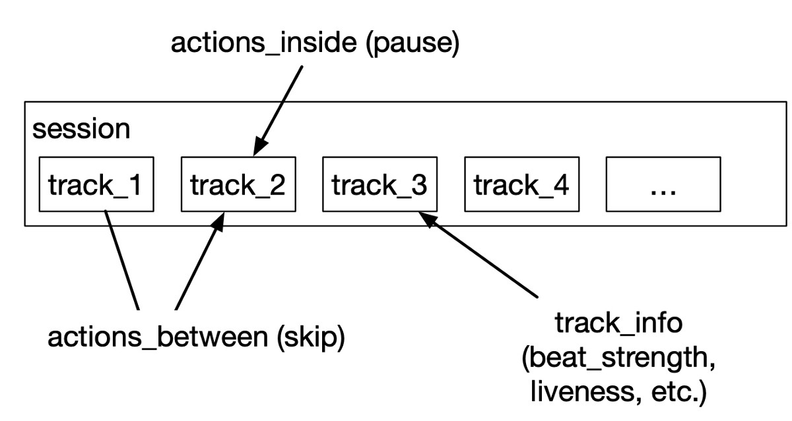

上面是我们拥有的数据结构图。 我们有两个数据文件：一个带有会话行的文件，另一个带有轨道功能行的文件。 曲目是歌曲，会话是单个用户收听的一系列曲目。 Spotify将会话的最大长度上限限制为20。

在会话内，记录轨道之间和轨道内的动作。 曲目之间的动作包括：skip_very_briefly，skip_briefly，mostly_played_before_skip，no_skip，指示用户从一个曲目转移到下一曲目的模式。 歌曲中的动作主要包括move_forward，move_backward，no_move，指示用户在收听曲目时的行为； no_pause_before_play，short_pause_before_play，long_pause_before_play指示用户暂停行为。 以上响应可以解释为每个轨道上的用户首选项。

我们还在每个轨道上都有特征数据，这些特征由Spotify通过手动或自动方式给出。 这样的功能包括声学性，beat_strentgh，舞蹈性等，并且在[0,1]之间变化。 我们可以将这些功能整合到模型中。
## 资料取样

MSSD是一个庞大的数据集，包含超过2000万首歌曲和1700万次会话，包括大约600 GB的数据。 为了使我们的模型适应此数据集，我们采用了一部分歌曲和会话，如下所述。

要选择MSSD的子集，请执行以下操作：首先，我们对会话数据进行采样，然后对会话跟踪数据进行采样。 在原始数据中，我们决定从数据中抽取10万个会话。 由于数据分为大小相似的10个zip文件，因此我们需要从每个zip文件中采样1万个会话。 每个zip文件包含N个数据文件，因此我们需要从每个数据文件中采样10k / N万个会话。 由于每个数据文件包含不同数量的会话，因此我们需要从每个数据文件中以不同的概率进行采样。 例如，如果数据文件$ f_1 $中有$ M $个会话，我们将以10k / NM的概率随机接受文件f1中的每个会话。

在对所有会话进行采样之后，我们需要找出出现在采样数据中的所有轨道。 如果数据的大小很小，这可能很容易：我们可以使用一组数据结构来查找一组轨道ID。 但是，由于数据量太大而无法存储在内存中，因此我们决定使用数据库（Macbook Air 2014上为Mysql）来让数据库为我们维护树形结构。 使用数据库，我们可以轻松找到所需的曲目。

我们从300多个数据文件中统一采样，并将数据减少到106,375个会话（376MB）和281,185个磁道（167MB）。
# 型号概述

强化学习模型包含以下组件：代理，环境，状态，奖励功能，价值功能和策略。为了简化问题，我们假设一个假设用户，其经验来自所有实际用户。我们的推荐器模型将成为该歌曲的处理系统，该系统将处理此假设用户的歌曲，该用户将跳过/不跳过推荐。用户的行为与系统的环境相同，它会根据系统的状态响应系统的建议。用户反馈决定了我们的奖励，即只有用户不跳过时才获得一个分数。推荐代理商采取行动。我们的状态定义为歌曲功能和过去5个步骤（不包括当前步骤）的相应用户反应。因此，反馈和行动共同给了我们下一个状态。代理商的目标是学习一种可以在15个步骤中最大化累积奖励的策略。为了避免冷启动，我们将预测长度设置为15，也就是说，假设我们的原始会话长度为20，历史记录长度为5，则预测何时没有足够的历史记录。
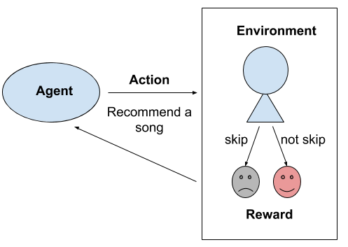

更正式地说，数学定义如下：
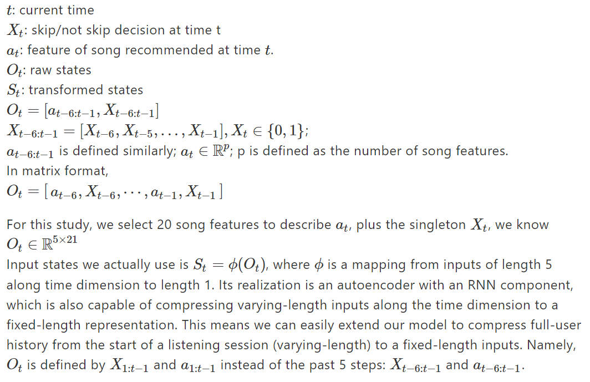
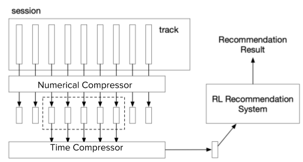
> Model Pipeline

# 自动编码器
## 总览

我们的数据首先通过一个由两部分组成的自动编码器：数字压缩器和时间压缩器。 每个数据点最初是5 x 21，对应于5首歌曲的20首歌曲特征以及用户观察到的动作（跳过/不跳过）。 我们使用前馈自动编码器压缩20首歌曲功能，该输入将输入转换为5 x8。最后将用户响应串联起来，使之达到5 x9。然后，将该潜在表示形式输入到LSTM自动编码器中，该编码器会沿时间维度压缩 转换为尺寸为1 x 9的单个向量。
## 实作

在训练期间，我们首先构建一个自动编码器，然后在歌曲特征数据集上对其进行训练。
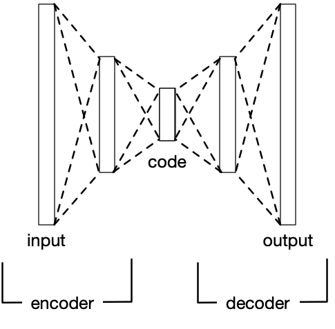

然后，我们修复编码层和解码层，并将它们与LSTM时间压缩器连接起来。 编码层负责预处理数字特征，而解码层负责将时间解码器的输出扩展到全长。
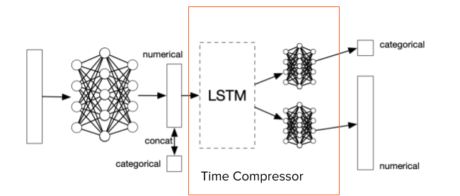

时间压缩器尝试将5 x 9输入压缩为1 x 9，然后将其解码为5 x9。为了容纳混合类型的数据，我们使用了两个时间解码器，一个具有MSE丢失的时间解码器来恢复数值，而另一个具有 交叉熵损失以恢复二进制用户跳过行为。 最终损失是这两个损失的线性组合，分配的权重会影响这两个任务中的模型性能。 尽管使用了两个解码器，但它们共享单个长度为9的潜在表示作为输入。 在预测期间，一个附加步骤是数字解码器获取时间解码器的输出并恢复数字特征的原始维度。
## 可能的扩展

不仅压缩数字特征，前一种“数字压缩器”既压缩歌曲特征，又压缩二进制用户响应，我们将其称为“组合压缩器”，以便将其与“数字压缩器”区分开。 通过从我们的时间压缩器中释放压缩分类响应的负担，可以进一步改善此结构。 在此项目中，我们尚未将组合压缩机与时间压缩机连接在一起。
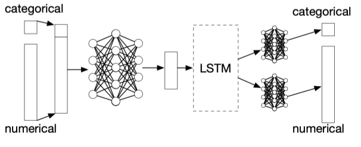
## 结果
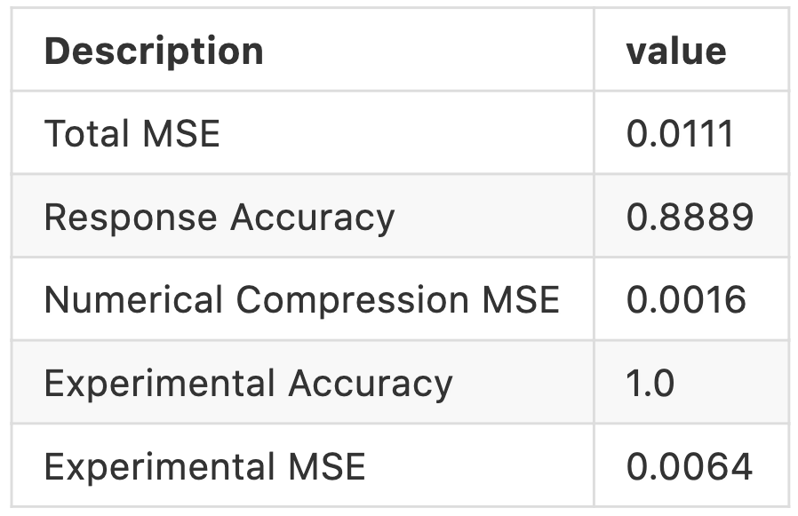
> Table 1: Results of the autoencoders


我们的数值特征被归一化为介于0到1之间。从1 x 9潜伏重构5 x 20的MSE为0.0111，约为特征范围的1％。 重构二进制用户行为的准确性为88.89％。 训练数字压缩机的MSE为0.0016。 所有统计数据均在测试集上计算。 最后两行是实验组合压缩机的性能统计数据。 实验性组合压缩机的精度为一个可恢复测试集上的二进制用户跳过行为的精度，而数值重构MSE的精度略有提高，为0.0064。
# 强化学习
## 构架
+ 状态：时间压缩器的潜在向量。 长度为9的状态包含前五首歌曲的信息和相应的用户响应。
+ 行动：数值压缩器的潜矢量。 该动作是推荐的歌曲。 为了减小尺寸，我们使用长度为8的歌曲特征的潜在表示。
+ 奖励：不跳过概率与推荐多样性的总和。
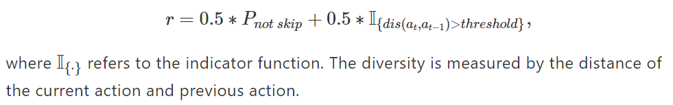
+ 代理：策略功能和Q功能。

## 环境

当给出一对状态和动作时，环境应该返回奖励。 但是，在此问题中，我们无法观察到实时的用户响应。 我们将使用现有数据来估计跳过/不跳过行为。
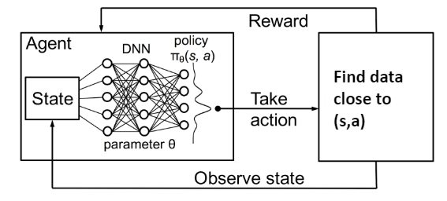
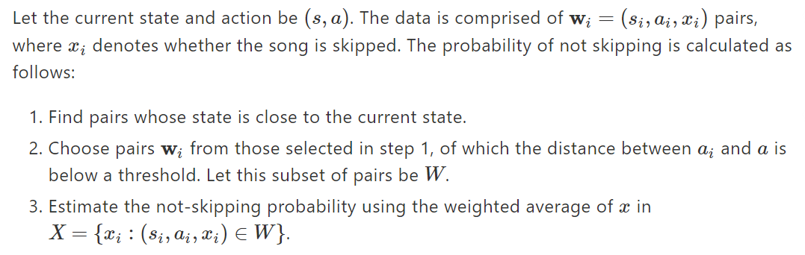
## 深度确定性策略梯度

DDPG是“深度确定性策略梯度”的缩写，是一种无模型的非策略参与者批评算法，将DPG与DQN结合在一起。 原始的DQN在离散空间中工作，而DDPG在学习确定性策略的同时，使用行为者批评框架将其扩展到连续的动作空间。
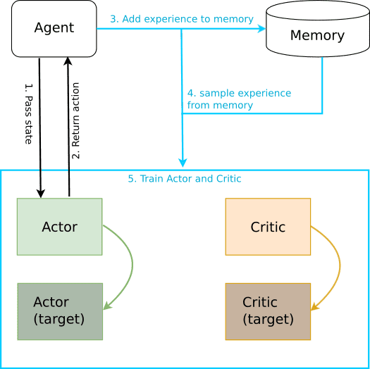

该算法有四个神经网络：参与者，评论者，参与者目标和批评者目标。 角色网络学习策略功能，而评论者网络则近似Q功能。
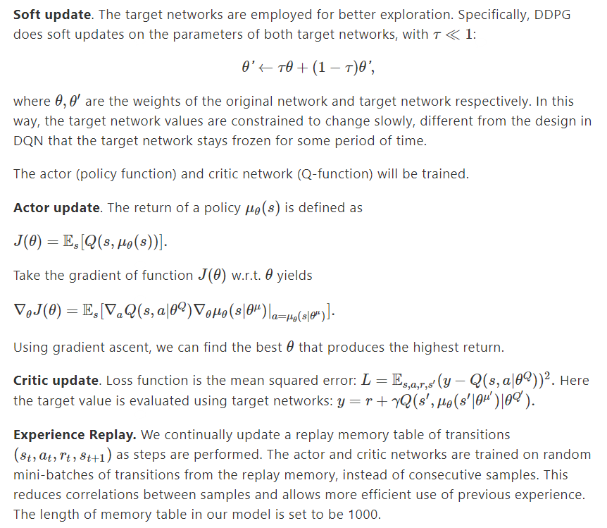
## 结果

由于我们的模型要求提供前五首歌曲的信息，因此代理将为每个会话提出15条建议。 因此，我们在每个情节中执行15个步骤。
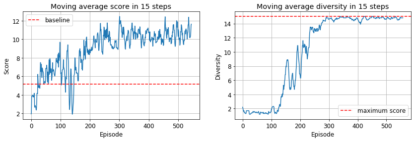

推荐器系统从我们的截断的音乐会话中可以累积的最高分数是15。不跳过行为占据了整个数据的34％，这相当于基准分数约为5。从左图可以看出， 在仅几百集的训练中，我们的经纪人的得分就达到了11分左右，显示出比基准测试更好的性能。 右边是多样性分数。 如果当前动作与上一个动作之间的距离超过某个阈值（标准偏差的0.4倍），则多样性得分为1，否则为0。这是针对每个步骤计算得出的，因此最高得分也为15 从情节中我们可以看到，一开始，我们的经纪人倾向于推荐类似的歌曲。 但是在大约300集之后，它学会了考虑推荐的多样性。
# 结论

在这个项目中，我们成功地使用强化学习来捕获用户歌曲的交互以及当前和过去决策之间的时间依赖性。 未来的研究可以通过放宽许多简化的假设来扩展我们的发现：首先，不要假设单个假设的用户，而是要进行客户分层，并将此变量纳入模型。 第二，我们可以考虑自会话开始以来的完整用户历史记录，而不是在5点时将历史记录截断。 另外，我们可以通过将其与时间压缩器和下游DDPG代理连接来测试实验组合压缩机是否优于当前模型。

在训练方面，由于计算资源和时间的限制，我们正在分别训练不同的模型组件。 端到端地训练模型是一个好主意，以便潜在可能更适合强化学习任务。 最后，在我们研究的基础上，可能做出的最重要的修改是为强化学习代理提供真实的环境。 我们当前的数据集偏向于跳过行为（非跳过率为34％），可能无法反映实际的客户行为。 因此，与其使用数据集（600G）模拟环境，不如使模型准备投入生产，更好的方法是招募一些参与者以测试他们对建议的反应。 这样，代理就可以充分探索推荐空间并提出更可信赖的推荐。
# 致谢

我们要最真诚的感谢：指导老师，强化学习专家Javier Zazo，以及一个一直向我们提供宝贵建议和鼓励的好朋友，我们需要继续前进。 297R研究项目负责人Pavlos Protopapas，使这项令人难忘的研究旅程成为可能的教练，以及Spotify高级研究员和数据科学家Aparna Kumar（向他报告的出色支持经理）。

该研究项目属于IACS 297R研究项目。
```
(本文翻译自Yizhou Wang的文章《Recommendation System with Reinforcement Learning》，参考：https://towardsdatascience.com/recommendation-system-with-reinforcement-learning-3362cb4422c8)
```
