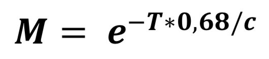

# 推荐系统应用程序开发
## 使用余弦相似度，评级阈值和其他自定义技术

> Source


在本文中，我们将使用余弦相似度（CS）以及其他使用Python编程语言的自定义公式来开发推荐系统（RS）。 该应用程序将是我在MSc论文期间从事的项目的一部分。

建立RS的方法有很多。 在这里，我们将开发一些方法来特别解决RS的冷启动问题。 冷启动问题是难以在没有大量关于用户（新注册用户）的信息的情况下为用户提出建议的困难。 在这个项目中，我们将研究仅使用有关用户的少量信息（允许他们选择他们感兴趣的类别）进行推荐的方法。

要求：
+ Python 3
+ 麻木
+ 大熊猫
+ lt

我将假设您在这些文章的整个开发过程中都了解Python。 这些文章的主要目的是讲授如何使用CS和其他技术来构建RS，因此我不会重点介绍Python代码。 还值得一提的是，我可能会编写一些代码，由于我不是Python专家，所以可能会更好。 如果您意识到这些部分，请在评论中让我知道，以便稍后进行重构:)

我们将开发4个不同的版本，以研究一种不同的方法来改进我们的系统。 首先，我们将从具有余弦相似性的推荐系统开始。

我们将建立的RS将针对所选类别推荐5个不同的城市出行。 当然，这些技术和方法以后可以应用于具有不同上下文的应用程序。

请在此处下载我们的RS将基于的数据集。

该数据集的某些功能（列）是我以前从TripAdvisor网站获得的真实信息，而其中一些只是我添加的随机功能，以在以后实现和显示不同的技术。 我们的数据集由25个城市组成，这些城市具有以下特征：城市，受欢迎程度，描述，图像，等级，等级数，肯定评论，否定评论。 您可以在下面查看前5个城市的数据集预览。

> City dataset preview


我从TripAdvisor获得的功能包括：城市，受欢迎程度，描述和图像。 除这些功能外，其他功能均由我随机制作。 我们不会在RS的第一个版本中使用这些功能，但是这些功能将用于这些系列其他部分的不同技术。

让我们回顾一下每个功能代表什么：
+ 城市：城市名称
+ 受欢迎程度：为该城市保存的评论数。
+ 描述：有关城市的博客文章
+ 图片：城市的背景图片
+ 评分：城市的平均评分值（0–10）
+ rating_count：从用户那里收到的评分数量
+ postive_review：正面评论的数量。
+ negative_review：负面评论数量。

现在我们已经下载了数据集并了解了功能，接下来就可以开始开发了。 如前所述，我们仅将城市和说明功能用于第一个版本。
# 版本1

RS的第一版将根据数据集中城市的描述特征给出建议。 RS将使用余弦相似度计算城市描述和与用户可以选择的旅行类别相关的关键字之间的相似度，然后返回相似度得分最高的前5个城市。
## 余弦相似度

余弦相似度是通过计算投影到多维空间中的两个向量之间的角度的余弦值来度量两个向量之间相似度的方法。 可以将其应用于数据集中可用的项目，以通过关键字或其他指标来计算彼此之间的相似度。 通过取两个向量的点积并将其除以幅度值，可以计算出两个向量（A和B）之间的相似度，如下式所示。 我们可以简单地说两个向量的CS分数随着它们之间的夹角的减小而增加。

> Cosine Similarity Calculation for vectors A and B


> Similarity between vectors A and B on 3-dimensional space

## 预处理

首先，我们需要对数据集进行一些预处理，以准备将其用于CS计算方法中。 让我们在包含数据集的文件夹中创建一个名为pre_processing.py的python文件。

我们只会清除数据集的描述功能。 我们需要从描述中删除停用词。 停用词是没有任何上下文意义的词，例如； 删除这些词的动机是确保以后不会由于非上下文词而降低相似度得分。 这将对分数产生负面影响，因为每个单词都会在空间中创建一个不同的维度，并且这些维度的相应值将始终为零，因为我们的关键字都不会包含非上下文的单词。
```
import numpy as npimport pandas as pdfrom nltk.corpus import stopwordsdef clear(city):    city = city.lower()    city = city.split()    city_keywords = [word for word in city if word not in stopwords.words('english')]    merged_city = " ".join(city_keywords)    return merged_city
```

我们将使用上面的clear（city）方法清除城市描述。 它的工作方式如下：
+ 它需要一个名为city的String参数
+ 使用.lower（）方法降低字符串的每个字符。
+ 使用.split（）方法创建单词列表。
+ 通过删除英语的停用词来初始化city_keywords（nltk框架）
+ 从清除的单词中合并一个字符串并返回

现在，将这种方法应用于数据集中的每个条目，如下所示：
```
for index, row in df.iterrows():    clear_desc = clear(row['description'])    df.at[index, 'description'] = clear_descupdated_dataset = df.to_csv('city_data_cleared.csv')
```

此代码块将清除数据集中所有城市的所有描述，然后将更新的城市另存为city_data_cleared.csv文件。 从现在开始，我们将使用此清除的数据集。

pre_processing.py要点：
```python
import numpy as np
import pandas as pd
from nltk.corpus import stopwords

df = pd.read_csv('city_data.csv')

def clear(city):
    city = city.lower()
    city = city.split()
    city_keywords = [word for word in city if word not in stopwords.words('english')]
    
    merged_city = " ".join(city_keywords)
    return merged_city

for index, row in df.iterrows():
    clear_desc = clear(row['description'])
    df.at[index, 'description'] = clear_desc

updated_dataset = df.to_csv('city_data_cleared.csv')

```
## 余弦相似度计算相似度

现在我们已经清除了城市描述，我们可以开始实现将用于计算相似性得分的类。 让我们创建一个名为cosine_similarity.py的python文件。

如前所述，该方法将根据两个字符串具有的单词来计算它们的相似度。 首先，这两个字符串都将转换为向量，然后向量中的每个单词都会在单词空间上创建一个维。 如果一个单词中不存在另一个单词，则另一个向量的相应维的值将为零。

不是：余弦相似度是尺度不变的，意思是； 单词在给定字符串中存在多少次的影响并不大。 无论如何，我们都使用余弦相似度，因为我们只关心两个字符串上是否都存在一个单词，所以我们不在乎一个单词出现了多少次。 但是，如果您对这种计数差异感兴趣，并且希望您的推荐者考虑到这一点（这意味着分数会受到单词出现的影响很大），那么我建议您检查一下Pearson相关性。

即使只有一种计算方法，让我们在一个类下创建它以提高以后的可用性。
```
import re, mathfrom collections import Counterclass CosineSimilarity:    def __init__(self):        print("Cosine Similarity initialized")        @staticmethod    def cosine_similarity_of(text1, text2):        first = re.compile(r"[\w']+").findall(text1)        second = re.compile(r"[\w']+").findall(text2)        vector1 = Counter(first)        vector2 = Counter(second)        common = set(vector1.keys()).intersection(set(vector2.keys()))        dot_product = 0.0        for i in common:                      dot_product += vector1[i] * vector2[i]        squared_sum_vector1 = 0.0        squared_sum_vector2 = 0.0        for i in vector1.keys():            squared_sum_vector1 += vector1[i]**2        for i in vector2.keys():            squared_sum_vector2 += vector2[i]**2        magnitude = math.sqrt(squared_sum_vector1) * math.sqrt(squared_sum_vector2)        if not magnitude:           return 0.0        else:           return float(dot_product) / magnitude
```

cosine_similarity_of方法的工作原理如下：
+ 接受两个字符串参数
+ 在正则表达式的帮助下获取两个字符串的单词
+ 使用计数器（单词，单词计数）初始化字典，其中键对应于一个单词，值对应于该特定单词的计数。
+ 获取两个向量中都存在的常用词
+ 通过遵循在“余弦相似度”部分下引入的公式来计算余弦相似度并返回值。

cosine_similarity.py要点：
```python
import re, math
from collections import Counter

class CosineSimilarity:
    def __init__(self):
        print("Cosine Similarity initialized")

    @staticmethod
    def cosine_similarity_of(text1, text2):
        #get words first
        first = re.compile(r"[\w']+").findall(text1)
        second = re.compile(r"[\w']+").findall(text2)

        #get dictionary with each word and count.
        vector1 = Counter(first)
        vector2 = Counter(second)

        #convert vectors to set to find common words as intersection
        common = set(vector1.keys()).intersection(set(vector2.keys()))

        dot_product = 0.0

        for i in common:
            #get amount of each common word for both vectors and multiply them then add them together.
            dot_product += vector1[i] * vector2[i]

        squared_sum_vector1 = 0.0
        squared_sum_vector2 = 0.0

        #get squared sum values of word counts from each vector.
        for i in vector1.keys():
            squared_sum_vector1 += vector1[i]**2

        for i in vector2.keys():
            squared_sum_vector2 += vector2[i]**2

        #calculate magnitude with squared sums.
        magnitude = math.sqrt(squared_sum_vector1) * math.sqrt(squared_sum_vector2)

        if not magnitude:
           return 0.0
        else:
           return float(dot_product) / magnitude

```
## 推荐引擎

接下来，我们将编写负责提出建议的引擎。

引擎类将很小，因为在版本1中，我们只会通过比较关键字和城市描述来提出建议，但是无论如何我们都将其作为单独的类，因为我们将对其进行迭代并在其他版本中进行开发 在这些系列的下一部分中。

Recommendationer_engine.py：
```python
import numpy as np
import pandas as pd
from cosine_similarity import CosineSimilarity
import operator
import json

class RecommenderEngine:
    def __init__(self):
        print("engine initialized")

    def get_recommendations(keywords):

        df = pd.read_csv('city_data_cleared.csv')

        score_dict = {}

        for index, row in df.iterrows():
            score_dict[index] = CosineSimilarity.cosine_similarity_of(row['description'], keywords)

        #sort cities by score and index.
        sorted_scores = sorted(score_dict.items(), key=operator.itemgetter(1), reverse=True)

        counter = 0

        #create an empty results data frame.
        resultDF = pd.DataFrame(columns=('city', 'popularity', 'description', 'score'))

        #get highest scored 5 cities.
        for i in sorted_scores:
            #print index and score of the city.
            #print(i[0], i[1])
            resultDF = resultDF.append({'city': df.iloc[i[0]]['city'], 'popularity': df.iloc[i[0]]['popularity'], 'description': df.iloc[i[0]]['description'], 'score': i[1]}, ignore_index=True)
            counter += 1

            if counter>4:
                break

        #convert DF to json.
        json_result = json.dumps(resultDF.to_dict('records'))
        return json_result

```

get_recommendations（keywords）方法的工作方式如下：
+ 接受字符串参数以计算城市描述的余弦相似度
+ 使用给定参数为每个城市计算CS，并将其另存为字典作为<city index，score>
+ 创建一个具有城市，受欢迎程度，描述和得分等特征的空数据框。
+ 将得分最高的5个城市添加到此数据框中
+ 将数据帧转换为JSON并返回。
## 请求代码

现在，我们将测试引擎（以及CS计算功能）。 让我们创建一个request.py python文件。

我们将在三种不同的类别下测试推荐引擎：
+ 文化，艺术与历史
+ 海滩和太阳
+ 夜生活和派对

我调查了数据集中所有城市的描述，并手动确定了每个类别的关键字，如下所示：
+ [历史史艺术建筑城市文化]
+ [海滩公园自然假期海边沙滩阳光阳光明媚]
+ [夜总会夜总会夜生活酒吧酒吧酒馆酒吧聚会啤酒]

让我们添加以下代码，该代码将发送请求，以获取给定关键字以及预定义关键字的前5个类似城市：
```
from recommender_engine import RecommenderEngineculture_keywords = "history historical art architecture city culture"beach_n_sun_keywords = "beach beaches park nature holiday sea seaside sand sunshine sun sunny"nightlife_keywords = "nightclub nightclubs nightlife bar bars pub pubs party beer"def get_recommendations(keywords):    result = RecommenderEngine.get_recommendations(keywords)    return result
```

然后，让我们编写一个辅助方法，以从JSON获取城市名称和得分，如下所示：
```
def get_top_5_city_names_out_of_json(json_string):    list = json.loads(json_string)    result = []    max = len(list)    i = 0    while i < max:        result.append(list[i]['city'])        i += 1    return result
```

现在，我们将向3个类别的推荐者发出3个请求，然后打印前5个城市以及每个类别的相似度得分：
```
top_5_cultural_cities = get_recommendations(culture_keywords)city_names_for_cultural = get_top_5_city_names_out_of_json(top_5_cultural_cities)print(city_names_for_cultural)print("#################")top_5_summer_cities = get_recommendations(beach_n_sun_keywords)city_names_for_summer = get_top_5_city_names_out_of_json(top_5_summer_cities)print(city_names_for_summer)print("#################")top_5_party_cities = get_recommendations(nightlife_keywords)city_names_for_party = get_top_5_city_names_out_of_json(top_5_party_cities)print(city_names_for_party)print("#################")
```

运行代码时，我们将为所有3个类别提供建议，但让我们调查仅从文化，艺术和历史类别获得的结果：
```
[('Athens', 0.21629522817435007), ('St. Petersburg', 0.16666666666666666), ('Stockholm', 0.14962640041614492), ('Milan', 0.140028008402801), ('Rome', 0.12171612389003691)]
```

如上所示，雅典的相似度得分为21.6％，而罗马的相似度得分为12.17％。 分数产生的结果可能比您预期的要少。 得分较低是因为，每个城市描述中的单词自然比我们提供的用于比较的关键字更多。 不同的单词会在空间上创建不同的维度，并且由于我们的关键字没有这些单词，因此这些维度的对应值将为零，这会导致相似度得分较低。 如果您从关键字中添加/减去单词，您将看到结果也将发生变化。

request.py要点：
```python
from recommender_engine import RecommenderEngine
import json

culture_keywords = "history historical art architecture city culture"
beach_n_sun_keywords = "beach beaches park nature holiday sea seaside sand sunshine sun sunny"
nightlife_keywords = "nightclub nightclubs nightlife bar bars pub pubs party beer"

def get_recommendations(keywords):
    result = RecommenderEngine.get_recommendations(keywords)
    return result

def get_top_5_city_names_out_of_json(json_string):
    list = json.loads(json_string)
    result = []
    max = len(list)
    i = 0
    while i < max:
        result.append((list[i]['city'], list[i]['score']))
        i += 1

    return result

top_5_cultural_cities = get_recommendations(culture_keywords)
city_names_for_cultural = get_top_5_city_names_out_of_json(top_5_cultural_cities)
print(city_names_for_cultural)
print("#################")
top_5_summer_cities = get_recommendations(beach_n_sun_keywords)
city_names_for_summer = get_top_5_city_names_out_of_json(top_5_summer_cities)
print(city_names_for_summer)
print("#################")
top_5_party_cities = get_recommendations(nightlife_keywords)
city_names_for_party = get_top_5_city_names_out_of_json(top_5_party_cities)
print(city_names_for_party)
print("#################")

```
## 版本1的结论

在此版本中，我们开发了一种推荐应用程序，可通过计算给定类别关键字的城市描述的余弦相似度，为三个不同类别的旅行提供城市推荐。

即使相似性分数很低，当您调查每个类别返回的前5个城市时； 您会看到我们的推荐系统会推荐有意义且适当的城市。 您不妨阅读城市说明以进行验证:)

我们到了第一个版本的结尾。 您可以从此处访问为第一个版本编写的所有代码。

在下面的下一个版本中，我们将采用一种不同的方法来计算分数，包括得分的余弦相似度和城市的等级信息。
# 版本2（评分贡献）

在此版本中，我们将利用数据集的评分功能，并改进推荐程序，使其更具动态性并提出更好的建议。 我们不想建立一个推荐低评级内容的系统吗？ 至少在大多数情况下不是：)
## 通过CS和Rating贡献产生最终分数

首先，我们将省略额定数量。 我们仍将计算余弦相似度，但现在最重要的是，我们将对最终分数进行评分。 我们将创建一种新方法，该方法将确定评分对最终分数的贡献。 我们将有两个参数Q和r。 其中，r代表评分，Q代表重要性（最终评分计算的评分权重）。 通过使用Q参数，我们将能够增加或减少评级值对最终分数生成的影响。

新功能将增加或减少余弦相似度的输出，具体取决于等级是否与给定的Q参数成正比（大于或小于5）（假设不喜欢平均等级小于5的城市，应劝阻这些城市，大于5的城市 如上一章所述，额定范围在0-10之间，额定贡献输出范围在-Q和+ Q之间。

例如：如果Q设为10，则最大评分值可以通过将CS得分的10％添加到CS得分中来产生最终推荐得分，对于最低评分，可以通过从CS得分中减去10％的CS得分来产生最终推荐得分。 CS分数。

我们将在该方法中使用的公式将找出给定额定值的确切输出（在蓝线上找到确切的点）。 下图显示了此额定值贡献生成器方法（对于Q = 10）的直观表示：

> Rating Contribution computer function for Q = 10


让我们创建一个名为rating_extractor.py的新文件并添加以下代码
```
from math import eclass RatingExtractor:    def __init__(self):        print("initialized")#Returns value between -q and q. for rating input between 0 and 10.    #Parameters:        #rating: indicates the rating for the destination        #q: indicates the percentage of rating for general score. (default is 10.)    @staticmethod    def get_rating_weight(rating, q=10):        if rating > 10 or rating < 0:            return None        else:            m = (2*q) / 10 #10 because rating varies between 0 and 10            b = -q            return (m*rating) + b
```

get_rating_weight（）方法进行一些计算以确定给定评级和Q参数的贡献输出，然后返回该值。 如前所述，也如上图所示，此方法可以产生负值和正值。 含义; 此方法将对最终分数计算产生负面或正面影响。 （请注意，Q参数的默认值设置为10）。
## 在推荐引擎中实现新方法

现在，我们将向RecommenderEngine类添加一个新方法，以使用余弦相似性评分和评分贡献来计算最终评分。 在RecommenderEngine类中添加以下方法。 （我是在init之后添加的）。
```
def calculate_final_score(cs, r):    amount = (cs / 100) * r    return cs + amount
```

方法的工作方式如下：
+ 取CS得分和等级贡献r参数。
+ 计算金额变量中CS分数的+ -r％
+ 将金额加到CS分数中并返回。

由于金额可以是正数或负数，因此最终分数将根据贡献值而增加或减少。

值得一提的是，这种方法对CS评分的偏向很高。 因为它的作用是取CS的r百分比并将其添加回原始CS值。 具有较高CS值的城市将受到此新的最终得分计算的极大影响，尤其是如果为get_rating_weight（）方法指定了较高的Q值时。

现在，我们向RecommenderEngine添加另一种方法，以使用此新方法进行得分计算（我们将保留旧的推荐方法）。
```python
import numpy as np
import pandas as pd
from cosine_similarity import CosineSimilarity
from rating_extractor import RatingExtractor
import operator
import json

class RecommenderEngine:
    def __init__(self):
        print("engine initialized")

    def calculate_final_score(cs, r):
        amount = (cs / 100) * r

        return cs + amount

    # Version-2
    def get_recommendations_include_rating(keywords):
        df = pd.read_csv('city_data_cleared.csv')

        score_dict = {}

        for index, row in df.iterrows():
            cs_score = CosineSimilarity.cosine_similarity_of(row['description'], keywords)

            rating = row['rating']
            rating_contribution = RatingExtractor.get_rating_weight(rating,10)

            final_score = RecommenderEngine.calculate_final_score(cs_score, rating_contribution)

            score_dict[index] = final_score

        #sort cities by score and index.
        sorted_scores = sorted(score_dict.items(), key=operator.itemgetter(1), reverse=True)

        counter = 0

        #create an empty results data frame.
        resultDF = pd.DataFrame(columns=('city', 'popularity', 'description', 'score'))

        #get highest scored 5 cities.
        for i in sorted_scores:
            #print index and score of the city.
            #print(i[0], i[1])
            resultDF = resultDF.append({'city': df.iloc[i[0]]['city'], 'popularity': df.iloc[i[0]]['popularity'], 'description': df.iloc[i[0]]['description'], 'score': i[1]}, ignore_index=True)
            counter += 1

            if counter>4:
                break

        #convert DF to json.
        json_result = json.dumps(resultDF.to_dict('records'))
        return json_result
```

get_recommendations_include_rating（keywords）方法的工作原理与第一章中实现的get_recommendations（keywords）方法类似。 但是现在它将使用CS分数和评分贡献值来计算最终分数，让我们检查一下该方法的工作原理：
+ 获取关键字参数，并对数据集中的每个城市执行以下操作
+ 计算CS分数
+ 计算Q = 10的评分贡献分数
+ 通过在calculate_final_score方法中使用两个分数来计算最终分数
+ 获得得分最高的前5个城市，并以JSON格式返回
## 请求

现在有了我们的方法，我们可以请求获取建议。 首先让我们打开request.py文件，并添加一个方法来从RecommenderEngine类中检索建议：
```
def get_recommendations_include_rating(keywords):    return RecommenderEngine.get_recommendations_include_rating(keywords)
```

现在，我们添加新请求，以使用新方法获取3个类别的推荐。
```
# Version 2 requests are below:top_5_cultural_with_rating = get_recommendations_include_rating(culture_keywords)city_names_for_cultural_rating = get_top_5_city_names_out_of_json(top_5_cultural_with_rating)print(city_names_for_cultural_rating)print("#################")top_5_summer_with_rating = get_recommendations_include_rating(beach_n_sun_keywords)city_names_for_summer_rating = get_top_5_city_names_out_of_json(top_5_summer_with_rating)print(city_names_for_summer_rating)print("#################")top_5_party_with_rating = get_recommendations_include_rating(nightlife_keywords)city_names_for_party_rating = get_top_5_city_names_out_of_json(top_5_party_with_rating)print(city_names_for_party_rating)print("#################")
```

上面的代码将获取建议及其最终分数，您可以运行它并查看获得的结果。

在本文中，我们仅从两个不同的角度调查文化，艺术和历史的结果。 首先，我们将比较在第一个版本中实施的唯一CS评分方法获得的结果与在刚刚实施的新方法中获得的结果。
## get_recommendations和get_recommendations_include_rating方法的比较：

以下代码用于实验目的，因此它们不再存在于request.py中，因为这两个请求均已存在。
```
top_5_cultural_cities = get_recommendations(culture_keywords)city_names_for_cultural = get_top_5_city_names_out_of_json(top_5_cultural_cities)print(city_names_for_cultural)print("#################")top_5_cultural_with_rating = get_recommendations_include_rating(culture_keywords)city_names_for_cultural_rating = get_top_5_city_names_out_of_json(top_5_cultural_with_rating)print(city_names_for_cultural_rating)print("#################")
```

在这里，我们观察两种不同方法的输出：
```
[('Athens', 0.21629522817435007), ('St. Petersburg', 0.16666666666666666), ('Stockholm', 0.14962640041614492), ('Milan', 0.140028008402801), ('Rome', 0.12171612389003691)]#################[('Athens', 0.22927294186481106), ('Stockholm', 0.1556114564327907), ('St. Petersburg', 0.15333333333333332), ('Milan', 0.15123024907502508), ('Rome', 0.13145341380123987)]
```

在这里，我们对两种方法的评分不同，您可以看到，如果考虑到评分，斯德哥尔摩将升至第二位，而圣彼得堡则降至第三位。 让我们看看为什么：


正如您在数据集中看到的那样，斯德哥尔摩的评分为7，而圣彼得堡的评分为1。然后我们的算法降低了圣彼得堡的最终得分，并提高了斯德哥尔摩的最终得分，如前所述，这使斯德哥尔摩升至第二位。 在这里，我们可以看到，通过实施的方法和公式，我们的推荐系统可以鼓励收视率较高的内容，而劝阻收视率较低的内容。 您还可以观察其他城市排名的数据集，以了解为什么最终得分比仅余弦相似性得分有所提高。
## Q = 10和Q = 100的get_recommendations_include_rating方法的比较：

现在，我们将比较具有不同Q参数的新方法。 较低的Q表示对最终分数的评分贡献较小，而较高的Q表示较高的贡献。 正如我们之前打印的那样，以下是针对Q = 10的文化，艺术和历史类别的建议：
```
[('Athens', 0.22927294186481106), ('Stockholm', 0.1556114564327907), ('St. Petersburg', 0.15333333333333332), ('Milan', 0.15123024907502508), ('Rome', 0.13145341380123987)]
```

您可以转到Recommendationer_engine.py并将10替换为100以增加get_recommendations_include_rating方法中的Q参数：
```
rating_contribution = RatingExtractor.get_rating_weight(rating,100)
```

现在让我们看看结果如何变化：
```
[('Athens', 0.3460723650789601), ('Milan', 0.2520504151250418), ('Rome', 0.21908902300206645), ('Stockholm', 0.2094769605826029), ('Venice', 0.17777777777777776)]
```

我们可以观察到我们的结果现在非常不同。
+ 圣彼得堡不再是前5名，因为它的排名为1，Q值较高，因此强烈不建议该城市
+ 米兰和罗马分别上升到第二和第三位，而斯德哥尔摩下降到第四位，因为米兰和罗马的评级高于斯德哥尔摩。

> Rating comparison for Stockholm, Rome and Milan


我建议您检查其他类别的结果，以及它们如何随着不同的Q值而变化。
## 版本2的结论

在版本2中，我们实施了一种方法，通过根据描述特征基于余弦相似度得分和基于评级特征的评级贡献得分计算最终得分来推荐城市。 利用评级等信息非常重要，因为在推荐系统中，我们经常希望向用户推荐优质内容。

您可以在此处访问为第二版本编写的所有代码。

在下面的下一版本中，我们将通过使用数据集中的评分计数功能来实现另一种方法来改进推荐程序。
# 版本3（评分阈值）

仅因为内容具有良好的评分，并不表示该评分是可靠的。 想象一下，我们有两个内容A和B，A的500.000个用户的平均评分为4.7，B的仅10个用户的评分为5。 您想向您的朋友推荐哪一个？ 您认为仅提供10个用户的评分，B的可靠性如何？ 借助rating_count功能，我们将提出一个阈值参数，因此我们的推荐系统将能够处理评级计数较低的内容（在我们的情况下为城市），因为对评级贡献的重视程度不高。
## 具有评级和计数功能的评级权重生成

在此版本中，我们将开发一些新方法来改进推荐系统，使其具有用于评分贡献计算的阈值。 现在，我将向您介绍我在论文中提出的公式：

> Multiplier formula


此公式的结果为M，该乘数将乘以我们获得的评分贡献值，然后再用于最终推荐分数计算。 在此，T表示阈值，c表示额定值。 具有以下属性的方式构造的此公式：
+ 输出范围在0.0到1.0之间
+ 如果T和c参数彼此相等，则公式始终得出0.5

尽管此公式的数字e没有什么特别的，它可以是任何数字（然后，0.68也必须更改）。 我只是用e使其看起来很酷：P

因此，该方法的主要重要性在于，当T = c时，它的值为0.50。 阈值就是这样工作的。 我们将为等级计数设置阈值T，以便如果等级计数小于阈值，则输出将在0.0–0.50范围内（取决于低值）。如果等级计数大于阈值，则输出将为0.0-5。 介于0.50和1.0之间，但不能超过1.0。

如前所述，此乘数仅应用于评分贡献值，因此我们不会在没有提供大量评分的情况下关注评分，而输出会降低评分贡献。 因此，推荐将主要落入CS得分。 但是，如果某个地方的评分较高，那么评分贡献值也将很高，最终总推荐分数也会更高。

现在，我们转到rating_extractor.py文件并创建一个新方法。 我们将乘以乘数作为评分贡献值，但让我们创建一个新方法，以便您仍然可以使用其他方法并按原样使用它。

首先，我们需要从数学中导入e：
```
from math import e
```

然后在RatingExtractor类中，添加新方法：
```
@staticmethoddef get_rating_weight_with_quantity(rating, c, T, q=10):    if rating > 10 or rating < 0:        return None    else:        m = (2*q) / 10 #10 because rating varies between 0 and 10        b = -q        val = (m*rating) + b        M = e**((-T*0.68)/c)        return val * M
```

方法如下：
+ 它使用等级，c（等级计数），T（阈值）和q参数。
+ 我们已经从上一章知道了等级和q参数。
+ c指用户提供的评级数量
+ T是指上面介绍的阈值
+ 计算评分贡献值
+ 计算乘数M值
+ 通过将贡献乘以M返回评分权重
## 在推荐引擎中实现新方法

让我们打开Recommendationer_engine.py并向RecommenderEngine类添加一个新方法（我们将保留在先前版本中实现的方法）它实际上与我们在上一章中添加到RecommenderEngine的方法几乎完全相同，但是这次我们将通过 评分计数和阈值以及城市描述和评分功能：
```python
# Version-3
    def get_recommendations_include_rating_count_threshold(keywords):
        df = pd.read_csv('city_data_cleared.csv')

        score_dict = {}

        for index, row in df.iterrows():
            cs_score = CosineSimilarity.cosine_similarity_of(row['description'], keywords)

            rating = row['rating']
            rating_count = row['rating_count']
            threshold = 1000000
            rating_contribution = RatingExtractor.get_rating_weight_with_quantity(rating,rating_count,threshold,10)

            final_score = RecommenderEngine.calculate_final_score(cs_score, rating_contribution)

            score_dict[index] = final_score

        #sort cities by score and index.
        sorted_scores = sorted(score_dict.items(), key=operator.itemgetter(1), reverse=True)

        counter = 0

        #create an empty results data frame.
        resultDF = pd.DataFrame(columns=('city', 'popularity', 'description', 'score'))

        #get highest scored 5 cities.
        for i in sorted_scores:
            #print index and score of the city.
            #print(i[0], i[1])
            resultDF = resultDF.append({'city': df.iloc[i[0]]['city'], 'popularity': df.iloc[i[0]]['popularity'], 'description': df.iloc[i[0]]['description'], 'score': i[1]}, ignore_index=True)
            counter += 1

            if counter>4:
                break

        #convert DF to json.
        json_result = json.dumps(resultDF.to_dict('records'))
        return json_result
```

该方法的工作方式如下：
+ 获取关键字参数，并对数据集中的每个城市执行以下操作
+ 计算CS分数
+ 通过将城市的等级，等级数，阈值传递为100万来获得等级贡献权重（数据集中的城市的等级数在100k和5M之间，我最初选择了100万，但我们将继续使用它） Q = 10
+ 通过使用CS分数和等级权重，使用calculate_final_score方法（在上一章中实现）计算最终分数。
+ 获得得分最高的前5个城市，并以JSON格式返回
## 请求

我们将向request.py文件添加新请求，以使用新方法获取3个类别的建议

首先，让我们添加一个方法，以从RecommenderEngine类中以新的实现检索建议：
```
def get_recommendations_include_rating_count_threshold(keywords):    return RecommenderEngine.get_recommendations_include_rating_count_threshold(keywords)
```

现在，我们添加新请求，以使用新方法获取3个类别的推荐。
```
# Version 3 requests are below:top_5_cultural_with_rating_count_threshold = get_recommendations_include_rating_count_threshold(culture_keywords)city_names_for_cultural_rating_count_threshold = get_top_5_city_names_out_of_json(top_5_cultural_with_rating_count_threshold)print(city_names_for_cultural_rating_count_threshold)print("#################")top_5_summer_with_rating_count_threshold = get_recommendations_include_rating_count_threshold(beach_n_sun_keywords)city_names_for_summer_rating_count_threshold = get_top_5_city_names_out_of_json(top_5_summer_with_rating_count_threshold)print(city_names_for_summer_rating_count_threshold)print("#################")top_5_party_with_rating_count_threshold = get_recommendations_include_rating_count_threshold(nightlife_keywords)city_names_for_party_rating_count_threshold = get_top_5_city_names_out_of_json(top_5_party_with_rating_count_threshold)print(city_names_for_party_rating_count_threshold)print("#################")
```

上面的代码将获取建议及其最终分数，您可以运行它并查看所有类别的结果。 但是，我们只会调查“文化，艺术和历史”类别的结果。
## 比较具有不同阈值的结果

让我们针对“文化，艺术和历史”类别提出具有不同阈值（T）的实验性请求。 您可以在RecommenderEngine类的get_recommendations_include_rating_count_threshold方法中更改阈值。 这次也将Q参数（在上一章中介绍的评级贡献重要性参数）更改为100，以便更好地看到阈值效果。

阈值= 100.000的结果：
```
[('Athens', 0.33318171469723395), ('Milan', 0.24587898720843948), ('Rome', 0.21192640793273687), ('Stockholm', 0.18358642633975064), ('Venice', 0.17262307588744202)]
```

阈值= 1.000.000的结果：
```
[('Athens', 0.26188415260156817), ('Milan', 0.2035910531885378), ('Rome', 0.16707033294390228), ('Stockholm', 0.14983344608755947), ('Barcelona', 0.14757848986361075)]
```

阈值= 2.500.000的结果：
```
[('Athens', 0.2257870828894539), ('Milan', 0.16719580286435054), ('St. Petersburg', 0.158824470447676), ('Stockholm', 0.14962644254339), ('Rome', 0.13613352041126298)]
```

如您所见，阈值为100K和1M； 第五名是不同的，当阈值较低时，我们在第五名中有威尼斯，而在阈值较高时，我们是巴塞罗那。 让我们看看为什么：

> Rating and Rating count for Barcelona and Venice


他们俩的评分均为8，但巴塞罗那的评分为120万，而威尼斯的评分为845.000，威尼斯的CS评分也比巴塞罗那高。 因此，当阈值为100.000时，两个城市都可以提供大量的评分贡献，并且由于威尼斯的CS评分较高，我们将其排名为第五。

但是当阈值为1.000.000时，贡献分数如下（Q = 100）：
+ 巴塞罗那：34
+ 威尼斯：26.8

由于巴塞罗那现在的产出更高，并且Q也很高，因此巴塞罗那的最终得分计算将大于威尼斯，因此巴塞罗那排名第五。

当阈值为2.500.000时，您会看到我们在第三名的位置上是圣彼得堡，而当阈值较低时，我们甚至没有在第四或第五位上。 我将对此进行调查。 查看圣彼得堡的数据集，查看我们的实现工作原理，看看您是否能理解为什么我们在圣彼得堡设置了更高的阈值。 如果您对评论有任何疑问，请告诉我：)

此外，我鼓励您使用所有这些参数，检查数据集的功能（这应该很好，因为我们只有25个城市），并尝试了解这些方法如何对推荐系统有效。
## 版本3的结论

在版本3中，我们实施了一种推荐城市的方法，首先计算余弦相似度得分，使用评级和评级计数功能计算评级权重输出，然后使用两个结果计算最终得分。 使用可靠的信息非常重要，因此通过这些实现，我们已经看到了如何改进推荐系统，以便它可以更多地依赖具有较高反馈（高度取决于应用程序上下文）的内容。

您可以在此处访问为第三个版本编写的所有代码。

在下面的下一个版本中，我们将通过研究如何利用不同形式的反馈来进一步改进推荐系统。
# 版本4

在此版本中，我们将通过使用数据集的positive_review和negative_review功能进一步改进我们的系统作为第四版。

本章将比前几章更多地关注该方法的理论和实验结果（不是在此处执行而是在结果表上），因此，如果您仅对代码实现感兴趣，则可以直接转到 实施部分。

有时，我们可能对我们的内容有不同类型的反馈。 例如评论和评分。 您可能会猜到，它们并不是完全相同的反馈，以给定的比例（在我们的案例中为0-10）提供了评分反馈，而评论通常以文本格式给出。 假设我们将评论分为正面和负面反馈（也许我们可以研究另一篇文章的评论分类），然后可以将评论反馈分析为二进制反馈（0或1）； 表示正面或负面评价。

我们的数据集中已有两个功能positive_review和negative_review。 这些功能代表了城市收到的正面和负面评论的数量。

推荐系统的挑战之一是采用不同形式的反馈。 这样做的方式可能有很多，在本章中，我们将尝试通过使用自定义方法将评论转换为评分形式来利用两种反馈形式。
## 将评论转换为评分等级

这样做的基本方法是为负面和正面反馈选择两个评分值，然后将每个评论反馈视为评分，然后重新计算商品的平均评分。 但是这种方法并不理想。 例如，如果将负面评论和正面评论的评分分别选择为0和10，则评论的效果将超过实际评分数据，尤其是当某项的评分接近0或10时。 选择不同的评分值以减轻审核对评分的影响。 例如，如果将评级分别选择为2.5和7.5，则会出现另一个问题，即平均评级大于7.5的项目的正反馈仍会降低评级，而平均评级小于此值的项目的负反馈 超过2.5会增加评分。 因此，需要另一种方法以便更好地结合两种形式。

对于正面评价和负面评价，我们的方法都将如下所示：
+ 对于任何正面评价，通过计算商品的平均评分与最大评分值之间的距离（在本例中为10），然后将计算所得距离的一半加到平均评分中，以确定评分，从而将新的评分值添加到评分中 审查价值。
+ 对于任何负面评论，通过计算商品的平均评分与最小评分值之间的距离（在我们的示例中为0），然后从平均评分中减去所计算距离的一半来确定评分，从而将新的评分值添加到评分中 审查价值。

下面给出了将给定项目的平均评价为r的正面和负面评论分别转换为评级值Rp和Rn的公式：

> Rating value conversion for a positive review


> Rating value conversion for a negative review


例如，对于平均评分为6（范围为0–10）的项目，对于每个负面评论，将新值为3的评分添加到评分中，而对于每个正面评论，则添加为8的新评分 评级。 然后，在输入评分功能之前，用新的评分再次计算平均评分。 下表显示了针对不同评分，评分计数和评论计数的审阅反馈转换为评分反馈结果。

> Rating calculation results with average rating and reviews


最终评级结果表明，在当前实施方案中，当评级值越来越接近最大值或最小值时，计算得出的评级往往倾向于相反的评级值。例如，对于评分为7.2，正面和负面评论计数相等的情况，结果是从原始值接近最小评分时为6.65。这是因为0和7,2之间的距离大于7,2和10之间的距离，当原始额定值为2,8时，也具有相同的正负额定值，也会观察到类似的行为。此外，评论的影响很小，因为测试案例包含的评分值比评论多，这在商业推荐系统中通常是这样。可以通过引入其他参数来更改评论的重要性以提高此方法的效率，从而提高效果（例如，对于每个评论，我们可以使用计算出的值生成10个评分值）。
## 实作

现在，我们研究了它的工作方式以及它可以生成的结果，让我们继续并在RatingExtractor类中实现一个新方法：
```
    @staticmethod    def get_rating_with_count_and_reviews(r, rc, pf, bf):        if r > 10 or r < 0:            return None        else:            positive_diff = (10 - r) / 2            positive_rating = r + positive_diff            negative_diff = r / 2            negative_rating = r - negative_diff            updated_rating = ((r * rc) + (pf * positive_rating) + (bf * negative_rating)) / (rc + pf + bf)return RatingExtractor.get_rating_weight_with_quantity(updated_rating,rc,1000000,10)
```

方法的工作方式如下：
+ 取得（正面评论计数）和bf（负面评论计数）参数的r（评分），rc（评分计数）
+ 计算正面评论的转换后的评分值
+ 计算负面评论的转换后的评分值
+ 然后针对每个正反馈和负反馈计算更新的平均评分，其中包含旧的平均评分和新的评分值
+ 然后调用具有更新的平均评分，评分计数，T = 1.000.000（阈值）和Q = 100（评分重要性参数）的先前版本中实现的方法，并将结果作为评分贡献返回
## 在推荐引擎中实现新方法

让我们打开Recommendationer_engine.py，然后向RecommenderEngine类添加一个新方法。 这将与我们在前几章中实现的方法类似，但是这次我们将传递正面评论和负面评论计数以及描述，等级，等级计数和阈值：
```python
# Version-4
    def get_recommendations_include_rating_count_threshold_positive_negative_reviews(keywords):
        df = pd.read_csv('city_data_cleared.csv')

        score_dict = {}

        for index, row in df.iterrows():
            cs_score = CosineSimilarity.cosine_similarity_of(row['description'], keywords)

            rating = row['rating']
            rating_count = row['rating_count']
            positive_review_count = row['positive_review']
            negative_review_count = row['negative_review']
            rating_contribution = RatingExtractor.get_rating_weight_with_count_and_reviews(rating,rating_count,positive_review_count,negative_review_count)

            final_score = RecommenderEngine.calculate_final_score(cs_score, rating_contribution)

            score_dict[index] = final_score

        #sort cities by score and index.
        sorted_scores = sorted(score_dict.items(), key=operator.itemgetter(1), reverse=True)

        counter = 0

        #create an empty results data frame.
        resultDF = pd.DataFrame(columns=('city', 'popularity', 'description', 'score'))

        #get highest scored 5 cities.
        for i in sorted_scores:
            #print index and score of the city.
            #print(i[0], i[1])
            resultDF = resultDF.append({'city': df.iloc[i[0]]['city'], 'popularity': df.iloc[i[0]]['popularity'], 'description': df.iloc[i[0]]['description'], 'score': i[1]}, ignore_index=True)
            counter += 1

            if counter>4:
                break

        #convert DF to json.
        json_result = json.dumps(resultDF.to_dict('records'))
        return json_result
```

该方法的工作方式如下：
+ 获取关键字参数，并对数据集中的每个城市执行以下操作
+ 计算CS分数
+ 通过传递城市等级，等级数，正面评论数和负面评论数来获得等级贡献权重。 这次（T和Q参数直接从RatingExtractor类中的新方法传递。
+ 通过使用CS分数和等级权重，使用calculate_final_score方法（在先前的章节中实现）计算最终分数。
+ 获得得分最高的前5个城市，并以JSON格式返回
## 请求

我们将向request.py文件添加新请求，以使用新方法获取3个类别的建议

首先，让我们添加一个方法，以从RecommenderEngine类中以新的实现检索建议：
```
def get_recommendations_include_rating_count_threshold_positive_negative_reviews(keywords):    return RecommenderEngine.get_recommendations_include_rating_count_threshold_positive_negative_reviews(keywords)
```

现在，我们添加新请求，以使用新方法获取3个类别的推荐。
```
# Version 4 requests are below:top_5_cultural_with_rating_count_threshold_reviews = get_recommendations_include_rating_count_threshold_positive_negative_reviews(culture_keywords)city_names_for_cultural_rating_count_threshold_reviews = get_top_5_city_names_out_of_json(top_5_cultural_with_rating_count_threshold_reviews)print(city_names_for_cultural_rating_count_threshold_reviews)print("#################")top_5_summer_with_rating_count_threshold_reviews = get_recommendations_include_rating_count_threshold_positive_negative_reviews(beach_n_sun_keywords)city_names_for_summer_rating_count_threshold_reviews = get_top_5_city_names_out_of_json(top_5_summer_with_rating_count_threshold_reviews)print(city_names_for_summer_rating_count_threshold_reviews)print("#################")top_5_party_with_rating_count_threshold_reviews = get_recommendations_include_rating_count_threshold_positive_negative_reviews(nightlife_keywords)city_names_for_party_rating_count_threshold_reviews = get_top_5_city_names_out_of_json(top_5_party_with_rating_count_threshold_reviews)print(city_names_for_party_rating_count_threshold_reviews)print("#################")
```

上面的代码将获取建议及其最终分数，您可以运行它并查看所有类别的结果。 我将省略本最后一章的结果调查，因为在帖子的开头已讨论了这些实现的影响。 我将把关于文化，艺术和历史的结果留给您：
```
[('Athens', 0.2622560540924768), ('Milan', 0.2040068651858985), ('Rome', 0.16752794267650856), ('Stockholm', 0.14984473241175314), ('Barcelona', 0.14831614523091158)]
```

但是，我强烈建议您调查所有类别的结果，转到第3章，在此处比较结果，有什么不同之处，为什么？ 检查数据集以找到答案，如果您有任何问题，请告诉我:)
# 结论

在此版本中，我们实施了一种方法，以针对Recommender系统的不同形式合并反馈。 我们的方法是使用某些自定义技术将评论反馈转化为评分反馈。

在本章中，我们到了推荐系统实施的结尾。 总体而言，我们已经实施了一个系统来提出建议，使我们对用户几乎一无所知，而仅让他们使用迭代方法在每个章节的基础上选择类别（冷启动问题）。 希望您喜欢这篇文章，如果您有任何疑问，请告诉我。 同样，由于所有这些实现都是我自己的想法（自定义函数，公式和技术），因此它们当然不是完美的，并且我们已经看到了一些权衡。 因此，如果您可以让我知道如何在评论中加以改进，我将非常高兴：)

您可以在此处下载该项目的最终版本。

干杯!
## 额外

您可能想知道为什么数据集中未使用某些功能。 如前所述，这些实现来自我的MSc项目，当我通过Flutter开发用于移动设备的UI时，我在其中使用了一些功能。 您可以在下面看到该应用程序的屏幕截图：

> Images from the application


如果您有兴趣构建通过Flutter在此处实施的推荐系统的UI，请告诉我。 也许我也可以发布有关构建应用程序的帖子：）

照顾自己！
```
(本文翻译自Emre Havan的文章《Recommender System Application development》，参考：https://towardsdatascience.com/recommender-system-application-development-part-1-of-4-cosine-similarity-f6dbcd768e83)
```
