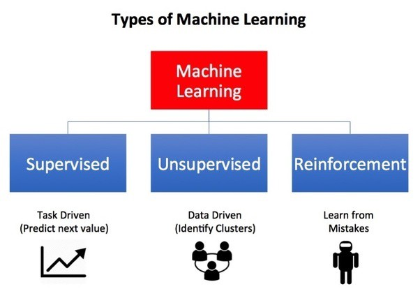

# 强化学习101
## 了解强化学习的要点！

> Photo by Daniel Cheung on Unsplash


强化学习（RL）是现代人工智能领域中最热门的研究主题之一，其普及度还在不断增长。 让我们看一下开始学习RL需要了解的5件事。
# 1.什么是强化学习？ 与其他机器学习技术相比有何不同？

强化学习（RL）是一种机器学习技术，使代理能够使用自身行为和经验的反馈通过反复试验在交互式环境中学习。


尽管监督学习和强化学习都使用输入和输出之间的映射，但不同于监督学习，后者提供给代理的反馈是执行任务的正确动作集，而强化学习则将奖惩作为正面和负面行为的信号。

与无监督学习相比，强化学习在目标方面有所不同。 无监督学习的目标是发现数据点之间的相似点和差异，而在强化学习的情况下，目标是找到合适的行为模型，以最大化代理的总累积奖励。 下图说明了通用RL模型的动作奖励反馈回路。

# 2.如何制定基本的强化学习问题？

描述RL问题基本要素的一些关键术语是：
+ 环境-代理在其中运行的物理世界
+ 州—代理商的现状
+ 奖励-来自环境的反馈
+ 策略-将座席状态映射到操作的方法
+ 价值-代理商在特定状态下采取的行动将获得的未来奖励

RL问题可以通过游戏来最好地解释。 让我们以吃豆人的游戏为例，代理人（PacMan）的目标是在网格中吃食物，同时避免途中出现鬼魂。 在这种情况下，网格世界是代理所作用的交互式环境。 如果特工被幽灵杀死（输掉了游戏），特工会得到食物和惩罚的奖励。 状态是座席在网格世界中的位置，总累积奖励是赢得比赛的座席。


为了建立最佳政策，代理人面临探索新国家的困境，同时又要最大化其整体回报。 这称为“探索与开发”的权衡。 为了平衡两者，最佳的整体策略可能涉及短期牺牲。 因此，代理应收集足够的信息，以便将来做出最佳的总体决策。

马尔可夫决策过程（MDP）是描述RL环境的数学框架，几乎所有RL问题都可以使用MDP来表述。 一个MDP由一组有限的环境状态S，在每个状态下的一组可能的动作A，一个实值奖励函数R和一个过渡模型P（s’，s | a）组成。 但是，现实环境更可能缺少任何有关环境动力学的先验知识。 在这种情况下，无模型RL方法非常方便。

Q学习是一种常用的无模型方法，可用于构建自播放的PacMan代理。 它围绕更新Q值的概念展开，Q值表示在状态s中执行动作a的值。 以下值更新规则是Q学习算法的核心。


这是使用深度强化学习的PacMan代理的视频演示。
# 3.什么是最常用的强化学习算法？

Q学习和SARSA（状态行动-奖励状态行动）是两种常用的无模型RL算法。 它们的勘探策略不同，而开采策略却相似。 Q学习是一种非策略方法，其中代理根据从另一个策略得出的操作a *学习值，而SARSA是一种策略上方法，在其中根据其当前操作a从当前策略得出的值来学习值。 政策。 这两种方法易于实现，但缺乏通用性，因为它们无法估计未见状态的值。

可以通过更高级的算法（例如使用神经网络来估计Q值的深度Q网络（DQN））来克服这一问题。 但是DQN只能处理离散的低维动作空间。

深度确定性策略梯度（DDPG）是一种无模型，脱离策略，执行者批评的算法，它通过在高维连续动作空间中学习策略来解决此问题。 下图是演员评论体系结构的表示。

# 4.强化学习的实际应用是什么？

由于RL需要大量数据，因此最适用于容易获得模拟数据（例如游戏性，机器人技术）的领域。
+ RL被广泛用于构建用于玩计算机游戏的AI。 AlphaGo Zero是第一个在古代中国的Go游戏中击败世界冠军的计算机程序。 其他包括ATARI游戏，西洋双陆棋等
+ 在机器人技术和工业自动化中，RL用于使机器人能够为其自身创建高效的自适应控制系统，该系统可以从自身的经验和行为中学习。 DeepMind的“通过异步策略更新进行机器人操纵的深度强化学习”就是一个很好的例子。 观看这个有趣的演示视频。

RL的其他应用包括抽象文本摘要引擎，对话代理（文本，语音），这些代理可以从用户的交互中学习并随着时间的流逝而改善，学习医疗保健中的最佳治疗策略以及用于在线股票交易的基于RL的代理。
# 5.我如何开始进行强化学习？

为了理解RL的基本概念，可以参考以下资源。
+ 《强化学习-入门》，是强化学习之父的一本书-理查德·萨顿（Richard Sutton）和他的博士生导师安德鲁·巴托（Andrew Barto）。 这本书的在线草稿可以在这里找到。
+ David Silver的教学材料（包括视频讲座）是有关RL的入门课程。
+ 这是Pieter Abbeel和John Schulman（开放式AI /伯克利AI研究实验室）的另一本有关RL的技术教程。

对于开始构建和测试RL代理，以下资源可能会有所帮助。
+ 此博客介绍了如何使用来自原始像素的Policy Gradients训练神经网络ATARI Pong代理，Andrej Karpathy将帮助您在130行Python代码中启动并运行您的第一个Deep Reinforcement Learning代理。
+ DeepMind Lab是一个类似于开放源代码的3D游戏平台，用于具有丰富模拟环境的基于代理的AI研究。
+ 马尔默项目是另一个支持AI基础研究的AI实验平台。
+ OpenAI Gym是用于构建和比较强化学习算法的工具包。
```
(本文翻译自Shweta Bhatt的文章《Reinforcement Learning 101》，参考：https://towardsdatascience.com/reinforcement-learning-101-e24b50e1d292)
```
