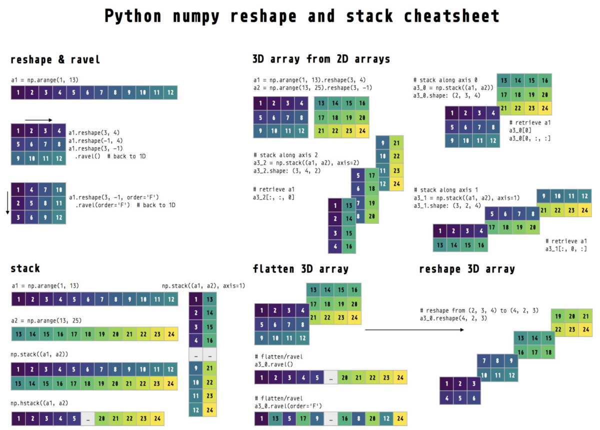
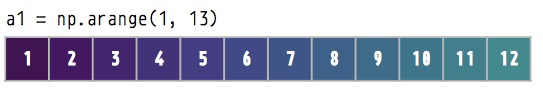
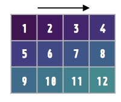
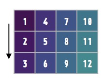
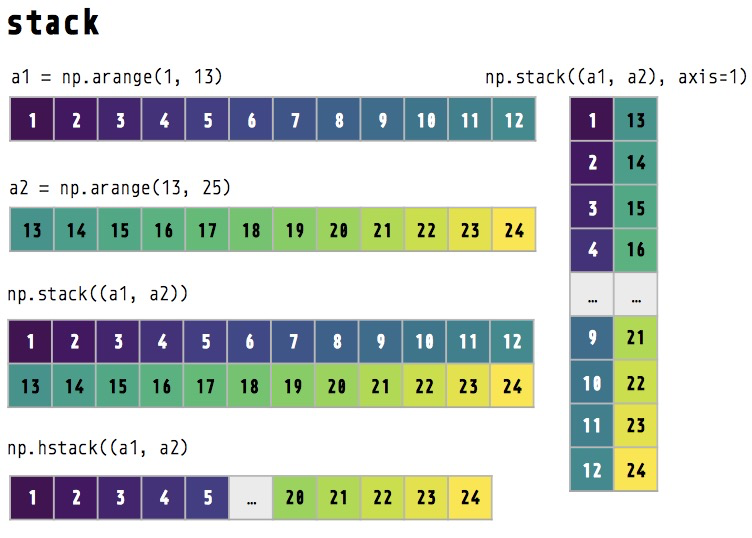
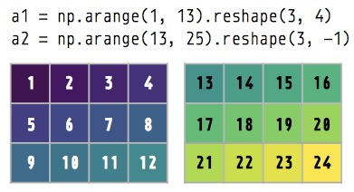
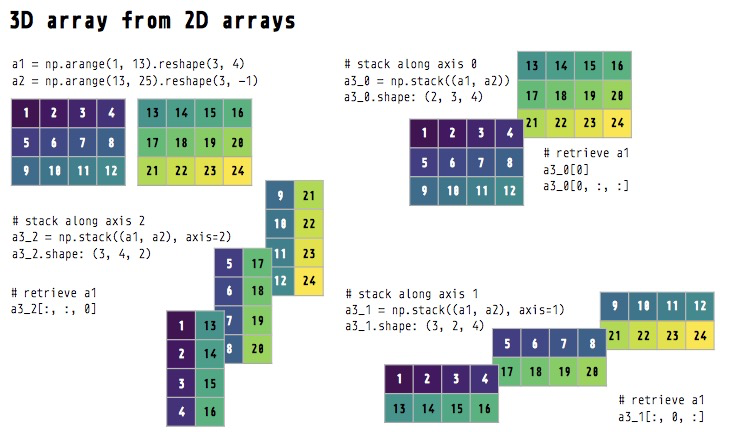
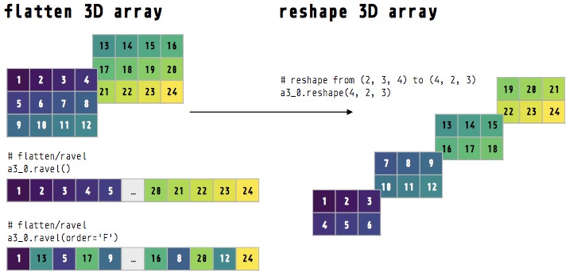

## numpy重塑和堆栈的备忘单和教程
# 在Python中重塑numpy数组—分步教程
## 本教程和备忘单提供可视化帮助您了解numpy如何重塑多维数组。

> Cheatsheet for Python numpy reshape, stack, and flatten (created by Hause Lin and available here)


numpy reshape（）方法如何重整数组？ 您是否感到困惑或难以理解其工作原理？ 本教程将引导您逐步重塑numpy。 如果您需要上述备忘单的pdf副本，则可以在此处下载。
# 创建一个Python numpy数组

使用np.arange（）生成一个numpy数组，其中包含从1到12的数字序列。请参见此处的文档。
```
import numpy as npa1 = np.arange(1, 13)  # numbers 1 to 12print(a1.shape)> (12,)print(a1)> [ 1  2  3  4  5  6  7  8  9 10 11 12]
```

# 使用reshape（）方法重塑

使用reshape（）方法将a1数组整形为3 x 4维数组。 让我们使用3_4来表示它的尺寸：3是第0个尺寸（轴），4是第1个尺寸（轴）（请注意，Python索引从0开始）。 请参阅此处的文档。
```
a1_2d = a1.reshape(3, 4)  # 3_4print(a1_2d.shape)> (3, 4)print(a1_2d)> [[ 1  2  3  4]   [ 5  6  7  8]   [ 9 10 11 12]]
```


如果希望numpy自动确定特定尺寸应为多少尺寸/长度，请将该尺寸指定为-1。
```
a1.reshape(3, 4)a1.reshape(-1, 4)  # same as above: a1.reshape(3, 4)a1.reshape(3, 4)a1.reshape(3, -1)  # same as above: a1.reshape(3, 4)a1.reshape(2, 6)a1.reshape(2, -1)  # same as above: a1.reshape(2, 6)
```
# 沿不同尺寸重塑

默认情况下，reshape（）沿第0维（行）对数组进行整形。 可以通过命令参数更改此行为（默认值为“ C”）。 请参阅文档以获取更多信息。
```
a1.reshape(3, 4) # reshapes or ‘fills in’ row by rowa1.reshape(3, 4, order='C') # same results as above
```

通过将顺序更改为“ F”，我们可以沿第一维（列）重塑形状。 对于熟悉MATLAB的人，MATLAB使用此顺序。
```
a1.reshape(3, 4, order='F')  # reshapes column by column> [[ 1  4  7 10]   [ 2  5  8 11]   [ 3  6  9 12]]
```


测试：阵列a1的尺寸/形状是什么？

a1是一维数组-仅具有1个维度，即使您可能认为其维度应为1_12（1行12列）。 要转换为1_12数组，请使用reshape（）。
```
print(a1)  # what's the shape?> [ 1  2  3  4  5  6  7  8  9 10 11 12]print(a1.shape)> (12,)a1_1_by_12 = a1.reshape(1, -1)  # reshape to 1_12print(a1_1_by_12)  # note the double square brackets!> [[ 1  2  3  4  5  6  7  8  9 10 11 12]]print(a1_1_by_12.shape)  # 1_12 array> (1, 12)
```
# 使用ravel（）展平/拖曳到一维数组

使用ravel（）方法可以将多维数组转换为一维数组（请参见此处的文档）。 我们的2D数组（3_4）将被展平或拉平，使其成为具有12个元素的1D数组。

如果您未指定任何参数，则ravel（）将沿行（第0维/轴）展平/散列我们的2D数组。 即，第0行[1、2、3、4] +第1行[5、6、7、8] +第2行[9、10、11、12]。

如果要沿列（第1维）展平/滚动，请使用order参数。
```
print(a1_2d)  # 3_4> [[ 1  2  3  4]   [ 5  6  7  8]   [ 9 10 11 12]]print(a1_2d.ravel())  # ravel by row (default order='C')> [ 1  2  3  4  5  6  7  8  9 10 11 12]print(a1_2d.ravel(order='F'))  # ravel by column> [ 1  5  9  2  6 10  3  7 11  4  8 12]
```
# 使用np.stack（）和np.hstack（）连接/堆栈数组


创建两个一维数组
```
a1 = np.arange(1, 13)print(a1)> [ 1  2  3  4  5  6  7  8  9 10 11 12]a2 = np.arange(13, 25)print(a2)> [13 14 15 16 17 18 19 20 21 22 23 24]
```

使用np.stack（）连接/堆栈数组。 默认情况下，np.stack（）沿第0维（行）（参数轴= 0）堆叠数组。 有关更多信息，请参阅文档。
```
stack0 = np.stack((a1, a1, a2, a2))  # default stack along 0th axisprint(stack0.shape)> (4, 12)print(stack0)> [[ 1  2  3  4  5  6  7  8  9 10 11 12]   [ 1  2  3  4  5  6  7  8  9 10 11 12]   [13 14 15 16 17 18 19 20 21 22 23 24]   [13 14 15 16 17 18 19 20 21 22 23 24]]
```

沿第一维堆叠（轴= 1）
```
stack1 = np.stack((a1, a1, a2, a2), axis=1)print(stack1.shape)> (12, 4)print(stack1)> [[ 1  1 13 13]   [ 2  2 14 14]   [ 3  3 15 15]   [ 4  4 16 16]   [ 5  5 17 17]   [ 6  6 18 18]   [ 7  7 19 19]   [ 8  8 20 20]   [ 9  9 21 21]   [10 10 22 22]   [11 11 23 23]   [12 12 24 24]]
```

用np.hstack（）连接为长的一维数组（水平堆栈）
```
stack_long = np.hstack((a1, a2))print(stack_long.shape)> (24,)print(stack_long)> [ 1  2  3  4  5  6  7  8  9 10 11 12 13 14 15 16 17 18 19 20 21 22 23 24]
```
# 创建多维数组（3D）

多维数组非常常见，称为张量。 它们在深度学习和神经网络中使用很多。 如果您要进行深度学习，则将定期重整张量或多维数组。

首先，我们创建两个不同的3 x 4数组。 稍后，我们将它们组合成一个3D阵列。
```
a1 = np.arange(1, 13).reshape(3, -1)  # 3_4a2 = np.arange(13, 25).reshape(3, -1)  # 3_4print(a1)> [[ 1  2  3  4]   [ 5  6  7  8]   [ 9 10 11 12]]print(a2)> [[13 14 15 16]   [17 18 19 20]   [21 22 23 24]]
```

# 通过沿不同的轴/维度堆叠数组来创建3D数组
```
a3_0 = np.stack((a1, a2))  # default axis=0 (dimension 0)a3_1 = np.stack((a1, a2), axis=1)  # along dimension 1a3_2 = np.stack((a1, a2), axis=2)  # along dimension 2print(a3_0.shape)> (2, 3, 4)print(a3_1.shape)> (3, 2, 4)print(a3_2.shape)> (3, 4, 2)
```


让我们打印数组以查看它们的外观。 有关可视化的信息，请参见上图。
```
print(a3_0)> [[[ 1  2  3  4]    [ 5  6  7  8]    [ 9 10 11 12]]   [[13 14 15 16]    [17 18 19 20]    [21 22 23 24]]]print(a3_1)> [[[ 1  2  3  4]    [13 14 15 16]]   [[ 5  6  7  8]    [17 18 19 20]]   [[ 9 10 11 12]    [21 22 23 24]]]print(a3_2)> [[[ 1 13]    [ 2 14]    [ 3 15]    [ 4 16]]   [[ 5 17]    [ 6 18]    [ 7 19]    [ 8 20]]   [[ 9 21]    [10 22]    [11 23]    [12 24]]]
```

由于这三个3D数组是通过沿不同维度堆叠两个数组而创建的，因此，如果我们要从这些3D数组中检索原始的两个数组，则必须沿正确的维度/轴进行子集化。

测试：我们如何从这些3D数组中检索a1数组？
```
print(a1)  # check what's a1> [[ 1  2  3  4]   [ 5  6  7  8]   [ 9 10 11 12]]# solutionsa3_0[0, :, :]a3_0[0]  # same as abovea3_1[:, 0, :]a3_2[:, :, 0]
```
# 展平多维数组

我们还可以使用ravel（）展平多维数组。 下面，我们逐行浏览（默认顺序为“ C”）到一维数组。

```
print(a3_0)> [[[ 1  2  3  4]    [ 5  6  7  8]    [ 9 10 11 12]]   [[13 14 15 16]    [17 18 19 20]    [21 22 23 24]]]print(a3_0.ravel())> [ 1  2  3  4  5  6  7  8  9 10 11 12 13 14 15 16 17 18 19 20 21 22 23 24]
```

逐列划定（order ='F'）到一维数组
```
print(a3_0.ravel(order='F'))> [ 1 13  5 17  9 21  2 14  6 18 10 22  3 15  7 19 11 23  4 16  8 20 12 24]
```
# 重塑多维数组

我们还可以使用reshape（）重塑多维数组。
```
# reshape row by row (default order=C) to 2D arrayprint(a3_0)  # 2_3_4> [[[ 1  2  3  4]    [ 5  6  7  8]    [ 9 10 11 12]]   [[13 14 15 16]    [17 18 19 20]    [21 22 23 24]]]print(a3_0.reshape(4, -1))  # reshape to 4_6 (row by row)> [[ 1  2  3  4  5  6]   [ 7  8  9 10 11 12]   [13 14 15 16 17 18]   [19 20 21 22 23 24]]print(a3_0.reshape(4, -1, order='F'))  # reshape (column by column)> [[ 1  9  6  3 11  8]   [13 21 18 15 23 20]   [ 5  2 10  7  4 12]   [17 14 22 19 16 24]]print(a3_0.reshape(4, 2, 3))  # reshape to 4_2_3 (row by row)> [[[ 1  2  3]    [ 4  5  6]]   [[ 7  8  9]    [10 11 12]]   [[13 14 15]    [16 17 18]]   [[19 20 21]    [22 23 24]]]
```
# 结束语

我希望您现在对numpy如何重塑多维数组有了更好的了解。 我期待您的想法和评论。 另外，请查看有关numpy和数据表示的直观介绍。

如果您需要上述备忘单的pdf副本，则可以在此处下载。 如果您觉得这篇文章有用，请关注我并访问我的网站以获取更多数据科学教程。
```
(本文翻译自Hause的文章《Reshaping numpy arrays in Python — a step-by-step pictorial tutorial》，参考：https://towardsdatascience.com/reshaping-numpy-arrays-in-python-a-step-by-step-pictorial-tutorial-aed5f471cf0b)
```
