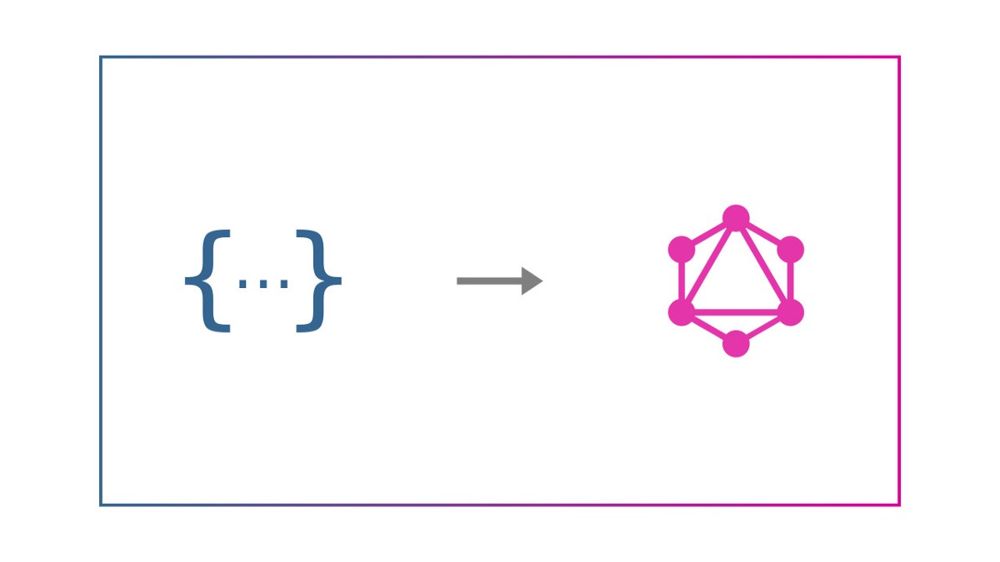
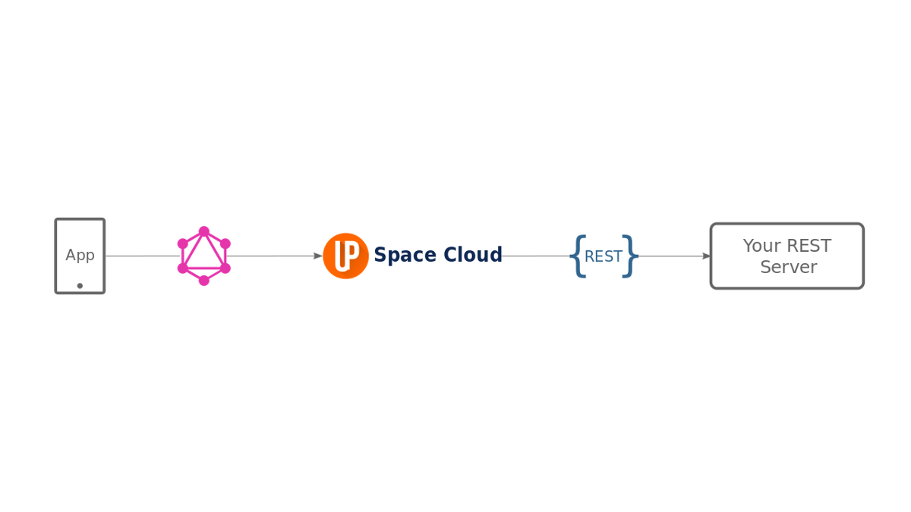
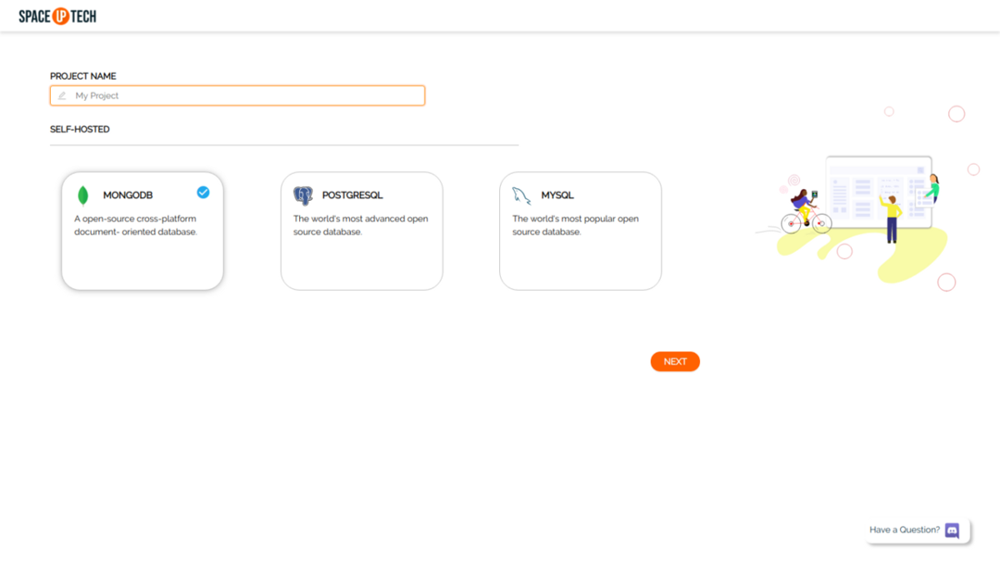
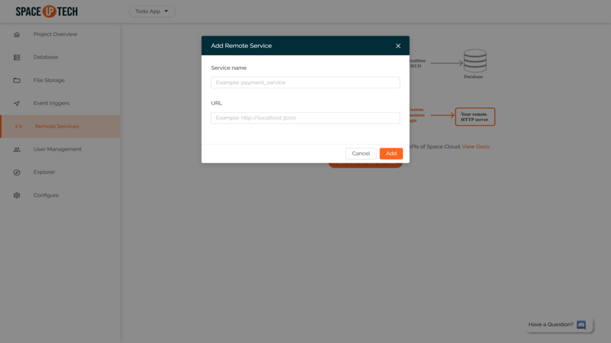
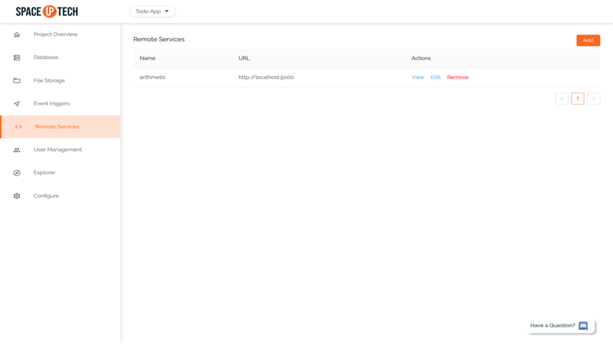
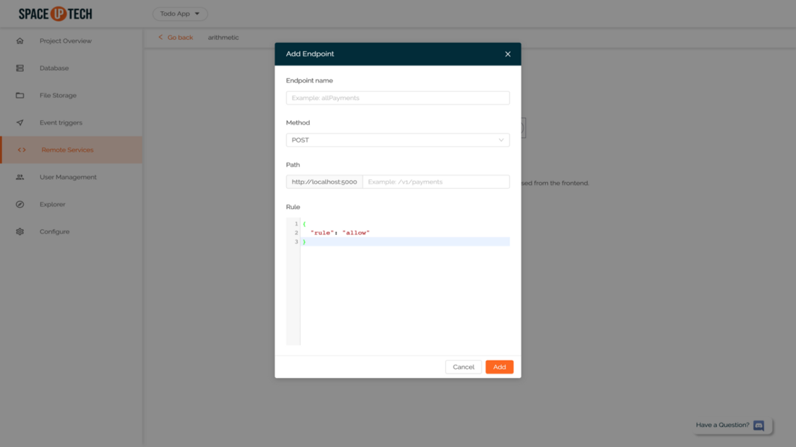
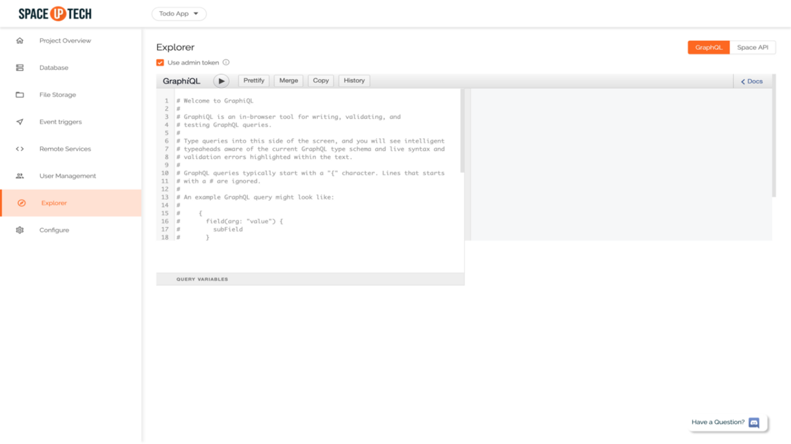
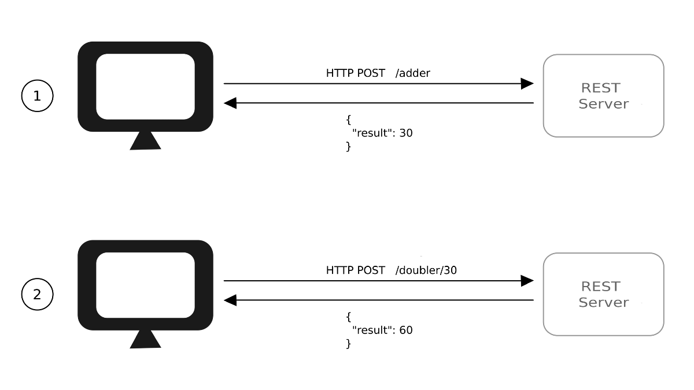
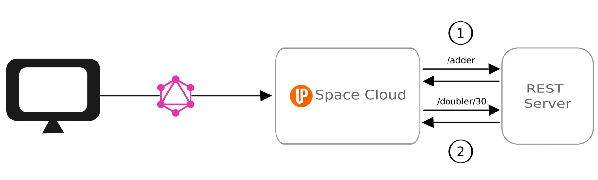

# 数分钟内即可将REST转换为GraphQL


由于GraphQL目前在API世界中引起了极大的疯狂，您可能想知道如何在不破坏任何内容的情况下将现有的REST API迁移到GraphQL。 本指南将帮助您完成REST to GraphQL的任务，而无需更改代码库，以便可以使用GraphQL进行REST！ （双关语意🤭）
# REST到GraphQL

好吧，GraphQL的倡导者已经在营销GraphQL方面做得很好。 尊重他们的努力，我将不做详细介绍，而是提供一个摘要：
+ GraphQL允许您在单个请求中获取多个资源。
+ GraphQL通过让您描述您的确切数据需求来解决REST的获取问题。
+ GraphQL通过在单个查询中获取相关数据来帮助您解决前端的N + 1查询问题。

我将在本指南中涉及的是大多数人在提倡GraphQL时会错过的方面，即“我们已经在REST上投入了大量资金”。 这表示：
+ 我们大多数现有的服务都在REST中。
+ 我们更愿意编写REST服务。
+ 我们希望使用REST API支持现有的客户端。

尽管许多文章可帮助您从REST迁移到GraphQL，但它们都迫使您更改现有代码库或在REST服务之前编写新代码库。
# 可是等等…

如果可以，请不要触摸它。

这不是编程的第一条规则吗？

迁移可能会很痛苦，尤其是庞大的代码库的规模可能令人生畏。 总是有可能破坏某些东西。
# 我们为什么不能只休息？


面对现实-我们所有人天生都是懒惰的。 我们喜欢简单的技巧和简单的解决方案。

如果有一种方法可以使您的REST服务保持原样，并且仍然在其上面获得GraphQL层而无需编写任何代码，该怎么办？ 听起来像魔术吗？ 好吧，太空云有助于实现这一目标。
# 什么是空间云？

为了简单起见，

Space Cloud是一个开源Web服务器，可在您的数据库和微服务上提供即时的GraphQL和REST API。

关于Space Cloud的最酷的部分是所有API都是实时的。 您可以选择订阅数据库中的更改。 在制作实时应用程序时，此功能非常方便。

但是，在本指南中，我们将坚持使用Space Cloud的远程服务模块将REST服务迁移到GraphQL。

已经喜欢了吗？ 通过在Github上给我们一颗星来表示支持❤️。
# 架构

这是基于REST的GraphQL的最终体系结构：


您的应用程序向Space Cloud进行GraphQL查询，这反过来又命中了服务器上的REST端点。 在这种情况下，Space Cloud充当GraphQL代理或API网关。

如您所知，Space Cloud是位于REST服务之上的单独的GraphQL层。 这个事实的好处在于您的REST服务仍然完整无缺，您可以直接在现有客户端中使用它们。 这一事实使您可以将REST服务发送到GraphQL，而不会破坏较旧的客户端。

大！ 我们已经了解了什么是空间云以及它在应用程序中的位置。 让我们直接采取行动！
# 我们将要建设的

在本指南中，我们将构建一个简单的算术服务，该服务具有以下端点：
+ 加法器端点：POST / adder
+ 倍增端点：GET / doubler /：number

加法器端点将返回从请求正文获得的两个数字的和。 另一方面，doubler端点将返回其接收的数字的两倍，作为URL路径参数。

大！ 现在开始构建东西！

注意：如果卡在某个地方，请不要担心。 您可以随时在此Discord服务器上ping我，我将亲自为您提供帮助。
# 步骤1：编写服务

注意：即使您现在正在从手机中阅读此内容，仍然可以仅通过阅读来遵循本指南。

让我们从编写REST服务开始。 我们将使用Express在NodeJS中编写REST服务。

注意：您可以使用任何语言或框架编写服务，只要它能说HTTP，因为Space Cloud将使用该协议与REST服务进行通信。

首先，创建一个文件夹作为我们的工作目录。

创建NPM项目：
```
npm init -y
```

安装Express：
```
npm install - save express
```

写快递服务器

创建一个文件index.js并复制粘贴以下代码：
```
var express = require("express");var app = express();app.use(express.json());app.post("/adder", function(req, res) {  const num1 = req.body.num1;  const num2 = req.body.num2;  const response = { result: num1 + num2 };  res.status(200).send(JSON.stringify(response));});app.get("/doubler/:num", function(req, res) {  const num = req.params.num;  const response = { result: num * 2 };  res.status(200).send(JSON.stringify(response));});var server = app.listen(5000, function () {    console.log("app running on port:", server.address().port);});
```

如您所见，该代码非常简单。 我们刚刚使用ExpressJS创建了一个HTTP服务器，该服务器正在侦听端口5000。

如前所述，服务器具有两个端点：
+ 加法器端点：我们期望从POST正文收到两个数字num1和num2。 我们要做的就是返回这两个数字的和。
+ Doubler端点：我们只是返回从URL路径参数获得的数字。

这就是我们需要为该服务编写的所有内容。

注意：要迁移现有的REST服务，您无需编写/修改任何代码。 如果您的服务已经在运行，则可以跳过下一步。
# 步骤2：启动服务

只需运行以下命令即可运行该服务：
```
node index.js
```

大！ 我们已启动并运行REST服务。 让我们启动Space Cloud并通过GraphQL使用此REST服务。
# 步骤3：下载太空云

您需要为您的操作系统下载Space Cloud二进制文件，也可以直接从其源代码构建它。 您需要安装1.13.0或更高版本才能从源代码构建它。

从此处下载适用于您的操作系统的二进制文件：
+ 苹果电脑
+ 的Linux
+ 视窗

您可以解压缩压缩的存档。

对于Linux / Mac：解压缩space-cloud.zip && chmod + x space-cloud

对于Windows：右键单击存档，然后在此处选择解压缩。

要确定二进制文件是否正确，请从下载二进制文件的目录中键入以下命令：

对于Linux / Mac：./space-cloud -v

对于Windows：space-cloud.exe -v

它应该显示如下内容：
```
space-cloud-ee version 0.13.0
```
# 步骤4：启动太空云

要以开发人员模式启动Space Cloud，请复制粘贴以下命令，然后按Enter键：

对于Linux / Mac：./space-cloud运行-开发

对于Windows：运行space-cloud.exe-开发

太空云启动时，您应该会看到类似以下内容：
```
Creating a new server with id auto-1T5fA9E1B2jeNUbV8R0fOPubRngStarting http server on port: 4122Hosting mission control on http://localhost:4122/mission-control/Space cloud is running on the specified ports :D
```

注意：-dev标志告诉Space Cloud在dev模式下运行（以便管理UI不需要输入用户名和密码）
# 步骤5：配置空间云

您会注意到，Space Cloud在工作目录中生成一个config.yaml文件。

Space Cloud需要此配置文件才能起作用。 配置文件用于加载信息，例如要连接的REST服务器及其端点。

Space Cloud具有自己的任务控制（admin UI），可以快速配置所有这些功能。
## 开放式任务控制

转到http：// localhost：4122 / mission-control打开任务控制。

注意：如果您不在本地运行本地主机，请用您的空间云的地址替换本地主机。
## 建立专案

单击创建项目按钮以打开以下屏幕：


为您的项目命名。

您在这里选择哪个数据库都没有关系，因为我们还是不会使用它。

单击下一步创建项目。
# 步骤6：将远程服务添加到Space Cloud

转到任务控制中的“远程服务”部分。

单击“添加第一个远程服务”按钮以打开以下表单：


将服务名称输入为算术，将服务URL输入为：
```
http://localhost:5000
```

添加远程服务后，您应该能够在远程服务表中看到它：


单击“操作”列中的“查看”按钮以打开服务页面。

单击“添加第一个远程端点”按钮以打开以下表单：


放入以下加法器端点：
+ 名称：加法器
+ 方法：开机自检
+ 路径：/ adder

再次单击“添加”按钮以添加倍增器端点：
+ 名称：倍增器
+ 方法：GET
+ 路径：/ doubler / {args.num}

注意：现在不必担心{args.num}部分。 只要确保已将“方法”作为GET即可。
# 步骤7：通过GraphQL查询您的REST服务

我们已经将REST服务和两个端点也添加到了Space Cloud。 是时候使用我们统一的GraphQL API对其进行查询了。

转到“资源管理器”部分：


尝试在GraphiQL资源管理器中运行以下GraphQL查询：
```
{  adder(num1: 10, num2: 20) @arithmetic {    result  }}
```

您应该能够看到如下响应：
```
{  "adder": {    "result": 30  }}
```

在获得上述GraphQL查询后，Space Cloud向您的REST服务发出了以下请求：
+ 方法：开机自检
+ 路径：/ adder
+ 请求正文：
```
{  "num1": 10,  "num2": 20}
```

这意味着您在GraphQL查询中传递的参数将作为请求正文发送到REST服务。

让我们尝试使用以下GraphQL查询来查询doubler端点：
```
{  doubler(num: 50) @arithmetic {    result  }}
```

SC将此GraphQL查询转换为REST调用，如下所示：
```
GET /doubler/50
```

如果您还记得我们添加到Space Cloud的倍增器的端点是：
```
/doubler/{args.num}
```

基于此端点，Space Cloud理解它必须从GraphQL查询中选择参数num并将其用作变量以形成路径/ doubler / 50。

成功调用后，您应该能够看到如下响应：
```
{  "doubler": {    "result": 100  }}
```
# 奖励—服务链接

成功地遵循了本指南，到这里为止，我们都应获得丰厚的奖金！ 让我们看看从REST到GraphQL的过渡如何为我们释放超强大的功能Service Chaining。

让我们假设一个场景：
+ 我们想使用加法器服务对两个数字求和。
+ 将我们从加法器服务获得的结果加倍。
## REST方式

如果我们在客户端代码中使用REST，则上述任务将看起来像这样：


注意，我们如何从前端发出两个请求，这意味着往返时间是两倍。 这会导致响应时间慢和用户体验差。
## GraphQL方式

现在，如果使用太空云将客户端从REST切换到GraphQL，我们的请求将如下所示：


注意，这里我们只进行从前端到后端（太空云）的一个GraphQL查询。 反过来，Space Cloud正在向您的REST服务器发出两个请求以实现此请求。 但是，这些请求（从Space Cloud到服务器）的往返行程可以忽略不计，因为它们在同一网络中。

向Space Cloud查询以完成上述任务的GraphQL将是：
```
{  adder(num1: 10, num2: 20) @arithmetic {    doubler(num: "adder.result") @arithmetic {      result    }  }}
```

注意，我们如何在加法器服务响应后调用doubler服务，并将加法器服务的结果作为参数传递给doubler。

该查询的响应如下所示：
```
{  "adder": {    "doubler": {      "result": 60    }  }}
```

如您所料，结果是60（（10 + 20）* 2）。

附加提示：如果要并行查询两个不相关的REST服务，则也可以在单个请求中完成此操作，如下所示：
```
{  adder(num1: 10, num2: 20) @arithmetic {    result  }  doubler(num: 50) @arithmetic {    result  }}
```

我将把该查询的响应部分留给您作为作业😛。
# 结论

首先，请遵循下面的指南，以帮助自己。

我们了解到：
+ 从REST迁移到GraphQL不需要更改代码。
+ 我们不需要在REST和GraphQL之间进行选择。 我们可以在同一应用程序中同时支持REST和GraphQL。
+ 将GraphQL与Space Cloud一起使用可为我们提供一些巧妙的联网好处，并帮助您减少往返行程。

嗯，除了从REST迁移到GraphQL（例如，跨数据库联接）之外，您还可以使用Space Cloud做更多的事情。 如果您喜欢，请在Github上给Space Cloud一颗星星❤️。 如果您想跳出一些想法或有任何疑问，请加入我们的Discord服务器。
```
(本文翻译自Noorain - YourTechBud的文章《REST to GraphQL in minutes》，参考：https://medium.com/spaceuptech/rest-to-graphql-in-minutes-44f3b86cf79f)
```
