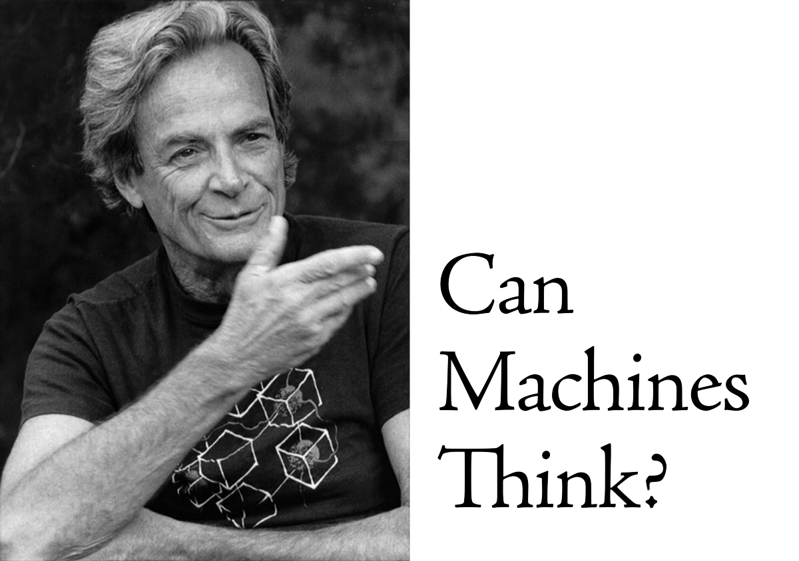

## 理查德·费曼
# 理查德·费曼（Richard Feynman）谈人工智能

在1985年9月26日诺贝尔奖获得者Richard Feynman（1918–1988）举行的一次演讲中，提出了人工智能的问题。
## 听众问题

您是否认为会出现像人类一样思考并且比人类更智能的机器？

以下是费曼逐字记录答复的结构化笔录。 随着通过人工神经网络进行机器学习的兴起，令人耳目一新的是，甚至在35年前，听到费恩曼关于这个问题的想法以及他的距离有多近。

预计阅读时间为8分钟。 祝您阅读愉快！
# 理查德·费曼的答案
```
First of all, do they think like human beings? I would say no and I’ll explain in a minute why I say no.Second, for "whether they be more intelligent than human beings" to be a question, intelligences must first be defined. If you were to ask me are they better chess players than any human being? Possibly can be, yes, "I'll get you, some day".
```

当然，到1985年，人类象棋大师的实力仍比机器强。 直到1996年和1997年，世界象棋冠军GM Garry Kasparov和IBM超级计算机Deep Blue进行了传奇的六场比赛之后，计算机才击败了世界级的国际象棋冠军。 即便如此，比分还是3 1/2到2 1/2，而Kasparov最终还是对损失进行了争论，声称IBM团队在比赛之间代表机器以某种方式进行了干预。
## 人工智能效应

“一旦运作，就没有人称其为AI” –约翰·麦卡锡（John McCarthy）

Feynman接下来解决了所谓的“ AI效应”，即通过指示编程的机器执行任务并实际执行任务时观察到的折扣，旁观者认为AI实现的不是“真正的”智能 ：
```
They're better chess players than most human beings right now! One of the things, by the way we always do is we want the darn machine to be better than ANYBODY, not just better than us. If we find a machine that can play chess better than us it doesn't impress us much. We keep saying "and what happens when it comes up against the masters?". We imagine that we human beings are equivalent to the masters in everything, right? The machine has to be better in everything that the best person does at the best level. Okay, but that's hard on the machine.
```
## 关于构建人造机器

Feynman接下来通过类似于自然演化的运动方式（例如，具有韧带，肌腱，关节和肌肉的哺乳动物的奔跑步态）与机械设计的运动方式（使用轮子，机翼和/或运动方式）之间的差异来解决心理模型问题 或螺旋桨）：
```
With regard to the question of whether we can make it to think like [human beings], my opinion is based on the following idea: That we try to make these things work as efficiently as we can with the materials that we have. Materials are different than nerves, and so on. If we would like to make something that runs rapidly over the ground, then we could watch a cheetah running, and we could try to make a machine that runs like a cheetah. But, it's easier to make a machine with wheels. With fast wheels or something that flies just above the ground in the air. When we make a bird, the airplanes don't fly like a bird, they fly but they don't fly like a bird, okay? They don't flap their wings exactly, they have in front, another gadget that goes around, or the more modern airplane has a tube that you heat the air and squirt it out the back, a jet propulsion, a jet engine, has internal rotating fans and so on, and uses gasoline. It's different, right?So, there's no question that the later machines are not going to think like people think, in that sense.With regard to intelligence, I think it's exactly the same way, for example they're not going to do arithmetic the same way as we do arithmetic, but they'll do it better.
```
## 超人窄带AI

作为设计的机械设备比自然进化的器官在执行智力任务方面优越的一个例子，费曼接下来描述了超人狭窄的AI（例如计算器）和人脑之间的区别：
```
Let's take mathematics, very elementary mathematics. Arithmetic. They do arithmetic better than anybody. Much faster and differently, but it's fundamentally the same because in the end, the numbers are equivalent, right? So that's a good example of.. We're never going to change how they do arithmetic, to make it more like humans. That would be going backwards. Because, the arithmetic done by humans is slow, cumbersome, confused and full of errors. Where, these guys (machines) are fast.If one compares what computers can do, to the human beings, we find the following rather interesting comparisons. First of all, if I give you, a human being, a problem like this: I'm going to ask you for these numbers back, every other one, in reverse order, please. Right? I've got a series of numbers, and I want you to give them to me back, in reverse order, every other one. I'll tell you, I'll make it easy for you. Just give me the numbers back the way I gave them to you. You ready?1, 7, 3, 9, 2, 6, 5, 8, 3, 1, 7, 2, 6, 3Anybody gonna be able to do that? No. And that's not more than twenty or thirty numbers, but you can give a computer 50,000 numbers like that and ask it for any reverse order, the sum of them all, do different things with them, and so on. And it doesn't forget them for a long time.So there are some things a computer does much better than a human, and you'd be better remember that if you're trying to compare a machines to humans.
```
## 模式识别问题

接下来，Feynman越来越接近地描述后来由监督机器学习解决的问题，即从大数据集识别模式：
```
But, what a human has to do for his own.. Always, they always do this. They always try to find one thing, darn-it that they can bdo better than the computer. So, we now know many, many things that humans can do better than a computer.She's walking down the street and she's got a certain kind of a wiggle, and you know that's Jane, right? Or, this guy is going and you see his hair flip just a little bit, it's hard to see, it's at a distance but the particular funny way that the back of his head looks, that's Jack, okay?To recognize things, to recognize patterns, seems to be something we have not been able to put into a definite procedure. You would say, "I have a good procedure for recognizing a jacket. Just take lots of pictures of Jack" --by the way, a picture can be put into the computer by this method here, if this were very much finer I could tell whether it's black and white at different spots. You know, you in fact get pictures in a newspaper by black and white dots and if you do it fine enough you can't see the dots. So, with enough information I can load pictures in so you put all the pictures of Jack under different circumstances, and there is a machine to compare it.
```
## 偏差-方差权衡

Feynman继续从本质上解决数据训练集中的方差问题，因此也隐式地解决了所谓的偏差方差折衷。 在统计和机器学习中，偏差－方差折衷是一组预测模型的属性，因此参数估计中偏差较小的模型在样本之间的参数估计方差较大，反之亦然。 偏差方差困境描述了一种优化问题，即人们试图同时最小化学习算法中来自错误假设的偏差和从敏感性到训练集中小波动的偏差。
```
The trouble is that the actual new circumstance is different. The lighting is different, the distance is different, the tilt of the head is different and you have to figure out how to allow for all that. It's so complicated and elaborate that even with the large machines with the amount of storage that's available and the speed that they go, we can't figure out how to make a definite procedure that works at all, or at least works anywhere within a reasonable speed.So, recognizing things is difficult for the machines at the present time, and some of those things that are done in a snap by a person.. So, there are things that humans can do that we don't know how to do in a filing system. It is recognition, and that brings me back to something I left which is what kind of a file clerk that has some special skill which requires recognition of a complicated kind.For instance a clerk in the fingerprint department which looks at the fingerprints and then makes a careful comparison to see if these finger prints match, has not been.. It's just about ready to be.. It's hard to do, but almost possible to do it by a computer. 
```
## 人工智能的现状（1985）

Feynman在最后的评论中讨论了人类当时为指纹匹配而设计机器所遇到的困难：
```
You'd think there's nothing to it, I look a the two fingerprints and see if all the blood dots are the same, but of course, it's not the case. The finger was dirty, the print was made at a different angle, the pressure was different, the ridges are not exactly in the same place. If you were trying to match exactly the same picture it would be easy, but where the center of the print is, which way the finger is turned, where there's been squashed a little more, a little bit less, where there's some dirt on the finger, whether in the meantime you got a wart on this thumb and so forth are all complications. These little complications make the comparison so much more difficult for the machine, for the "blind filing clerk system", that is too much. Too slow, certainly to be utterly impractical, almost, at the present time.I don't know where they stand but they're going fast trying to do it. Whereas a human can go across all of that somehow, just like they do in the chess game. They seem to be able to catch on to patterns rapidly and we don't know how to do that rapidly and automatically.
```
# 视频

费曼的完整回应视频可通过以下链接获得：

本文是每周发表在Cantor’s Paradise上的一系列与数学相关的故事的一部分。 感谢您的阅读！
```
(本文翻译自Jørgen Veisdal的文章《Richard Feynman on Artificial General Intelligence》，参考：https://medium.com/cantors-paradise/richard-feynman-on-artificial-general-intelligence-2c1b9d8aae31)
```
