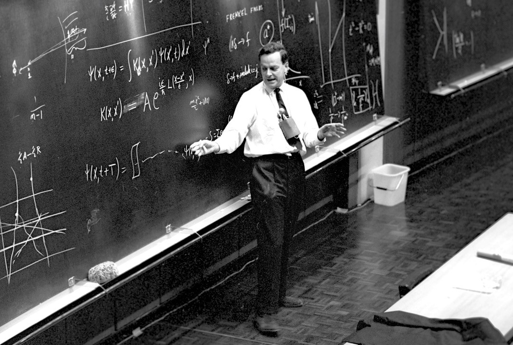

## 理查德·费曼
# 理查德·费曼（Richard Feynman）关于数学与物理的区别

“我想对数学和物理学之间的关系发表一些看法”


1965年，理查德·费曼（Richard Feynman）在康奈尔大学（Cornell University）举行的“数学与物理学的关系”信使系列讲座中，“伟大的解释者”谈到了他发现的数学与物理学之间的主要区别。 他的思想总结如下。
## 认识论的差异

“数学家准备了可以被“使用”的抽象推理，即使他们不知道它被用于什么。”

首先，费曼解决了研究数学的人在认识论分析水平上的差异，特别是选出了数学家：
```
Mathematicians are only dealing with the structure of the reasoning and they do not really care about what they're talking about. They don't even need to know what they're talking about, as they themselves say, or whether what they say is true.
```

接下来，他将描述形式系统的可计算性的性质，以及人造机器推论人类自己无法理解的定理的理论可能性：
```
Now, I explained that if you state the axioms to say "such and such is so" and "such and such is so", what then? Then the logic can be carried out without knowing what the "such and such" words mean.That is, if the statements about the axioms are true, i.e. carefully formulated and complete enough, it is not necessary for the man doing the reasoning to have any knowledge of the meaning of these words. He will be able to deduce, in the same language, new conclusions. If I use the word triangle in one of the axioms there might be some statement about triangles in the conclusion. Whereas, the man who is doing the reasoning, he might not even know what the triangle is! But, then he can read his thing back and say "oh, a triangle, that's just a three sided what-have-you and so and so", and so I know this new fact.In other words, mathematicians prepare abstract reasoning that's ready "to be used".
```

这与物理学分析的认识论水平相反：
```
The physicist has meaning to all the phrases and there's a very important thing that a lot of people who study physics, but don't come from mathematics don't appreciate: That physics is not mathematics and mathematics is not physics. One helps the other.But, you have to have some understanding of the connection of the words with the real world. If necessary, to at the end translate what you figured out into English, into the world of blocks of copper and glass that you're going to do the experiment with, to find out whether the consequences are true. This is a problem which is not a problem of mathematics at all.I've already mentioned the only other relationship that.. of course it obvious how the mathematical reasoning which have been developed are of great power and are in use for physics. On the other hand, sometimes the physicists' reasoning is useful for mathematicians.
```

费曼停在那里没有做进一步的解释，但其中包括的一个相关示例是爱德华·维滕在正能量定理方面的工作，他因此被授予菲尔兹奖。 在关于爱德华·维滕作品的论文中，数学家迈克尔·阿提亚（Michael Atiyah）随后描述了其对数学的重要性：

他以数学形式解释物理思想的能力非常独特。 他一次又一次地通过对物理洞察力的出色应用而产生了新的深刻的数学定理，使数学界感到惊讶。[H] e对当代数学产生了深远的影响。 在他的手中，物理学再次为数学提供了丰富的灵感和见解。” —迈克尔·阿迪耶（Michael Atiyah）
## 适用范围的差异

“数学家喜欢使他们的推理尽可能地笼统”

Feynman继续幽默地讨论数学的适用性，与大多数物理学家的兴趣形成鲜明对比的是：
```
If you say "I have a three-dimensional space" [...] and you ask mathematicians about theorems then they say "now look, if you had a space of n dimensions" then here are the theorems". "Yeah, well I only want the case of three dimensions..." "Well, then substitute n = 3!". It turns out that very many of the complicated theorems they have are much simpler because they happen to be special cases.The physicist is always interested in the special case. He's never interested in the general case. He's talking about SOMETHING. He's  not talking abstractly about anything. He knows what he's talking about, he wants to discuss the new gravity law, he doesn't want the arbitrary force case, he wants the gravity law!And so, there's a certain amount of reducing because the mathematicians have prepared these things for a wide range of problems which is very useful and later on it always turns out that the poor physicists has to come back and say "excuse me, you wanted to tell me about these four dimensions.."
```
## 直觉与严谨

“可怜的数学家没有指导，但论点上精确的数学严谨和谨慎”

Feynman接下来谈到了这两个主题的发现过程，强调物理学家从某种本质上说，应用了他们的主题而不是纯粹抽象的优势：
```
When you know what it is you're talking about, that these things are forces, these are masses, this is inertia and so on, then you can use an awful lot of common-sense, seat-of-the-pants feeling about the world. You've seen various things, you know more or less how the phenomenon is going to behave.Well, the poor mathematician he translates it into equations and the symbols don't mean anything to him and he has no guide but precise mathematical rigor and care in the argument. Whereas, the physicist who knows more or less how the answer can go, is going to come out and sort of guess partway and go right along rather rapidly.The mathematical rigor of great precision is not very useful in physics, nor is the modern attitude in mathematics to look at axioms. Now, mathematicians can do what they want to do, one should not criticize them because they are not slaves to physics. It is not necessary that just because this would be useful to you, they have to do it that way. They can do what they will, it's their own job and if you want something else then you work it out yourself.
```

费曼在这里认为，由于物理学关注自然现象，因此人类在这一领域具有更好的直觉倾向。 这与描述某些数学定理的过程有些相反，包括John Forbes Nash Jr.关于非线性偏微分方程的发现：

1950年代的数学家们知道使用计算机来求解常微分方程（ODE）的相对琐碎的例程。 然而，还没有建立解决非线性偏微分方程的方法，例如在喷气发动机的湍流运动中出现的方法。

[…]

然而，到1958年春季，纳什能够使用自己的发明方法获得基本的存在性，唯一性和连续性定理。 令人惊讶的是，这些方法涉及“将非线性方程式转化为线性方程式，然后通过非线性手段进行攻击” –彼得·拉克斯（Peter Lax）密切关注他的进步，这是以前从未有人想到的“天才之笔”。 关于这项技术，隆德大学数学教授，偏微分方程专家拉尔斯·高丁（LarsGårding）随后类似地宣布：“要做这一点，你必须是个天才”。
## 论模型的实用性

Feynman接下来讨论了物理中模型的有用性，以及它们在进行新发现的过程中似乎缺乏有用性：
```
The next point is the question of, whether we should guess when we try to get a new law, whether we should use the seat-of-the-pants feeling and philosophical principles, i.e. "I don't like minimum principle, I do like minimum control" or "I don't like action at a distance or I do like action at a distance". The question is to what extent models help. It is very a interesting thing. Very often models help, and very often physics teachers try to teach how to use these models and get a good physical feel for how things are going to work out. But, the greatest discoveries, it always turns out, abstract away from the model. It never did any good. Maxwell's discovery of electrodynamics was first made with a lot of imaginary wheels on idlers and everything else in space. If you got rid of all the idlers and everything else in space, the thing was okay. Dirac discovered the correct laws of quantum mechanics for relativity simply by guessing the equations. The method of guessing the equations seems to be a pretty effective way of guessing new laws. This shows again that mathematics is a deep way of expressing nature, and attempts to express nature in philosophical principles or in seat-of-the-pants mechanical feelings is not an efficient way. 
```
## 论数学物理的适用性

奇怪的是，费曼继续预测，在将来的某个时候，世界的本质将不会以数学语言表达。 相反，将有其他表达自然如何运作的方法，这需要较少的计算：
```
I must say, I've often made a hypothesis that physics ultimately will not require a mathematical statement. That the machinery will ultimately will be revealed. It always bothers me that in spite of all this local business, what goes on in, no matter how tiny a region of space and no matter how tiny a region of time, according to the laws and how we understand them today, takes a computing machine an infinite number of logical operations to figure out.Now how can all that be going on in that tiny space? Why should it take an infinite amount of logic to figure out what one stinky tiny bit of space-time is going to do? And so, I made a hypothesis often that the laws are going to turn out to be, in the end, simple like the checkerboard and that all the complexity is from sizeBut, that is of the same nature as the other speculations that other people make. It says "I like it", "you don''t like it". It's not good to be too prejudiced about these things.
```
## 关于数学的需要

接下来，Feynman引用了James Jean爵士的话，并提到了小说家和物理化学家C. P. Show在讨论物理数学时的著名著作“两种文化”：
```
To summarize, I would like to use the words of Sir James Jeans which says that said that "The great architect seems to be a mathematician and for you who don't know mathematics, it's really quite difficult to get a real feeling across and up to the deepest beauty of nature."C. P. Snow talked about two cultures. I really think that those two cultures are people who have had and who have not had this experience of understanding mathematics well enough to appreciate nature once.It's too bad that it has to be mathematics and that mathematics for some people is hard. When one of the kings were trying to learn geometry from Euclid he complained that it was difficult and Euclid said that "There's no royal road to geometry". 
```
## 传播论

“也许视域有限，使这些人可以想象感兴趣的宇宙的中心是人。”

最后，费曼谈到了物理学家掌握数学的需求，以便能够发现有关自然的新发现，并指出数学对于我们当前对世界运转方式的理解至关重要：
```
We cannot, as people who have looked at these things, a physicist cannot convert this thing to any other language we have. If you want to discuss nature, to learn about nature, to appreciate nature, it's necessary to find out the language that she speaks in. She offers her information only in one form.We are not so un-humble as to "demand that she change" before we pay any attention. It seems to me that all the intellectual arguments that you can make would communicate very little to deaf ears. All the intellectual arguments of the world will not convince those of the "other culture".The philosophers who tried to teach you by telling you qualitatively about this thing. Me, who is trying to describe it but who is not getting it across because it's impossible. We're talking to deaf ears.It's perhaps that the horizons are limited that permits such people to imagine that the center of the universe of interest is man.
```
# 视频

费曼演讲的视频可通过以下链接获得：

本文是每周在中等刊物Cantor’s Paradise上发表的一系列与数学相关的故事的一部分。 感谢您的阅读！
```
(本文翻译自Jørgen Veisdal的文章《Richard Feynman on the Differences between Mathematics and Physics》，参考：https://medium.com/cantors-paradise/richard-feynman-on-the-differences-between-mathematics-and-physics-c0847e8a3d75)
```
