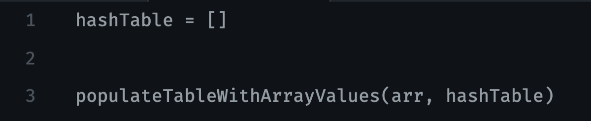
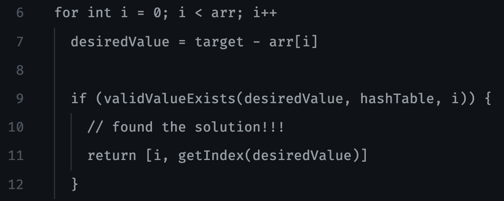
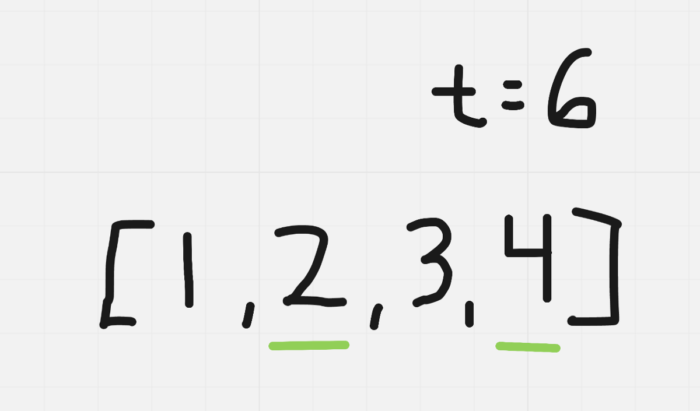
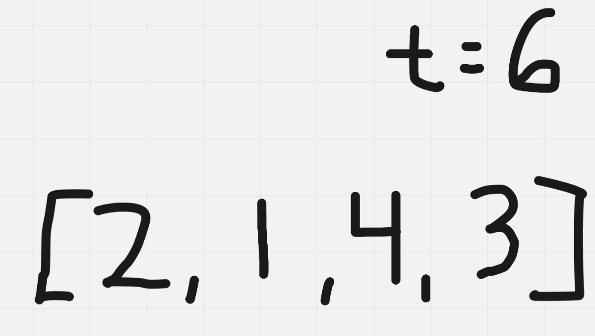
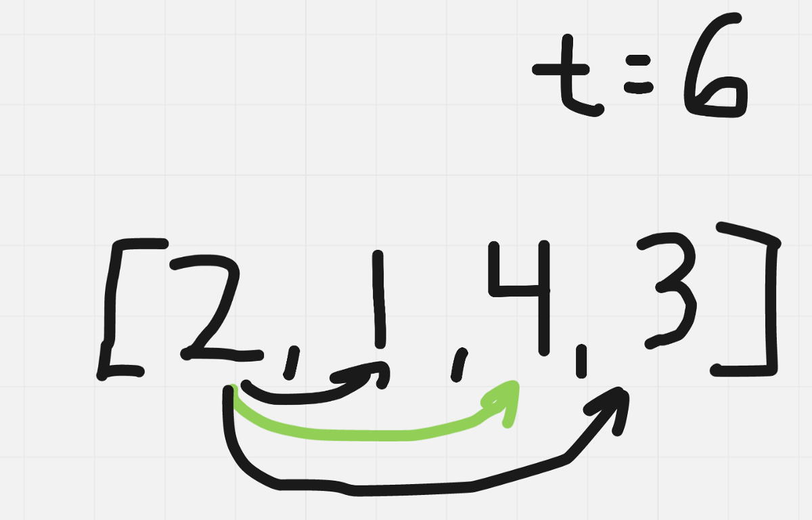

# 外卖

解决问题的方式非常重要。 永远，永远，永远，通过立即编码您认为的解决方案来解决问题。

面试问题看起来很容易。 还应注意，我们需要知道我们可以访问哪些数据结构，以及如何利用它们来解决当前的问题。 例如，如果我们不知道哈希表是什么，那么与天真的O（n²）方法相比，我们将很难找到最佳解决方案。
# 评估您的解决方案

尽管我们已经评估了初始解决方案的复杂性以认识到效率低下，但是在实施最佳解决方案后重申解决方案的空间和运行时复杂性并没有什么坏处。 让我们定义N为输入数组的长度。 由于我们在所有情况下都用N个元素填充哈希表，因此可以说我们的空间复杂度为O（N）。 我们还至少要遍历数组一次，因此对于运行时，平均情况下，我们可以表示它是O（N）。 平均而言，检查哈希表中是否存在元素为O（1）。 实际上，我们的运行时类似于O（N +（N * 1）），但这减少为O（N）。
# 查看您的解决方案

在访谈的这一点上，您想使用在上一步中创建的示例，并逐行跟踪代码。 这将向您的面试官表明您拥有强大的追踪和逻辑技能。 作为练习，我建议您在自己的计算机上运行它之前，先找到自己的解决方案来解决此问题。 有些公司（例如Google和Facebook）不会在计算机上运行您的代码，因此此技能对于100％的开发至关重要，而其他公司（例如Uber和Airbnb）也希望您的代码能够在测试用例中正确编译并运行 。
# 实施您的解决方案

鉴于前面的步骤，这应该是最简单的步骤，因为我们已经有了我们想要的东西的蓝图。
```javascript
const twoSum = (arr, target) => {
  const hashTable = {};
  populateTable(hashTable, arr);

  for (let i = 0; i < arr.length; i++) {
    const desiredValue = target - arr[i];
    if (validValueExists(desiredValue, hashTable, i)) {
      return [i, hashTable[desiredValue]];
    }
  }

  return [-1, -1];
};

const validValueExists = (desiredValue, hashTable, currentIndex) => {
  return (
    // Make sure there exists a key with `desiredValue`.
    hashTable.hasOwnProperty(desiredValue)
    // Make sure we aren't re-using the same index.
    && hashTable[desiredValue] !== currentIndex
  );
}

const populateTable = (hashTable, arr) => {
  for (let i = 0; i < arr.length; i++) {
    hashTable[arr[i]] = i;
  }
}


console.log(twoSum([2, 1, 4, 3], 6)); // [0, 2]
console.log(twoSum([2, 7, 11, 15], 9)); // [0, 1]
```
# 规划解决方案

这是我们想要用简单的英文写出我们希望算法执行的操作的时间。 这将包括我们想利用的必要辅助功能-确保您使用这种模块化的编码方法来节省您在实际任务上的时间。

我们要做的第一件事是用数组中的键（即它们各自的值作为我们在其中看到它们的索引）填充哈希表。


因此，在上面创建的示例中，我们希望hashTable包含：
```
{   ‘1’: 1,  ‘2’: 0,  ‘3’: 3,  ‘4’: 2}
```

初始化之后，我们还要做什么？ 我们实际上需要做的只是简单地再次遍历数组，并检查哈希表中是否存在目标的补码。 换句话说，哈希表中是否存在target — arr [i]？ 如果可以，那么我们找到了解决方案。 否则，我们需要继续遍历数组并继续执行此检查。


通过UMPIRE的这一步骤，您应该尝试尽可能地专注于您的方法，并使编写的内容尽可能易于阅读，以便在开始编写可编译代码时可以引用它。 我们可能不希望使用validValueExists（）或getIndex（）方法，但是出于可读性考虑，我们只希望此时使其尽可能可读。 在我自己的采访中，我将尽可能地模块化我的代码。 由于我们在面试中受时间限制，因此我们总是可以注意到每种方法的作用，并且在时间用完（发生）的情况下，面试官知道我们的意图是什么。

让我们将其转换为可编译的代码。
# 匹配问题

在我们以前的方法中，我们没有使用任何数据结构，并且我们的算法运行得比我们想要的慢—为什么呢？ 我们正在重新访问先前迭代中已经看到的索引，这意味着我们正在进行不必要的计算。

由于数组是未排序的，因此我们必须至少访问数组的每个索引一次，以便知道数组的内容实际包含什么。 我们需要利用不同的数据结构来表示数组中的内容。 理想情况下，我们希望有一个可以快速告诉我们元素是否存在的数据结构。 要检查数组是否包含特定元素，我们必须浏览整个数组（因为它已排序），这会使我们每次迭代的速度大大降低。 为了使算法运行更快，我的想法立即跳到使用哈希表。

哈希表是键-值配对的数据结构。 在一般情况下，我们可以检查密钥是否在恒定时间内存在。 在问题语句中，我们想返回组成目标的索引，因此我们可以将值映射为我们说出键的索引。
# 了解问题

问题陈述似乎很清楚。 用外行的话来说，我们想在数组中找到两个元素，它们共同构成给定目标。 但是，我们不能重复使用同一元素（两个索引必须彼此唯一）。 在UMPIRE的这一步中，我将创建自己的示例并考虑如何找到答案：


对于我们给出的示例，此示例似乎还可以。 但是，我们正在做出一些大胆的假设。 我们应该注意，两个数组都按排序（升序）顺序，但是假定该数组将始终被排序。 我们不能假设这将永远是正确的。 我会立即与面试官澄清这个问题，因为它会极大地改变我们算法的复杂性。 在这个问题上，面试官让我们知道，我们不能保证数组按排序顺序。 让我们修改现有示例。


我在给定示例中注意到的另一个属性是数组中的每个元素都是唯一的。 在我得到的数组中，这是否总是正确的？ 换句话说，数组[1,1,3,3]是有效的输入数组吗？ 我们知道我们不能在返回类型中重复使用相同的索引，但是问题并没有指定是否可以重复元素。 在这种情况下，我们的面试官将让我们知道所有要素都是唯一的。 凉。 让我们转到绘图板上，找出一些方法。

对我而言，最直观的方法是采用ith索引，并对照数组中的所有其他索引检查是否存在一个元素，使得arr [i] + arr [other_index] = target

使用这种方法，对于索引0，它看起来类似于以下内容：


此解决方案确实有效。 对于每个索引，我们只是在检查是否存在其他补充来达到我们的目标。 问题在于，我们必须假设算法中的数组任意大。 在每个索引处，如果我们要检查整个数组，则在每个索引处都进行O（N）工作。

这将演变为以O（N * N）或O（N²）运行的算法。 让我们考虑一下如何做得更好。
# 解决Google 2020年最常见的白板问题
## 深入了解最常见的Google编码问题

如果您新年的目标之一是在一家大型科技公司找到一份工作，并且没有回答算法问题的经验，那么您很幸运。 如果您不了解进行技术面试的方式，通常会在一个小时的窗口中向您询问1–2个针对算法的问题，对于Google来说则是45分钟。 今天，我们将探讨使用UMPIRE方法的2020年最常见的Google白板问题，我在上一篇文章中对此进行了解释。 让我们开始吧。

# 问题陈述

给定一个整数数组，返回两个数字的索引，以便它们加起来成为一个特定的目标。

您可以假定每个输入都只有一个解决方案，并且您可能不会两次使用同一元素。

例：
```
Given nums = [2, 7, 11, 15], target = 9,Because nums[0] + nums[1] = 2 + 7 = 9,return [0, 1].
```

学分：https：//leetcode.com/problems/two-sum/
```
(本文翻译自Joey Colon的文章《Solving Google’s 2020 Most Frequently Asked Whiteboarding Question》，参考：https://medium.com/better-programming/solving-googles-most-frequently-asked-whiteboarding-question-1c2eacaf1523)
```
