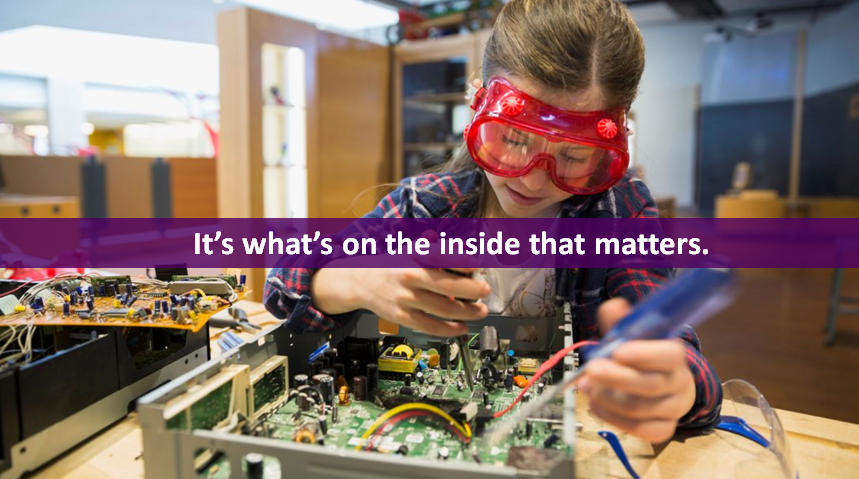
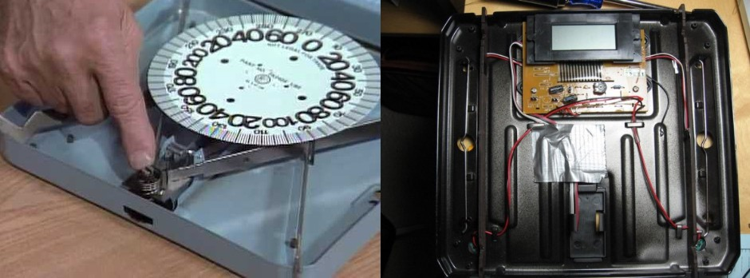
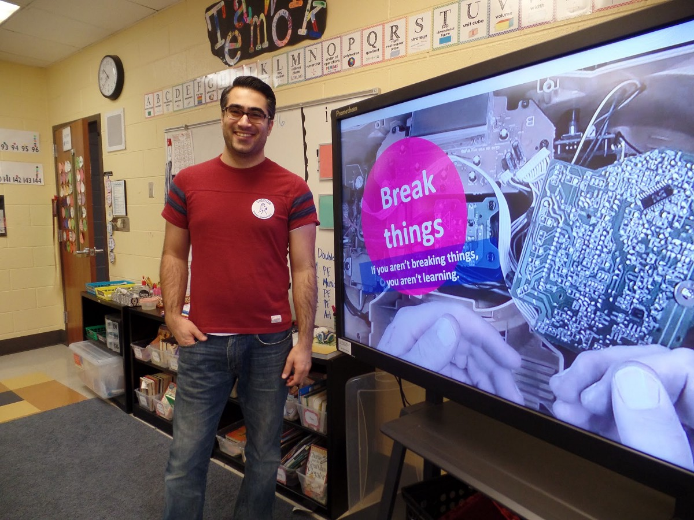
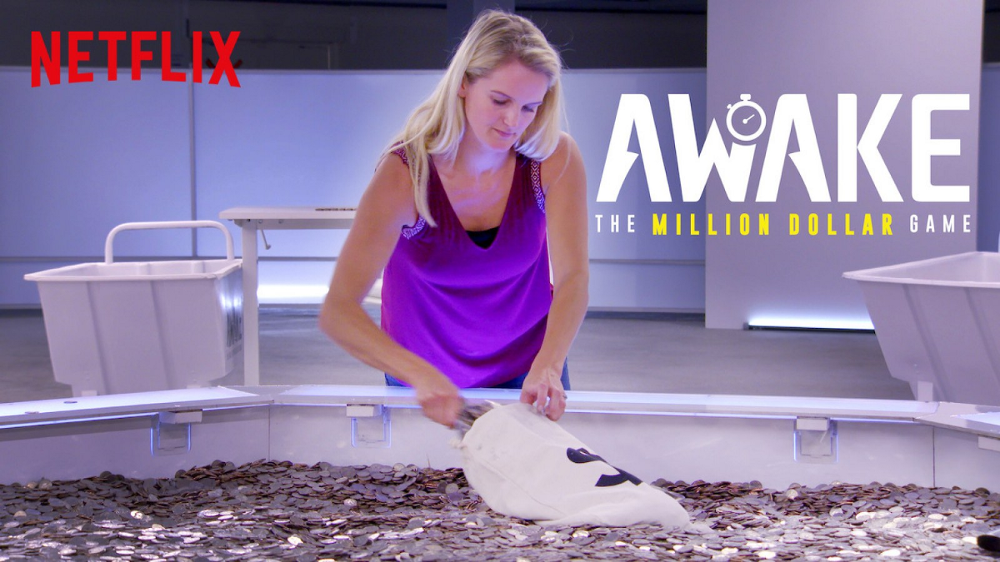
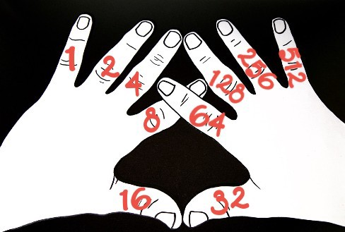
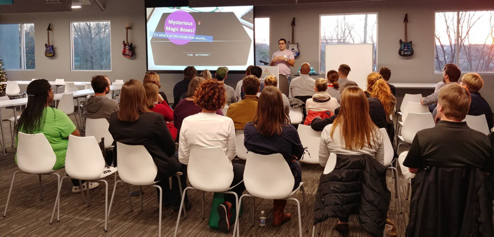

目标：通过简化计算机的工作方式，帮助儿童了解计算机的含义。

我看过许多3至5年级的教学计划，这些计划结合了“计算思维”方法，为孩子提供了解决问题的好方法。 我将在下一篇文章中介绍计算思想，但首先，我认为为儿童（以及成年人！）揭开神秘面纱的重要性很重要。 没有人应该看电脑，智能手机或平板电脑，并且至少不了解内部发生的事情。 他们不必是神秘的黑匣子。

我要解决的问题很简单。 随着设备变得更紧凑且软件运行得更好，孩子们失去了将这些设备与自然世界联系起来的机会。 这些设备变得不那么直观，因此变得更加神秘，神奇。 当孩子们无法将这些设备如何与世界其他地区联系起来时，进行计算思考就更具挑战性，并且编程概念似乎很陌生。 但是，如果计算机变得直观，只要它们变得有意义，其他一切自然流淌。

# 练习1：模拟与数字

让学生使用模拟和数字设备进行非常简单的测量。 例如，让他们使用液体温度计和数字温度计测量温度。

他们应该首先使用模拟工具进行测量，然后再使用数字工具进行测量。 本练习的重点不是要测量的值，而是要建立对设备的观察。 也就是说，当两个设备的测量值不同时，他们应该注意。

讨论：讨论模拟设备和数字设备之间的区别。
+ 问孩子们他们更喜欢哪个，为什么。
+ 询问他们是否知道他们中的任何一个人如何工作，或者他们是否可以猜测他们的工作方式。

模拟和数字被认为是相反的。 实际上，数字工具是具有高级功能的模拟工具。 随着技术变得更简单，更便宜和更好，这两组之间的错误区分越来越大。

之所以称其为“模拟”，是因为我们所测量的是一个物理类似物。 石英晶体在手表中振动的时间类似于经过1秒。 当我们使用模拟温度计测量温度时，我们所看到的是酒精在管中传播的距离。 酒精的膨胀/收缩类似于温度。 当我们站在浴室磅秤上时，我们的体重会压缩弹簧。 随着弹簧压缩，带有重物的圆盘旋转。 弹簧的压缩非常适合我们的体重。

数字设备仍然使用模拟。 数字秤仍然使用弹簧压缩，但是压缩并没有旋转显示不同重量的金属盘，而是将压缩转换为电信号，然后将其显示在屏幕上。 所有前面的示例都一样。 这里重要的一点是，所有测量工具都依赖于实际机制。

讨论应该帮助孩子得出一个结论，即模拟工具和数字工具之间没有真正的区别，只是数字工具通常更易于阅读，因此更加精确。 值得弥补数字工具的缺点：它们需要电池，并且设备中的“东西”很多，因此它们通常更昂贵且更难维修。

> While breaking things (and trying to put them back together) can help you learn how they work, it mostly works with analog equipment

# 练习2：手指数超过1,000

如果您在Netflix上看过电视剧《醒来》，则此练习似乎很熟悉。 在本练习中，您将需要大量可操作的计数对象。 例如，让我们将鹅卵石放在罐子里。 挑战在于：它们必须通过将小卵石从一个罐子移到另一个罐子中来数数小卵石。 他们无法写下任何东西，但是他们必须记住已经计数了多少。 目的是展示在资源有限的情况下跟踪号码所面临的挑战，因此分散注意力以使他们失去计数是公平的。

讨论：
+ 问他们必须掌握哪些技巧，并遵守不能写下任何东西的规则。 讨论可能涉及一些手指和脚趾的系统。
+ 询问是否有人仅用手指就能计数超过1,000。
+ 请提及目标-我们正在尝试使用很少的工具来完成一项大任务。 只需10。这就是计算机的工作-它们非常高效。
+ 在这里，您可以展示如何用手指进行二进制计数。 二进制计数对每个人来说都有些棘手，虽然最小的孩子可能并不完全了解这个想法，但他们应该掌握以下基本知识：

从您的左手拇指开始，并将其命名为“ 1”。然后您的左手索引将为“ 2”，左中线为“ 4”，然后左环为“ 8”，然后为“ 16”。继续 您的右手“ 32”，“ 64”，“ 128”，“ 256”，“ 512”。为帮助他们形象化，在您的手指上使用标记可能会有所帮助。

接下来，说明一下，当我们通常用手指数时，我们将每个数字都视为相同的值1，而我们只是将1加起来。 因此，举起三个手指就是三个1，1 + 1 + 1 =3。通过二进制计数，每个手指都值得它们标记的值-因此，您的左手拇指仍为1，但左手食指仍为2。 ，您可以将所有延伸的手指的值相加。

一个=您的左手拇指（“ 1”）伸出。

2 =仅扩展了您的左索引（“ 2”）。

三=您的左手拇指（“ 1”）和左手食指（“ 2”）伸出。

四个=只是您的左中间（“ 4”）伸出了-在这里要小心，因为您不想将它们翻转掉。

五=您的左手拇指（“ 1”）和左中指（“ 4”）。

当两只手的所有手指都伸出时，您将获得1 + 2 + 4 + 8 + 16 + 32 + 64 + 128 + 256 + 512 = 1,023。

最后，问他们用这种方式计算面临的挑战。 即使需要进行更多的思考，它也可以让您用很少的计数器来计算更大的数字。 如果您的手指更多（或用了脚趾，或使用了很多灯的开关），那么使用同一系统可以算得更高。
# 结论讨论

计算中包含三个关键步骤：
+ 收到说明（代表什么数字），
+ 执行说明（伸出手指，拨动开关）
+ 产生输出（看着手指/开关，将其值相加以获得结果。）

这就是我们在练习1和练习2中所做的事情。

计算机不过是一长串的开/关开关。 电流流经那些开/关开关，因此它们可以计数。 因为电流真的非常快地通过电线移动，所以计算机中的计数真的非常快。 编写计算机程序时，我们会向计算机提供有关要关闭和打开哪些开关的说明。 当我们使用手指，水桶或电灯开关时，我们的移动速度比电力要慢得多，但是如果我们能像电力一样快地移动，我们甚至根本不需要计算机。

重要的结论是系统围绕我们定义的一组简单规则构建。 使用这些简单的逻辑规则集，计算机可以执行非常复杂的计算，制作视频游戏，创建虚拟现实世界甚至是思考机。 （在下一篇文章中，我们将探讨计算机的想法。）

作为孩子们的思维练习，使他们为下一节做好准备，请他们考虑自己在日常生活中所做的事情-家务，进餐，从家到学校，并请他们考虑最基本的 他们可以为每一个提出的指示。

在下一篇文章中，我们将更深入地研究计算思想，并继续为解决问题奠定基础。
## ＃技术学习
# 计算机如何工作
## 两次无需技术的教学练习，使计算机神秘化

> Encouraging educators to take a tech-less approach for the Hour of Code

本文是#Techless教学系列中的第一篇，该系列鼓励教育工作者采用无技术的方法向学生教授计算机和软件工程。 当您跳过iPad，计算机和高科技玩具时，可以消除干扰，让学生专注于原理。 如果您还没有阅读介绍，建议您从那里开始。

该系列的前两篇文章着重于为将来的概念建立框架和基础。 每篇文章都以目标为起点。
