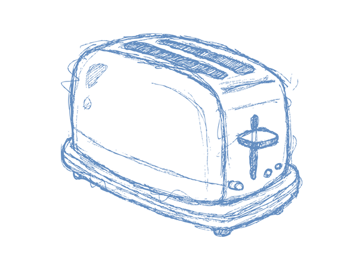
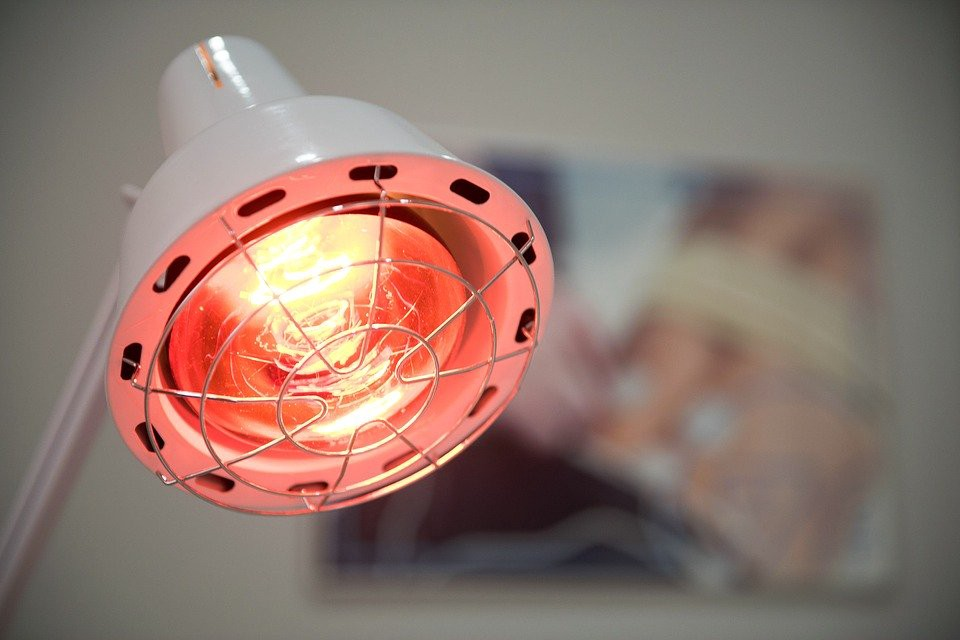
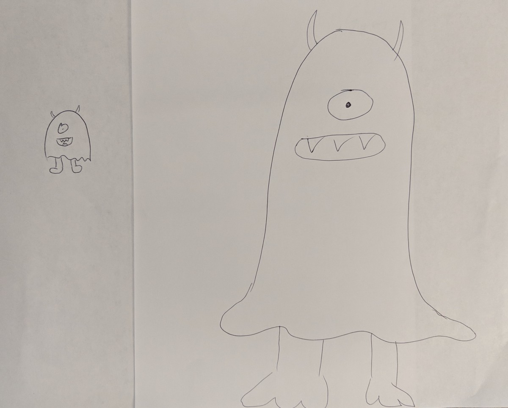
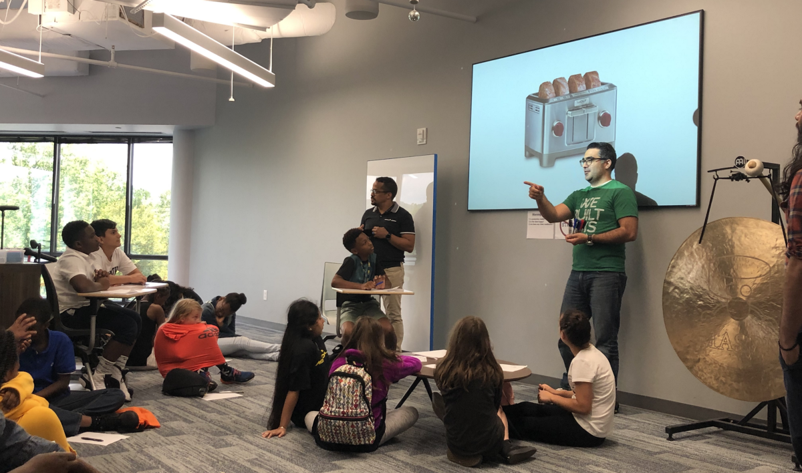

目标：学习如何采用计算思维方法，以及像计算机一样的思维如何将问题分解为简单的部分。

在上一篇文章中，我专注于简化计算机，并试图将其与学生对自然世界的直觉联系起来。 最大的收获是，仅凭一套基本规则，我们就可以创建思考，创建虚拟世界并解决难题的机器。 但是当规则如此基本时，他们如何到达那里？

计算思维是一个重要的概念，可以应用于任何领域-即使不涉及计算机。 在本文中，我们将通过模拟计算机的“思维方式”解决挑战性问题。这是一些技术性操作，因为我想说明学生在解决任何类型的问题时如何使用这种方法。

但是首先，我们应该如何定义计算思维？ 我喜欢使用的简单定义是：让自己像计算机一样解决问题。 这意味着创建规则并限制我们可以借鉴的东西。 这也意味着迫使我们将问题简化为最基本的参数。

计算思维使自己像计算机一样解决问题。
# 练习1：绘制概念图

我喜欢从使用烤面包机的简单练习开始。 此练习的灵感来自我推荐观看的精彩TED演讲。

让学生分成几对，分别给他们一个记号笔和一张纸。 说明如下：

想象您遇到一个从科学实验室逃脱的陌生女孩。 她不会说英语，也不会读书。 您正在保护她免受科学家的侵害，因此您可以住在地下室。 她唯一喜欢吃的是蛋饼华夫饼。 今天是星期一早上，您上学要迟到了。 您的父母告诉您，您必须在3分钟内离开-没有足够的时间来制作Eggos！ 当我说“去”时，您有3分钟的时间逐步绘制图表，向她说明如何使用烤面包机，以便她可以制作自己的Eggos。 记住她不会读书！ – 1，2，3，开始！

（在您说“ GO”之后，就不要再提供任何说明或有用的提示了。请回顾一下他们只有3分钟的时间。）

讨论：完成后，让他们与合作伙伴一起更换论文并进行比较。 问：“如果您是女孩，您是否可以按照伴侣的指示制作Eggos？”我通常会感到困惑，因此我们将与那些回答“是”和“拒绝”的人讨论什么。

拿走：这个示例并未完全涉及计算思想，但这是我们的出发点。 它显示了当人们不得不解释时，像烤面包这样最基本的东西可能具有挑战性。 在此讨论中，我想着重于最简单和最基本的动作以及常见符号的语言：时钟可能表示“等待”，而弯曲的弯腰可能表示“热”。 语言将在以后出现。
# 练习2：三灯三开关

以下是一个常见的软件工程之谜。 乍看之下，挑战可能非常艰巨，直觉是说这是不可能的。 我喜欢这个示例，因为它完美地说明了如何将问题分解为非常基本的机制，以及如何使用我们在上一篇文章中学到的关于用很少的工具表示大量数据的知识。

谜题是这样的：

走廊上有3个常规电灯开关和一扇门。 门后是3个不同的灯泡，每个灯泡仅连接到3个开关之一。 您的目标是确定哪个灯泡连接到哪个开关。 没有窗户。 只允许您打开电灯开关，并根据需要随意打开和关闭它们。 您只有一次机会打开门进入房间。 进入房间后，您可以做任何想做的事，但是只有说出哪个开关连接到哪个灯泡，您才能离开房间。

讨论：我想集体解决这个问题，所以我将它交给学生举手并提供建议。几乎总是，第一个建议是：“打开一个开关，然后进入房间，打开的是您打开的开关。”但这不能解决其他两个开关。在这一点上，您将获得一些答案，例如“拔出开关并遵循电线”（不允许这样做），或者您可能有一些疑问可以弄清楚这个谜语：您可以通过以下方式打开/关闭开关吗？你喜欢多少次？是。您可以随意进入房间多次吗？否。当您在房间里时，可以和朋友聊天吗？不，我最喜欢的是：“为什么要创建一个房间，房间的外部有开关？”可能是步入式衣橱，或者是想开灯的浴室，这样就不会碰到任何东西。最后，一个隐含但未明确说明的问题：向上拨动开关是否表示其接通？是的-了解这一点很重要。

> Take a Socratic method of asking questions to lead to the answer.

在继续讨论实际的解决方案之前，我还想问学生他们是否认为有可能的解决方案。

如果学生们仍然不在轨道上，我喜欢让他们告诉我一些他们注意到的有关电灯开关的事情。 他们能做什么，却不能做什么。 就像关闭/打开一样简单。 这是对上一节和二进制计数的一个很好的提醒-事物只能具有两种状态：打开或关闭。

灯泡呢？ 灯泡能做什么？ 他们有什么属性？ 我会提出这个问题-它们只会发光吗？ 我们还没有注意到其他有关灯泡的信息？ 您在用眼睛感知的事物上断断续续，我们用眼睛感知的事物还有别的吗？ 那其他感觉呢？ 闻？ 听力？ 味道？ 触摸？ 他们确实很热！

这是我们希望进一步引导讨论的地方。 是什么使灯泡变热？ 开启时热吗？ 我们可以使用灯泡仅在打开一段时间后才会变热的事实吗？ 我们可以用视线查看打开和关闭的灯泡，我们可以用触觉来查看哪个灯泡热吗？

通常，现在它们落在解决方案上，或者接近解决方案：打开开关，等待一分钟，然后将其关闭。 然后打开第二个开关，进入房间。 打开的灯泡是我们打开的开关。 熄灭，冷的灯泡已连接到我们从未触摸过的开关。 熄灭但很热的灯泡是我们打开并打开一分钟后再关闭的开关。 （它可以帮助绘制出来以提供视觉效果。）

总结：虽然我们的直觉反应可能说服了我们，但没有解决方案，但是将问题分解为输入和输出，并使用我们仅有的几种工具找到了解决方案。 虽然电灯开关只有2种状态（开或关），但灯泡实际上有2种以上（开，关，热，冷）。 我们可能对与房间，电线，窗户或黑客问题有关的所有其他事物都感到分心。 但是，当我们开始将问题分解为有关电灯开关和灯泡的最基本问题时，我们找到了解决方案。
# 练习3：破碎的烤面包机

这是另一种简单的练习，可以使人们理解从简单开始和解决显而易见的问题。 问题是这样的：

想象一下，我是你的老板，我说如果我早上不去艾格托，我是个脾气暴躁的老板。 团队的其他成员告诉您，他们有一个防止我脾气暴躁的系统-他们轮流确保每天早上我进去时，我都有新鲜烤的Eggo等着我。 他们告诉您，星期三将是您需要考虑的日子。 星期一临近，我走进去，他们为我准备了我的Eggo。 周二，同样的事情。 星期三是您的一天-您去烤面包机，放上Eggo，按一下按钮，……什么都没有发生。 你看时钟，我现在随时都在办公室。 你是做什么？”

讨论：讨论不需要太忙-有时人们有创造性的解决方案或愚蠢的解决方案，但关键是要从小处着手，从显而易见的开始。 我们的冲动可能使我们忽视非常明显的问题。 软件工程师每天都面临着这一挑战，因此很容易想到一个问题。 但是有时烤面包机恰好被拔掉了。 您可能会觉得很愚蠢，但是浪费很多时间和精力。 想象一下，老板对您刚插上烤面包机时起火来烤鸡蛋的反应。

拿走：虽然这个特定的例子并没有深入到实际的计算思维中，但是它说明了计算思维如何分解简单问题的一个完美示例。 换句话说，计算思维是一个逐步的逻辑思维过程，当出现问题时，请按照相同的步骤逐步检查输入。 “我按下了滑杆，但是烤面包机没有打开……”应该提示您是否将其插入。

当您从树上采摘苹果时，最好先采摘低垂的苹果：它们更容易拿到，您可以最快地采摘那些苹果，而这可能就是您所需要的所有苹果。
# 练习4：绘制怪物

到现在为止，最后几次练习应该让他们思考“简单”-因此在这里，我们将让他们进行测试。 他们会再次配对。 其中一个（人A）将闭上眼睛，另一个（人B）将有一张纸和笔。 给他们1分钟，然后告诉B人在纸上画一个怪物。 提醒人A不要看。 当会议记录结束时，请人B遮盖他们的绘图，然后人A可以睁开眼睛。 现在，A人应该准备在一张空白的纸上绘图。 告诉他们他们也只有1分钟的时间，他们必须画出与伴侣B人相同的怪物，但不允许他们看图纸。 B人必须向A人描述他们的绘画。完成后，让他们比较并再次进行练习，但是这次相反，谁先走。

讨论：
+ 讨论哪种策略最有效，重点是“简单”的说明。
+ 这与计算思维有关：当他们向伙伴描述图纸时，他们重新创建了他们所采取的相同步骤，但是简单易懂。
+ 有些说明可能看起来很复杂，例如“像蝙蝠侠符号那样画翅膀”，但实际上很简单。 再次是符号的语言。 它立即告诉某人它的外观。 这与更加模棱两可的说法（例如“用翅膀吸引愤怒的吸血鬼”）大相径庭。 而且，有时候采用过于简单的方法会使事情变得复杂：“由曲线组成的机翼。 它们弯曲起来，在机翼的顶部和底部，中间和末端附近形成尖锐的点……”

> “A ghost-shaped body with legs, two devil horns, cyclops-eye, open mouth with pointy teeth.”

结论性讨论：我们没有真正地有目的地进行真正的计算思维。 取而代之的是，我们将这些原理应用于一些游戏，谜语和现实情况中，以循序渐进的方法化过程为线性思考奠定了基础。 当面对数学，科学或烤面包机等问题时，计算思维为解决问题提供了基础。 容易被所有细节所淹没-但是，如果您专注于开始（输入），并且每次都一步一步地进行到结束（输出），则可以简化整个问题。

在下一组文章中，我们将介绍一些实际的编程概念。 在执行操作时，请记住最后两篇有关计算机如何工作和思考的文章。 它们为编程结构为何如此提供了重要基础。
## ＃技术学习
# 解决计算机之类的问题
## 四个无技术练习，模拟计算机如何“思考”

本文是#Techless教学系列中的第二篇文章，该系列鼓励教育工作者采用无技术的方法向学生教授计算机和软件工程。 当您跳过iPad，计算机和高科技玩具时，可以消除干扰，让学生专注于原理。 如果您还没有阅读介绍，建议您从那里开始。
