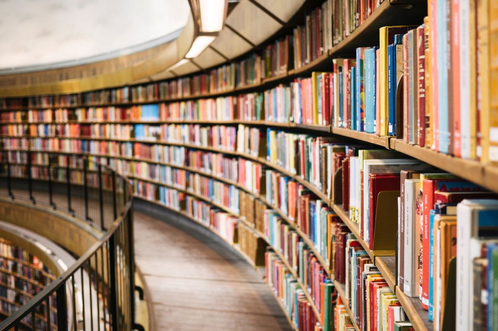
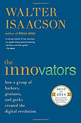
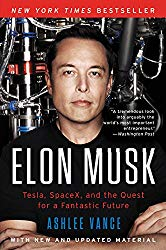
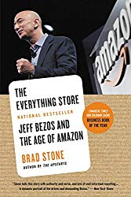
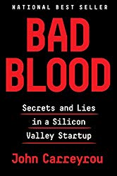
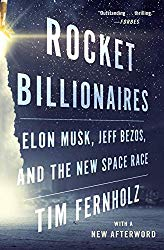
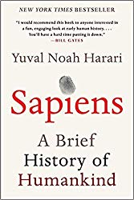
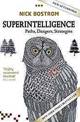
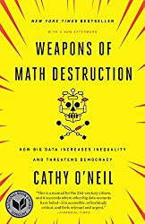
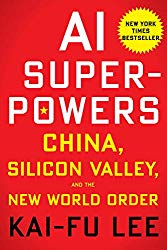

如果您在寻找更多推荐书籍，请参阅我的其他书籍清单：
+ 人工智能书籍
+ 数据科学书籍
+ 机器学习书
+ 入门书
# 您应该在2020年阅读的技术书籍
## 我们生活在未来。 是时候了解它了。

我们的世界是一个地球村。 如果您正在阅读这些文字，则可能是您的智能手机已连接到互联网。 在技术以及我们如何使用技术方面，过去的二十年非常疯狂。 在我们的历史上，我们从未在如此短的时间内见过如此多的突破。 本文重点介绍从不同角度讨论这些变化的书籍。

> Technology Books you should read in 2020

# 创新者改变世界

我们都喜欢关于英雄的故事，他们做出牺牲，失败和失败，失败之后又回来改变了世界。 以下书籍着重于人：


沃尔特·艾萨克森（Walter Isaacson）撰写的《创新者》（Innovators）是一本关于创新思维的书，他们突破界限，与时代背道而驰，重新发明了事物的完成方式。 现在是创新的绝对经典。


埃隆·马斯克（Elon Musk）受千百万人的喜爱和憎恨。 他将电动汽车推向大众并前往火星的着迷之旅成为头条新闻。 他的传记介绍了他从南非童年至今的故事。 一个惊人的故事至今仍在揭晓。


一切商店（Everything Store）讲述了亚马逊如何从一个小型的在线图书销售商成长为一家遍及许多行业并且不断发展的全球巨头。 阅读它以了解为什么总是“第一天”。


如果您的目标是“不惜一切代价建立一家十亿美元的公司”而不是进行创新，那么Bad Blood就是您要走多大错。 它显示了硅谷的运作方式，以及在没有可用原型的情况下可以走多远。


火箭亿万富翁表明了火箭工业有多艰辛，为什么“火箭科学”仍然意味着“困难，几乎是不可能的”。 它介绍了首次登月的历史，分析了卫星业务，并解释了为什么私营部门完全改变了火箭工业。 任何对太空感兴趣的人都必须阅读。
# 人工智能即将到来

技术可以有很多面孔，但是最近的主要面孔之一是人工智能。 无论是否需要，我们都在使用它。 以下书籍说明了我们如何进入当前时代，以及将来可能要等待我们什么。


undefined


超级智能是人工智能和人工智能的经典参考。 尼克·博斯特伦（Nick Bostrom）列出了其他作者经常使用的所有理论。 对于任何想知道人工智能将如何改变世界的人来说都是一本好书。


《数学毁灭武器》是一本有关数学的书。 凯茜·奥尼尔（Cathy O’Neil）展示了算法如何控制我们的世界，以及如何让算法为我们做出决定。 同时令人着迷和恐惧。


人工智能超级大国对于解释如何在商业中使用人工智能以及中国如何利用人工智能以使其受益而提供了很好的参考。 作者解释了硅谷和中国初创生态系统之间的差异。
```
(本文翻译自Przemek Chojecki的文章《Technological Books you should read in 2020》，参考：https://towardsdatascience.com/technological-books-you-should-read-in-2020-82ba23dda054)
```
